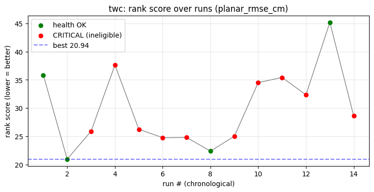

# Global Cross-Run Analysis

_Generated 2026-07-12 13:27:14 from 3 path mode(s)._

## Best per mode

| Mode | Runs | Best score | Metric | Champion run |
|------|------|-----------|--------|--------------|
| sinusoid | 1 | - | - | - |
| twc | 14 | 20.94 | planar_rmse_cm | exp_flight_twc_1781526842 |
| unknown | 1 | - | - | - |

## sinusoid

**Latest run**: exp_flight_sinusoid_1781527210

| | rank score | crit | warn |
|--|--|--|--|
| latest | 54.81 | 2 | 4 |

## twc

**Latest run**: exp_flight_twc_1781527197

| | rank score | crit | warn |
|--|--|--|--|
| latest | 28.58 | 2 | 4 |
| previous | 45.19 | 0 | 5 |
| champion | 20.94 | 0 | 2 |

- Latest improved vs previous by **16.61** (45.19 → 28.58).
- Off champion by 7.65 (champion 20.94).

### Leaderboard (best per tuning-config)

| Rank | Score | Metric | Cross-track mean (cm) | Config hash | Run |
|------|-------|--------|----------------------|-------------|-----|
| 1 | 20.94 | planar_rmse_cm | - | `f0474734a0` | exp_flight_twc_1781526842 |

## unknown

**Latest run**: exp_flight_1783833738

| | rank score | crit | warn |
|--|--|--|--|
| latest | 293.67 | 1 | 9 |

