# Flight Analysis Report: exp_flight_1783833738

**Date:** 2026-07-12T05:27:11.991931Z | **Duration:** 266.7s | **Samples:** 115470 | **Config:** PAYLOAD_LIGHT

---

## What Happened

- Planar XY tracking RMSE was **293.7 cm** (peak 558.8 cm).
- Worst-tracked position axis was **X** (RMSE 271.12 cm).
- Yaw held **-5.6°** off command (drift -0.01°/s over the run) — expected heading-hold signature of bias/asymmetry.
- ⚠ **1 CRITICAL** MRAC alert(s) — run is INELIGIBLE as a champion until resolved.
- MRAC was most active on **z** (ρ_mean 0.83).

## Path Tracking

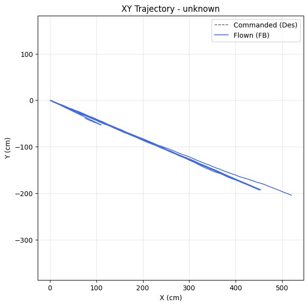

| Metric | Value |
|--------|-------|
| Planar XY RMSE (cm) | 293.67 |
| Planar peak (cm) | 558.79 |
| Cross-track mean / p95 / max (cm) | - / - / - |
| Along-track lag (ms) | - |
| Rank score (planar_rmse_cm) | 293.67 |

| Axis | RMSE | MAE | Peak |
|------|------|-----|------|
| X | 271.12 | 232.98 | 520.09 |
| Y | 112.87 | 97.55 | 204.31 |
| Z | 0.00 | 0.00 | 0.00 |

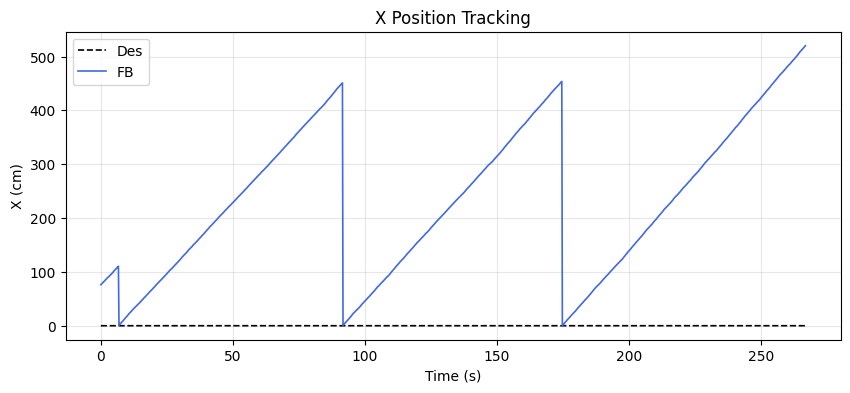
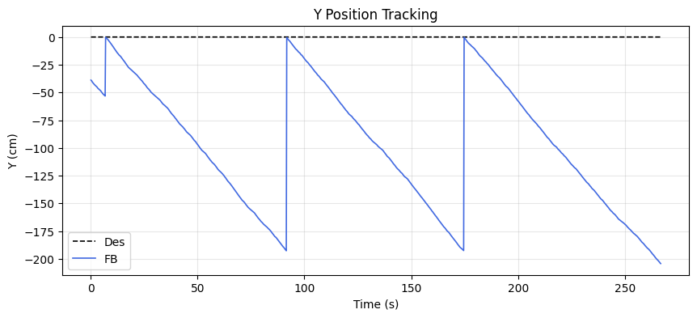
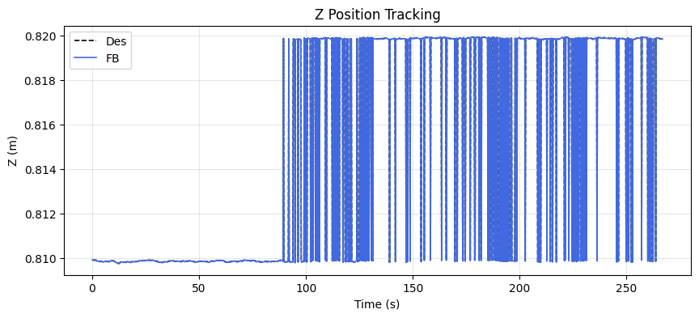

### Yaw heading-hold drift

| Cmd (°) | Final offset (°) | Mean offset (°) | Drift (°/s) | Total drift (°) | P2P (°) |
|---------|------------------|-----------------|-------------|-----------------|---------|
| -0.02 | -5.64 | -4.23 | -0.01 | -2.78 | 3.77 |

## MRAC Scoreboard (attitude / rate loops)

| Axis  | RMSE | RMSE_ss | RMSE_tr | ρ_mean | ρ_p95 | Phase | ‖Θ‖ | ⚠ | 🔴 |
|-------|------|---------|---------|--------|-------|-------|------|---|---|
| Pitch | 11.822 | 11.151 | 8.243 | 0.657 | 0.853 | reinforcing | 0.283 | 3 | 0 |
| Roll | 13.686 | 13.557 | 8.943 | 0.630 | 0.743 | reinforcing | 0.283 | 3 | 0 |
| Yaw | 4.320 | 4.229 | - | 0.560 | 0.616 | reinforcing | 0.172 | 2 | 0 |
| Z | 0.000 | 0.000 | - | 0.828 | 0.989 | decoupled | 0.331 | 1 | 1 |

## Alerts

- [CRITICAL] **NEAR_SATURATION**: z: MRAC near saturation (ρ_p95=0.99). Reduce gamma or increase u_max.
- [WARN] **HIGH_AUTHORITY**: pitch: MRAC-dominant (ρ=0.66). PID gains may be insufficient.
- [WARN] **POOR_TRACKING**: pitch: Tracking degraded (RMSE=11.82).
- [WARN] **REDUNDANT_EFFORT**: pitch: MRAC reinforcing PID (r=0.96) with significant authority. PID may need retuning.
- [WARN] **HIGH_AUTHORITY**: roll: MRAC-dominant (ρ=0.63). PID gains may be insufficient.
- [WARN] **POOR_TRACKING**: roll: Tracking degraded (RMSE=13.69).
- [WARN] **REDUNDANT_EFFORT**: roll: MRAC reinforcing PID (r=0.93) with significant authority. PID may need retuning.
- [WARN] **POOR_TRACKING**: yaw: Tracking degraded (RMSE=4.32).
- [WARN] **REDUNDANT_EFFORT**: yaw: MRAC reinforcing PID (r=0.95) with significant authority. PID may need retuning.
- [WARN] **HIGH_AUTHORITY**: z: MRAC-dominant (ρ=0.83). PID gains may be insufficient.
- [INFO] **QUASI_STATIC**: pitch: MRAC output is >80% DC — acting as slow integrator. May be fine for bias rejection.
- [INFO] **QUASI_STATIC**: z: MRAC output is >80% DC — acting as slow integrator. May be fine for bias rejection.

## Per-Axis Detail

### Pitch

#### Tracking
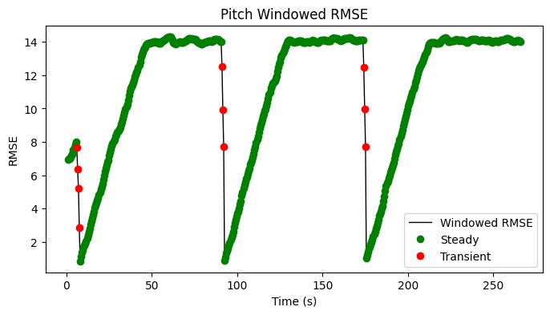

| Metric | Value |
|--------|-------|
| RMSE | 11.822 |
| MAE | 11.053 |
| Peak Error | 14.362 |
| Steady-State RMSE | 11.151109552289535 |
| Transient RMSE | 8.243147623662372 |

#### Control Authority
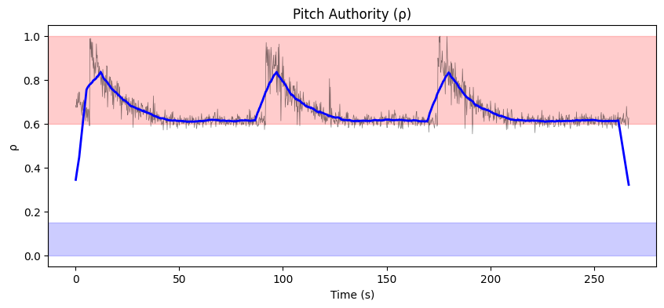
- ρ_mean = 0.657, ρ_p95 = 0.853
- u_ad RMS = 308.83 mixer units, u_nom RMS = 0.16 mixer units
- Phase relationship: reinforcing (r = 0.96)

#### Weight Health
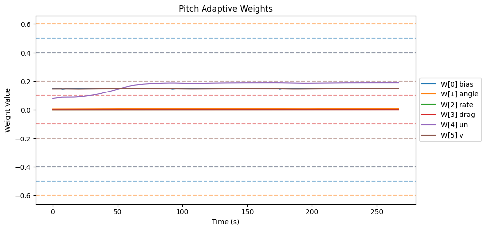
| Weight | θ_final | Drift (/s) | Proj. Hits | Oscillation (/s) |
|--------|---------|------------|------------|-------------------|
| W[0] bias | 0.149 | 0.0000 | 0.0% | 2.20 |
| W[1] angle | 0.008 | 0.0000 | 0.0% | 2.30 |
| W[2] rate | 0.001 | 0.0000 | 0.0% | 0.05 |
| W[3] drag | 0.000 | 0.0000 | 0.0% | 0.25 |
| W[4] un | 0.189 | 0.0003 | 0.0% | 0.23 |
| W[5] v | 0.148 | 0.0000 | 0.0% | 1.35 |

- ‖Θ‖ final = 0.283, trending: → STABLE/CONVERGING
- Hard-freeze fraction: 0.0%

#### Spectral
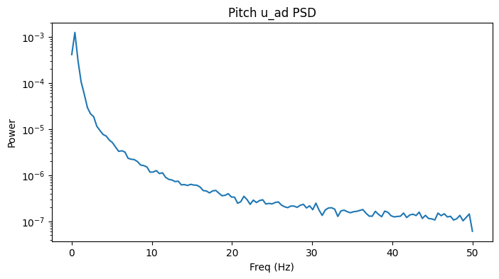
- Dominant freq: 0.4 Hz | Bandwidth: 0.8 Hz | DC fraction: 85%

### Roll

#### Tracking
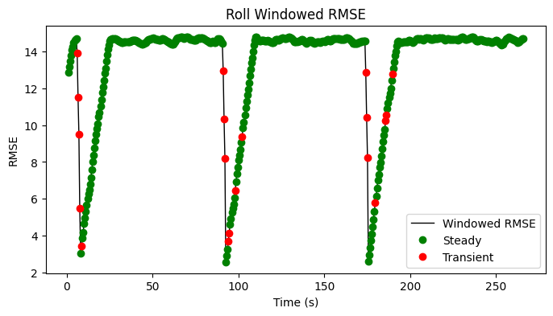

| Metric | Value |
|--------|-------|
| RMSE | 13.686 |
| MAE | 13.359 |
| Peak Error | 14.944 |
| Steady-State RMSE | 13.557000516056588 |
| Transient RMSE | 8.943254592261633 |

#### Control Authority
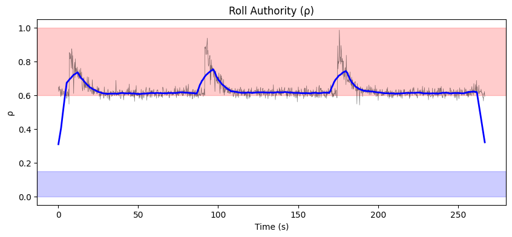
- ρ_mean = 0.630, ρ_p95 = 0.743
- u_ad RMS = 334.26 mixer units, u_nom RMS = 0.18 mixer units
- Phase relationship: reinforcing (r = 0.93)

#### Weight Health
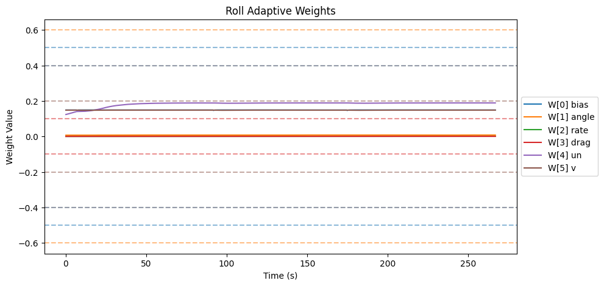
| Weight | θ_final | Drift (/s) | Proj. Hits | Oscillation (/s) |
|--------|---------|------------|------------|-------------------|
| W[0] bias | 0.149 | -0.0000 | 0.0% | 2.34 |
| W[1] angle | 0.008 | 0.0000 | 0.0% | 2.41 |
| W[2] rate | 0.001 | 0.0000 | 0.0% | 0.08 |
| W[3] drag | 0.000 | 0.0000 | 0.0% | 0.21 |
| W[4] un | 0.189 | 0.0001 | 0.0% | 0.68 |
| W[5] v | 0.148 | 0.0000 | 0.0% | 1.84 |

- ‖Θ‖ final = 0.283, trending: → STABLE/CONVERGING
- Hard-freeze fraction: 0.0%

#### Spectral
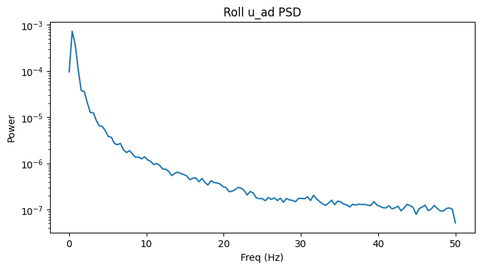
- Dominant freq: 0.4 Hz | Bandwidth: 1.2 Hz | DC fraction: 80%

### Yaw

#### Tracking
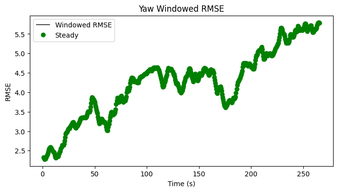

| Metric | Value |
|--------|-------|
| RMSE | 4.320 |
| MAE | 4.227 |
| Peak Error | 5.918 |
| Steady-State RMSE | 4.22868751032884 |
| Transient RMSE | - |

#### Control Authority
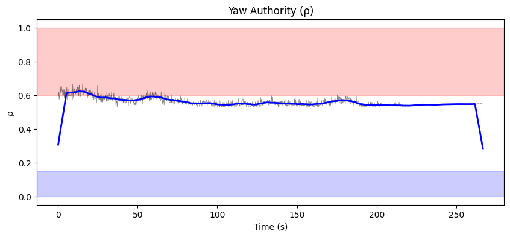
- ρ_mean = 0.560, ρ_p95 = 0.616
- u_ad RMS = 270.96 mixer units, u_nom RMS = 0.12 mixer units
- Phase relationship: reinforcing (r = 0.95)

#### Weight Health
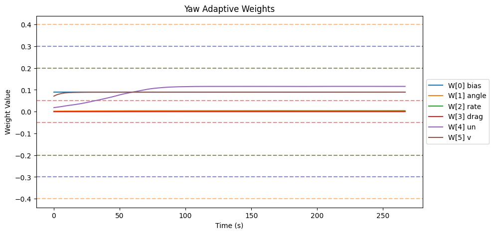
| Weight | θ_final | Drift (/s) | Proj. Hits | Oscillation (/s) |
|--------|---------|------------|------------|-------------------|
| W[0] bias | 0.090 | -0.0000 | 0.0% | 2.34 |
| W[1] angle | 0.005 | 0.0000 | 0.0% | 2.27 |
| W[2] rate | 0.001 | 0.0000 | 0.0% | 0.00 |
| W[3] drag | 0.000 | 0.0000 | 0.0% | 0.00 |
| W[4] un | 0.116 | 0.0003 | 0.0% | 0.27 |
| W[5] v | 0.089 | 0.0000 | 0.0% | 0.62 |

- ‖Θ‖ final = 0.172, trending: → STABLE/CONVERGING
- Hard-freeze fraction: 0.0%

#### Spectral
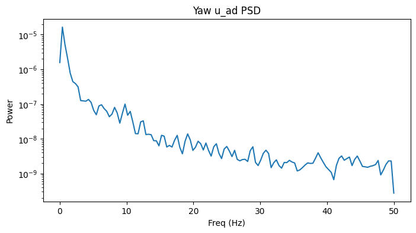
- Dominant freq: 0.4 Hz | Bandwidth: 0.8 Hz | DC fraction: 79%

### Z

#### Tracking
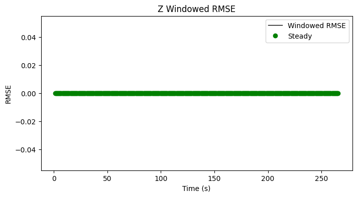

| Metric | Value |
|--------|-------|
| RMSE | 0.000 |
| MAE | 0.000 |
| Peak Error | 0.000 |
| Steady-State RMSE | - |
| Transient RMSE | - |

#### Control Authority
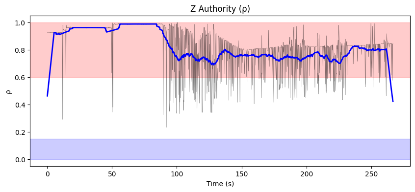
- ρ_mean = 0.828, ρ_p95 = 0.989
- u_ad RMS = 46.65 mixer units, u_nom RMS = 0.10 mixer units
- Phase relationship: decoupled (r = -0.28)

#### Weight Health
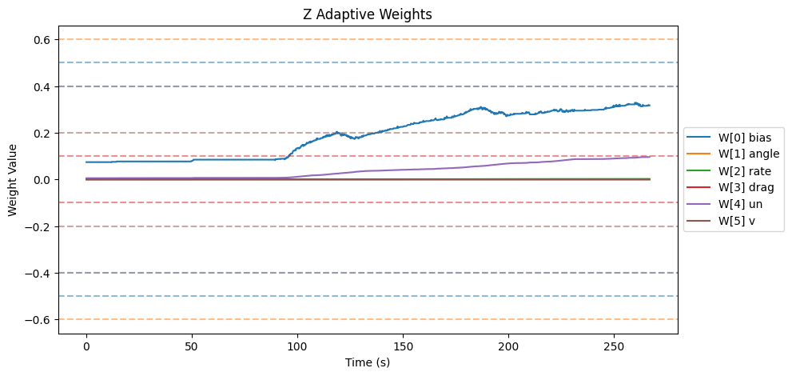
| Weight | θ_final | Drift (/s) | Proj. Hits | Oscillation (/s) |
|--------|---------|------------|------------|-------------------|
| W[0] bias | 0.317 | 0.0012 | 0.0% | 1.83 |
| W[1] angle | 0.000 | 0.0000 | 0.0% | 0.00 |
| W[2] rate | 0.002 | 0.0000 | 0.0% | 1.42 |
| W[3] drag | 0.000 | 0.0000 | 0.0% | 0.00 |
| W[4] un | 0.096 | 0.0004 | 0.0% | 0.95 |
| W[5] v | 0.000 | 0.0000 | 0.0% | 0.00 |

- ‖Θ‖ final = 0.331, trending: → STABLE/CONVERGING
- Hard-freeze fraction: 0.0%

#### Spectral
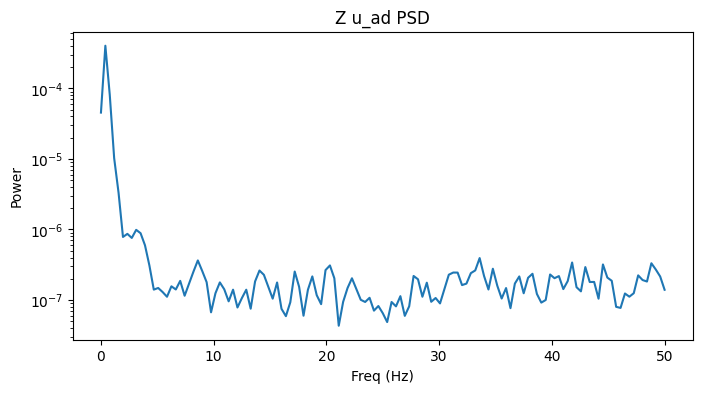
- Dominant freq: 0.4 Hz | Bandwidth: 0.8 Hz | DC fraction: 93%

## Firmware Parameters (Snapshot)
```json
{
  "payload": "PAYLOAD_LIGHT",
  "mrac_dt": 0.005,
  "num_basis": 6,
  "mixer": {
    "pitch": 1170.0,
    "roll": 1170.0,
    "yaw": 1872.0,
    "z": 222.0
  },
  "gamma": {
    "pitch": [
      0.5,
      3.3,
      1.0,
      2.0,
      0.1,
      1.0
    ],
    "roll": [
      0.5,
      3.3,
      1.0,
      2.0,
      0.1,
      1.0
    ],
    "yaw": [
      0.3,
      2.0,
      0.7,
      1.5,
      0.1,
      1.0
    ]
  },
  "wlim": {
    "pitch": [
      0.5,
      0.6,
      0.4,
      0.1,
      0.4,
      0.2
    ],
    "roll": [
      0.5,
      0.6,
      0.4,
      0.1,
      0.4,
      0.2
    ],
    "yaw": [
      0.3,
      0.4,
      0.2,
      0.05,
      0.3,
      0.2
    ]
  },
  "sigma": {
    "pitch": "from_config",
    "roll": "from_config",
    "yaw": "from_config"
  },
  "features": {
    "projection": true,
    "sigma_mod": true,
    "deadzone": true,
    "l1_filter": true,
    "pch": true,
    "perf_recovery": true
  },
  "_comment": "Manual overrides for firmware params. Edit before a test session. deep_analysis.py merges this into the experiment record.",
  "_instructions": "Update the fields below when you change firmware params that aren't in telemetry yet.",
  "sigma_pitch": null,
  "sigma_roll": null,
  "sigma_yaw": null,
  "omega_u_pitch": null,
  "omega_u_roll": null,
  "omega_u_yaw": null,
  "e_deadzone": null,
  "e_freeze": 8.0,
  "notes": ""
}
```
