# Flight Analysis Report: exp_flight_1783944984

**Date:** 2026-07-13T12:18:10.859977Z | **Duration:** 73.0s | **Samples:** 294498 | **Config:** PAYLOAD_LIGHT

---

## What Happened

- Planar XY tracking RMSE was **0.0 cm** (peak 0.0 cm).
- Worst-tracked position axis was **X** (RMSE 0.00 cm).
- ⚠ **3 CRITICAL** MRAC alert(s) — run is INELIGIBLE as a champion until resolved.
- MRAC was most active on **yaw** (ρ_mean 0.99).
- Telemetry gap up to **350 ms** — some data may be missing.

## Path Tracking

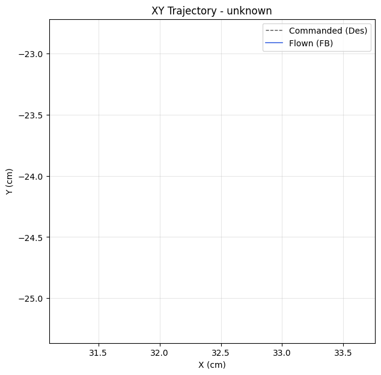

| Metric | Value |
|--------|-------|
| Planar XY RMSE (cm) | 0.00 |
| Planar peak (cm) | 0.00 |
| Cross-track mean / p95 / max (cm) | - / - / - |
| Along-track lag (ms) | - |
| Rank score (planar_rmse_cm) | 0.00 |

| Axis | RMSE | MAE | Peak |
|------|------|-----|------|
| X | 0.00 | 0.00 | 0.00 |
| Y | 0.00 | 0.00 | 0.00 |
| Z | 0.00 | 0.00 | 0.00 |

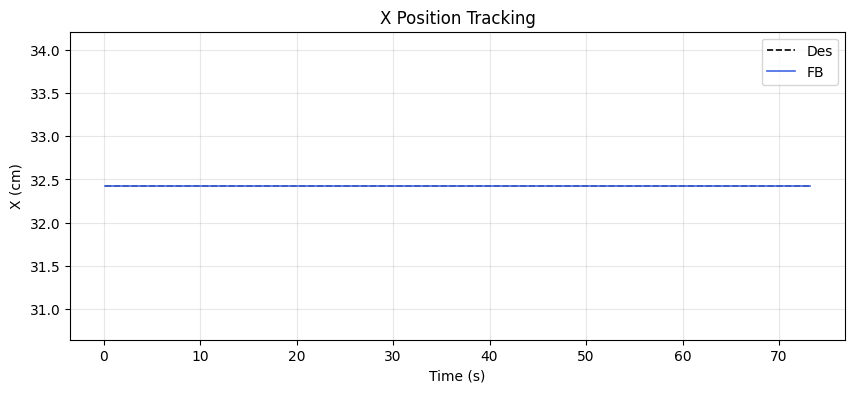
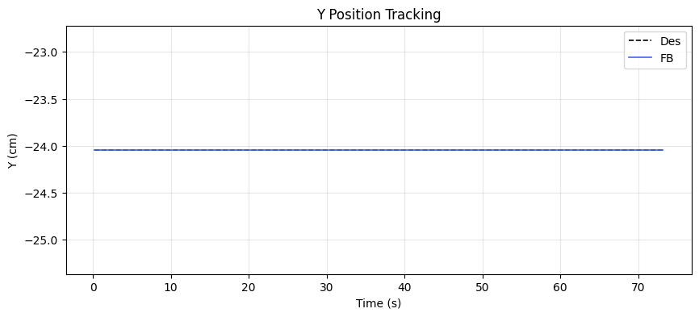
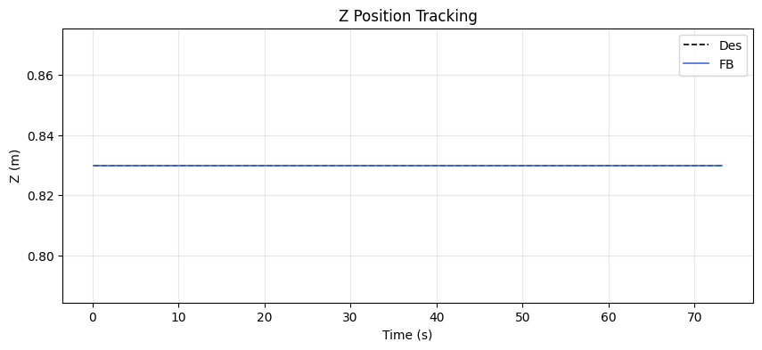

### Yaw heading-hold drift

| Cmd (°) | Final offset (°) | Mean offset (°) | Drift (°/s) | Total drift (°) | P2P (°) |
|---------|------------------|-----------------|-------------|-----------------|---------|
| -0.85 | 0.00 | 0.00 | 0.00 | 0.00 | 0.00 |

## MRAC Scoreboard (attitude / rate loops)

| Axis  | RMSE | RMSE_ss | RMSE_tr | ρ_mean | ρ_p95 | Phase | ‖Θ‖ | ⚠ | 🔴 |
|-------|------|---------|---------|--------|-------|-------|------|---|---|
| Pitch | 0.376 | 0.376 | - | 0.945 | 0.945 | decoupled | 0.143 | 1 | 1 |
| Roll | 1.171 | 1.171 | - | 0.907 | 0.907 | decoupled | 0.149 | 1 | 1 |
| Yaw | 0.000 | 0.000 | - | 0.991 | 0.991 | decoupled | 0.086 | 1 | 1 |
| Z | 0.000 | 0.000 | - | 0.001 | 0.001 | decoupled | 0.002 | 1 | 0 |

## Alerts

- [CRITICAL] **NEAR_SATURATION**: pitch: MRAC near saturation (ρ_p95=0.95). Reduce gamma or increase u_max.
- [CRITICAL] **NEAR_SATURATION**: roll: MRAC near saturation (ρ_p95=0.91). Reduce gamma or increase u_max.
- [CRITICAL] **NEAR_SATURATION**: yaw: MRAC near saturation (ρ_p95=0.99). Reduce gamma or increase u_max.
- [WARN] **HIGH_AUTHORITY**: pitch: MRAC-dominant (ρ=0.95). PID gains may be insufficient.
- [WARN] **HIGH_AUTHORITY**: roll: MRAC-dominant (ρ=0.91). PID gains may be insufficient.
- [WARN] **HIGH_AUTHORITY**: yaw: MRAC-dominant (ρ=0.99). PID gains may be insufficient.
- [WARN] **LOW_AUTHORITY**: z: MRAC nearly inactive (ρ=0.00). Check if gamma is too low or deadzone too wide.
- [INFO] **QUASI_STATIC**: pitch: MRAC output is >80% DC — acting as slow integrator. May be fine for bias rejection.
- [INFO] **QUASI_STATIC**: yaw: MRAC output is >80% DC — acting as slow integrator. May be fine for bias rejection.
- [INFO] **QUASI_STATIC**: z: MRAC output is >80% DC — acting as slow integrator. May be fine for bias rejection.

## Per-Axis Detail

### Pitch

#### Tracking
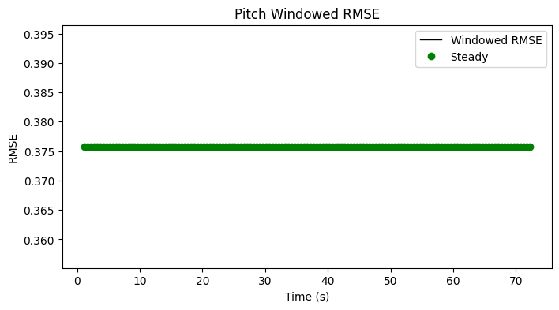

| Metric | Value |
|--------|-------|
| RMSE | 0.376 |
| MAE | 0.376 |
| Peak Error | 0.376 |
| Steady-State RMSE | 0.3757940099999999 |
| Transient RMSE | - |

#### Control Authority

- ρ_mean = 0.945, ρ_p95 = 0.945
- u_ad RMS = 167.83 mixer units, u_nom RMS = 0.01 mixer units
- Phase relationship: decoupled (r = 0.00)

#### Weight Health
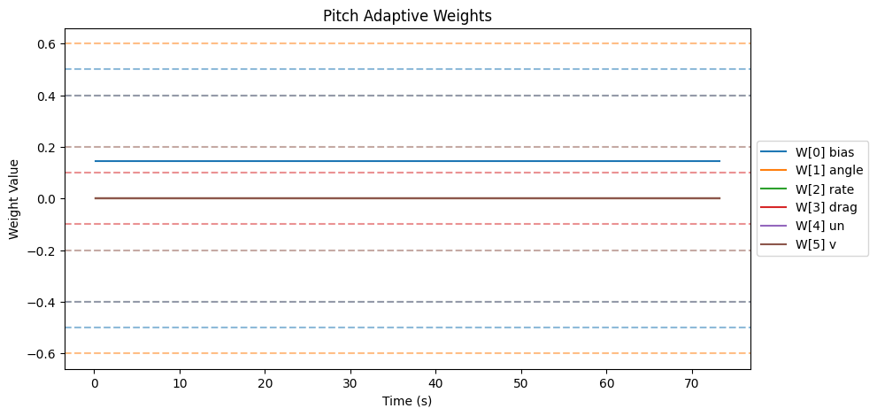
| Weight | θ_final | Drift (/s) | Proj. Hits | Oscillation (/s) |
|--------|---------|------------|------------|-------------------|
| W[0] bias | 0.143 | -0.0000 | 0.0% | 0.00 |
| W[1] angle | 0.000 | 0.0000 | 0.0% | 0.00 |
| W[2] rate | 0.000 | 0.0000 | 0.0% | 0.00 |
| W[3] drag | 0.000 | 0.0000 | 0.0% | 0.00 |
| W[4] un | 0.001 | -0.0000 | 0.0% | 0.00 |
| W[5] v | 0.002 | -0.0000 | 0.0% | 0.00 |

- ‖Θ‖ final = 0.143, trending: → STABLE/CONVERGING
- Hard-freeze fraction: 0.0%

#### Spectral

- Dominant freq: 0.4 Hz | Bandwidth: 0.8 Hz | DC fraction: 100%

### Roll

#### Tracking


| Metric | Value |
|--------|-------|
| RMSE | 1.171 |
| MAE | 1.171 |
| Peak Error | 1.171 |
| Steady-State RMSE | 1.1706341269999998 |
| Transient RMSE | - |

#### Control Authority
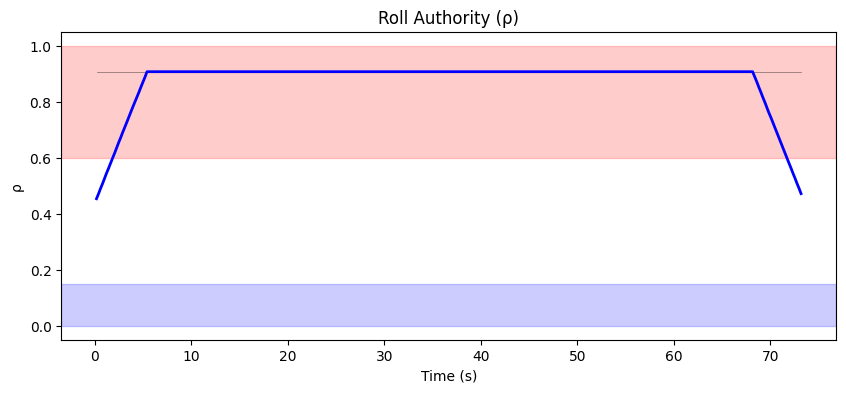
- ρ_mean = 0.907, ρ_p95 = 0.907
- u_ad RMS = 174.16 mixer units, u_nom RMS = 0.02 mixer units
- Phase relationship: decoupled (r = 0.00)

#### Weight Health
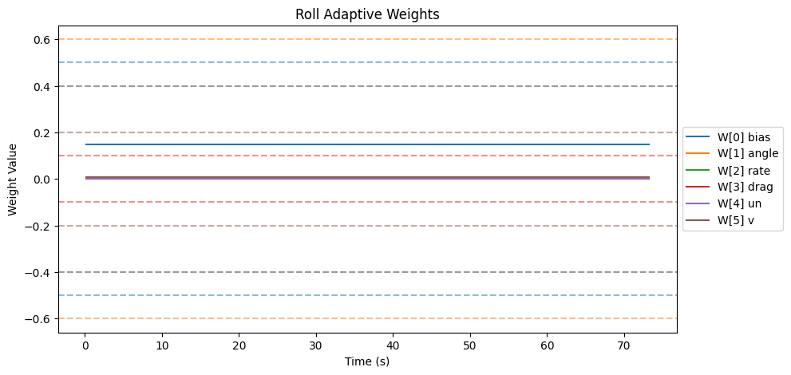
| Weight | θ_final | Drift (/s) | Proj. Hits | Oscillation (/s) |
|--------|---------|------------|------------|-------------------|
| W[0] bias | 0.148 | 0.0000 | 0.0% | 0.00 |
| W[1] angle | 0.001 | 0.0000 | 0.0% | 0.00 |
| W[2] rate | 0.000 | 0.0000 | 0.0% | 0.00 |
| W[3] drag | 0.000 | -0.0000 | 0.0% | 0.00 |
| W[4] un | 0.002 | -0.0000 | 0.0% | 0.00 |
| W[5] v | 0.008 | -0.0000 | 0.0% | 0.00 |

- ‖Θ‖ final = 0.149, trending: → STABLE/CONVERGING
- Hard-freeze fraction: 0.0%

#### Spectral
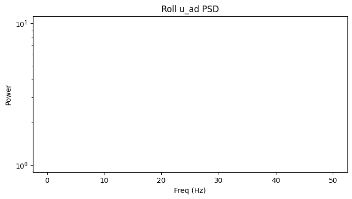
- Dominant freq: 0.4 Hz | Bandwidth: 50.0 Hz | DC fraction: 0%

### Yaw

#### Tracking
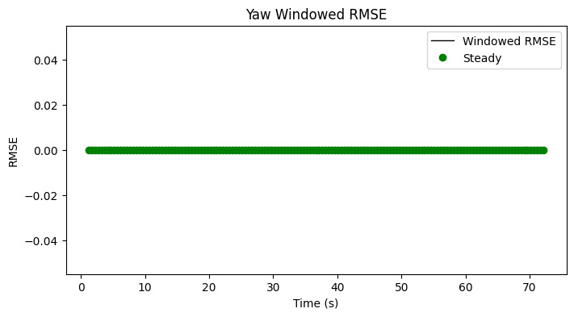

| Metric | Value |
|--------|-------|
| RMSE | 0.000 |
| MAE | 0.000 |
| Peak Error | 0.000 |
| Steady-State RMSE | - |
| Transient RMSE | - |

#### Control Authority
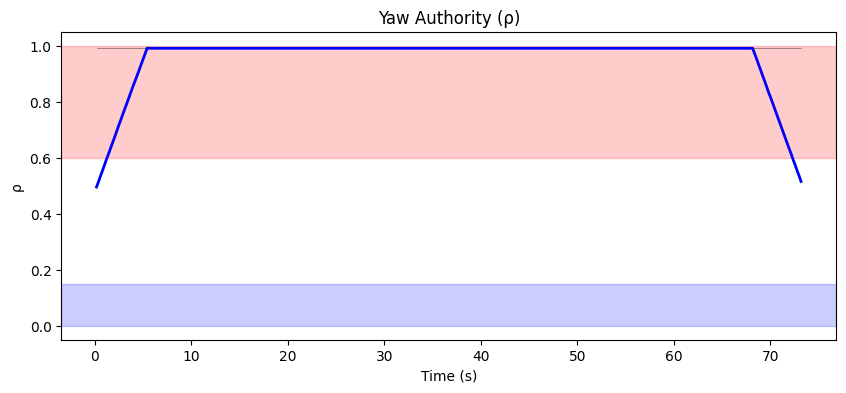
- ρ_mean = 0.991, ρ_p95 = 0.991
- u_ad RMS = 161.12 mixer units, u_nom RMS = 0.00 mixer units
- Phase relationship: decoupled (r = 0.00)

#### Weight Health
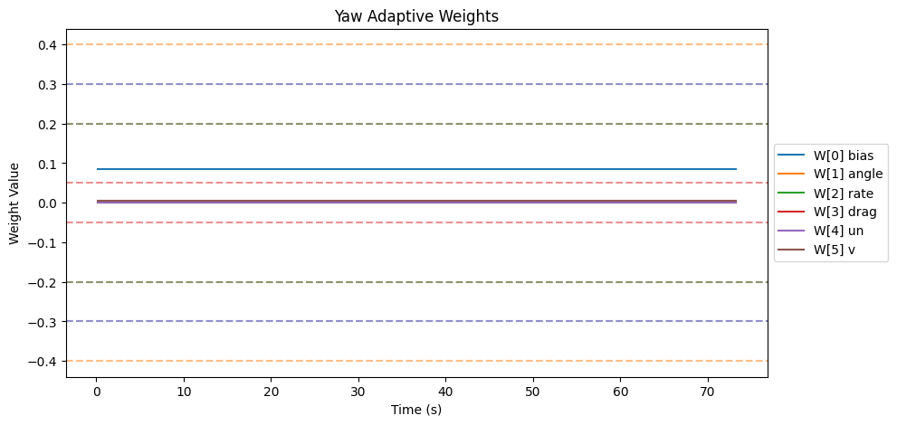
| Weight | θ_final | Drift (/s) | Proj. Hits | Oscillation (/s) |
|--------|---------|------------|------------|-------------------|
| W[0] bias | 0.086 | 0.0000 | 0.0% | 0.00 |
| W[1] angle | 0.000 | 0.0000 | 0.0% | 0.00 |
| W[2] rate | 0.000 | -0.0000 | 0.0% | 0.00 |
| W[3] drag | 0.000 | 0.0000 | 0.0% | 0.00 |
| W[4] un | 0.001 | 0.0000 | 0.0% | 0.00 |
| W[5] v | 0.004 | -0.0000 | 0.0% | 0.00 |

- ‖Θ‖ final = 0.086, trending: → STABLE/CONVERGING
- Hard-freeze fraction: 0.0%

#### Spectral
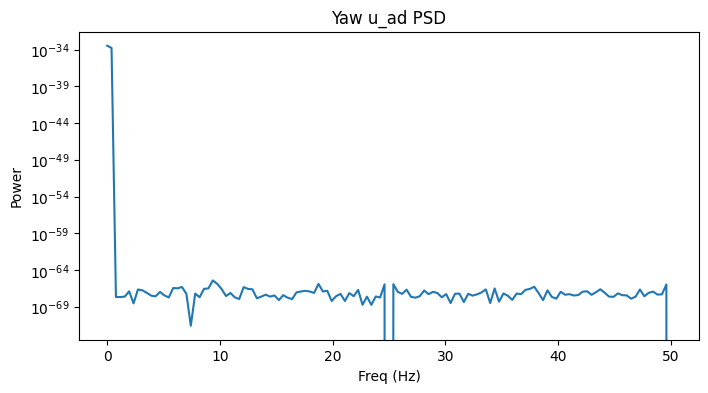
- Dominant freq: 0.4 Hz | Bandwidth: 0.8 Hz | DC fraction: 100%

### Z

#### Tracking
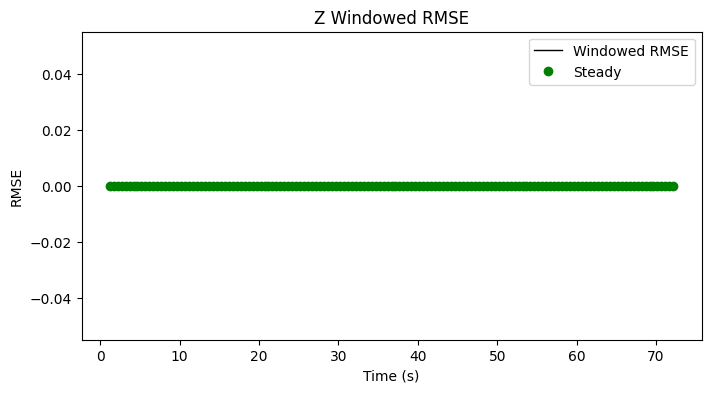

| Metric | Value |
|--------|-------|
| RMSE | 0.000 |
| MAE | 0.000 |
| Peak Error | 0.000 |
| Steady-State RMSE | - |
| Transient RMSE | - |

#### Control Authority
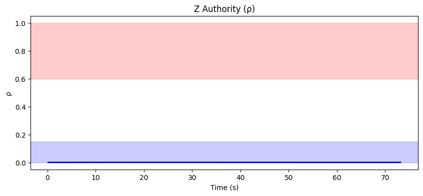
- ρ_mean = 0.001, ρ_p95 = 0.001
- u_ad RMS = 0.00 mixer units, u_nom RMS = 0.00 mixer units
- Phase relationship: decoupled (r = 0.00)

#### Weight Health
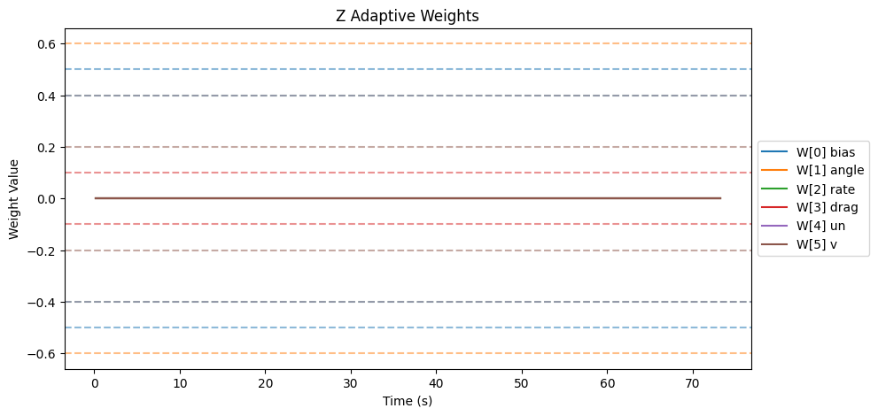
| Weight | θ_final | Drift (/s) | Proj. Hits | Oscillation (/s) |
|--------|---------|------------|------------|-------------------|
| W[0] bias | 0.000 | 0.0000 | 0.0% | 0.00 |
| W[1] angle | 0.000 | 0.0000 | 0.0% | 0.00 |
| W[2] rate | 0.000 | 0.0000 | 0.0% | 0.00 |
| W[3] drag | 0.000 | 0.0000 | 0.0% | 0.00 |
| W[4] un | 0.002 | -0.0000 | 0.0% | 0.00 |
| W[5] v | 0.000 | 0.0000 | 0.0% | 0.00 |

- ‖Θ‖ final = 0.002, trending: → STABLE/CONVERGING
- Hard-freeze fraction: 0.0%

#### Spectral
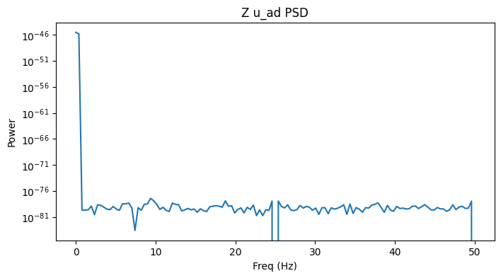
- Dominant freq: 0.4 Hz | Bandwidth: 0.8 Hz | DC fraction: 100%

## Firmware Parameters (Snapshot)
```json
{
  "payload": "PAYLOAD_LIGHT",
  "mrac_dt": 0.005,
  "num_basis": 6,
  "mixer": {
    "pitch": 1170.0,
    "roll": 1170.0,
    "yaw": 1872.0,
    "z": 222.0
  },
  "gamma": {
    "pitch": [
      0.5,
      3.3,
      1.0,
      2.0,
      0.1,
      1.0
    ],
    "roll": [
      0.5,
      3.3,
      1.0,
      2.0,
      0.1,
      1.0
    ],
    "yaw": [
      0.3,
      2.0,
      0.7,
      1.5,
      0.1,
      1.0
    ]
  },
  "wlim": {
    "pitch": [
      0.5,
      0.6,
      0.4,
      0.1,
      0.4,
      0.2
    ],
    "roll": [
      0.5,
      0.6,
      0.4,
      0.1,
      0.4,
      0.2
    ],
    "yaw": [
      0.3,
      0.4,
      0.2,
      0.05,
      0.3,
      0.2
    ]
  },
  "sigma": {
    "pitch": "from_config",
    "roll": "from_config",
    "yaw": "from_config"
  },
  "features": {
    "projection": true,
    "sigma_mod": true,
    "deadzone": true,
    "l1_filter": true,
    "pch": true,
    "perf_recovery": true
  },
  "_comment": "Manual overrides for firmware params. Edit before a test session. deep_analysis.py merges this into the experiment record.",
  "_instructions": "Update the fields below when you change firmware params that aren't in telemetry yet.",
  "sigma_pitch": null,
  "sigma_roll": null,
  "sigma_yaw": null,
  "omega_u_pitch": null,
  "omega_u_roll": null,
  "omega_u_yaw": null,
  "e_deadzone": null,
  "e_freeze": 8.0,
  "notes": ""
}
```
