# Flight Analysis Report: exp_flight_sinusoid_1781527210

**Date:** 2026-06-15T13:27:54.341204Z | **Duration:** 30.7s | **Samples:** 13410 | **Config:** PAYLOAD_LIGHT

---

## What Happened

- Planar XY tracking RMSE was **54.8 cm** (peak 78.3 cm).
- Worst-tracked position axis was **X** (RMSE 48.20 cm).
- Feedback trailed the reference by ~**1008 ms** (along-track/phase lag).
- **X** tracking error is dominated by **phase lag** (bias 19 / amp 24 / lag 44 / resid 16 cm RMS; gain 0.39).
- ⚠ **2 CRITICAL** MRAC alert(s) — run is INELIGIBLE as a champion until resolved.
- MRAC was most active on **z** (ρ_mean 0.80).

## Path Tracking

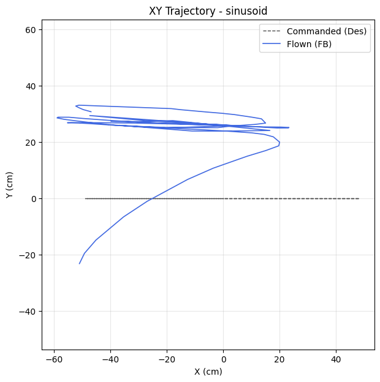

| Metric | Value |
|--------|-------|
| Planar XY RMSE (cm) | 54.81 |
| Planar peak (cm) | 78.31 |
| Cross-track mean / p95 / max (cm) | - / - / - |
| Along-track lag (ms) | 1008 |
| Rank score (planar_rmse_cm) | 54.81 |

| Axis | RMSE | MAE | Peak |
|------|------|-----|------|
| X | 48.20 | 43.94 | 76.89 |
| Y | 26.09 | 25.74 | 33.08 |
| Z | 0.04 | 0.02 | 0.15 |

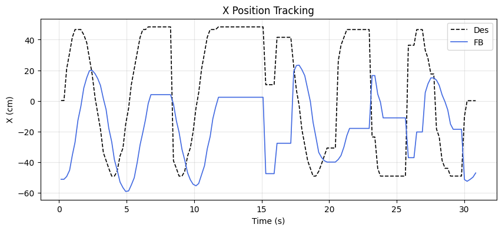
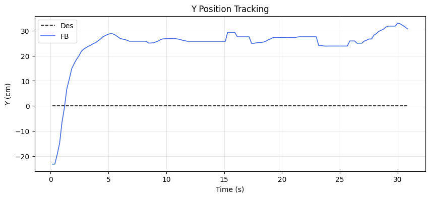
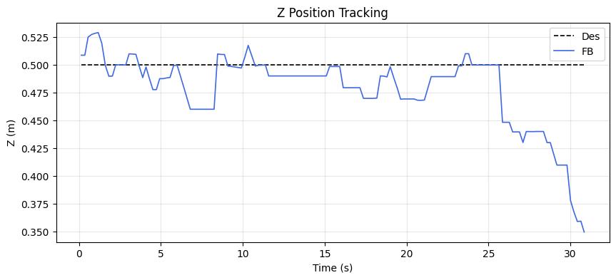

### Tracking error decomposition

_Splits each axis RMSE into the cause that injects it: a steady DC offset, amplitude attenuation (gain≠1), phase lag, or residual distortion. Read the largest column as the thing to fix first._

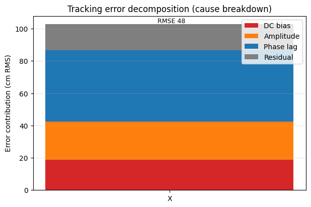

| Axis | Total RMSE | DC bias | Amplitude | Phase lag | Residual | Gain | Lag (ms) |
|------|-----------|---------|-----------|-----------|----------|------|----------|
| X | 48.20 | 18.80 | 23.55 | 44.41 | 16.00 | 0.39 | 1008 |

### Yaw heading-hold drift

| Cmd (°) | Final offset (°) | Mean offset (°) | Drift (°/s) | Total drift (°) | P2P (°) |
|---------|------------------|-----------------|-------------|-----------------|---------|
| 0.00 | -0.10 | 0.24 | -0.01 | -0.35 | 2.07 |

## MRAC Scoreboard (attitude / rate loops)

| Axis  | RMSE | RMSE_ss | RMSE_tr | ρ_mean | ρ_p95 | Phase | ‖Θ‖ | ⚠ | 🔴 |
|-------|------|---------|---------|--------|-------|-------|------|---|---|
| Pitch | 3.858 | 3.353 | 4.086 | 0.475 | 0.913 | decoupled | 0.239 | 1 | 1 |
| Roll | 2.456 | 0.529 | 1.935 | 0.411 | 0.846 | decoupled | 0.245 | 0 | 0 |
| Yaw | 0.424 | 0.350 | - | 0.276 | 0.602 | reinforcing | 0.144 | 0 | 0 |
| Z | 0.039 | 0.024 | - | 0.802 | 0.919 | reinforcing | 1.030 | 3 | 1 |

## Alerts

- [CRITICAL] **NEAR_SATURATION**: pitch: MRAC near saturation (ρ_p95=0.91). Reduce gamma or increase u_max.
- [CRITICAL] **NEAR_SATURATION**: z: MRAC near saturation (ρ_p95=0.92). Reduce gamma or increase u_max.
- [WARN] **POOR_TRACKING**: pitch: Tracking degraded (RMSE=3.86).
- [WARN] **HIGH_AUTHORITY**: z: MRAC-dominant (ρ=0.80). PID gains may be insufficient.
- [WARN] **PROJECTION_ACTIVE**: z: Weight[0] hitting projection bound 100% of time. Disturbance may exceed budget.
- [WARN] **REDUNDANT_EFFORT**: z: MRAC reinforcing PID (r=0.78) with significant authority. PID may need retuning.
- [INFO] **TRANSIENT_PENALTY**: roll: Transient RMSE 3.7× worse than steady-state.

## Per-Axis Detail

### Pitch

#### Tracking
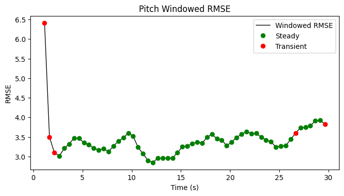

| Metric | Value |
|--------|-------|
| RMSE | 3.858 |
| MAE | 3.543 |
| Peak Error | 16.154 |
| Steady-State RMSE | 3.3525734980601194 |
| Transient RMSE | 4.086494668348483 |

#### Control Authority
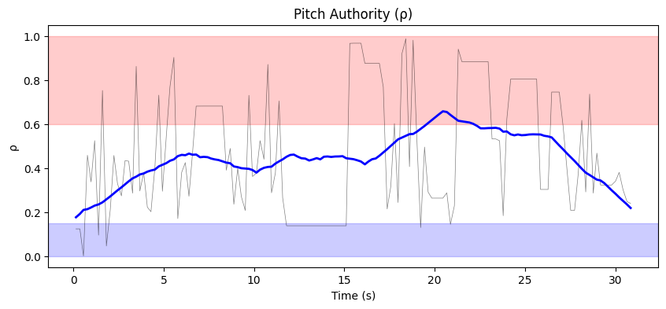
- ρ_mean = 0.475, ρ_p95 = 0.913
- u_ad RMS = 38.38 mixer units, u_nom RMS = 0.07 mixer units
- Phase relationship: decoupled (r = 0.24)

#### Weight Health
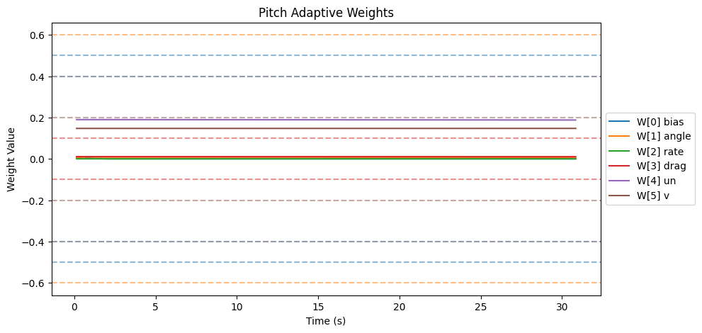
| Weight | θ_final | Drift (/s) | Proj. Hits | Oscillation (/s) |
|--------|---------|------------|------------|-------------------|
| W[0] bias | 0.000 | -0.0000 | 0.0% | 0.98 |
| W[1] angle | 0.004 | 0.0000 | 0.0% | 1.89 |
| W[2] rate | 0.000 | -0.0000 | 0.0% | 0.94 |
| W[3] drag | 0.011 | -0.0000 | 0.0% | 1.34 |
| W[4] un | 0.188 | -0.0001 | 0.0% | 0.85 |
| W[5] v | 0.147 | 0.0000 | 0.0% | 1.17 |

- ‖Θ‖ final = 0.239, trending: → STABLE/CONVERGING
- Hard-freeze fraction: 0.0%

### Roll

#### Tracking
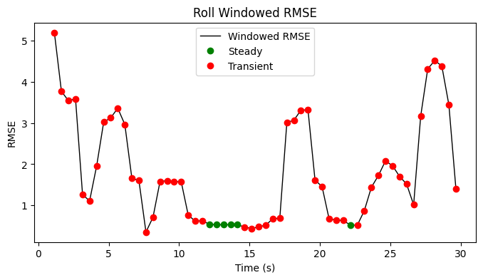

| Metric | Value |
|--------|-------|
| RMSE | 2.456 |
| MAE | 1.364 |
| Peak Error | 10.943 |
| Steady-State RMSE | 0.5290179103223472 |
| Transient RMSE | 1.9352432647995859 |

#### Control Authority
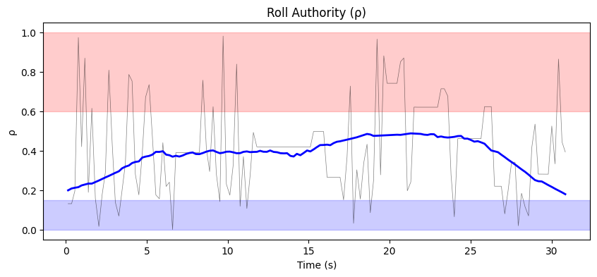
- ρ_mean = 0.411, ρ_p95 = 0.846
- u_ad RMS = 57.67 mixer units, u_nom RMS = 0.09 mixer units
- Phase relationship: decoupled (r = 0.03)

#### Weight Health
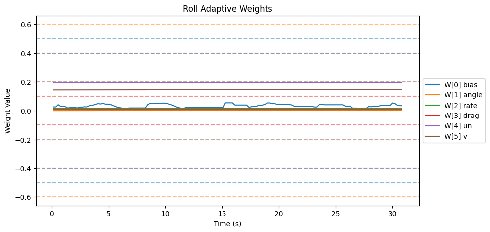
| Weight | θ_final | Drift (/s) | Proj. Hits | Oscillation (/s) |
|--------|---------|------------|------------|-------------------|
| W[0] bias | 0.034 | 0.0002 | 0.0% | 1.86 |
| W[1] angle | 0.002 | 0.0001 | 0.0% | 1.47 |
| W[2] rate | 0.017 | -0.0000 | 0.0% | 1.40 |
| W[3] drag | 0.007 | -0.0000 | 0.0% | 1.43 |
| W[4] un | 0.193 | -0.0000 | 0.0% | 1.69 |
| W[5] v | 0.146 | 0.0001 | 0.0% | 1.47 |

- ‖Θ‖ final = 0.245, trending: → STABLE/CONVERGING
- Hard-freeze fraction: 0.0%

### Yaw

#### Tracking
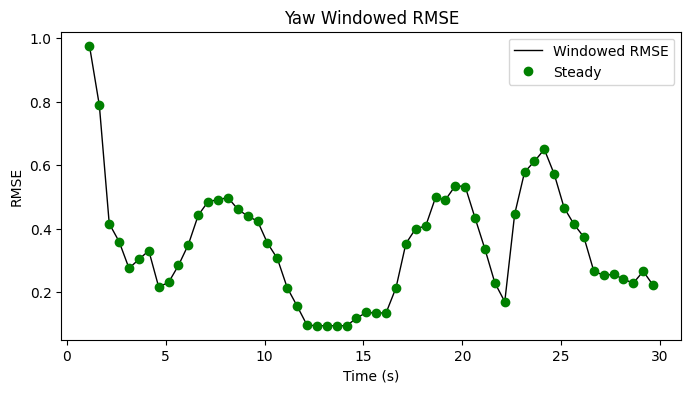

| Metric | Value |
|--------|-------|
| RMSE | 0.424 |
| MAE | 0.327 |
| Peak Error | 1.621 |
| Steady-State RMSE | 0.34952485510768067 |
| Transient RMSE | - |

#### Control Authority
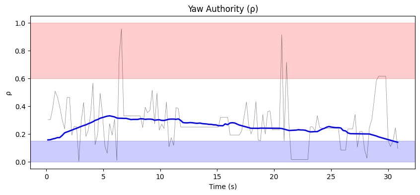
- ρ_mean = 0.276, ρ_p95 = 0.602
- u_ad RMS = 14.65 mixer units, u_nom RMS = 0.02 mixer units
- Phase relationship: reinforcing (r = 0.61)

#### Weight Health
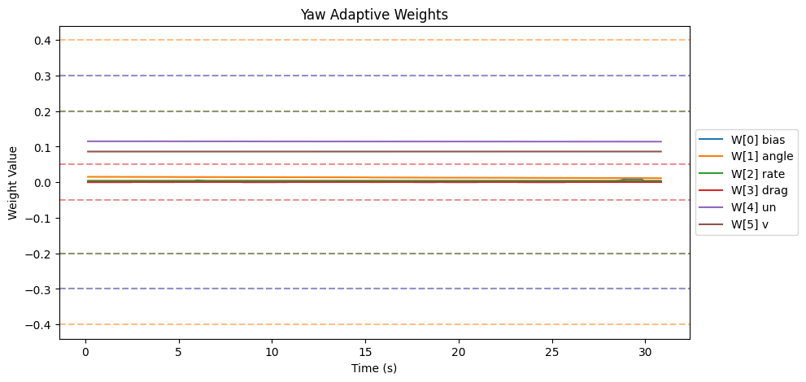
| Weight | θ_final | Drift (/s) | Proj. Hits | Oscillation (/s) |
|--------|---------|------------|------------|-------------------|
| W[0] bias | 0.001 | 0.0001 | 0.0% | 1.73 |
| W[1] angle | 0.012 | -0.0001 | 0.0% | 0.88 |
| W[2] rate | 0.004 | -0.0000 | 0.0% | 1.11 |
| W[3] drag | 0.000 | 0.0000 | 0.0% | 0.00 |
| W[4] un | 0.114 | -0.0000 | 0.0% | 0.81 |
| W[5] v | 0.086 | -0.0000 | 0.0% | 1.37 |

- ‖Θ‖ final = 0.144, trending: → STABLE/CONVERGING
- Hard-freeze fraction: 0.0%

### Z

#### Tracking
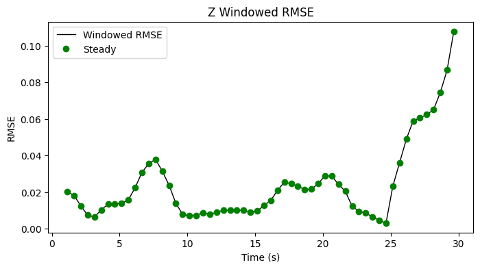

| Metric | Value |
|--------|-------|
| RMSE | 0.039 |
| MAE | 0.025 |
| Peak Error | 0.151 |
| Steady-State RMSE | 0.02404749219480051 |
| Transient RMSE | - |

#### Control Authority
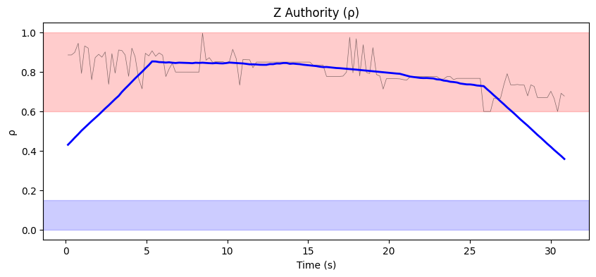
- ρ_mean = 0.802, ρ_p95 = 0.919
- u_ad RMS = 228.23 mixer units, u_nom RMS = 0.31 mixer units
- Phase relationship: reinforcing (r = 0.78)

#### Weight Health
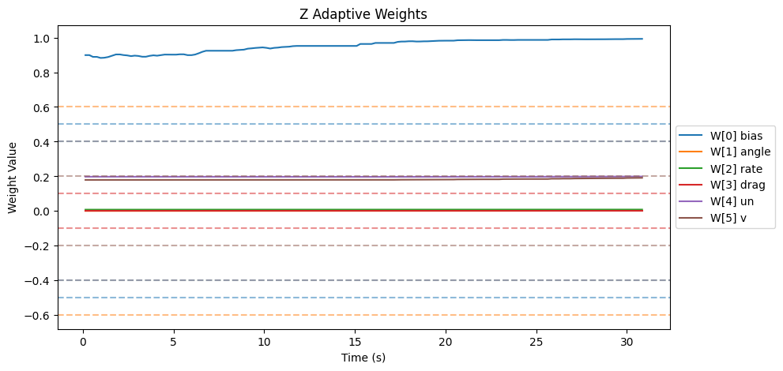
| Weight | θ_final | Drift (/s) | Proj. Hits | Oscillation (/s) |
|--------|---------|------------|------------|-------------------|
| W[0] bias | 0.992 | 0.0038 | 100.0% | 1.73 |
| W[1] angle | 0.002 | 0.0000 | 0.0% | 1.60 |
| W[2] rate | 0.009 | 0.0000 | 0.0% | 1.95 |
| W[3] drag | 0.000 | 0.0000 | 0.0% | 0.00 |
| W[4] un | 0.199 | 0.0000 | 0.0% | 1.82 |
| W[5] v | 0.191 | 0.0003 | 3.4% | 1.50 |

- ‖Θ‖ final = 1.030, trending: → STABLE/CONVERGING
- Hard-freeze fraction: 0.0%

## Firmware Parameters (Snapshot)
```json
{
  "payload": "PAYLOAD_LIGHT",
  "mrac_dt": 0.005,
  "num_basis": 6,
  "mixer": {
    "pitch": 1170.0,
    "roll": 1170.0,
    "yaw": 1872.0,
    "z": 222.0
  },
  "gamma": {
    "pitch": [
      0.5,
      3.3,
      1.0,
      2.0,
      0.1,
      1.0
    ],
    "roll": [
      0.5,
      3.3,
      1.0,
      2.0,
      0.1,
      1.0
    ],
    "yaw": [
      0.3,
      2.0,
      0.7,
      1.5,
      0.1,
      1.0
    ]
  },
  "wlim": {
    "pitch": [
      0.5,
      0.6,
      0.4,
      0.1,
      0.4,
      0.2
    ],
    "roll": [
      0.5,
      0.6,
      0.4,
      0.1,
      0.4,
      0.2
    ],
    "yaw": [
      0.3,
      0.4,
      0.2,
      0.05,
      0.3,
      0.2
    ]
  },
  "sigma": {
    "pitch": "from_config",
    "roll": "from_config",
    "yaw": "from_config"
  },
  "features": {
    "projection": true,
    "sigma_mod": true,
    "deadzone": true,
    "l1_filter": true,
    "pch": true,
    "perf_recovery": true
  },
  "_comment": "Manual overrides for firmware params. Edit before a test session. deep_analysis.py merges this into the experiment record.",
  "_instructions": "Update the fields below when you change firmware params that aren't in telemetry yet.",
  "sigma_pitch": null,
  "sigma_roll": null,
  "sigma_yaw": null,
  "omega_u_pitch": null,
  "omega_u_roll": null,
  "omega_u_yaw": null,
  "e_deadzone": null,
  "e_freeze": 8.0,
  "notes": ""
}
```
