# Flight Analysis Report: exp_flight_twc_1781526837

**Date:** 2026-06-15T13:28:01.584630Z | **Duration:** 5.0s | **Samples:** 2250 | **Config:** PAYLOAD_LIGHT

---

## What Happened

- Planar XY tracking RMSE was **35.9 cm** (peak 63.2 cm).
- Worst-tracked position axis was **X** (RMSE 31.05 cm).
- Feedback trailed the reference by ~**625 ms** (along-track/phase lag).
- **X** tracking error is dominated by **DC offset/drift** (bias 13 / amp 2 / lag 10 / resid 11 cm RMS; gain 0.77).
- **Never settled** within 5 cm of target (final error 30.1 cm).
- 3 warning-level MRAC alert(s); no critical issues.
- MRAC was most active on **pitch** (ρ_mean 0.44).

## Path Tracking

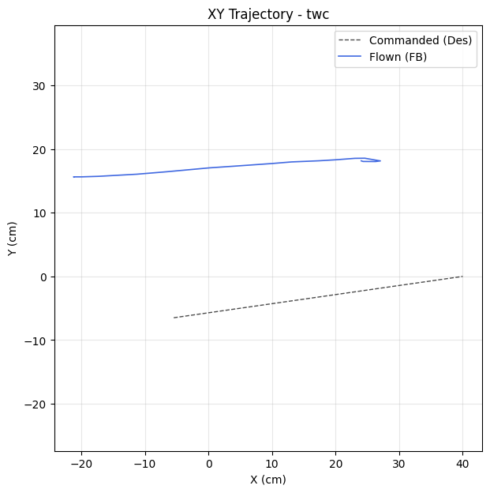

| Metric | Value |
|--------|-------|
| Planar XY RMSE (cm) | 35.86 |
| Planar peak (cm) | 63.20 |
| Cross-track mean / p95 / max (cm) | - / - / - |
| Along-track lag (ms) | 625 |
| Rank score (planar_rmse_cm) | 35.86 |
| TWC settling time (s) | - |
| TWC final error (cm) | 30.13 |

| Axis | RMSE | MAE | Peak |
|------|------|-----|------|
| X | 31.05 | 26.62 | 61.23 |
| Y | 17.92 | 17.87 | 22.12 |
| Z | 0.18 | 0.15 | 0.44 |

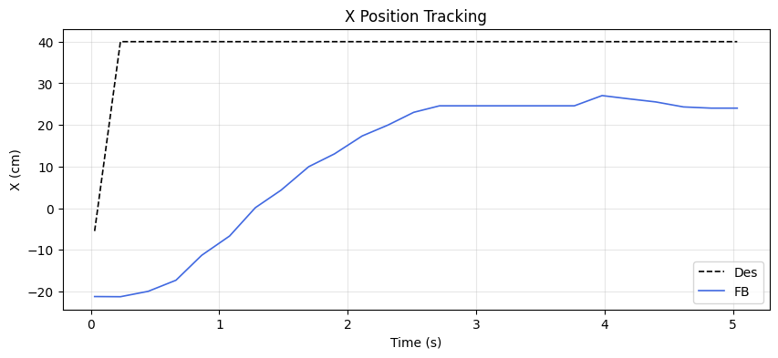
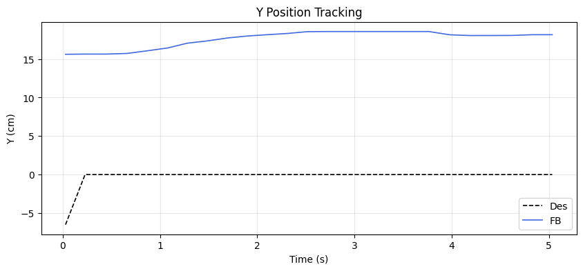
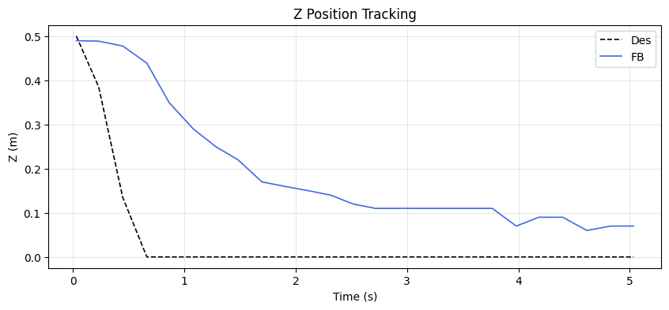

### Tracking error decomposition

_Splits each axis RMSE into the cause that injects it: a steady DC offset, amplitude attenuation (gain≠1), phase lag, or residual distortion. Read the largest column as the thing to fix first._

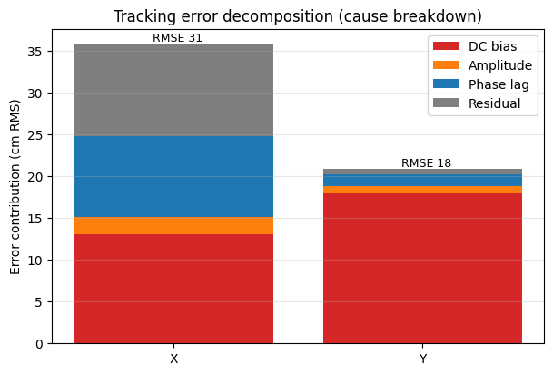

| Axis | Total RMSE | DC bias | Amplitude | Phase lag | Residual | Gain | Lag (ms) |
|------|-----------|---------|-----------|-----------|----------|------|----------|
| X | 31.05 | 13.09 | 2.08 | 9.69 | 11.01 | 0.77 | 625 |
| Y | 17.92 | 17.99 | 0.83 | 1.39 | 0.68 | 0.35 | 625 |

### Yaw heading-hold drift

| Cmd (°) | Final offset (°) | Mean offset (°) | Drift (°/s) | Total drift (°) | P2P (°) |
|---------|------------------|-----------------|-------------|-----------------|---------|
| 0.00 | 0.15 | 0.10 | 0.03 | 0.16 | 0.68 |

## MRAC Scoreboard (attitude / rate loops)

| Axis  | RMSE | RMSE_ss | RMSE_tr | ρ_mean | ρ_p95 | Phase | ‖Θ‖ | ⚠ | 🔴 |
|-------|------|---------|---------|--------|-------|-------|------|---|---|
| Pitch | 2.414 | 2.417 | - | 0.442 | 0.705 | decoupled | 0.227 | 0 | 0 |
| Roll | 0.998 | 0.351 | 0.577 | 0.378 | 0.799 | reinforcing | 0.206 | 1 | 0 |
| Yaw | 0.170 | 0.179 | - | 0.419 | 0.806 | reinforcing | 0.143 | 1 | 0 |
| Z | 0.185 | 0.163 | - | 0.262 | 0.632 | reinforcing | 0.236 | 1 | 0 |

## Alerts

- [WARN] **REDUNDANT_EFFORT**: roll: MRAC reinforcing PID (r=0.53) with significant authority. PID may need retuning.
- [WARN] **REDUNDANT_EFFORT**: yaw: MRAC reinforcing PID (r=0.37) with significant authority. PID may need retuning.
- [WARN] **POOR_TRACKING**: z: Tracking degraded (RMSE=0.18).

## Per-Axis Detail

### Pitch

#### Tracking
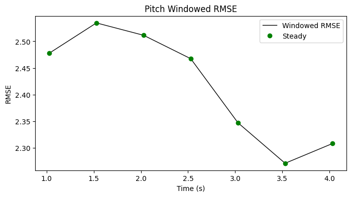

| Metric | Value |
|--------|-------|
| RMSE | 2.414 |
| MAE | 2.406 |
| Peak Error | 2.761 |
| Steady-State RMSE | 2.4166142067383096 |
| Transient RMSE | - |

#### Control Authority
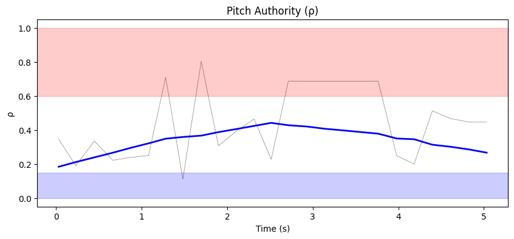
- ρ_mean = 0.442, ρ_p95 = 0.705
- u_ad RMS = 34.59 mixer units, u_nom RMS = 0.06 mixer units
- Phase relationship: decoupled (r = -0.13)

#### Weight Health
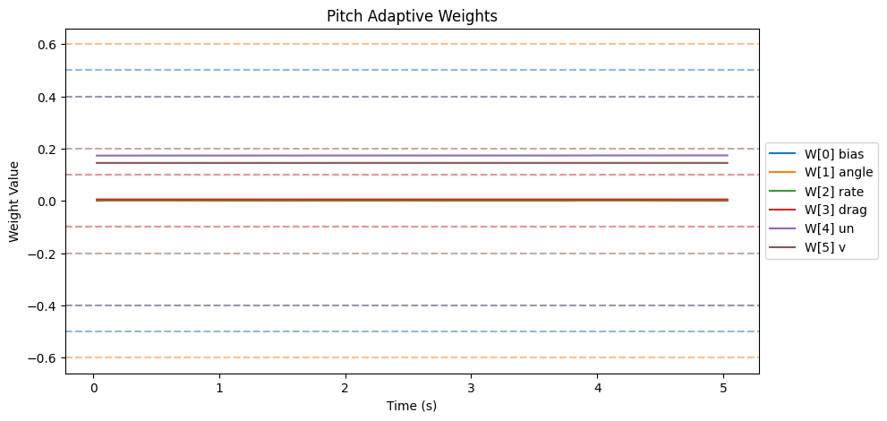
| Weight | θ_final | Drift (/s) | Proj. Hits | Oscillation (/s) |
|--------|---------|------------|------------|-------------------|
| W[0] bias | 0.000 | -0.0001 | 0.0% | 1.80 |
| W[1] angle | 0.001 | -0.0000 | 0.0% | 2.60 |
| W[2] rate | 0.003 | -0.0000 | 0.0% | 0.60 |
| W[3] drag | 0.005 | -0.0000 | 0.0% | 1.40 |
| W[4] un | 0.174 | 0.0001 | 0.0% | 0.60 |
| W[5] v | 0.145 | 0.0000 | 0.0% | 1.60 |

- ‖Θ‖ final = 0.227, trending: → STABLE/CONVERGING
- Hard-freeze fraction: 0.0%

### Roll

#### Tracking
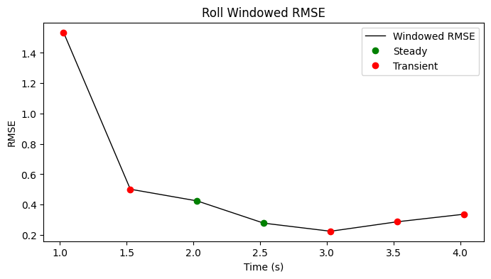

| Metric | Value |
|--------|-------|
| RMSE | 0.998 |
| MAE | 0.507 |
| Peak Error | 4.514 |
| Steady-State RMSE | 0.3508255888924726 |
| Transient RMSE | 0.5766006077870536 |

#### Control Authority
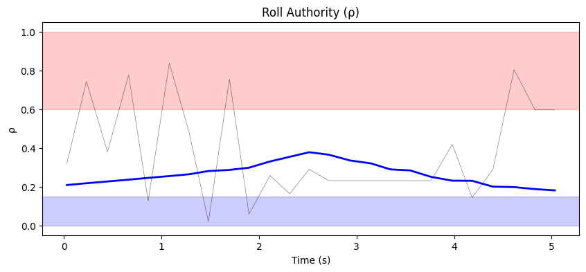
- ρ_mean = 0.378, ρ_p95 = 0.799
- u_ad RMS = 34.24 mixer units, u_nom RMS = 0.08 mixer units
- Phase relationship: reinforcing (r = 0.53)

#### Weight Health
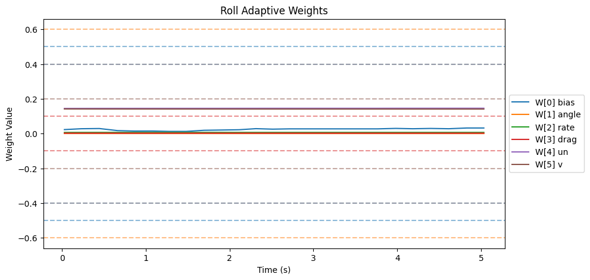
| Weight | θ_final | Drift (/s) | Proj. Hits | Oscillation (/s) |
|--------|---------|------------|------------|-------------------|
| W[0] bias | 0.032 | 0.0025 | 0.0% | 2.60 |
| W[1] angle | 0.000 | -0.0000 | 0.0% | 0.80 |
| W[2] rate | 0.007 | 0.0000 | 0.0% | 1.80 |
| W[3] drag | 0.002 | 0.0000 | 0.0% | 1.60 |
| W[4] un | 0.146 | 0.0002 | 0.0% | 0.60 |
| W[5] v | 0.141 | -0.0001 | 0.0% | 0.60 |

- ‖Θ‖ final = 0.206, trending: → STABLE/CONVERGING
- Hard-freeze fraction: 0.0%

### Yaw

#### Tracking
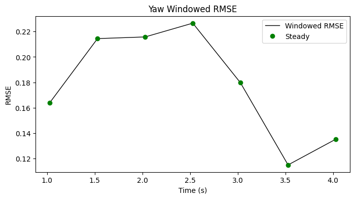

| Metric | Value |
|--------|-------|
| RMSE | 0.170 |
| MAE | 0.126 |
| Peak Error | 0.440 |
| Steady-State RMSE | 0.1787092278823654 |
| Transient RMSE | - |

#### Control Authority
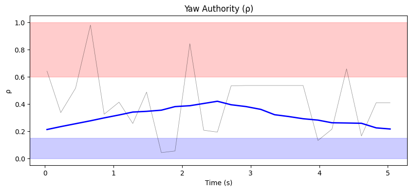
- ρ_mean = 0.419, ρ_p95 = 0.806
- u_ad RMS = 10.81 mixer units, u_nom RMS = 0.02 mixer units
- Phase relationship: reinforcing (r = 0.37)

#### Weight Health
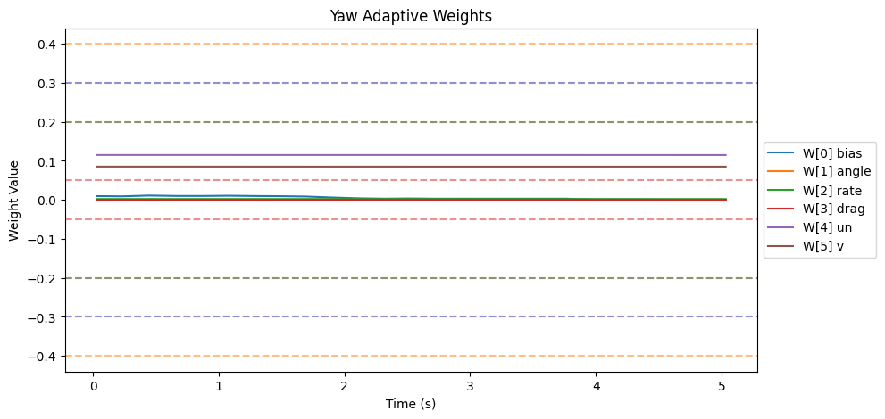
| Weight | θ_final | Drift (/s) | Proj. Hits | Oscillation (/s) |
|--------|---------|------------|------------|-------------------|
| W[0] bias | 0.000 | -0.0024 | 0.0% | 1.80 |
| W[1] angle | 0.000 | -0.0000 | 0.0% | 0.60 |
| W[2] rate | 0.002 | -0.0000 | 0.0% | 1.40 |
| W[3] drag | 0.000 | 0.0000 | 0.0% | 0.00 |
| W[4] un | 0.115 | -0.0000 | 0.0% | 0.60 |
| W[5] v | 0.085 | -0.0000 | 0.0% | 1.40 |

- ‖Θ‖ final = 0.143, trending: → STABLE/CONVERGING
- Hard-freeze fraction: 0.0%

### Z

#### Tracking
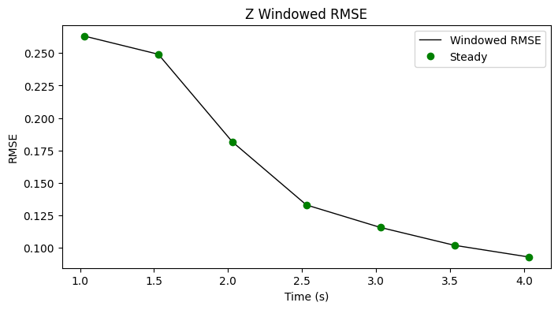

| Metric | Value |
|--------|-------|
| RMSE | 0.185 |
| MAE | 0.154 |
| Peak Error | 0.439 |
| Steady-State RMSE | 0.16250352346053895 |
| Transient RMSE | - |

#### Control Authority
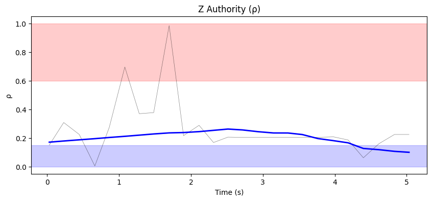
- ρ_mean = 0.262, ρ_p95 = 0.632
- u_ad RMS = 22.89 mixer units, u_nom RMS = 0.39 mixer units
- Phase relationship: reinforcing (r = 0.63)

#### Weight Health
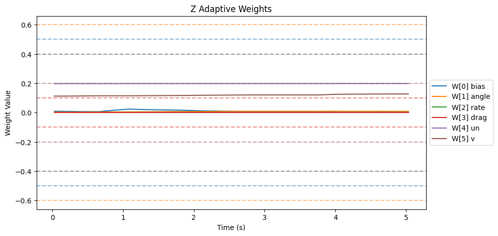
| Weight | θ_final | Drift (/s) | Proj. Hits | Oscillation (/s) |
|--------|---------|------------|------------|-------------------|
| W[0] bias | 0.004 | -0.0024 | 0.0% | 1.40 |
| W[1] angle | 0.008 | 0.0013 | 0.0% | 1.60 |
| W[2] rate | 0.002 | 0.0000 | 0.0% | 1.40 |
| W[3] drag | 0.000 | 0.0000 | 0.0% | 0.00 |
| W[4] un | 0.198 | 0.0001 | 0.0% | 1.60 |
| W[5] v | 0.127 | 0.0030 | 0.0% | 1.00 |

- ‖Θ‖ final = 0.236, trending: → STABLE/CONVERGING
- Hard-freeze fraction: 0.0%

## Firmware Parameters (Snapshot)
```json
{
  "payload": "PAYLOAD_LIGHT",
  "mrac_dt": 0.005,
  "num_basis": 6,
  "mixer": {
    "pitch": 1170.0,
    "roll": 1170.0,
    "yaw": 1872.0,
    "z": 222.0
  },
  "gamma": {
    "pitch": [
      0.5,
      3.3,
      1.0,
      2.0,
      0.1,
      1.0
    ],
    "roll": [
      0.5,
      3.3,
      1.0,
      2.0,
      0.1,
      1.0
    ],
    "yaw": [
      0.3,
      2.0,
      0.7,
      1.5,
      0.1,
      1.0
    ]
  },
  "wlim": {
    "pitch": [
      0.5,
      0.6,
      0.4,
      0.1,
      0.4,
      0.2
    ],
    "roll": [
      0.5,
      0.6,
      0.4,
      0.1,
      0.4,
      0.2
    ],
    "yaw": [
      0.3,
      0.4,
      0.2,
      0.05,
      0.3,
      0.2
    ]
  },
  "sigma": {
    "pitch": "from_config",
    "roll": "from_config",
    "yaw": "from_config"
  },
  "features": {
    "projection": true,
    "sigma_mod": true,
    "deadzone": true,
    "l1_filter": true,
    "pch": true,
    "perf_recovery": true
  },
  "_comment": "Manual overrides for firmware params. Edit before a test session. deep_analysis.py merges this into the experiment record.",
  "_instructions": "Update the fields below when you change firmware params that aren't in telemetry yet.",
  "sigma_pitch": null,
  "sigma_roll": null,
  "sigma_yaw": null,
  "omega_u_pitch": null,
  "omega_u_roll": null,
  "omega_u_yaw": null,
  "e_deadzone": null,
  "e_freeze": 8.0,
  "notes": ""
}
```
