# Flight Analysis Report: exp_flight_twc_1781526842

**Date:** 2026-06-15T13:28:08.673517Z | **Duration:** 1.4s | **Samples:** 720 | **Config:** PAYLOAD_LIGHT

---

## What Happened

- Planar XY tracking RMSE was **20.9 cm** (peak 24.2 cm).
- Worst-tracked position axis was **Y** (RMSE 15.73 cm).
- Feedback trailed the reference by ~**0 ms** (along-track/phase lag).
- **Never settled** within 5 cm of target (final error 29.6 cm).
- 2 warning-level MRAC alert(s); no critical issues.
- MRAC was most active on **roll** (ρ_mean 0.48).

## Path Tracking

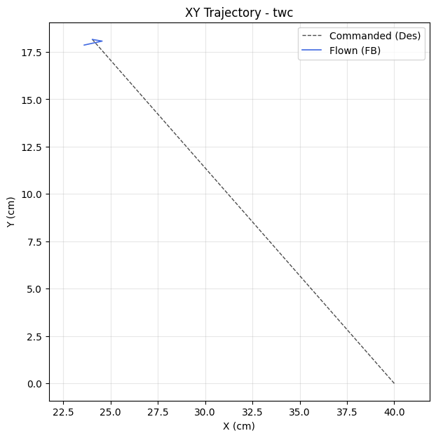

| Metric | Value |
|--------|-------|
| Planar XY RMSE (cm) | 20.94 |
| Planar peak (cm) | 24.18 |
| Cross-track mean / p95 / max (cm) | - / - / - |
| Along-track lag (ms) | 0 |
| Rank score (planar_rmse_cm) | 20.94 |
| TWC settling time (s) | - |
| TWC final error (cm) | 29.60 |

| Axis | RMSE | MAE | Peak |
|------|------|-----|------|
| X | 13.83 | 12.09 | 15.96 |
| Y | 15.73 | 13.67 | 18.16 |
| Z | 0.10 | 0.09 | 0.24 |

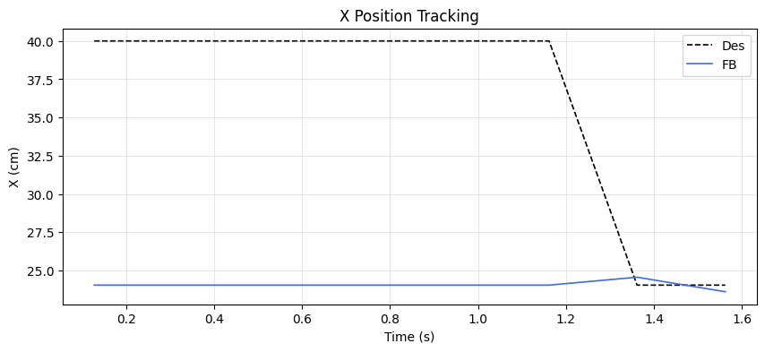
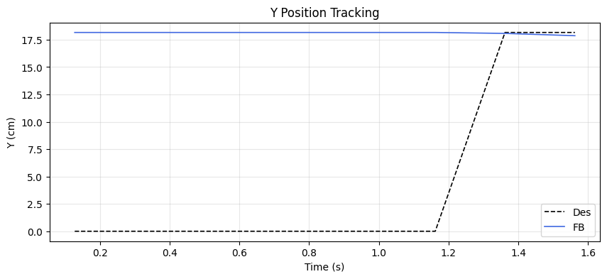
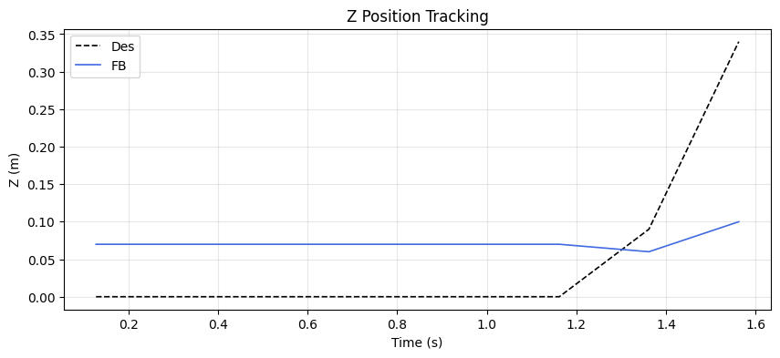

## MRAC Scoreboard (attitude / rate loops)

| Axis  | RMSE | RMSE_ss | RMSE_tr | ρ_mean | ρ_p95 | Phase | ‖Θ‖ | ⚠ | 🔴 |
|-------|------|---------|---------|--------|-------|-------|------|---|---|
| Pitch | 2.498 | - | - | 0.443 | 0.585 | reinforcing | 0.227 | 1 | 0 |
| Roll | 0.641 | - | - | 0.480 | 0.596 | decoupled | 0.205 | 0 | 0 |
| Yaw | 0.147 | - | - | 0.363 | 0.409 | decoupled | 0.143 | 0 | 0 |
| Z | 0.105 | - | - | 0.205 | 0.233 | reinforcing | 0.240 | 1 | 0 |

## Alerts

- [WARN] **REDUNDANT_EFFORT**: pitch: MRAC reinforcing PID (r=0.92) with significant authority. PID may need retuning.
- [WARN] **POOR_TRACKING**: z: Tracking degraded (RMSE=0.10).

## Per-Axis Detail

### Pitch

#### Tracking


| Metric | Value |
|--------|-------|
| RMSE | 2.498 |
| MAE | 2.332 |
| Peak Error | 3.151 |
| Steady-State RMSE | - |
| Transient RMSE | - |

#### Control Authority
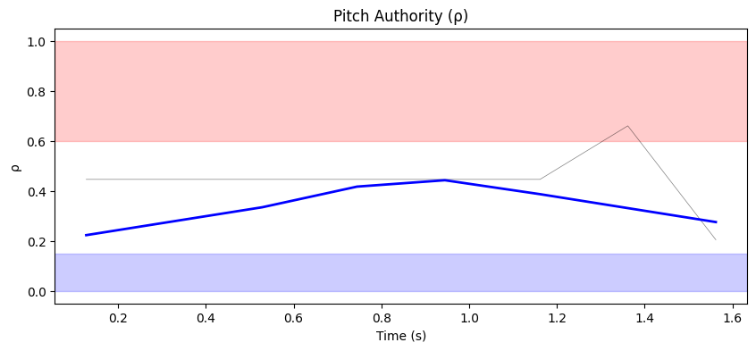
- ρ_mean = 0.443, ρ_p95 = 0.585
- u_ad RMS = 16.79 mixer units, u_nom RMS = 0.04 mixer units
- Phase relationship: reinforcing (r = 0.92)

#### Weight Health
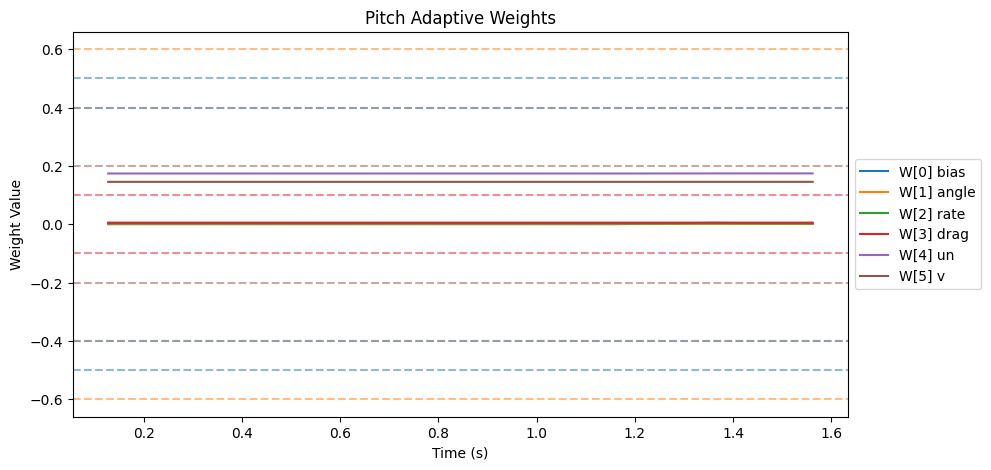
| Weight | θ_final | Drift (/s) | Proj. Hits | Oscillation (/s) |
|--------|---------|------------|------------|-------------------|
| W[0] bias | 0.001 | 0.0018 | 0.0% | 1.39 |
| W[1] angle | 0.001 | -0.0000 | 0.0% | 1.39 |
| W[2] rate | 0.003 | -0.0000 | 0.0% | 0.70 |
| W[3] drag | 0.005 | 0.0000 | 0.0% | 1.39 |
| W[4] un | 0.174 | 0.0002 | 0.0% | 0.70 |
| W[5] v | 0.145 | 0.0001 | 0.0% | 0.70 |

- ‖Θ‖ final = 0.227, trending: → STABLE/CONVERGING
- Hard-freeze fraction: 0.0%

### Roll

#### Tracking
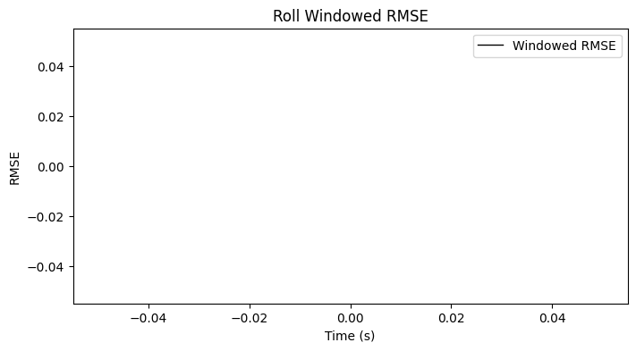

| Metric | Value |
|--------|-------|
| RMSE | 0.641 |
| MAE | 0.274 |
| Peak Error | 1.805 |
| Steady-State RMSE | - |
| Transient RMSE | - |

#### Control Authority
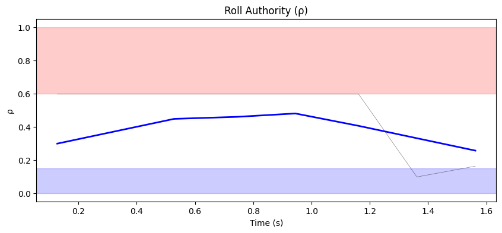
- ρ_mean = 0.480, ρ_p95 = 0.596
- u_ad RMS = 15.13 mixer units, u_nom RMS = 0.05 mixer units
- Phase relationship: decoupled (r = -0.23)

#### Weight Health
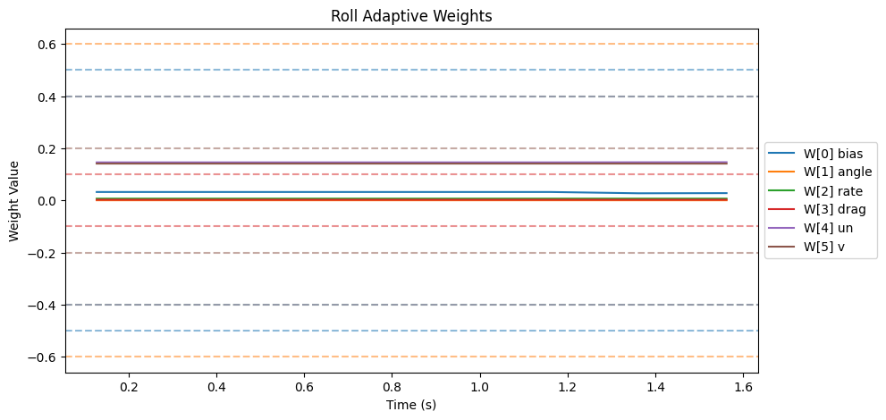
| Weight | θ_final | Drift (/s) | Proj. Hits | Oscillation (/s) |
|--------|---------|------------|------------|-------------------|
| W[0] bias | 0.028 | -0.0032 | 0.0% | 1.39 |
| W[1] angle | 0.000 | -0.0000 | 0.0% | 0.70 |
| W[2] rate | 0.007 | -0.0000 | 0.0% | 0.70 |
| W[3] drag | 0.003 | 0.0000 | 0.0% | 0.70 |
| W[4] un | 0.146 | 0.0003 | 0.0% | 0.70 |
| W[5] v | 0.141 | -0.0000 | 0.0% | 0.70 |

- ‖Θ‖ final = 0.205, trending: → STABLE/CONVERGING
- Hard-freeze fraction: 0.0%

### Yaw

#### Tracking
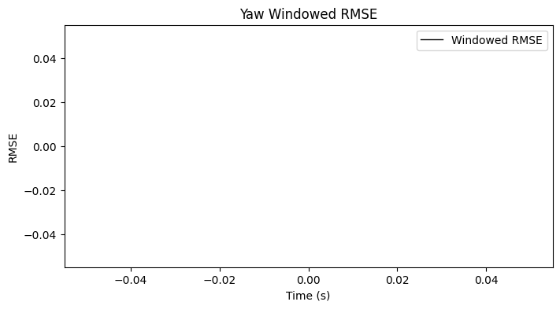

| Metric | Value |
|--------|-------|
| RMSE | 0.147 |
| MAE | 0.144 |
| Peak Error | 0.179 |
| Steady-State RMSE | - |
| Transient RMSE | - |

#### Control Authority
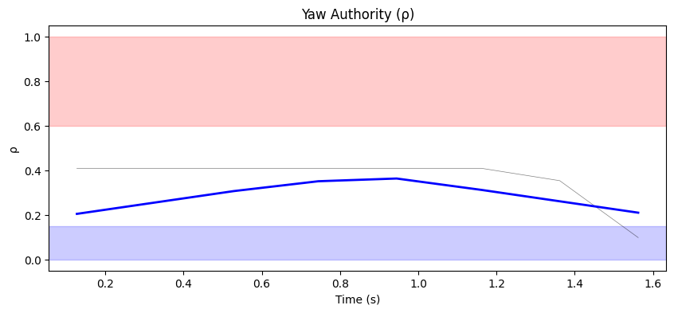
- ρ_mean = 0.363, ρ_p95 = 0.409
- u_ad RMS = 12.36 mixer units, u_nom RMS = 0.01 mixer units
- Phase relationship: decoupled (r = -0.23)

#### Weight Health
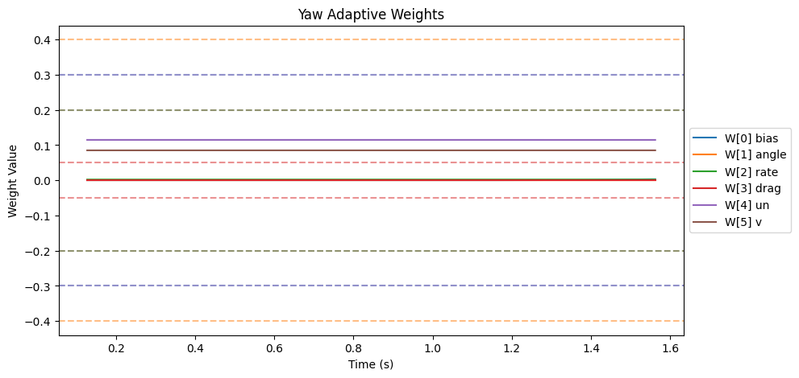
| Weight | θ_final | Drift (/s) | Proj. Hits | Oscillation (/s) |
|--------|---------|------------|------------|-------------------|
| W[0] bias | 0.003 | 0.0012 | 0.0% | 0.70 |
| W[1] angle | 0.000 | -0.0000 | 0.0% | 0.70 |
| W[2] rate | 0.002 | -0.0000 | 0.0% | 1.39 |
| W[3] drag | 0.000 | 0.0000 | 0.0% | 0.00 |
| W[4] un | 0.115 | -0.0000 | 0.0% | 0.70 |
| W[5] v | 0.085 | 0.0000 | 0.0% | 1.39 |

- ‖Θ‖ final = 0.143, trending: → STABLE/CONVERGING
- Hard-freeze fraction: 0.0%

### Z

#### Tracking
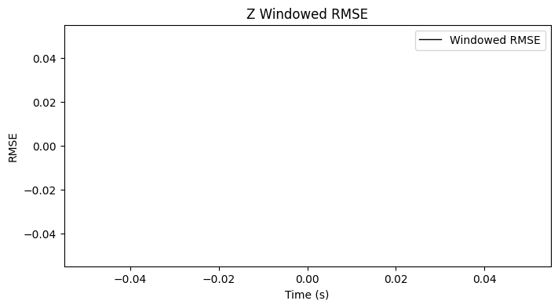

| Metric | Value |
|--------|-------|
| RMSE | 0.105 |
| MAE | 0.086 |
| Peak Error | 0.240 |
| Steady-State RMSE | - |
| Transient RMSE | - |

#### Control Authority
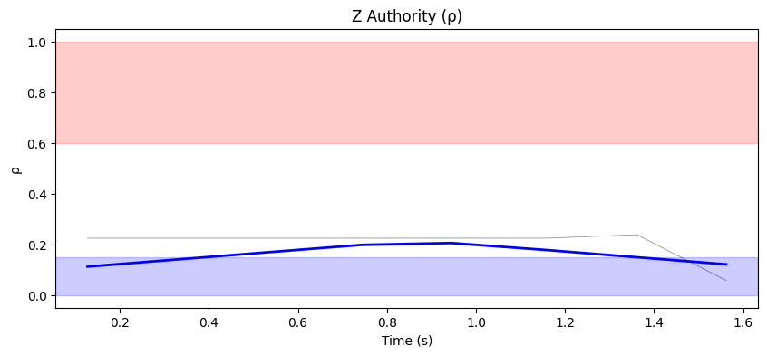
- ρ_mean = 0.205, ρ_p95 = 0.233
- u_ad RMS = 33.31 mixer units, u_nom RMS = 0.58 mixer units
- Phase relationship: reinforcing (r = 0.66)

#### Weight Health
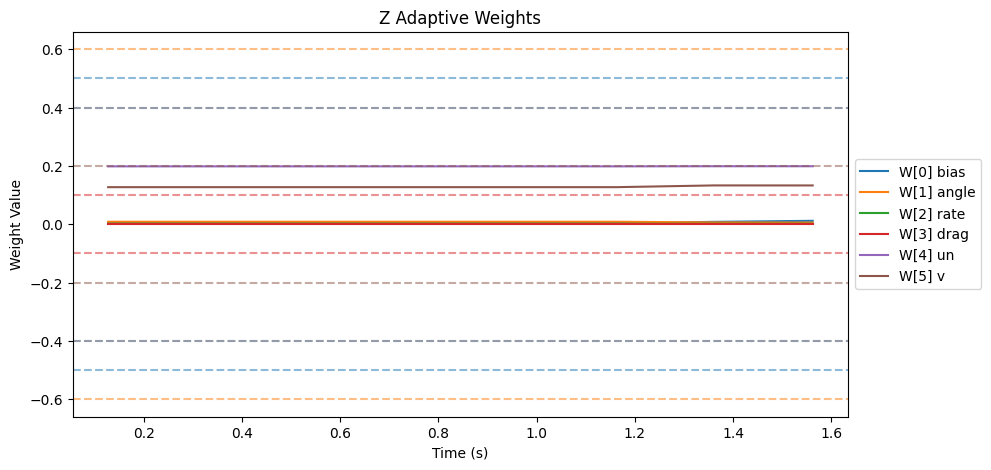
| Weight | θ_final | Drift (/s) | Proj. Hits | Oscillation (/s) |
|--------|---------|------------|------------|-------------------|
| W[0] bias | 0.012 | 0.0046 | 0.0% | 0.70 |
| W[1] angle | 0.006 | -0.0018 | 0.0% | 0.70 |
| W[2] rate | 0.002 | -0.0000 | 0.0% | 0.70 |
| W[3] drag | 0.000 | 0.0000 | 0.0% | 0.00 |
| W[4] un | 0.199 | 0.0003 | 0.0% | 0.70 |
| W[5] v | 0.133 | 0.0041 | 0.0% | 1.39 |

- ‖Θ‖ final = 0.240, trending: → STABLE/CONVERGING
- Hard-freeze fraction: 0.0%

## Firmware Parameters (Snapshot)
```json
{
  "payload": "PAYLOAD_LIGHT",
  "mrac_dt": 0.005,
  "num_basis": 6,
  "mixer": {
    "pitch": 1170.0,
    "roll": 1170.0,
    "yaw": 1872.0,
    "z": 222.0
  },
  "gamma": {
    "pitch": [
      0.5,
      3.3,
      1.0,
      2.0,
      0.1,
      1.0
    ],
    "roll": [
      0.5,
      3.3,
      1.0,
      2.0,
      0.1,
      1.0
    ],
    "yaw": [
      0.3,
      2.0,
      0.7,
      1.5,
      0.1,
      1.0
    ]
  },
  "wlim": {
    "pitch": [
      0.5,
      0.6,
      0.4,
      0.1,
      0.4,
      0.2
    ],
    "roll": [
      0.5,
      0.6,
      0.4,
      0.1,
      0.4,
      0.2
    ],
    "yaw": [
      0.3,
      0.4,
      0.2,
      0.05,
      0.3,
      0.2
    ]
  },
  "sigma": {
    "pitch": "from_config",
    "roll": "from_config",
    "yaw": "from_config"
  },
  "features": {
    "projection": true,
    "sigma_mod": true,
    "deadzone": true,
    "l1_filter": true,
    "pch": true,
    "perf_recovery": true
  },
  "_comment": "Manual overrides for firmware params. Edit before a test session. deep_analysis.py merges this into the experiment record.",
  "_instructions": "Update the fields below when you change firmware params that aren't in telemetry yet.",
  "sigma_pitch": null,
  "sigma_roll": null,
  "sigma_yaw": null,
  "omega_u_pitch": null,
  "omega_u_roll": null,
  "omega_u_yaw": null,
  "e_deadzone": null,
  "e_freeze": 8.0,
  "notes": ""
}
```
