# Flight Analysis Report: exp_flight_twc_1781526844

**Date:** 2026-06-15T13:28:17.142161Z | **Duration:** 48.3s | **Samples:** 20970 | **Config:** PAYLOAD_LIGHT

---

## What Happened

- Planar XY tracking RMSE was **25.9 cm** (peak 48.1 cm).
- Worst-tracked position axis was **Y** (RMSE 23.24 cm).
- Feedback trailed the reference by ~**0 ms** (along-track/phase lag).
- **Y** tracking error is dominated by **DC offset/drift** (bias 5 / amp 4 / lag 1 / resid 4 cm RMS; gain 1.76).
- Yaw held **+0.2°** off command (drift -0.17°/s over the run) — expected heading-hold signature of bias/asymmetry.
- **Never settled** within 5 cm of target (final error 88.5 cm).
- ⚠ **2 CRITICAL** MRAC alert(s) — run is INELIGIBLE as a champion until resolved.
- MRAC was most active on **z** (ρ_mean 0.54).

## Path Tracking

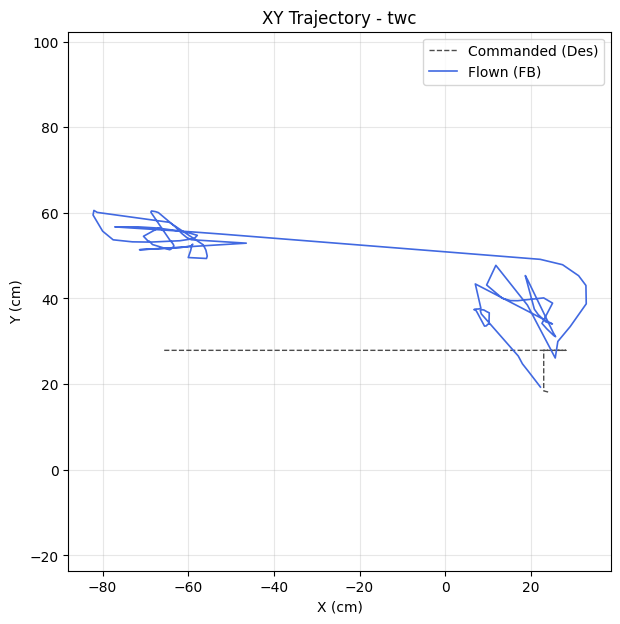

| Metric | Value |
|--------|-------|
| Planar XY RMSE (cm) | 25.88 |
| Planar peak (cm) | 48.09 |
| Cross-track mean / p95 / max (cm) | - / - / - |
| Along-track lag (ms) | 0 |
| Rank score (planar_rmse_cm) | 25.88 |
| TWC settling time (s) | - |
| TWC final error (cm) | 88.51 |

| Axis | RMSE | MAE | Peak |
|------|------|-----|------|
| X | 11.40 | 8.51 | 38.49 |
| Y | 23.24 | 22.39 | 32.67 |
| Z | 0.06 | 0.03 | 0.36 |

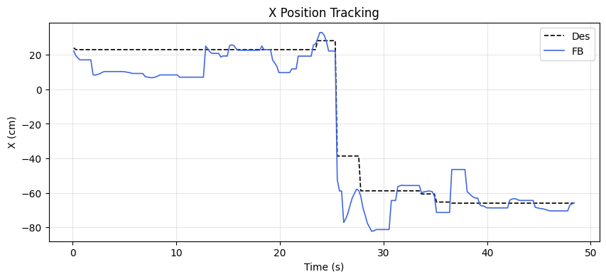
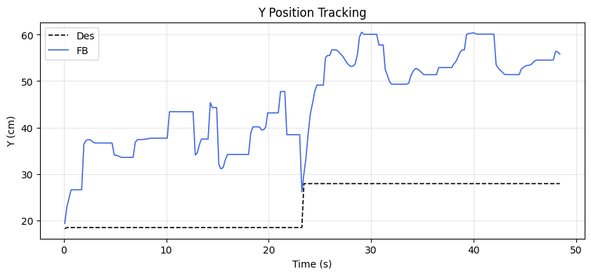
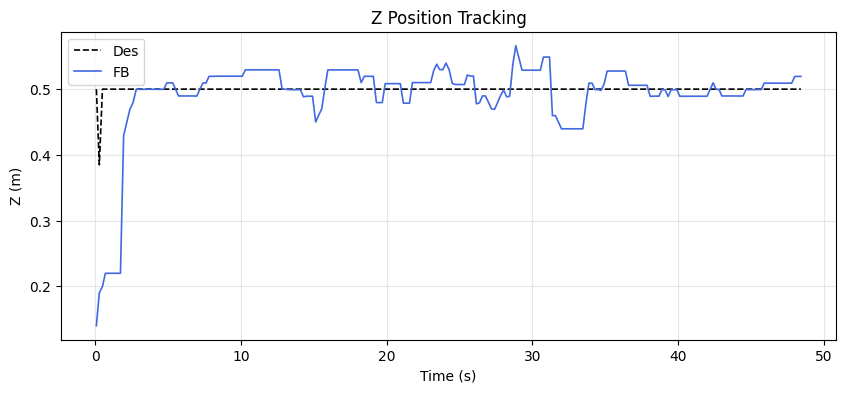

### Tracking error decomposition

_Splits each axis RMSE into the cause that injects it: a steady DC offset, amplitude attenuation (gain≠1), phase lag, or residual distortion. Read the largest column as the thing to fix first._

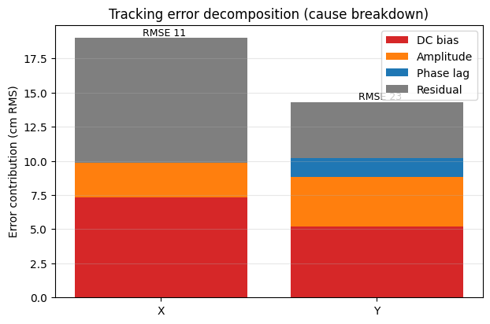

| Axis | Total RMSE | DC bias | Amplitude | Phase lag | Residual | Gain | Lag (ms) |
|------|-----------|---------|-----------|-----------|----------|------|----------|
| X | 11.40 | 7.30 | 2.54 | 0.00 | 9.15 | 0.94 | 0 |
| Y | 23.24 | 5.19 | 3.62 | 1.40 | 4.10 | 1.76 | 1018 |

### Yaw heading-hold drift

| Cmd (°) | Final offset (°) | Mean offset (°) | Drift (°/s) | Total drift (°) | P2P (°) |
|---------|------------------|-----------------|-------------|-----------------|---------|
| 0.00 | 0.22 | 6.81 | -0.17 | -8.07 | 88.09 |

## MRAC Scoreboard (attitude / rate loops)

| Axis  | RMSE | RMSE_ss | RMSE_tr | ρ_mean | ρ_p95 | Phase | ‖Θ‖ | ⚠ | 🔴 |
|-------|------|---------|---------|--------|-------|-------|------|---|---|
| Pitch | 2.581 | 2.398 | 2.782 | 0.387 | 0.915 | decoupled | 0.231 | 0 | 1 |
| Roll | 1.632 | 0.501 | 1.917 | 0.316 | 0.678 | decoupled | 0.211 | 0 | 0 |
| Yaw | 18.579 | 9.024 | 4.952 | 0.440 | 0.900 | decoupled | 0.141 | 1 | 0 |
| Z | 0.061 | 0.027 | - | 0.538 | 0.940 | reinforcing | 0.286 | 1 | 1 |

## Alerts

- [CRITICAL] **NEAR_SATURATION**: pitch: MRAC near saturation (ρ_p95=0.91). Reduce gamma or increase u_max.
- [CRITICAL] **NEAR_SATURATION**: z: MRAC near saturation (ρ_p95=0.94). Reduce gamma or increase u_max.
- [WARN] **POOR_TRACKING**: yaw: Tracking degraded (RMSE=18.58).
- [WARN] **REDUNDANT_EFFORT**: z: MRAC reinforcing PID (r=0.44) with significant authority. PID may need retuning.
- [INFO] **TRANSIENT_PENALTY**: roll: Transient RMSE 3.8× worse than steady-state.

## Per-Axis Detail

### Pitch

#### Tracking
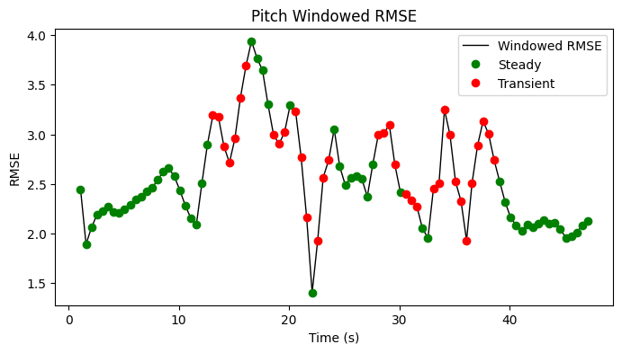

| Metric | Value |
|--------|-------|
| RMSE | 2.581 |
| MAE | 2.447 |
| Peak Error | 6.476 |
| Steady-State RMSE | 2.398443461119615 |
| Transient RMSE | 2.782054822939669 |

#### Control Authority
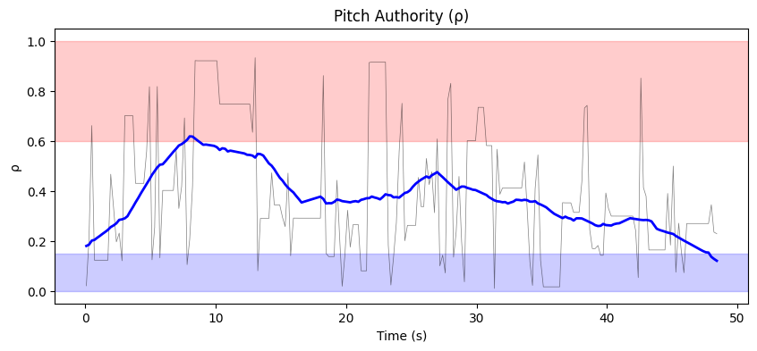
- ρ_mean = 0.387, ρ_p95 = 0.915
- u_ad RMS = 30.78 mixer units, u_nom RMS = 0.07 mixer units
- Phase relationship: decoupled (r = -0.05)

#### Weight Health
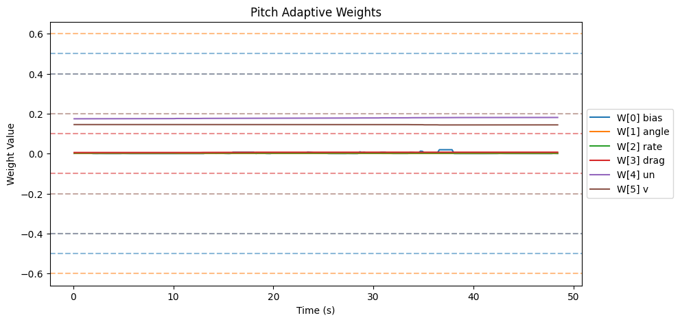
| Weight | θ_final | Drift (/s) | Proj. Hits | Oscillation (/s) |
|--------|---------|------------|------------|-------------------|
| W[0] bias | 0.000 | 0.0000 | 0.0% | 1.59 |
| W[1] angle | 0.001 | -0.0000 | 0.0% | 1.68 |
| W[2] rate | 0.003 | -0.0000 | 0.0% | 1.30 |
| W[3] drag | 0.007 | 0.0000 | 0.0% | 1.63 |
| W[4] un | 0.181 | 0.0002 | 0.0% | 1.08 |
| W[5] v | 0.144 | -0.0000 | 0.0% | 1.57 |

- ‖Θ‖ final = 0.231, trending: → STABLE/CONVERGING
- Hard-freeze fraction: 0.0%

### Roll

#### Tracking
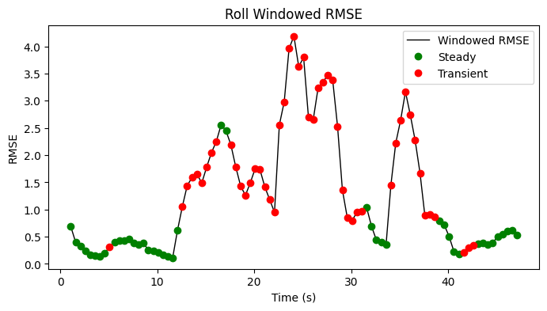

| Metric | Value |
|--------|-------|
| RMSE | 1.632 |
| MAE | 1.033 |
| Peak Error | 8.307 |
| Steady-State RMSE | 0.5008988655441827 |
| Transient RMSE | 1.91724947899096 |

#### Control Authority
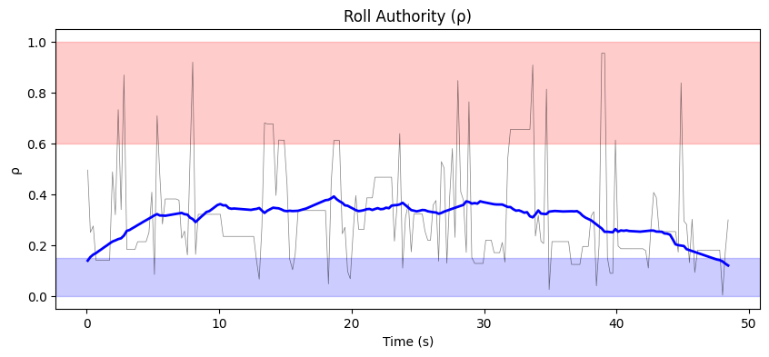
- ρ_mean = 0.316, ρ_p95 = 0.678
- u_ad RMS = 34.96 mixer units, u_nom RMS = 0.09 mixer units
- Phase relationship: decoupled (r = 0.13)

#### Weight Health
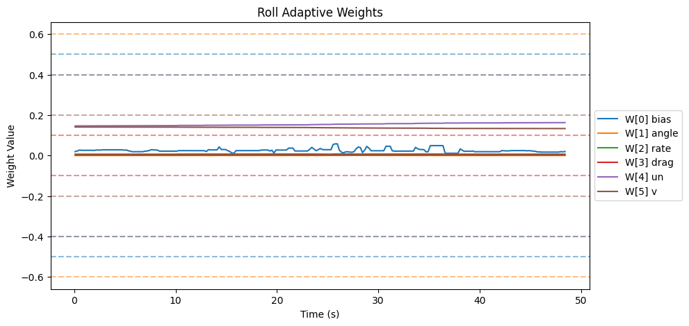
| Weight | θ_final | Drift (/s) | Proj. Hits | Oscillation (/s) |
|--------|---------|------------|------------|-------------------|
| W[0] bias | 0.020 | -0.0001 | 0.0% | 1.80 |
| W[1] angle | 0.000 | 0.0000 | 0.0% | 1.39 |
| W[2] rate | 0.007 | 0.0000 | 0.0% | 1.55 |
| W[3] drag | 0.003 | 0.0000 | 0.0% | 1.82 |
| W[4] un | 0.163 | 0.0004 | 0.0% | 0.99 |
| W[5] v | 0.133 | -0.0002 | 0.0% | 1.18 |

- ‖Θ‖ final = 0.211, trending: → STABLE/CONVERGING
- Hard-freeze fraction: 0.0%

### Yaw

#### Tracking
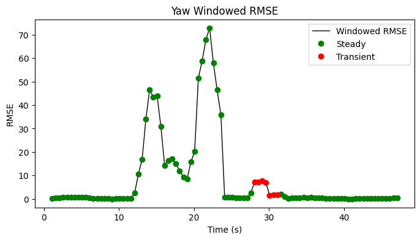

| Metric | Value |
|--------|-------|
| RMSE | 18.579 |
| MAE | 6.835 |
| Peak Error | 87.397 |
| Steady-State RMSE | 9.024071405491593 |
| Transient RMSE | 4.952215370408358 |

#### Control Authority
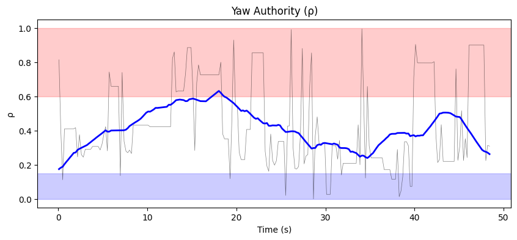
- ρ_mean = 0.440, ρ_p95 = 0.900
- u_ad RMS = 97.02 mixer units, u_nom RMS = 0.05 mixer units
- Phase relationship: decoupled (r = 0.07)

#### Weight Health
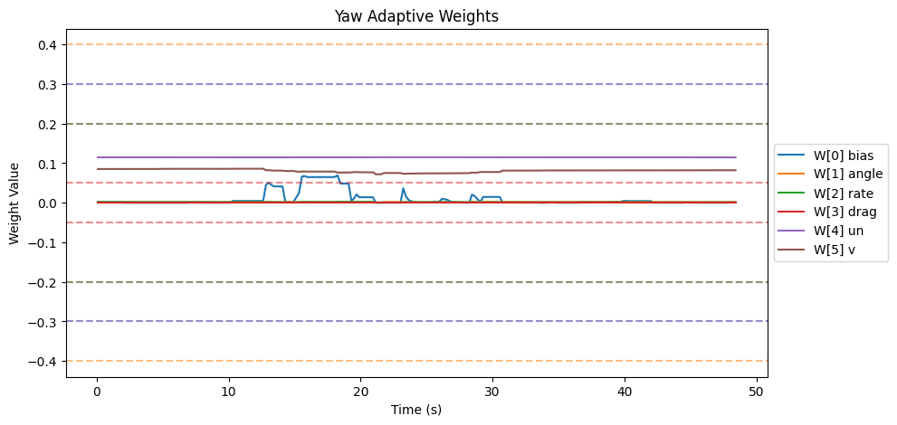
| Weight | θ_final | Drift (/s) | Proj. Hits | Oscillation (/s) |
|--------|---------|------------|------------|-------------------|
| W[0] bias | 0.001 | -0.0002 | 0.0% | 1.43 |
| W[1] angle | 0.002 | 0.0000 | 0.0% | 1.37 |
| W[2] rate | 0.001 | -0.0000 | 0.0% | 1.37 |
| W[3] drag | 0.000 | 0.0000 | 0.0% | 0.00 |
| W[4] un | 0.115 | 0.0000 | 0.0% | 1.18 |
| W[5] v | 0.082 | -0.0001 | 0.0% | 1.30 |

- ‖Θ‖ final = 0.141, trending: → STABLE/CONVERGING
- Hard-freeze fraction: 0.0%

### Z

#### Tracking
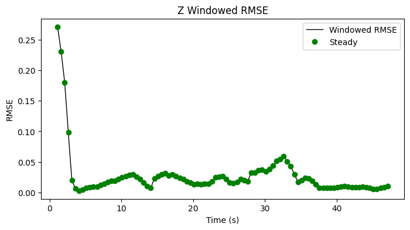

| Metric | Value |
|--------|-------|
| RMSE | 0.061 |
| MAE | 0.028 |
| Peak Error | 0.360 |
| Steady-State RMSE | 0.027417872057895906 |
| Transient RMSE | - |

#### Control Authority
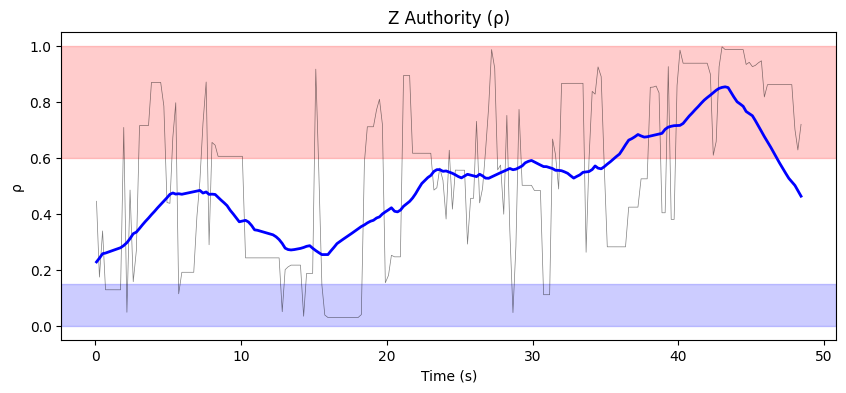
- ρ_mean = 0.538, ρ_p95 = 0.940
- u_ad RMS = 24.81 mixer units, u_nom RMS = 0.21 mixer units
- Phase relationship: reinforcing (r = 0.44)

#### Weight Health
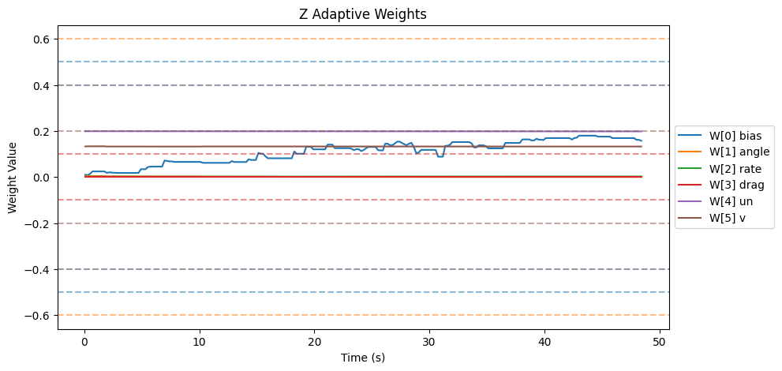
| Weight | θ_final | Drift (/s) | Proj. Hits | Oscillation (/s) |
|--------|---------|------------|------------|-------------------|
| W[0] bias | 0.157 | 0.0033 | 0.0% | 1.82 |
| W[1] angle | 0.000 | -0.0001 | 0.0% | 1.49 |
| W[2] rate | 0.002 | 0.0000 | 0.0% | 1.82 |
| W[3] drag | 0.000 | 0.0000 | 0.0% | 0.00 |
| W[4] un | 0.198 | -0.0000 | 0.0% | 1.66 |
| W[5] v | 0.132 | -0.0000 | 0.0% | 1.72 |

- ‖Θ‖ final = 0.286, trending: → STABLE/CONVERGING
- Hard-freeze fraction: 0.0%

## Firmware Parameters (Snapshot)
```json
{
  "payload": "PAYLOAD_LIGHT",
  "mrac_dt": 0.005,
  "num_basis": 6,
  "mixer": {
    "pitch": 1170.0,
    "roll": 1170.0,
    "yaw": 1872.0,
    "z": 222.0
  },
  "gamma": {
    "pitch": [
      0.5,
      3.3,
      1.0,
      2.0,
      0.1,
      1.0
    ],
    "roll": [
      0.5,
      3.3,
      1.0,
      2.0,
      0.1,
      1.0
    ],
    "yaw": [
      0.3,
      2.0,
      0.7,
      1.5,
      0.1,
      1.0
    ]
  },
  "wlim": {
    "pitch": [
      0.5,
      0.6,
      0.4,
      0.1,
      0.4,
      0.2
    ],
    "roll": [
      0.5,
      0.6,
      0.4,
      0.1,
      0.4,
      0.2
    ],
    "yaw": [
      0.3,
      0.4,
      0.2,
      0.05,
      0.3,
      0.2
    ]
  },
  "sigma": {
    "pitch": "from_config",
    "roll": "from_config",
    "yaw": "from_config"
  },
  "features": {
    "projection": true,
    "sigma_mod": true,
    "deadzone": true,
    "l1_filter": true,
    "pch": true,
    "perf_recovery": true
  },
  "_comment": "Manual overrides for firmware params. Edit before a test session. deep_analysis.py merges this into the experiment record.",
  "_instructions": "Update the fields below when you change firmware params that aren't in telemetry yet.",
  "sigma_pitch": null,
  "sigma_roll": null,
  "sigma_yaw": null,
  "omega_u_pitch": null,
  "omega_u_roll": null,
  "omega_u_yaw": null,
  "e_deadzone": null,
  "e_freeze": 8.0,
  "notes": ""
}
```
