# Flight Analysis Report: exp_flight_twc_1781526892

**Date:** 2026-06-15T13:28:25.787453Z | **Duration:** 13.5s | **Samples:** 5940 | **Config:** PAYLOAD_LIGHT

---

## What Happened

- Planar XY tracking RMSE was **37.6 cm** (peak 75.4 cm).
- Worst-tracked position axis was **Y** (RMSE 27.70 cm).
- Feedback trailed the reference by ~**1616 ms** (along-track/phase lag).
- **Y** tracking error is dominated by **DC offset/drift** (bias 23 / amp 0 / lag 6 / resid 3 cm RMS; gain 0.93).
- Yaw held **+0.4°** off command (drift -0.67°/s over the run) — expected heading-hold signature of bias/asymmetry.
- **Never settled** within 5 cm of target (final error 27.6 cm).
- ⚠ **3 CRITICAL** MRAC alert(s) — run is INELIGIBLE as a champion until resolved.
- MRAC was most active on **z** (ρ_mean 0.83).

## Path Tracking

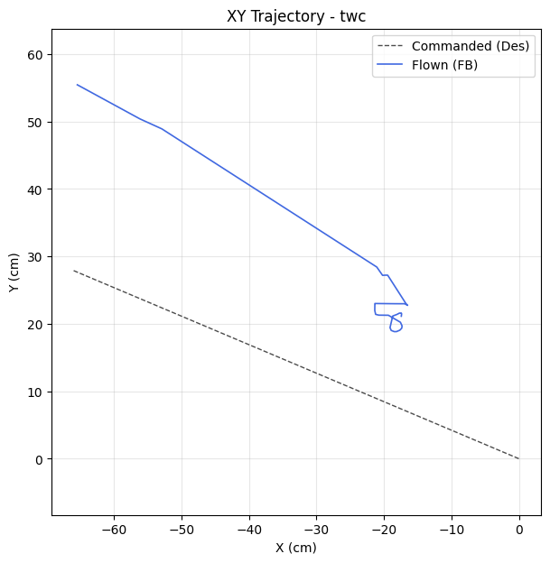

| Metric | Value |
|--------|-------|
| Planar XY RMSE (cm) | 37.63 |
| Planar peak (cm) | 75.44 |
| Cross-track mean / p95 / max (cm) | - / - / - |
| Along-track lag (ms) | 1616 |
| Rank score (planar_rmse_cm) | 37.63 |
| TWC settling time (s) | - |
| TWC final error (cm) | 27.60 |

| Axis | RMSE | MAE | Peak |
|------|------|-----|------|
| X | 25.47 | 22.37 | 56.15 |
| Y | 27.70 | 26.22 | 50.39 |
| Z | 0.03 | 0.02 | 0.06 |

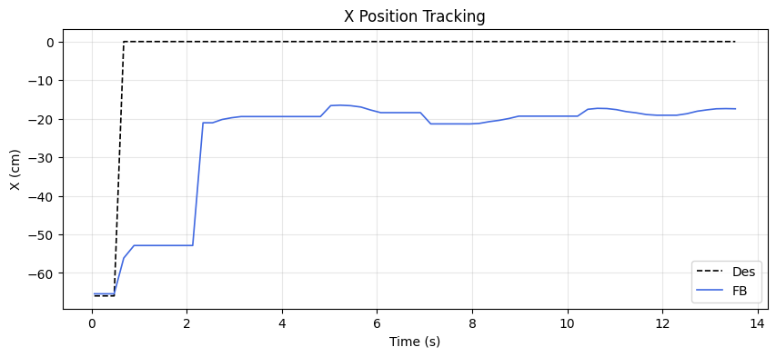
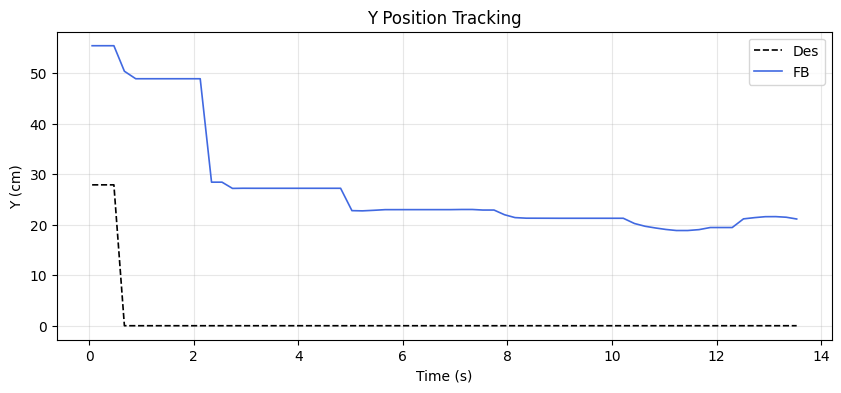
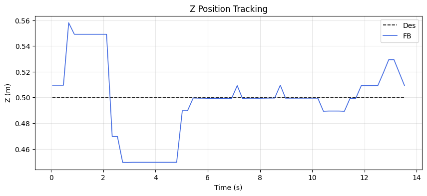

### Tracking error decomposition

_Splits each axis RMSE into the cause that injects it: a steady DC offset, amplitude attenuation (gain≠1), phase lag, or residual distortion. Read the largest column as the thing to fix first._

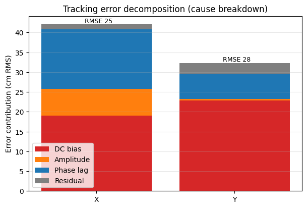

| Axis | Total RMSE | DC bias | Amplitude | Phase lag | Residual | Gain | Lag (ms) |
|------|-----------|---------|-----------|-----------|----------|------|----------|
| X | 25.47 | 19.06 | 6.69 | 15.00 | 1.29 | 0.51 | 1616 |
| Y | 27.70 | 22.82 | 0.38 | 6.34 | 2.74 | 0.93 | 1616 |

### Yaw heading-hold drift

| Cmd (°) | Final offset (°) | Mean offset (°) | Drift (°/s) | Total drift (°) | P2P (°) |
|---------|------------------|-----------------|-------------|-----------------|---------|
| 0.00 | 0.36 | 2.36 | -0.67 | -9.08 | 20.54 |

## MRAC Scoreboard (attitude / rate loops)

| Axis  | RMSE | RMSE_ss | RMSE_tr | ρ_mean | ρ_p95 | Phase | ‖Θ‖ | ⚠ | 🔴 |
|-------|------|---------|---------|--------|-------|-------|------|---|---|
| Pitch | 2.117 | 2.093 | - | 0.295 | 0.646 | adversarial | 0.232 | 0 | 1 |
| Roll | 0.887 | 0.320 | 1.398 | 0.299 | 0.730 | decoupled | 0.213 | 0 | 0 |
| Yaw | 5.474 | 2.258 | 13.156 | 0.426 | 0.875 | adversarial | 0.142 | 1 | 1 |
| Z | 0.029 | 0.022 | - | 0.827 | 0.991 | decoupled | 0.306 | 1 | 1 |

## Alerts

- [CRITICAL] **PID_MRAC_FIGHT**: pitch: MRAC and PID are anti-correlated (r=-0.59). Check reference model sign convention.
- [CRITICAL] **PID_MRAC_FIGHT**: yaw: MRAC and PID are anti-correlated (r=-0.49). Check reference model sign convention.
- [CRITICAL] **NEAR_SATURATION**: z: MRAC near saturation (ρ_p95=0.99). Reduce gamma or increase u_max.
- [WARN] **POOR_TRACKING**: yaw: Tracking degraded (RMSE=5.47).
- [WARN] **HIGH_AUTHORITY**: z: MRAC-dominant (ρ=0.83). PID gains may be insufficient.
- [INFO] **TRANSIENT_PENALTY**: roll: Transient RMSE 4.4× worse than steady-state.
- [INFO] **TRANSIENT_PENALTY**: yaw: Transient RMSE 5.8× worse than steady-state.

## Per-Axis Detail

### Pitch

#### Tracking
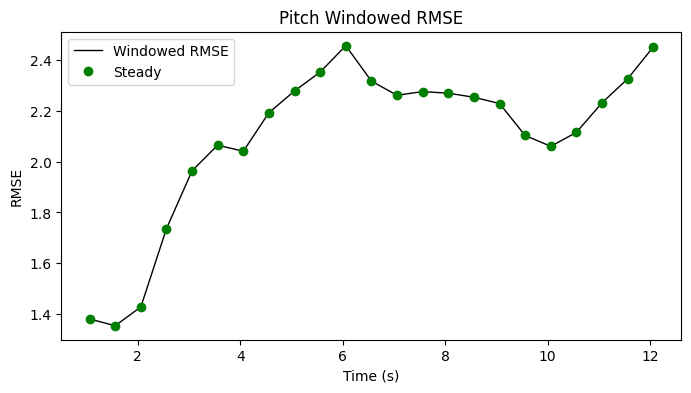

| Metric | Value |
|--------|-------|
| RMSE | 2.117 |
| MAE | 2.053 |
| Peak Error | 3.041 |
| Steady-State RMSE | 2.0931156459794273 |
| Transient RMSE | - |

#### Control Authority
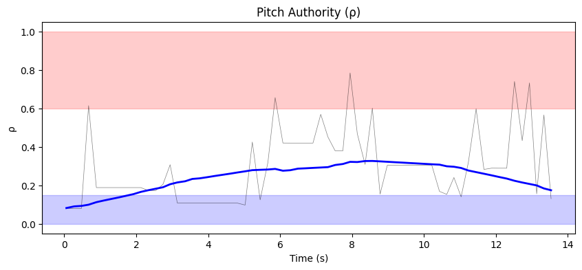
- ρ_mean = 0.295, ρ_p95 = 0.646
- u_ad RMS = 27.25 mixer units, u_nom RMS = 0.08 mixer units
- Phase relationship: adversarial (r = -0.59)

#### Weight Health
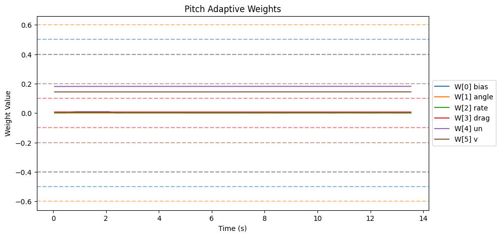
| Weight | θ_final | Drift (/s) | Proj. Hits | Oscillation (/s) |
|--------|---------|------------|------------|-------------------|
| W[0] bias | 0.000 | -0.0003 | 0.0% | 1.71 |
| W[1] angle | 0.001 | 0.0000 | 0.0% | 1.48 |
| W[2] rate | 0.002 | -0.0000 | 0.0% | 1.19 |
| W[3] drag | 0.007 | 0.0000 | 0.0% | 1.56 |
| W[4] un | 0.182 | 0.0000 | 0.0% | 1.26 |
| W[5] v | 0.144 | 0.0000 | 0.0% | 1.11 |

- ‖Θ‖ final = 0.232, trending: → STABLE/CONVERGING
- Hard-freeze fraction: 0.0%

### Roll

#### Tracking
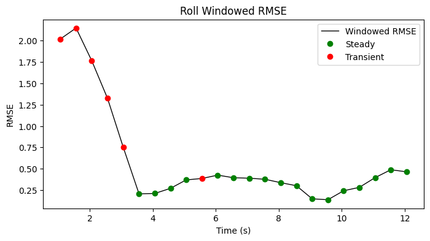

| Metric | Value |
|--------|-------|
| RMSE | 0.887 |
| MAE | 0.519 |
| Peak Error | 3.147 |
| Steady-State RMSE | 0.32042869655353146 |
| Transient RMSE | 1.3978244382140943 |

#### Control Authority
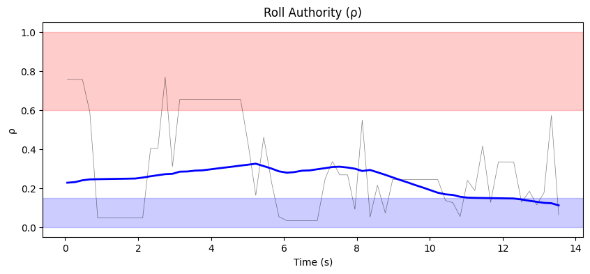
- ρ_mean = 0.299, ρ_p95 = 0.730
- u_ad RMS = 33.90 mixer units, u_nom RMS = 0.07 mixer units
- Phase relationship: decoupled (r = 0.08)

#### Weight Health
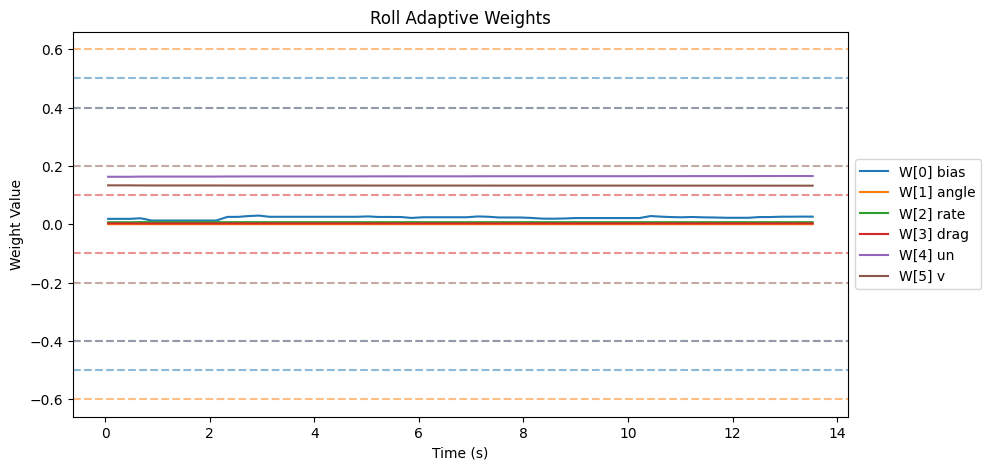
| Weight | θ_final | Drift (/s) | Proj. Hits | Oscillation (/s) |
|--------|---------|------------|------------|-------------------|
| W[0] bias | 0.026 | 0.0004 | 0.0% | 2.15 |
| W[1] angle | 0.000 | -0.0000 | 0.0% | 1.34 |
| W[2] rate | 0.007 | 0.0000 | 0.0% | 2.15 |
| W[3] drag | 0.003 | 0.0000 | 0.0% | 1.71 |
| W[4] un | 0.165 | 0.0002 | 0.0% | 1.11 |
| W[5] v | 0.132 | -0.0001 | 0.0% | 1.11 |

- ‖Θ‖ final = 0.213, trending: → STABLE/CONVERGING
- Hard-freeze fraction: 0.0%

### Yaw

#### Tracking
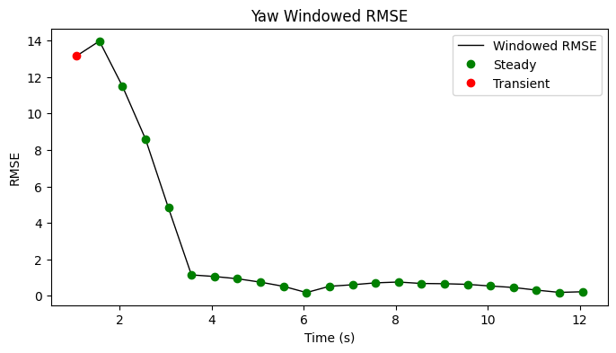

| Metric | Value |
|--------|-------|
| RMSE | 5.474 |
| MAE | 2.379 |
| Peak Error | 20.361 |
| Steady-State RMSE | 2.258322984118263 |
| Transient RMSE | 13.155531145973297 |

#### Control Authority
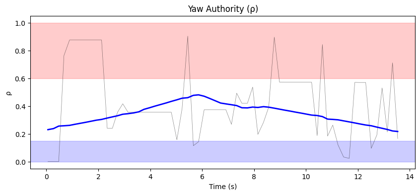
- ρ_mean = 0.426, ρ_p95 = 0.875
- u_ad RMS = 54.29 mixer units, u_nom RMS = 0.02 mixer units
- Phase relationship: adversarial (r = -0.49)

#### Weight Health
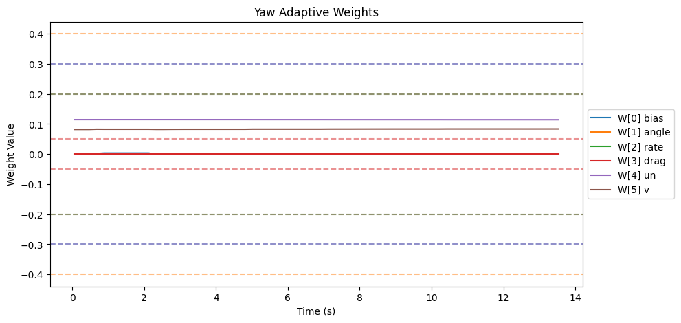
| Weight | θ_final | Drift (/s) | Proj. Hits | Oscillation (/s) |
|--------|---------|------------|------------|-------------------|
| W[0] bias | 0.000 | -0.0001 | 0.0% | 1.71 |
| W[1] angle | 0.002 | -0.0000 | 0.0% | 1.48 |
| W[2] rate | 0.002 | 0.0000 | 0.0% | 1.34 |
| W[3] drag | 0.000 | 0.0000 | 0.0% | 0.00 |
| W[4] un | 0.114 | -0.0000 | 0.0% | 1.19 |
| W[5] v | 0.084 | 0.0001 | 0.0% | 1.63 |

- ‖Θ‖ final = 0.142, trending: → STABLE/CONVERGING
- Hard-freeze fraction: 0.0%

### Z

#### Tracking
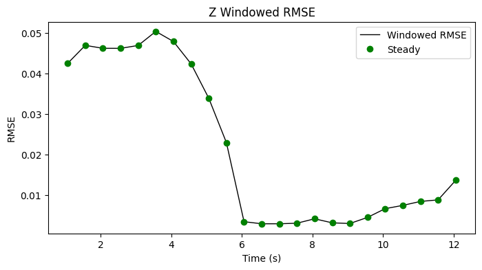

| Metric | Value |
|--------|-------|
| RMSE | 0.029 |
| MAE | 0.020 |
| Peak Error | 0.058 |
| Steady-State RMSE | 0.021719539986385105 |
| Transient RMSE | - |

#### Control Authority
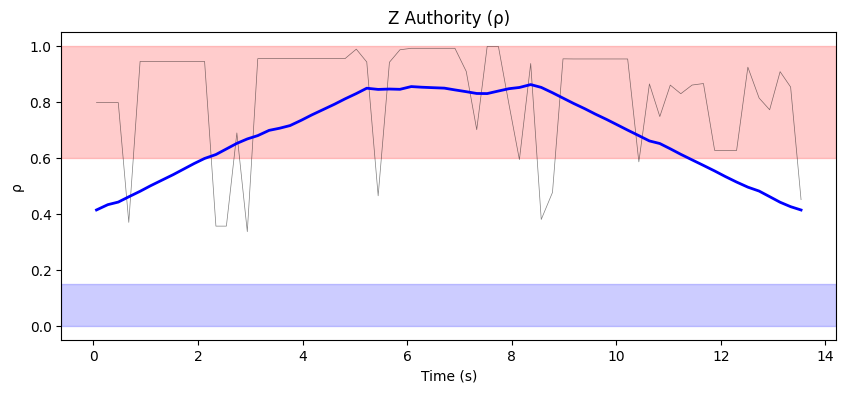
- ρ_mean = 0.827, ρ_p95 = 0.991
- u_ad RMS = 38.92 mixer units, u_nom RMS = 0.10 mixer units
- Phase relationship: decoupled (r = -0.02)

#### Weight Health
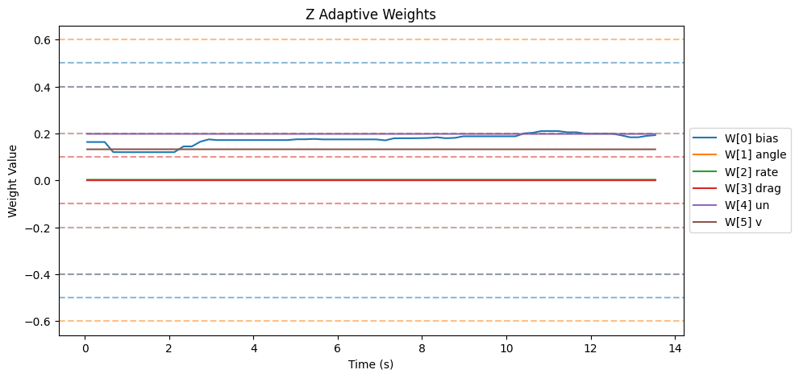
| Weight | θ_final | Drift (/s) | Proj. Hits | Oscillation (/s) |
|--------|---------|------------|------------|-------------------|
| W[0] bias | 0.193 | 0.0050 | 0.0% | 2.08 |
| W[1] angle | 0.000 | -0.0000 | 0.0% | 1.71 |
| W[2] rate | 0.003 | 0.0000 | 0.0% | 2.15 |
| W[3] drag | 0.000 | 0.0000 | 0.0% | 0.00 |
| W[4] un | 0.198 | -0.0000 | 0.0% | 1.78 |
| W[5] v | 0.132 | -0.0000 | 0.0% | 2.08 |

- ‖Θ‖ final = 0.306, trending: → STABLE/CONVERGING
- Hard-freeze fraction: 0.0%

## Firmware Parameters (Snapshot)
```json
{
  "payload": "PAYLOAD_LIGHT",
  "mrac_dt": 0.005,
  "num_basis": 6,
  "mixer": {
    "pitch": 1170.0,
    "roll": 1170.0,
    "yaw": 1872.0,
    "z": 222.0
  },
  "gamma": {
    "pitch": [
      0.5,
      3.3,
      1.0,
      2.0,
      0.1,
      1.0
    ],
    "roll": [
      0.5,
      3.3,
      1.0,
      2.0,
      0.1,
      1.0
    ],
    "yaw": [
      0.3,
      2.0,
      0.7,
      1.5,
      0.1,
      1.0
    ]
  },
  "wlim": {
    "pitch": [
      0.5,
      0.6,
      0.4,
      0.1,
      0.4,
      0.2
    ],
    "roll": [
      0.5,
      0.6,
      0.4,
      0.1,
      0.4,
      0.2
    ],
    "yaw": [
      0.3,
      0.4,
      0.2,
      0.05,
      0.3,
      0.2
    ]
  },
  "sigma": {
    "pitch": "from_config",
    "roll": "from_config",
    "yaw": "from_config"
  },
  "features": {
    "projection": true,
    "sigma_mod": true,
    "deadzone": true,
    "l1_filter": true,
    "pch": true,
    "perf_recovery": true
  },
  "_comment": "Manual overrides for firmware params. Edit before a test session. deep_analysis.py merges this into the experiment record.",
  "_instructions": "Update the fields below when you change firmware params that aren't in telemetry yet.",
  "sigma_pitch": null,
  "sigma_roll": null,
  "sigma_yaw": null,
  "omega_u_pitch": null,
  "omega_u_roll": null,
  "omega_u_yaw": null,
  "e_deadzone": null,
  "e_freeze": 8.0,
  "notes": ""
}
```
