# Flight Analysis Report: exp_flight_twc_1781526913

**Date:** 2026-06-15T13:28:42.494220Z | **Duration:** 2.1s | **Samples:** 990 | **Config:** PAYLOAD_LIGHT

---

## What Happened

- Planar XY tracking RMSE was **24.7 cm** (peak 24.7 cm).
- Worst-tracked position axis was **Y** (RMSE 24.53 cm).
- **Never settled** within 5 cm of target (final error 24.7 cm).
- ⚠ **1 CRITICAL** MRAC alert(s) — run is INELIGIBLE as a champion until resolved.
- MRAC was most active on **roll** (ρ_mean 0.94).

## Path Tracking

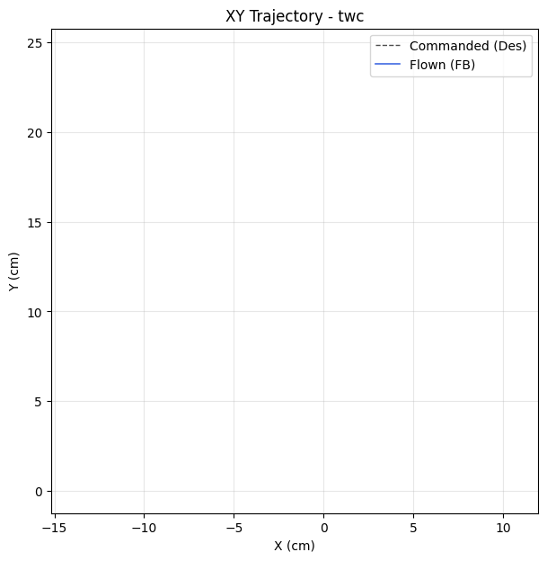

| Metric | Value |
|--------|-------|
| Planar XY RMSE (cm) | 24.74 |
| Planar peak (cm) | 24.74 |
| Cross-track mean / p95 / max (cm) | - / - / - |
| Along-track lag (ms) | - |
| Rank score (planar_rmse_cm) | 24.74 |
| TWC settling time (s) | - |
| TWC final error (cm) | 24.74 |

| Axis | RMSE | MAE | Peak |
|------|------|-----|------|
| X | 3.21 | 3.21 | 3.21 |
| Y | 24.53 | 24.53 | 24.53 |
| Z | 0.01 | 0.01 | 0.01 |

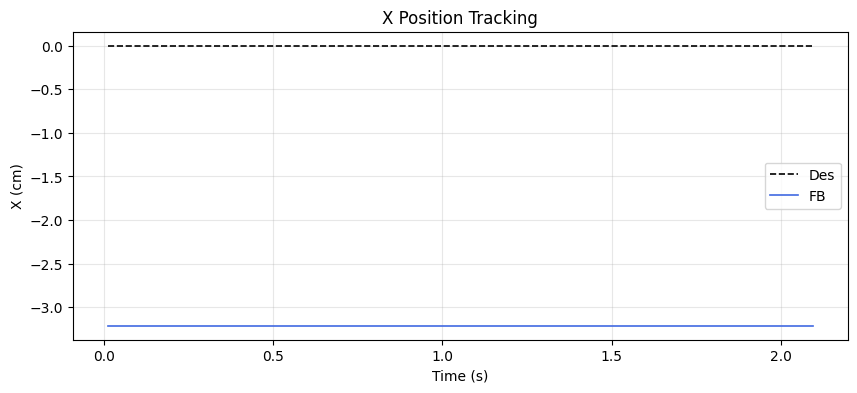
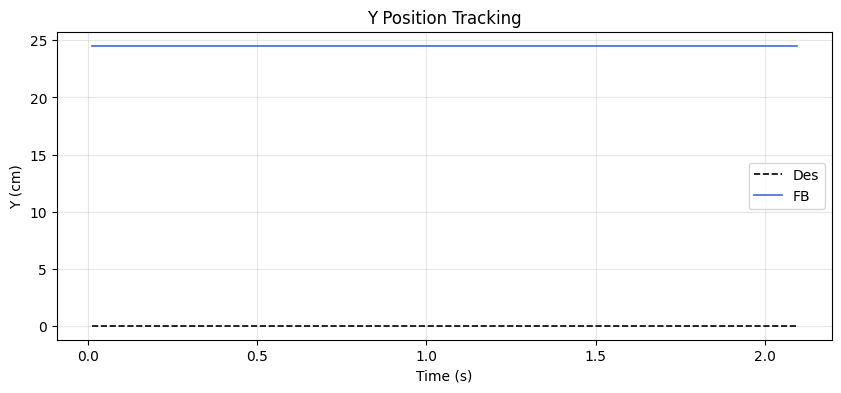
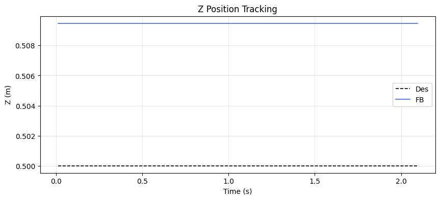

### Yaw heading-hold drift

| Cmd (°) | Final offset (°) | Mean offset (°) | Drift (°/s) | Total drift (°) | P2P (°) |
|---------|------------------|-----------------|-------------|-----------------|---------|
| 30.00 | -0.22 | -0.22 | -0.00 | -0.00 | 0.00 |

## MRAC Scoreboard (attitude / rate loops)

| Axis  | RMSE | RMSE_ss | RMSE_tr | ρ_mean | ρ_p95 | Phase | ‖Θ‖ | ⚠ | 🔴 |
|-------|------|---------|---------|--------|-------|-------|------|---|---|
| Pitch | 1.804 | 1.804 | - | 0.250 | 0.250 | decoupled | 0.232 | 0 | 0 |
| Roll | 0.239 | 0.239 | - | 0.936 | 0.936 | decoupled | 0.214 | 1 | 1 |
| Yaw | 0.222 | 0.222 | - | 0.245 | 0.245 | decoupled | 0.142 | 0 | 0 |
| Z | 0.009 | 0.009 | - | 0.820 | 0.820 | decoupled | 0.296 | 1 | 0 |

## Alerts

- [CRITICAL] **NEAR_SATURATION**: roll: MRAC near saturation (ρ_p95=0.94). Reduce gamma or increase u_max.
- [WARN] **HIGH_AUTHORITY**: roll: MRAC-dominant (ρ=0.94). PID gains may be insufficient.
- [WARN] **HIGH_AUTHORITY**: z: MRAC-dominant (ρ=0.82). PID gains may be insufficient.

## Per-Axis Detail

### Pitch

#### Tracking
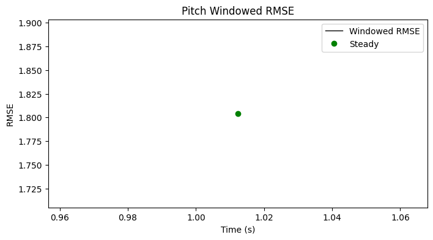

| Metric | Value |
|--------|-------|
| RMSE | 1.804 |
| MAE | 1.804 |
| Peak Error | 1.804 |
| Steady-State RMSE | 1.8042520800000001 |
| Transient RMSE | - |

#### Control Authority
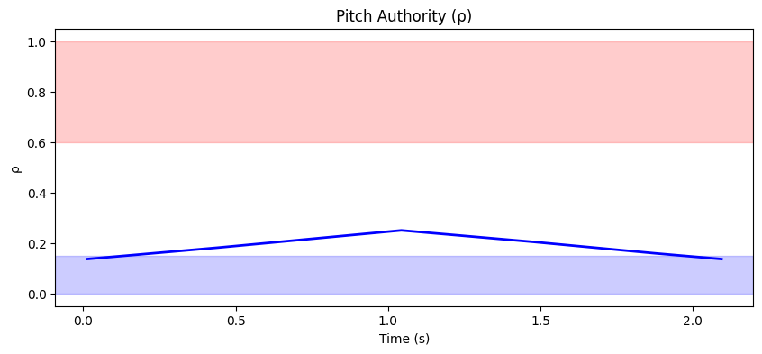
- ρ_mean = 0.250, ρ_p95 = 0.250
- u_ad RMS = 43.21 mixer units, u_nom RMS = 0.11 mixer units
- Phase relationship: decoupled (r = 0.00)

#### Weight Health
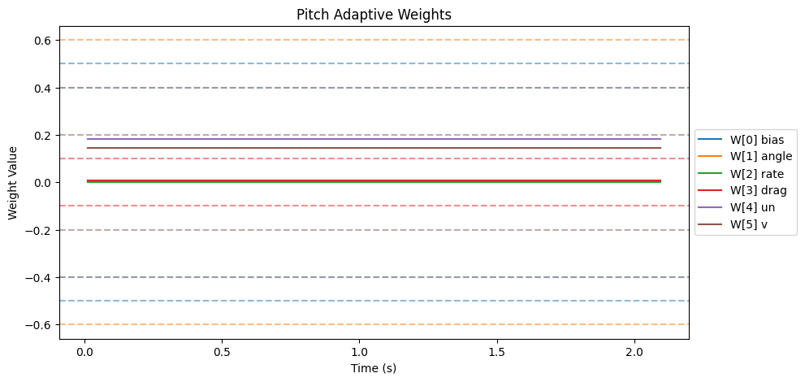
| Weight | θ_final | Drift (/s) | Proj. Hits | Oscillation (/s) |
|--------|---------|------------|------------|-------------------|
| W[0] bias | 0.000 | 0.0000 | 0.0% | 0.00 |
| W[1] angle | 0.001 | 0.0000 | 0.0% | 0.00 |
| W[2] rate | 0.002 | 0.0000 | 0.0% | 0.00 |
| W[3] drag | 0.007 | 0.0000 | 0.0% | 0.00 |
| W[4] un | 0.182 | -0.0000 | 0.0% | 0.00 |
| W[5] v | 0.144 | 0.0000 | 0.0% | 0.00 |

- ‖Θ‖ final = 0.232, trending: → STABLE/CONVERGING
- Hard-freeze fraction: 0.0%

### Roll

#### Tracking
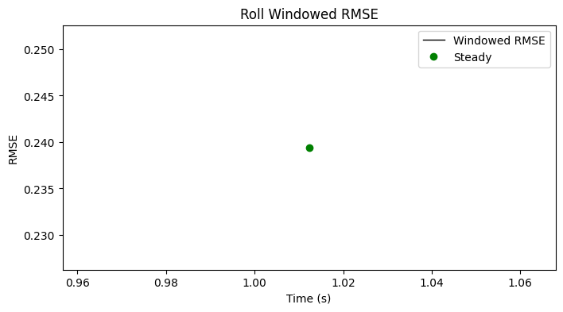

| Metric | Value |
|--------|-------|
| RMSE | 0.239 |
| MAE | 0.239 |
| Peak Error | 0.239 |
| Steady-State RMSE | 0.23941900000000027 |
| Transient RMSE | - |

#### Control Authority
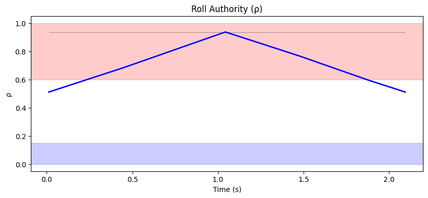
- ρ_mean = 0.936, ρ_p95 = 0.936
- u_ad RMS = 52.28 mixer units, u_nom RMS = 0.00 mixer units
- Phase relationship: decoupled (r = 0.00)

#### Weight Health
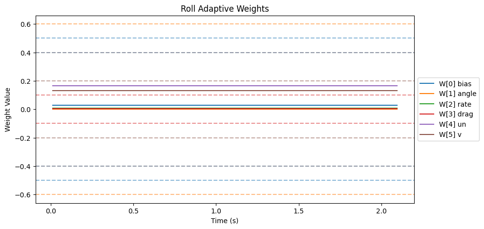
| Weight | θ_final | Drift (/s) | Proj. Hits | Oscillation (/s) |
|--------|---------|------------|------------|-------------------|
| W[0] bias | 0.028 | -0.0000 | 0.0% | 0.00 |
| W[1] angle | 0.000 | 0.0000 | 0.0% | 0.00 |
| W[2] rate | 0.007 | 0.0000 | 0.0% | 0.00 |
| W[3] drag | 0.003 | 0.0000 | 0.0% | 0.00 |
| W[4] un | 0.167 | 0.0000 | 0.0% | 0.00 |
| W[5] v | 0.132 | 0.0000 | 0.0% | 0.00 |

- ‖Θ‖ final = 0.214, trending: → STABLE/CONVERGING
- Hard-freeze fraction: 0.0%

### Yaw

#### Tracking
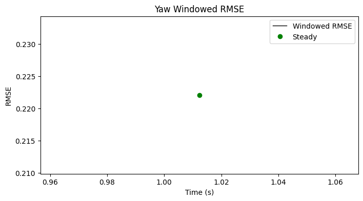

| Metric | Value |
|--------|-------|
| RMSE | 0.222 |
| MAE | 0.222 |
| Peak Error | 0.222 |
| Steady-State RMSE | 0.22207799999999978 |
| Transient RMSE | - |

#### Control Authority
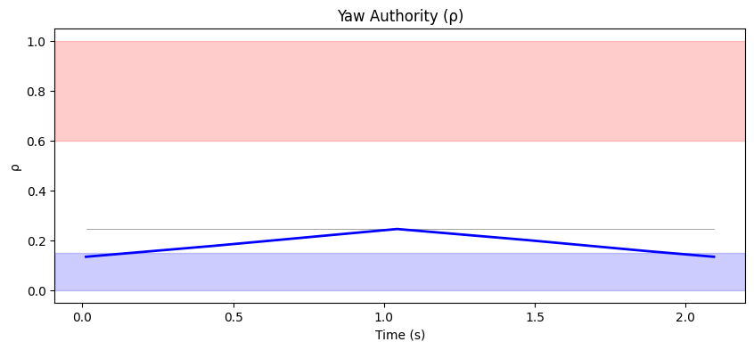
- ρ_mean = 0.245, ρ_p95 = 0.245
- u_ad RMS = 8.79 mixer units, u_nom RMS = 0.01 mixer units
- Phase relationship: decoupled (r = 0.00)

#### Weight Health
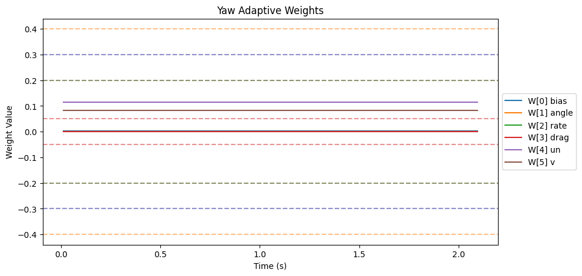
| Weight | θ_final | Drift (/s) | Proj. Hits | Oscillation (/s) |
|--------|---------|------------|------------|-------------------|
| W[0] bias | 0.004 | 0.0000 | 0.0% | 0.00 |
| W[1] angle | 0.001 | 0.0000 | 0.0% | 0.00 |
| W[2] rate | 0.001 | 0.0000 | 0.0% | 0.00 |
| W[3] drag | 0.000 | 0.0000 | 0.0% | 0.00 |
| W[4] un | 0.114 | 0.0000 | 0.0% | 0.00 |
| W[5] v | 0.084 | 0.0000 | 0.0% | 0.00 |

- ‖Θ‖ final = 0.142, trending: → STABLE/CONVERGING
- Hard-freeze fraction: 0.0%

### Z

#### Tracking
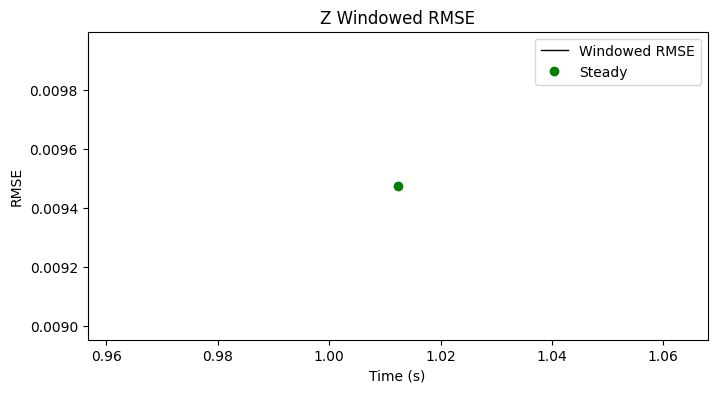

| Metric | Value |
|--------|-------|
| RMSE | 0.009 |
| MAE | 0.009 |
| Peak Error | 0.009 |
| Steady-State RMSE | 0.00947458000000001 |
| Transient RMSE | - |

#### Control Authority
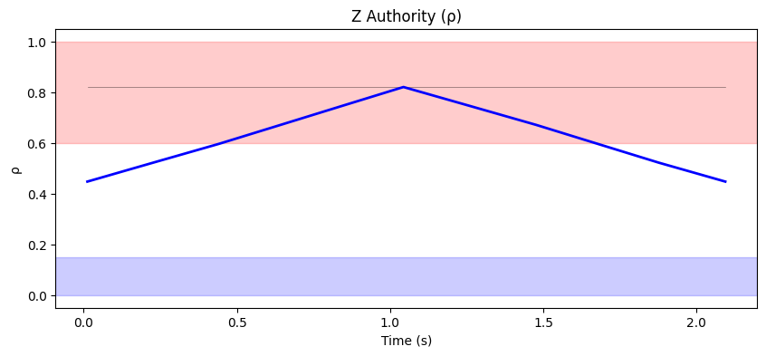
- ρ_mean = 0.820, ρ_p95 = 0.820
- u_ad RMS = 39.92 mixer units, u_nom RMS = 0.04 mixer units
- Phase relationship: decoupled (r = 0.00)

#### Weight Health
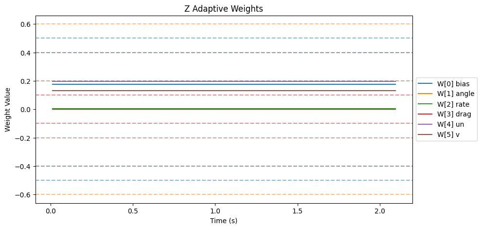
| Weight | θ_final | Drift (/s) | Proj. Hits | Oscillation (/s) |
|--------|---------|------------|------------|-------------------|
| W[0] bias | 0.176 | -0.0000 | 0.0% | 0.00 |
| W[1] angle | 0.000 | 0.0000 | 0.0% | 0.00 |
| W[2] rate | 0.003 | -0.0000 | 0.0% | 0.00 |
| W[3] drag | 0.000 | 0.0000 | 0.0% | 0.00 |
| W[4] un | 0.198 | 0.0000 | 0.0% | 0.00 |
| W[5] v | 0.132 | 0.0000 | 0.0% | 0.00 |

- ‖Θ‖ final = 0.296, trending: → STABLE/CONVERGING
- Hard-freeze fraction: 0.0%

## Firmware Parameters (Snapshot)
```json
{
  "payload": "PAYLOAD_LIGHT",
  "mrac_dt": 0.005,
  "num_basis": 6,
  "mixer": {
    "pitch": 1170.0,
    "roll": 1170.0,
    "yaw": 1872.0,
    "z": 222.0
  },
  "gamma": {
    "pitch": [
      0.5,
      3.3,
      1.0,
      2.0,
      0.1,
      1.0
    ],
    "roll": [
      0.5,
      3.3,
      1.0,
      2.0,
      0.1,
      1.0
    ],
    "yaw": [
      0.3,
      2.0,
      0.7,
      1.5,
      0.1,
      1.0
    ]
  },
  "wlim": {
    "pitch": [
      0.5,
      0.6,
      0.4,
      0.1,
      0.4,
      0.2
    ],
    "roll": [
      0.5,
      0.6,
      0.4,
      0.1,
      0.4,
      0.2
    ],
    "yaw": [
      0.3,
      0.4,
      0.2,
      0.05,
      0.3,
      0.2
    ]
  },
  "sigma": {
    "pitch": "from_config",
    "roll": "from_config",
    "yaw": "from_config"
  },
  "features": {
    "projection": true,
    "sigma_mod": true,
    "deadzone": true,
    "l1_filter": true,
    "pch": true,
    "perf_recovery": true
  },
  "_comment": "Manual overrides for firmware params. Edit before a test session. deep_analysis.py merges this into the experiment record.",
  "_instructions": "Update the fields below when you change firmware params that aren't in telemetry yet.",
  "sigma_pitch": null,
  "sigma_roll": null,
  "sigma_yaw": null,
  "omega_u_pitch": null,
  "omega_u_roll": null,
  "omega_u_yaw": null,
  "e_deadzone": null,
  "e_freeze": 8.0,
  "notes": ""
}
```
