# Flight Analysis Report: exp_flight_twc_1781526915

**Date:** 2026-06-15T13:28:50.681399Z | **Duration:** 6.1s | **Samples:** 2700 | **Config:** PAYLOAD_LIGHT

---

## What Happened

- Planar XY tracking RMSE was **24.8 cm** (peak 25.2 cm).
- Worst-tracked position axis was **Y** (RMSE 24.33 cm).
- **Never settled** within 5 cm of target (final error 25.1 cm).
- ⚠ **2 CRITICAL** MRAC alert(s) — run is INELIGIBLE as a champion until resolved.
- MRAC was most active on **z** (ρ_mean 0.86).

## Path Tracking

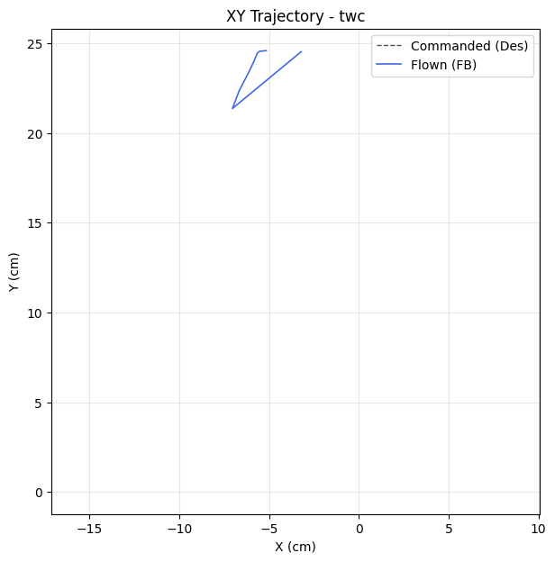

| Metric | Value |
|--------|-------|
| Planar XY RMSE (cm) | 24.78 |
| Planar peak (cm) | 25.16 |
| Cross-track mean / p95 / max (cm) | - / - / - |
| Along-track lag (ms) | - |
| Rank score (planar_rmse_cm) | 24.78 |
| TWC settling time (s) | - |
| TWC final error (cm) | 25.12 |

| Axis | RMSE | MAE | Peak |
|------|------|-----|------|
| X | 4.73 | 4.58 | 7.04 |
| Y | 24.33 | 24.32 | 24.59 |
| Z | 0.02 | 0.01 | 0.05 |

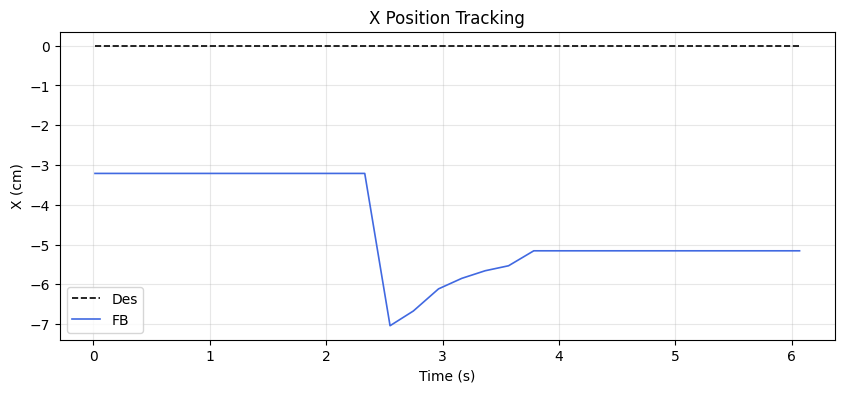
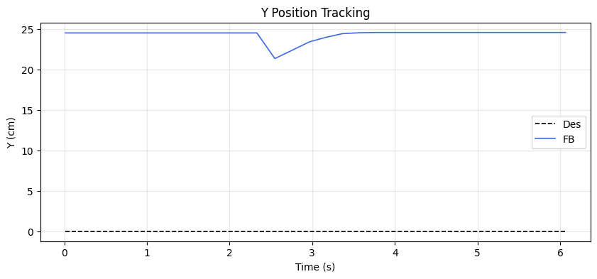
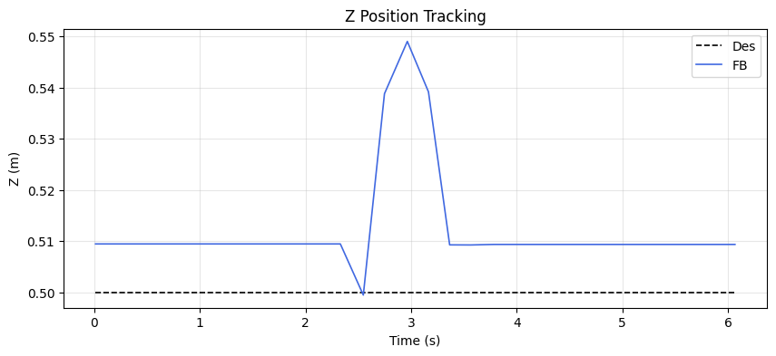

### Yaw heading-hold drift

| Cmd (°) | Final offset (°) | Mean offset (°) | Drift (°/s) | Total drift (°) | P2P (°) |
|---------|------------------|-----------------|-------------|-----------------|---------|
| 40.00 | -0.17 | -0.41 | 0.06 | 0.35 | 10.20 |

## MRAC Scoreboard (attitude / rate loops)

| Axis  | RMSE | RMSE_ss | RMSE_tr | ρ_mean | ρ_p95 | Phase | ‖Θ‖ | ⚠ | 🔴 |
|-------|------|---------|---------|--------|-------|-------|------|---|---|
| Pitch | 2.135 | 2.145 | - | 0.354 | 0.640 | reinforcing | 0.233 | 1 | 0 |
| Roll | 0.351 | 0.347 | 0.348 | 0.542 | 0.936 | reinforcing | 0.215 | 1 | 1 |
| Yaw | 1.679 | 0.660 | 2.944 | 0.211 | 0.418 | reinforcing | 0.142 | 0 | 0 |
| Z | 0.016 | 0.017 | - | 0.858 | 0.977 | reinforcing | 0.307 | 2 | 1 |

## Alerts

- [CRITICAL] **NEAR_SATURATION**: roll: MRAC near saturation (ρ_p95=0.94). Reduce gamma or increase u_max.
- [CRITICAL] **NEAR_SATURATION**: z: MRAC near saturation (ρ_p95=0.98). Reduce gamma or increase u_max.
- [WARN] **REDUNDANT_EFFORT**: pitch: MRAC reinforcing PID (r=0.50) with significant authority. PID may need retuning.
- [WARN] **REDUNDANT_EFFORT**: roll: MRAC reinforcing PID (r=0.42) with significant authority. PID may need retuning.
- [WARN] **HIGH_AUTHORITY**: z: MRAC-dominant (ρ=0.86). PID gains may be insufficient.
- [WARN] **REDUNDANT_EFFORT**: z: MRAC reinforcing PID (r=0.33) with significant authority. PID may need retuning.
- [INFO] **TRANSIENT_PENALTY**: yaw: Transient RMSE 4.5× worse than steady-state.

## Per-Axis Detail

### Pitch

#### Tracking
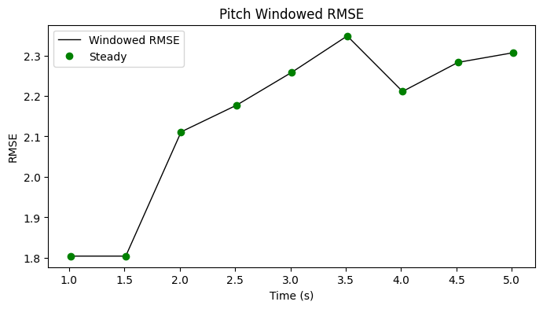

| Metric | Value |
|--------|-------|
| RMSE | 2.135 |
| MAE | 2.109 |
| Peak Error | 3.336 |
| Steady-State RMSE | 2.1448874374273217 |
| Transient RMSE | - |

#### Control Authority
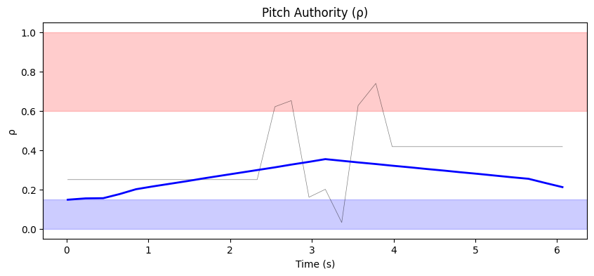
- ρ_mean = 0.354, ρ_p95 = 0.640
- u_ad RMS = 33.10 mixer units, u_nom RMS = 0.08 mixer units
- Phase relationship: reinforcing (r = 0.50)

#### Weight Health
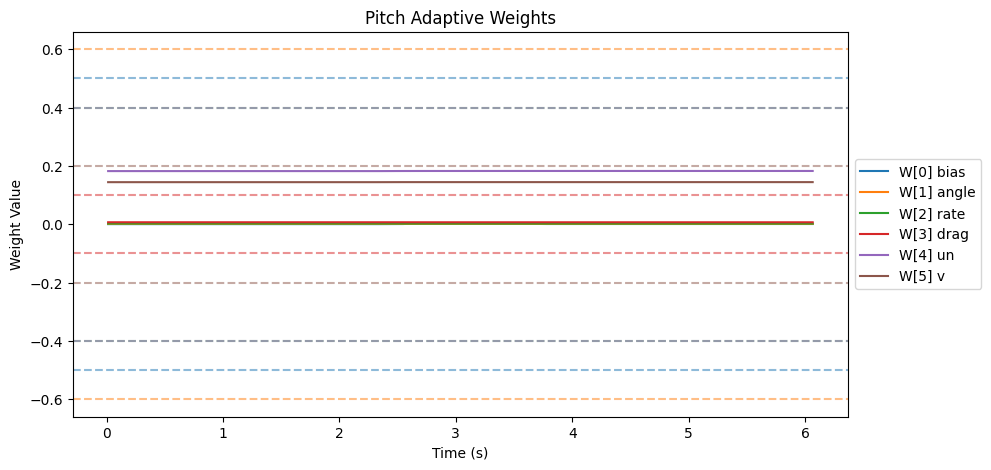
| Weight | θ_final | Drift (/s) | Proj. Hits | Oscillation (/s) |
|--------|---------|------------|------------|-------------------|
| W[0] bias | 0.001 | 0.0001 | 0.0% | 0.50 |
| W[1] angle | 0.001 | -0.0000 | 0.0% | 0.99 |
| W[2] rate | 0.002 | -0.0000 | 0.0% | 0.66 |
| W[3] drag | 0.007 | -0.0000 | 0.0% | 0.66 |
| W[4] un | 0.183 | 0.0001 | 0.0% | 0.50 |
| W[5] v | 0.144 | 0.0000 | 0.0% | 0.99 |

- ‖Θ‖ final = 0.233, trending: → STABLE/CONVERGING
- Hard-freeze fraction: 0.0%

### Roll

#### Tracking
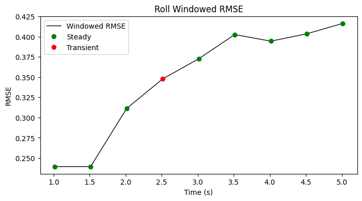

| Metric | Value |
|--------|-------|
| RMSE | 0.351 |
| MAE | 0.329 |
| Peak Error | 0.728 |
| Steady-State RMSE | 0.3474727908152945 |
| Transient RMSE | 0.3478220750383944 |

#### Control Authority
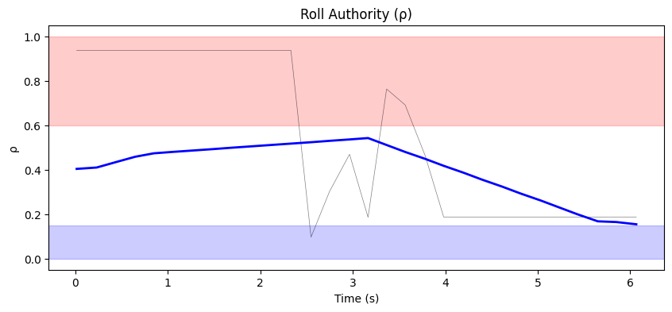
- ρ_mean = 0.542, ρ_p95 = 0.936
- u_ad RMS = 39.63 mixer units, u_nom RMS = 0.05 mixer units
- Phase relationship: reinforcing (r = 0.42)

#### Weight Health
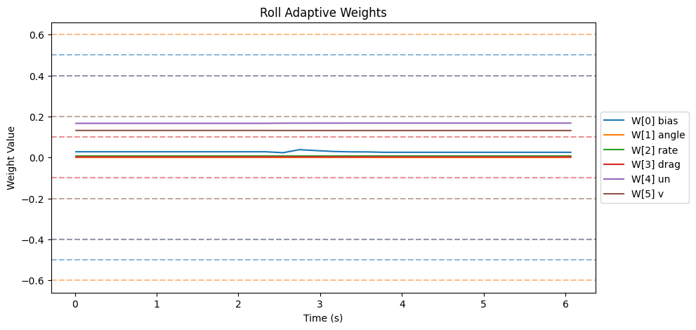
| Weight | θ_final | Drift (/s) | Proj. Hits | Oscillation (/s) |
|--------|---------|------------|------------|-------------------|
| W[0] bias | 0.025 | -0.0006 | 0.0% | 0.66 |
| W[1] angle | 0.000 | -0.0000 | 0.0% | 0.33 |
| W[2] rate | 0.007 | 0.0000 | 0.0% | 0.99 |
| W[3] drag | 0.003 | -0.0000 | 0.0% | 0.66 |
| W[4] un | 0.168 | 0.0003 | 0.0% | 0.33 |
| W[5] v | 0.131 | -0.0001 | 0.0% | 0.33 |

- ‖Θ‖ final = 0.215, trending: → STABLE/CONVERGING
- Hard-freeze fraction: 0.0%

### Yaw

#### Tracking
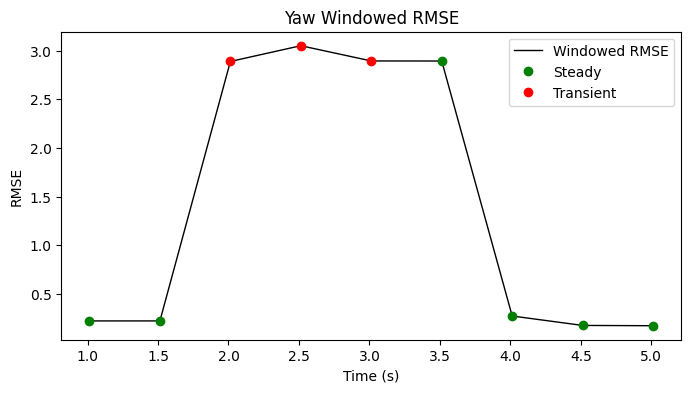

| Metric | Value |
|--------|-------|
| RMSE | 1.679 |
| MAE | 0.544 |
| Peak Error | 9.031 |
| Steady-State RMSE | 0.659726118409974 |
| Transient RMSE | 2.944314249952471 |

#### Control Authority
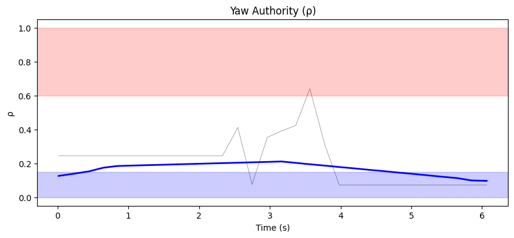
- ρ_mean = 0.211, ρ_p95 = 0.418
- u_ad RMS = 23.41 mixer units, u_nom RMS = 0.03 mixer units
- Phase relationship: reinforcing (r = 0.81)

#### Weight Health
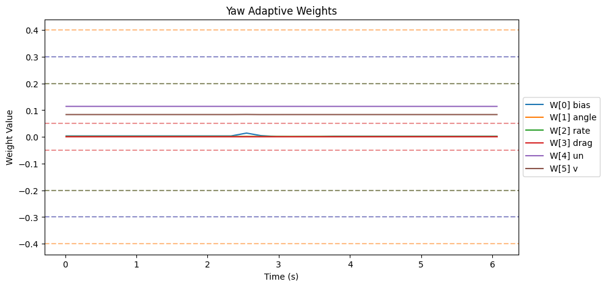
| Weight | θ_final | Drift (/s) | Proj. Hits | Oscillation (/s) |
|--------|---------|------------|------------|-------------------|
| W[0] bias | 0.003 | -0.0003 | 0.0% | 0.99 |
| W[1] angle | 0.001 | -0.0000 | 0.0% | 0.99 |
| W[2] rate | 0.001 | -0.0000 | 0.0% | 0.99 |
| W[3] drag | 0.000 | 0.0000 | 0.0% | 0.00 |
| W[4] un | 0.114 | -0.0000 | 0.0% | 0.99 |
| W[5] v | 0.084 | -0.0000 | 0.0% | 0.99 |

- ‖Θ‖ final = 0.142, trending: → STABLE/CONVERGING
- Hard-freeze fraction: 0.0%

### Z

#### Tracking
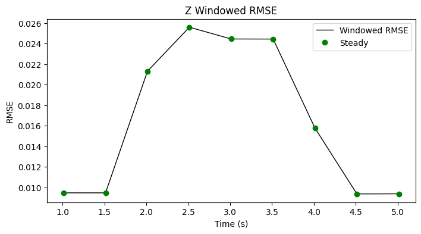

| Metric | Value |
|--------|-------|
| RMSE | 0.016 |
| MAE | 0.012 |
| Peak Error | 0.049 |
| Steady-State RMSE | 0.016583406594409853 |
| Transient RMSE | - |

#### Control Authority
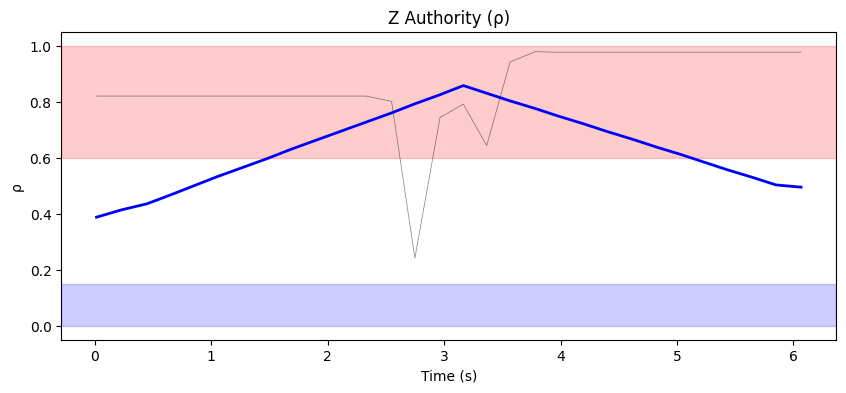
- ρ_mean = 0.858, ρ_p95 = 0.977
- u_ad RMS = 45.26 mixer units, u_nom RMS = 0.08 mixer units
- Phase relationship: reinforcing (r = 0.33)

#### Weight Health
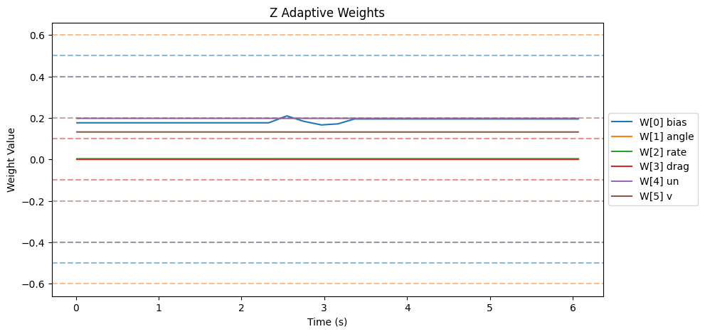
| Weight | θ_final | Drift (/s) | Proj. Hits | Oscillation (/s) |
|--------|---------|------------|------------|-------------------|
| W[0] bias | 0.195 | 0.0042 | 0.0% | 0.66 |
| W[1] angle | 0.000 | -0.0000 | 0.0% | 0.33 |
| W[2] rate | 0.003 | 0.0000 | 0.0% | 0.66 |
| W[3] drag | 0.000 | 0.0000 | 0.0% | 0.00 |
| W[4] un | 0.198 | -0.0000 | 0.0% | 0.83 |
| W[5] v | 0.132 | -0.0000 | 0.0% | 0.66 |

- ‖Θ‖ final = 0.307, trending: → STABLE/CONVERGING
- Hard-freeze fraction: 0.0%

## Firmware Parameters (Snapshot)
```json
{
  "payload": "PAYLOAD_LIGHT",
  "mrac_dt": 0.005,
  "num_basis": 6,
  "mixer": {
    "pitch": 1170.0,
    "roll": 1170.0,
    "yaw": 1872.0,
    "z": 222.0
  },
  "gamma": {
    "pitch": [
      0.5,
      3.3,
      1.0,
      2.0,
      0.1,
      1.0
    ],
    "roll": [
      0.5,
      3.3,
      1.0,
      2.0,
      0.1,
      1.0
    ],
    "yaw": [
      0.3,
      2.0,
      0.7,
      1.5,
      0.1,
      1.0
    ]
  },
  "wlim": {
    "pitch": [
      0.5,
      0.6,
      0.4,
      0.1,
      0.4,
      0.2
    ],
    "roll": [
      0.5,
      0.6,
      0.4,
      0.1,
      0.4,
      0.2
    ],
    "yaw": [
      0.3,
      0.4,
      0.2,
      0.05,
      0.3,
      0.2
    ]
  },
  "sigma": {
    "pitch": "from_config",
    "roll": "from_config",
    "yaw": "from_config"
  },
  "features": {
    "projection": true,
    "sigma_mod": true,
    "deadzone": true,
    "l1_filter": true,
    "pch": true,
    "perf_recovery": true
  },
  "_comment": "Manual overrides for firmware params. Edit before a test session. deep_analysis.py merges this into the experiment record.",
  "_instructions": "Update the fields below when you change firmware params that aren't in telemetry yet.",
  "sigma_pitch": null,
  "sigma_roll": null,
  "sigma_yaw": null,
  "omega_u_pitch": null,
  "omega_u_roll": null,
  "omega_u_yaw": null,
  "e_deadzone": null,
  "e_freeze": 8.0,
  "notes": ""
}
```
