# Flight Analysis Report: exp_flight_twc_1781526921

**Date:** 2026-06-15T13:28:58.636212Z | **Duration:** 8.7s | **Samples:** 3870 | **Config:** PAYLOAD_LIGHT

---

## What Happened

- Planar XY tracking RMSE was **22.4 cm** (peak 26.6 cm).
- Worst-tracked position axis was **Y** (RMSE 22.23 cm).
- **Never settled** within 5 cm of target (final error 20.2 cm).
- 2 warning-level MRAC alert(s); no critical issues.
- MRAC was most active on **z** (ρ_mean 0.71).

## Path Tracking

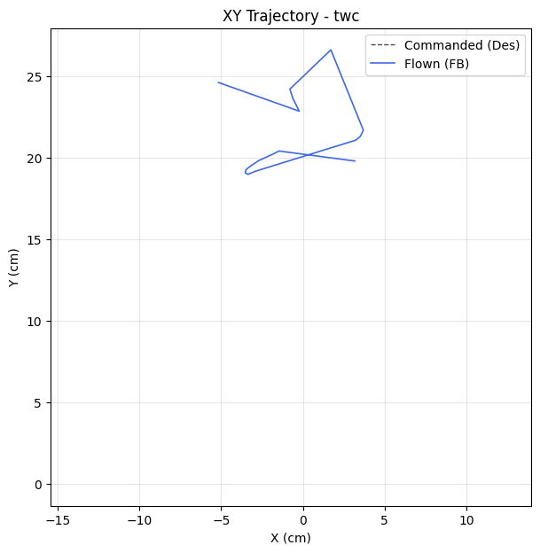

| Metric | Value |
|--------|-------|
| Planar XY RMSE (cm) | 22.36 |
| Planar peak (cm) | 26.64 |
| Cross-track mean / p95 / max (cm) | - / - / - |
| Along-track lag (ms) | - |
| Rank score (planar_rmse_cm) | 22.36 |
| TWC settling time (s) | - |
| TWC final error (cm) | 20.24 |

| Axis | RMSE | MAE | Peak |
|------|------|-----|------|
| X | 2.48 | 2.22 | 5.16 |
| Y | 22.23 | 22.09 | 26.59 |
| Z | 0.01 | 0.01 | 0.02 |

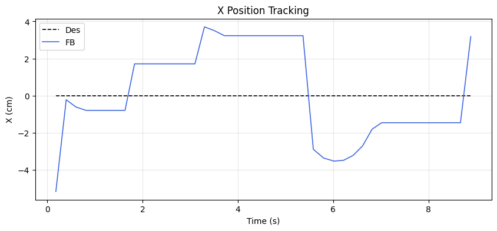
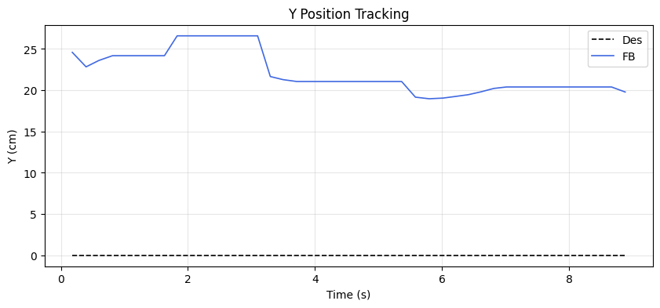
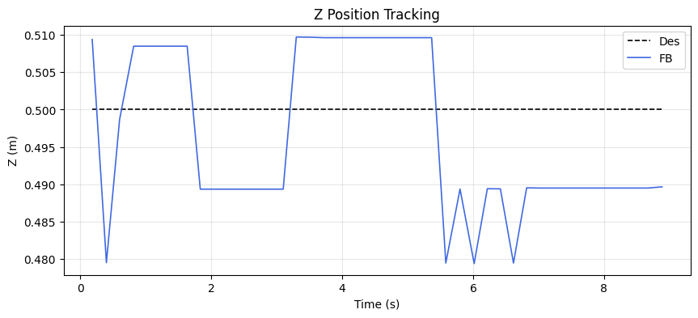

### Yaw heading-hold drift

| Cmd (°) | Final offset (°) | Mean offset (°) | Drift (°/s) | Total drift (°) | P2P (°) |
|---------|------------------|-----------------|-------------|-----------------|---------|
| 50.00 | 1.03 | 0.52 | 0.14 | 1.23 | 2.63 |

## MRAC Scoreboard (attitude / rate loops)

| Axis  | RMSE | RMSE_ss | RMSE_tr | ρ_mean | ρ_p95 | Phase | ‖Θ‖ | ⚠ | 🔴 |
|-------|------|---------|---------|--------|-------|-------|------|---|---|
| Pitch | 2.249 | 2.231 | 1.991 | 0.211 | 0.365 | decoupled | 0.233 | 0 | 0 |
| Roll | 0.263 | 0.248 | 0.215 | 0.345 | 0.858 | decoupled | 0.215 | 0 | 0 |
| Yaw | 0.702 | 0.566 | 0.595 | 0.351 | 0.762 | decoupled | 0.142 | 0 | 0 |
| Z | 0.011 | 0.011 | - | 0.705 | 0.790 | reinforcing | 0.397 | 2 | 0 |

## Alerts

- [WARN] **HIGH_AUTHORITY**: z: MRAC-dominant (ρ=0.71). PID gains may be insufficient.
- [WARN] **REDUNDANT_EFFORT**: z: MRAC reinforcing PID (r=0.73) with significant authority. PID may need retuning.

## Per-Axis Detail

### Pitch

#### Tracking
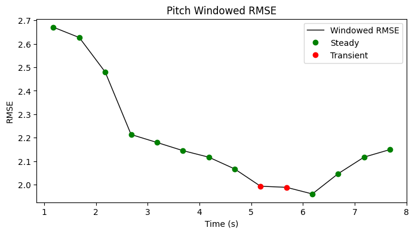

| Metric | Value |
|--------|-------|
| RMSE | 2.249 |
| MAE | 2.223 |
| Peak Error | 3.015 |
| Steady-State RMSE | 2.231325700777371 |
| Transient RMSE | 1.9914169009419895 |

#### Control Authority
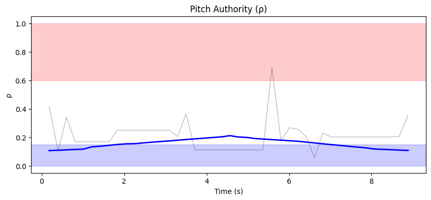
- ρ_mean = 0.211, ρ_p95 = 0.365
- u_ad RMS = 28.08 mixer units, u_nom RMS = 0.10 mixer units
- Phase relationship: decoupled (r = 0.19)

#### Weight Health
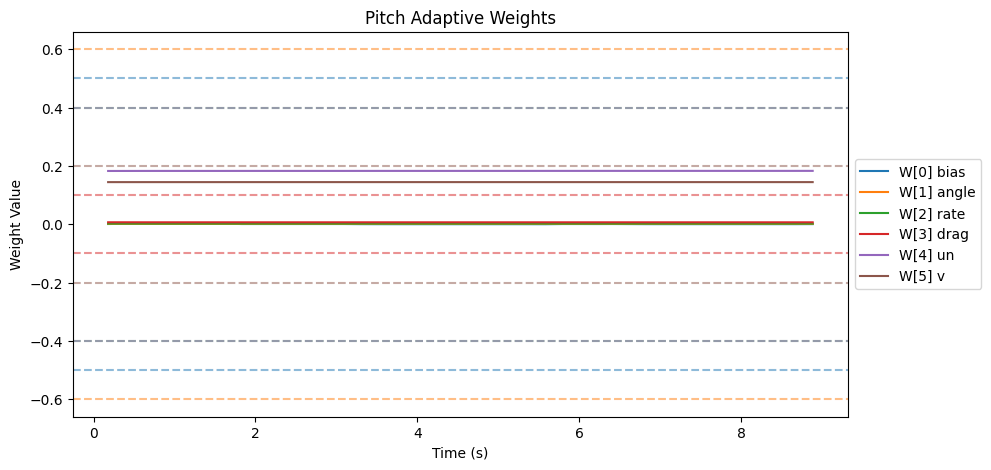
| Weight | θ_final | Drift (/s) | Proj. Hits | Oscillation (/s) |
|--------|---------|------------|------------|-------------------|
| W[0] bias | 0.000 | -0.0002 | 0.0% | 1.49 |
| W[1] angle | 0.001 | 0.0000 | 0.0% | 1.38 |
| W[2] rate | 0.002 | -0.0000 | 0.0% | 0.92 |
| W[3] drag | 0.007 | -0.0000 | 0.0% | 1.03 |
| W[4] un | 0.183 | 0.0000 | 0.0% | 1.15 |
| W[5] v | 0.144 | 0.0000 | 0.0% | 1.26 |

- ‖Θ‖ final = 0.233, trending: → STABLE/CONVERGING
- Hard-freeze fraction: 0.0%

### Roll

#### Tracking
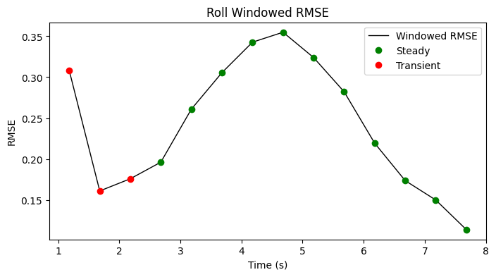

| Metric | Value |
|--------|-------|
| RMSE | 0.263 |
| MAE | 0.228 |
| Peak Error | 0.682 |
| Steady-State RMSE | 0.24758386257791595 |
| Transient RMSE | 0.21509816084504915 |

#### Control Authority
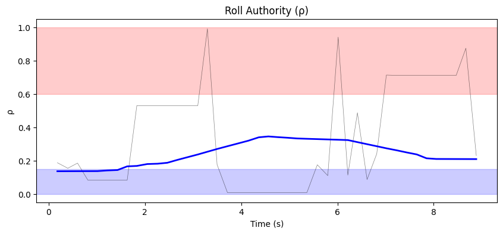
- ρ_mean = 0.345, ρ_p95 = 0.858
- u_ad RMS = 27.16 mixer units, u_nom RMS = 0.10 mixer units
- Phase relationship: decoupled (r = 0.03)

#### Weight Health
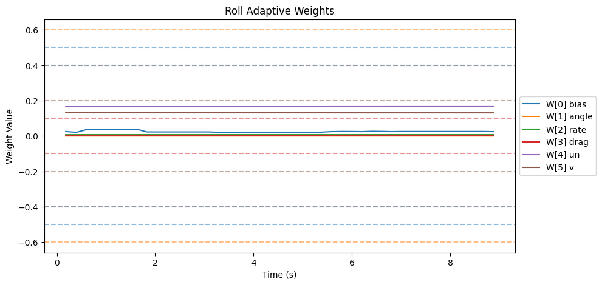
| Weight | θ_final | Drift (/s) | Proj. Hits | Oscillation (/s) |
|--------|---------|------------|------------|-------------------|
| W[0] bias | 0.025 | -0.0006 | 0.0% | 1.61 |
| W[1] angle | 0.000 | -0.0000 | 0.0% | 1.26 |
| W[2] rate | 0.007 | 0.0000 | 0.0% | 1.61 |
| W[3] drag | 0.003 | -0.0000 | 0.0% | 1.26 |
| W[4] un | 0.169 | 0.0001 | 0.0% | 0.92 |
| W[5] v | 0.131 | -0.0000 | 0.0% | 0.92 |

- ‖Θ‖ final = 0.215, trending: → STABLE/CONVERGING
- Hard-freeze fraction: 0.0%

### Yaw

#### Tracking
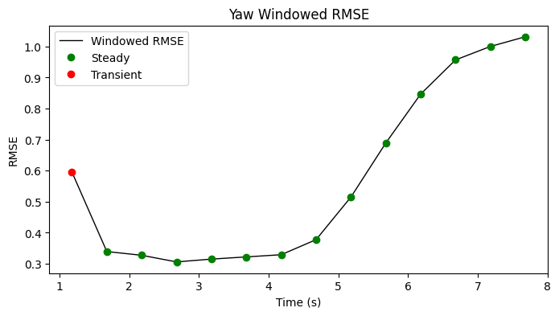

| Metric | Value |
|--------|-------|
| RMSE | 0.702 |
| MAE | 0.605 |
| Peak Error | 1.596 |
| Steady-State RMSE | 0.5658300884559365 |
| Transient RMSE | 0.5953685206701812 |

#### Control Authority
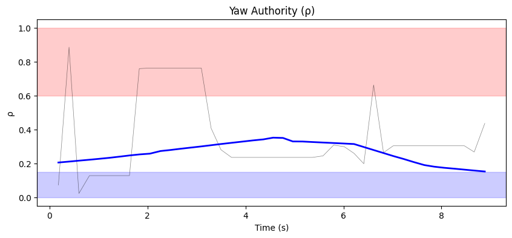
- ρ_mean = 0.351, ρ_p95 = 0.762
- u_ad RMS = 35.80 mixer units, u_nom RMS = 0.05 mixer units
- Phase relationship: decoupled (r = 0.18)

#### Weight Health
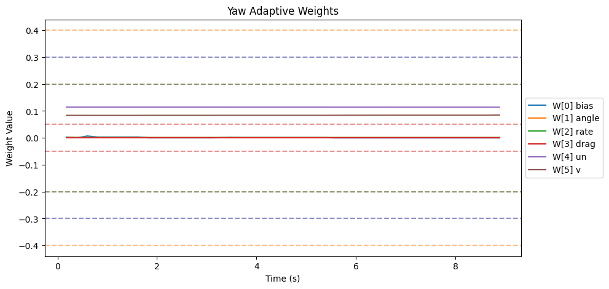
| Weight | θ_final | Drift (/s) | Proj. Hits | Oscillation (/s) |
|--------|---------|------------|------------|-------------------|
| W[0] bias | 0.000 | -0.0003 | 0.0% | 1.26 |
| W[1] angle | 0.001 | -0.0000 | 0.0% | 1.26 |
| W[2] rate | 0.001 | -0.0000 | 0.0% | 1.15 |
| W[3] drag | 0.000 | 0.0000 | 0.0% | 0.00 |
| W[4] un | 0.114 | -0.0000 | 0.0% | 1.03 |
| W[5] v | 0.085 | 0.0001 | 0.0% | 1.26 |

- ‖Θ‖ final = 0.142, trending: → STABLE/CONVERGING
- Hard-freeze fraction: 0.0%

### Z

#### Tracking
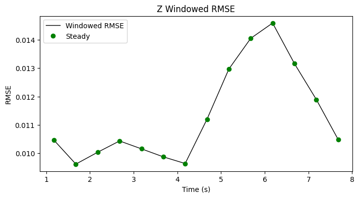

| Metric | Value |
|--------|-------|
| RMSE | 0.011 |
| MAE | 0.011 |
| Peak Error | 0.021 |
| Steady-State RMSE | 0.01132827457300073 |
| Transient RMSE | - |

#### Control Authority
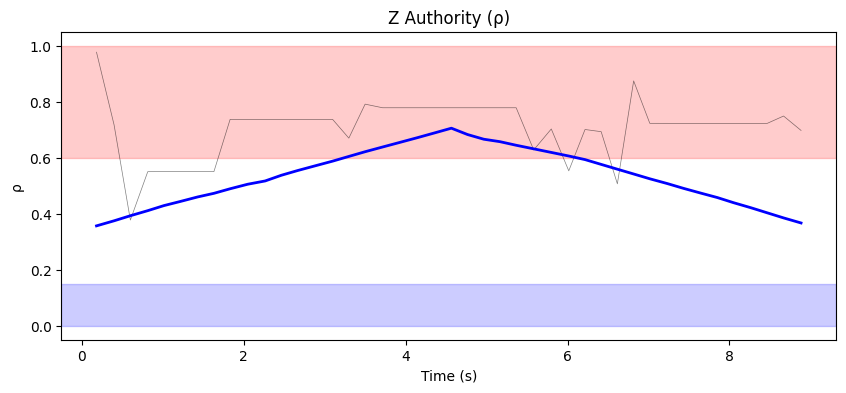
- ρ_mean = 0.705, ρ_p95 = 0.790
- u_ad RMS = 56.07 mixer units, u_nom RMS = 0.12 mixer units
- Phase relationship: reinforcing (r = 0.73)

#### Weight Health
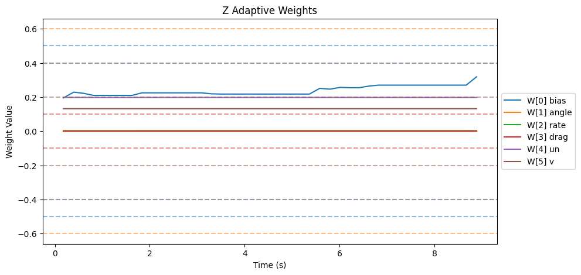
| Weight | θ_final | Drift (/s) | Proj. Hits | Oscillation (/s) |
|--------|---------|------------|------------|-------------------|
| W[0] bias | 0.318 | 0.0089 | 0.0% | 1.61 |
| W[1] angle | 0.000 | -0.0000 | 0.0% | 1.15 |
| W[2] rate | 0.003 | 0.0000 | 0.0% | 1.72 |
| W[3] drag | 0.000 | 0.0000 | 0.0% | 0.00 |
| W[4] un | 0.198 | -0.0000 | 0.0% | 1.61 |
| W[5] v | 0.132 | 0.0000 | 0.0% | 1.49 |

- ‖Θ‖ final = 0.397, trending: → STABLE/CONVERGING
- Hard-freeze fraction: 0.0%

## Firmware Parameters (Snapshot)
```json
{
  "payload": "PAYLOAD_LIGHT",
  "mrac_dt": 0.005,
  "num_basis": 6,
  "mixer": {
    "pitch": 1170.0,
    "roll": 1170.0,
    "yaw": 1872.0,
    "z": 222.0
  },
  "gamma": {
    "pitch": [
      0.5,
      3.3,
      1.0,
      2.0,
      0.1,
      1.0
    ],
    "roll": [
      0.5,
      3.3,
      1.0,
      2.0,
      0.1,
      1.0
    ],
    "yaw": [
      0.3,
      2.0,
      0.7,
      1.5,
      0.1,
      1.0
    ]
  },
  "wlim": {
    "pitch": [
      0.5,
      0.6,
      0.4,
      0.1,
      0.4,
      0.2
    ],
    "roll": [
      0.5,
      0.6,
      0.4,
      0.1,
      0.4,
      0.2
    ],
    "yaw": [
      0.3,
      0.4,
      0.2,
      0.05,
      0.3,
      0.2
    ]
  },
  "sigma": {
    "pitch": "from_config",
    "roll": "from_config",
    "yaw": "from_config"
  },
  "features": {
    "projection": true,
    "sigma_mod": true,
    "deadzone": true,
    "l1_filter": true,
    "pch": true,
    "perf_recovery": true
  },
  "_comment": "Manual overrides for firmware params. Edit before a test session. deep_analysis.py merges this into the experiment record.",
  "_instructions": "Update the fields below when you change firmware params that aren't in telemetry yet.",
  "sigma_pitch": null,
  "sigma_roll": null,
  "sigma_yaw": null,
  "omega_u_pitch": null,
  "omega_u_roll": null,
  "omega_u_yaw": null,
  "e_deadzone": null,
  "e_freeze": 8.0,
  "notes": ""
}
```
