# Flight Analysis Report: exp_flight_twc_1781527159

**Date:** 2026-06-15T13:29:06.676221Z | **Duration:** 17.2s | **Samples:** 7560 | **Config:** PAYLOAD_LIGHT

---

## What Happened

- Planar XY tracking RMSE was **25.0 cm** (peak 33.8 cm).
- Worst-tracked position axis was **Y** (RMSE 22.85 cm).
- Yaw held **+0.0°** off command (drift -1.13°/s over the run) — expected heading-hold signature of bias/asymmetry.
- Reached the 5 cm target band in **0.0 s**; final error 25.7 cm.
- ⚠ **3 CRITICAL** MRAC alert(s) — run is INELIGIBLE as a champion until resolved.
- MRAC was most active on **z** (ρ_mean 0.52).

## Path Tracking

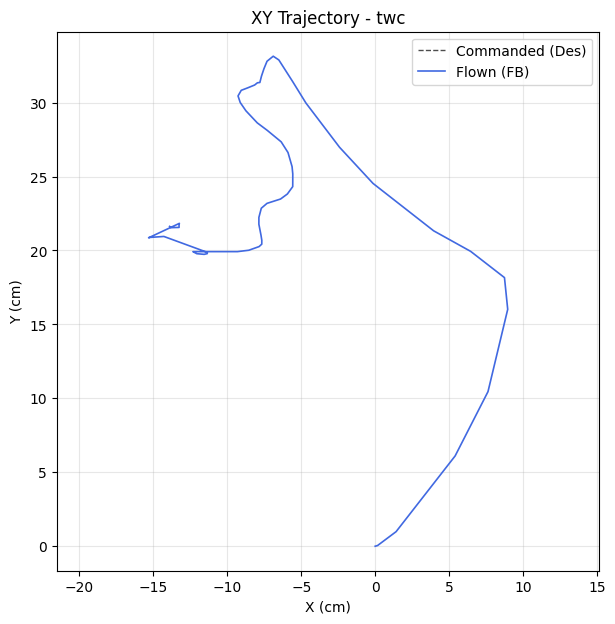

| Metric | Value |
|--------|-------|
| Planar XY RMSE (cm) | 24.99 |
| Planar peak (cm) | 33.85 |
| Cross-track mean / p95 / max (cm) | - / - / - |
| Along-track lag (ms) | - |
| Rank score (planar_rmse_cm) | 24.99 |
| TWC settling time (s) | 0.00 |
| TWC final error (cm) | 25.68 |

| Axis | RMSE | MAE | Peak |
|------|------|-----|------|
| X | 10.13 | 9.18 | 15.32 |
| Y | 22.85 | 21.54 | 33.14 |
| Z | 0.09 | 0.07 | 0.21 |

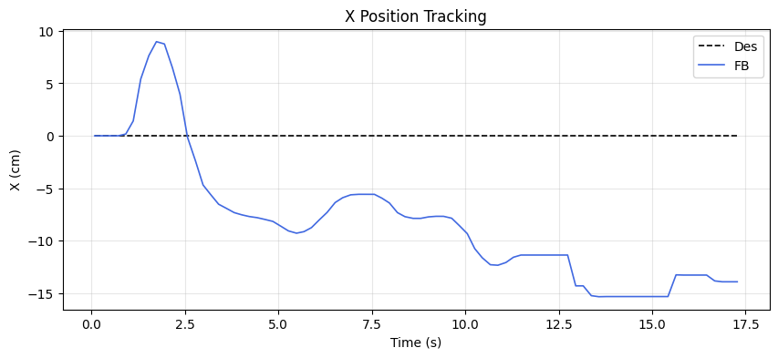
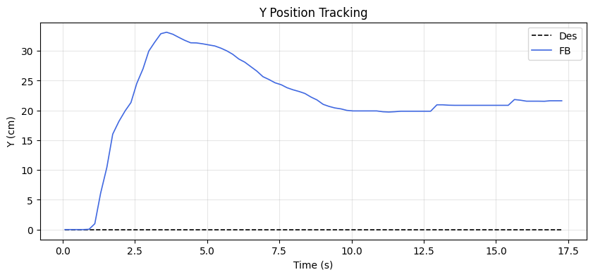
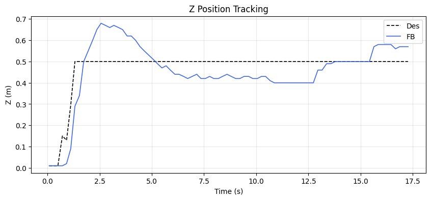

### Yaw heading-hold drift

| Cmd (°) | Final offset (°) | Mean offset (°) | Drift (°/s) | Total drift (°) | P2P (°) |
|---------|------------------|-----------------|-------------|-----------------|---------|
| 0.00 | 0.01 | 3.83 | -1.13 | -19.38 | 76.68 |

## MRAC Scoreboard (attitude / rate loops)

| Axis  | RMSE | RMSE_ss | RMSE_tr | ρ_mean | ρ_p95 | Phase | ‖Θ‖ | ⚠ | 🔴 |
|-------|------|---------|---------|--------|-------|-------|------|---|---|
| Pitch | 3.109 | 2.988 | 3.404 | 0.408 | 0.867 | decoupled | 0.244 | 1 | 0 |
| Roll | 0.674 | 0.369 | 1.107 | 0.401 | 0.958 | decoupled | 0.246 | 0 | 1 |
| Yaw | 14.749 | 2.679 | 45.048 | 0.315 | 0.759 | decoupled | 0.146 | 1 | 0 |
| Z | 0.089 | 0.081 | - | 0.520 | 0.966 | reinforcing | 0.866 | 3 | 2 |

## Alerts

- [CRITICAL] **NEAR_SATURATION**: roll: MRAC near saturation (ρ_p95=0.96). Reduce gamma or increase u_max.
- [CRITICAL] **NEAR_SATURATION**: z: MRAC near saturation (ρ_p95=0.97). Reduce gamma or increase u_max.
- [CRITICAL] **DIVERGING_WEIGHTS**: z: Weight norm is growing — adaptation may be diverging.
- [WARN] **POOR_TRACKING**: pitch: Tracking degraded (RMSE=3.11).
- [WARN] **POOR_TRACKING**: yaw: Tracking degraded (RMSE=14.75).
- [WARN] **PROJECTION_ACTIVE**: z: Weight[0] hitting projection bound 26% of time. Disturbance may exceed budget.
- [WARN] **WEIGHT_DRIFT**: z: Weight[0] drifting at 0.0412/s. σ-mod may be too weak.
- [WARN] **REDUNDANT_EFFORT**: z: MRAC reinforcing PID (r=0.51) with significant authority. PID may need retuning.
- [INFO] **TRANSIENT_PENALTY**: roll: Transient RMSE 3.0× worse than steady-state.
- [INFO] **TRANSIENT_PENALTY**: yaw: Transient RMSE 16.8× worse than steady-state.

## Per-Axis Detail

### Pitch

#### Tracking
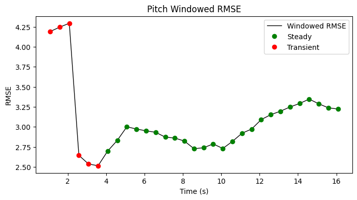

| Metric | Value |
|--------|-------|
| RMSE | 3.109 |
| MAE | 2.978 |
| Peak Error | 7.181 |
| Steady-State RMSE | 2.9880348939040466 |
| Transient RMSE | 3.4043782177515918 |

#### Control Authority
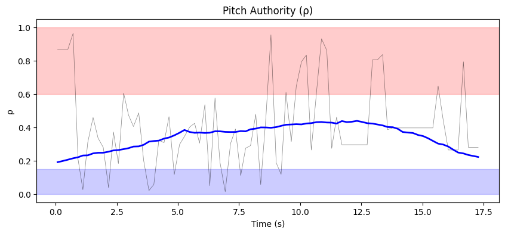
- ρ_mean = 0.408, ρ_p95 = 0.867
- u_ad RMS = 52.60 mixer units, u_nom RMS = 0.07 mixer units
- Phase relationship: decoupled (r = 0.03)

#### Weight Health
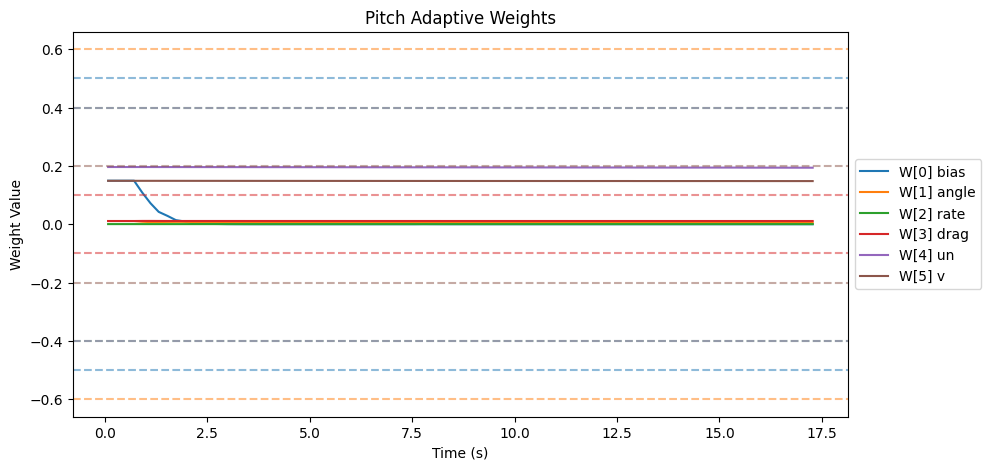
| Weight | θ_final | Drift (/s) | Proj. Hits | Oscillation (/s) |
|--------|---------|------------|------------|-------------------|
| W[0] bias | 0.000 | -0.0033 | 0.0% | 0.70 |
| W[1] angle | 0.005 | -0.0002 | 0.0% | 0.99 |
| W[2] rate | 0.000 | -0.0000 | 0.0% | 0.99 |
| W[3] drag | 0.011 | -0.0000 | 0.0% | 0.93 |
| W[4] un | 0.194 | -0.0001 | 0.0% | 0.58 |
| W[5] v | 0.148 | -0.0001 | 0.0% | 0.70 |

- ‖Θ‖ final = 0.244, trending: → STABLE/CONVERGING
- Hard-freeze fraction: 0.0%

### Roll

#### Tracking
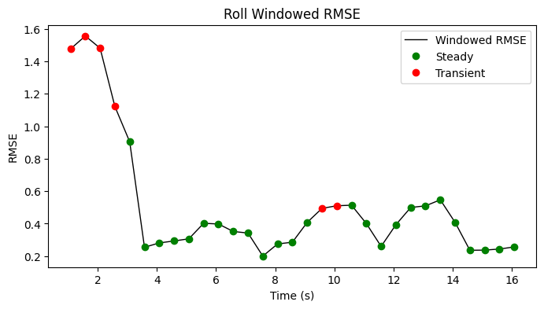

| Metric | Value |
|--------|-------|
| RMSE | 0.674 |
| MAE | 0.457 |
| Peak Error | 2.164 |
| Steady-State RMSE | 0.36851329981721415 |
| Transient RMSE | 1.1069737057026448 |

#### Control Authority
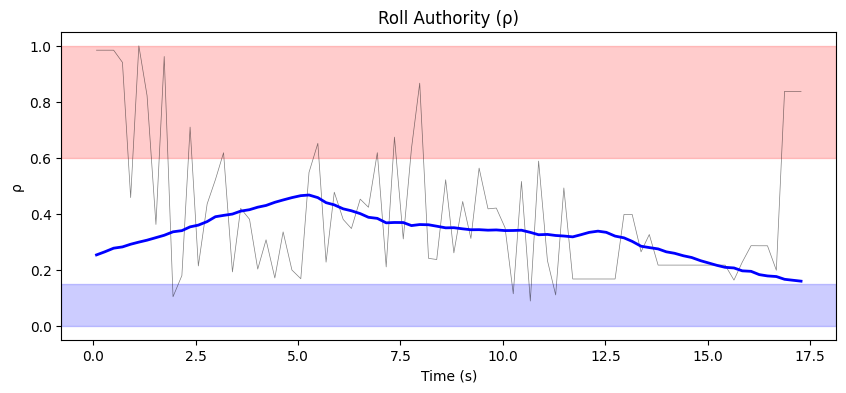
- ρ_mean = 0.401, ρ_p95 = 0.958
- u_ad RMS = 57.49 mixer units, u_nom RMS = 0.07 mixer units
- Phase relationship: decoupled (r = 0.01)

#### Weight Health
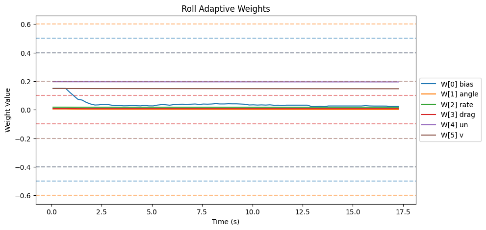
| Weight | θ_final | Drift (/s) | Proj. Hits | Oscillation (/s) |
|--------|---------|------------|------------|-------------------|
| W[0] bias | 0.023 | -0.0032 | 0.0% | 2.56 |
| W[1] angle | 0.001 | -0.0002 | 0.0% | 0.58 |
| W[2] rate | 0.018 | -0.0000 | 0.0% | 1.11 |
| W[3] drag | 0.007 | -0.0000 | 0.0% | 1.80 |
| W[4] un | 0.195 | -0.0001 | 0.0% | 0.58 |
| W[5] v | 0.147 | -0.0001 | 0.0% | 0.58 |

- ‖Θ‖ final = 0.246, trending: → STABLE/CONVERGING
- Hard-freeze fraction: 0.0%

### Yaw

#### Tracking
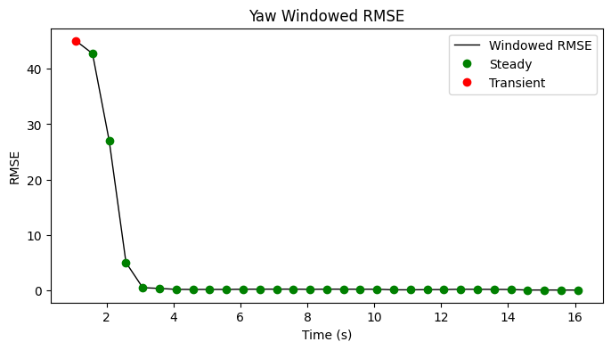

| Metric | Value |
|--------|-------|
| RMSE | 14.749 |
| MAE | 3.891 |
| Peak Error | 76.026 |
| Steady-State RMSE | 2.6792582052101968 |
| Transient RMSE | 45.047632380461096 |

#### Control Authority
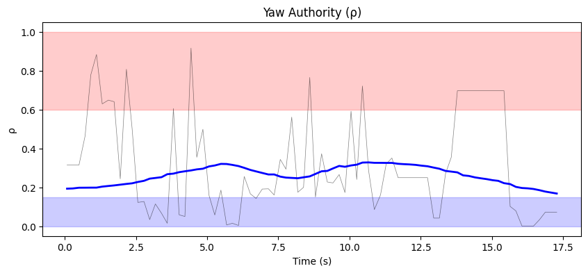
- ρ_mean = 0.315, ρ_p95 = 0.759
- u_ad RMS = 57.11 mixer units, u_nom RMS = 0.03 mixer units
- Phase relationship: decoupled (r = 0.07)

#### Weight Health
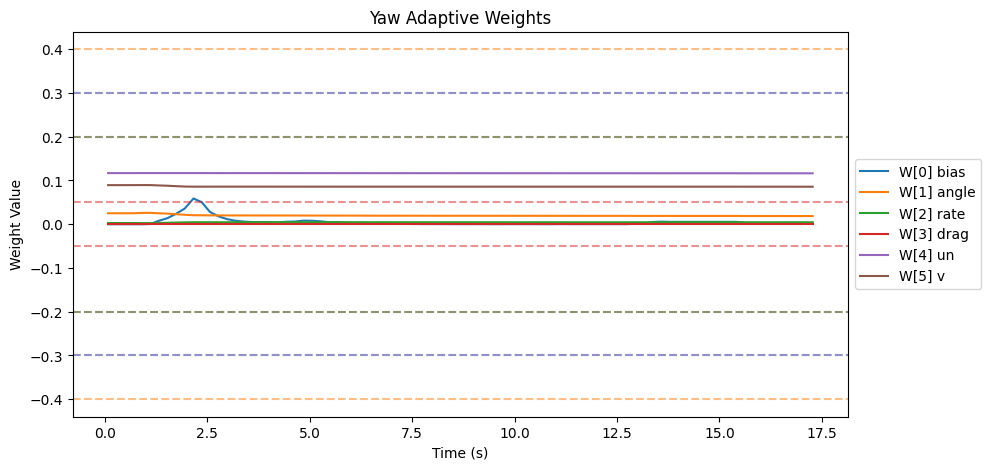
| Weight | θ_final | Drift (/s) | Proj. Hits | Oscillation (/s) |
|--------|---------|------------|------------|-------------------|
| W[0] bias | 0.003 | -0.0007 | 0.0% | 1.63 |
| W[1] angle | 0.019 | -0.0003 | 0.0% | 0.64 |
| W[2] rate | 0.005 | 0.0001 | 0.0% | 0.99 |
| W[3] drag | 0.000 | 0.0000 | 0.0% | 0.00 |
| W[4] un | 0.116 | -0.0000 | 0.0% | 0.76 |
| W[5] v | 0.086 | -0.0001 | 0.0% | 1.22 |

- ‖Θ‖ final = 0.146, trending: → STABLE/CONVERGING
- Hard-freeze fraction: 0.0%

### Z

#### Tracking
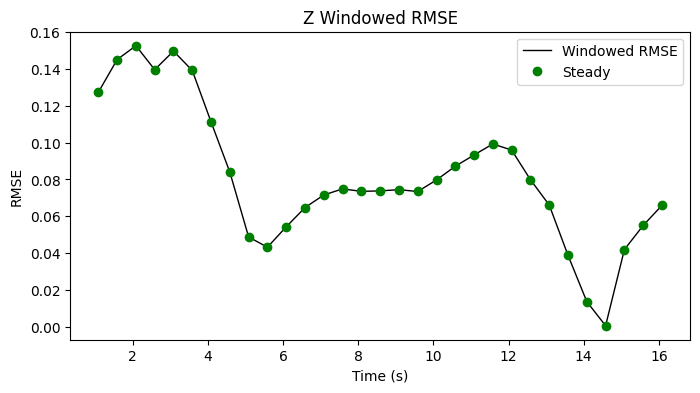

| Metric | Value |
|--------|-------|
| RMSE | 0.089 |
| MAE | 0.073 |
| Peak Error | 0.210 |
| Steady-State RMSE | 0.0812436245252517 |
| Transient RMSE | - |

#### Control Authority
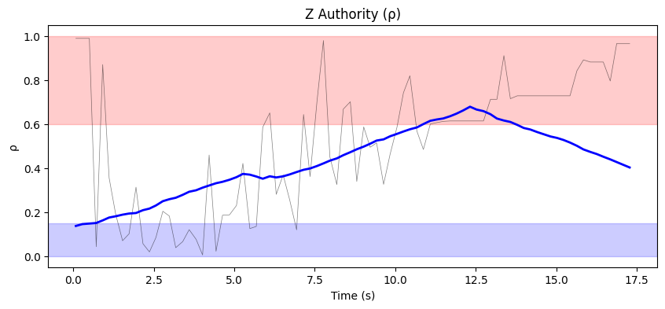
- ρ_mean = 0.520, ρ_p95 = 0.966
- u_ad RMS = 101.91 mixer units, u_nom RMS = 0.32 mixer units
- Phase relationship: reinforcing (r = 0.51)

#### Weight Health
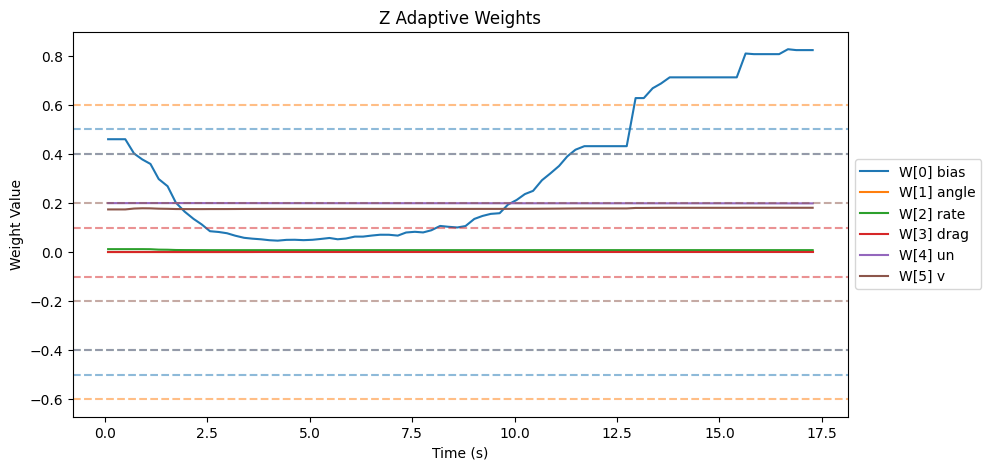
| Weight | θ_final | Drift (/s) | Proj. Hits | Oscillation (/s) |
|--------|---------|------------|------------|-------------------|
| W[0] bias | 0.823 | 0.0412 | 26.2% | 1.45 |
| W[1] angle | 0.002 | 0.0002 | 0.0% | 1.40 |
| W[2] rate | 0.008 | -0.0001 | 0.0% | 1.80 |
| W[3] drag | 0.000 | 0.0000 | 0.0% | 0.00 |
| W[4] un | 0.199 | -0.0001 | 0.0% | 1.11 |
| W[5] v | 0.181 | 0.0003 | 0.0% | 1.45 |

- ‖Θ‖ final = 0.866, trending: ↑ DIVERGING
- Hard-freeze fraction: 0.0%

## Firmware Parameters (Snapshot)
```json
{
  "payload": "PAYLOAD_LIGHT",
  "mrac_dt": 0.005,
  "num_basis": 6,
  "mixer": {
    "pitch": 1170.0,
    "roll": 1170.0,
    "yaw": 1872.0,
    "z": 222.0
  },
  "gamma": {
    "pitch": [
      0.5,
      3.3,
      1.0,
      2.0,
      0.1,
      1.0
    ],
    "roll": [
      0.5,
      3.3,
      1.0,
      2.0,
      0.1,
      1.0
    ],
    "yaw": [
      0.3,
      2.0,
      0.7,
      1.5,
      0.1,
      1.0
    ]
  },
  "wlim": {
    "pitch": [
      0.5,
      0.6,
      0.4,
      0.1,
      0.4,
      0.2
    ],
    "roll": [
      0.5,
      0.6,
      0.4,
      0.1,
      0.4,
      0.2
    ],
    "yaw": [
      0.3,
      0.4,
      0.2,
      0.05,
      0.3,
      0.2
    ]
  },
  "sigma": {
    "pitch": "from_config",
    "roll": "from_config",
    "yaw": "from_config"
  },
  "features": {
    "projection": true,
    "sigma_mod": true,
    "deadzone": true,
    "l1_filter": true,
    "pch": true,
    "perf_recovery": true
  },
  "_comment": "Manual overrides for firmware params. Edit before a test session. deep_analysis.py merges this into the experiment record.",
  "_instructions": "Update the fields below when you change firmware params that aren't in telemetry yet.",
  "sigma_pitch": null,
  "sigma_roll": null,
  "sigma_yaw": null,
  "omega_u_pitch": null,
  "omega_u_roll": null,
  "omega_u_yaw": null,
  "e_deadzone": null,
  "e_freeze": 8.0,
  "notes": ""
}
```
