# Flight Analysis Report: exp_flight_twc_1781527176

**Date:** 2026-06-15T13:29:14.729455Z | **Duration:** 4.4s | **Samples:** 1980 | **Config:** PAYLOAD_LIGHT

---

## What Happened

- Planar XY tracking RMSE was **34.5 cm** (peak 47.0 cm).
- Worst-tracked position axis was **Y** (RMSE 32.33 cm).
- Feedback trailed the reference by ~**1207 ms** (along-track/phase lag).
- **Y** tracking error is dominated by **DC offset/drift** (bias 23 / amp 1 / lag 5 / resid 3 cm RMS; gain 0.77).
- **Never settled** within 5 cm of target (final error 11.4 cm).
- ⚠ **3 CRITICAL** MRAC alert(s) — run is INELIGIBLE as a champion until resolved.
- MRAC was most active on **z** (ρ_mean 0.91).

## Path Tracking

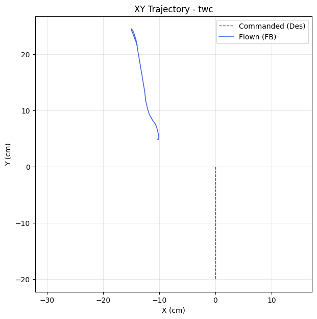

| Metric | Value |
|--------|-------|
| Planar XY RMSE (cm) | 34.51 |
| Planar peak (cm) | 46.99 |
| Cross-track mean / p95 / max (cm) | - / - / - |
| Along-track lag (ms) | 1207 |
| Rank score (planar_rmse_cm) | 34.51 |
| TWC settling time (s) | - |
| TWC final error (cm) | 11.40 |

| Axis | RMSE | MAE | Peak |
|------|------|-----|------|
| X | 12.08 | 11.94 | 14.92 |
| Y | 32.33 | 31.38 | 44.55 |
| Z | 0.03 | 0.02 | 0.07 |

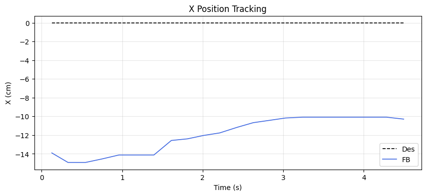
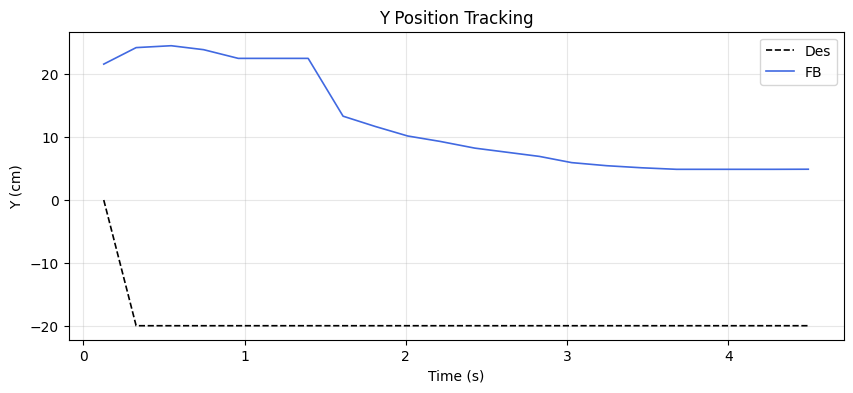
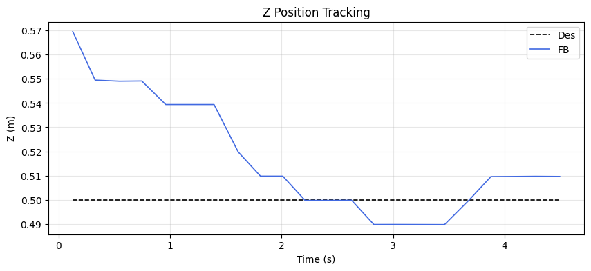

### Tracking error decomposition

_Splits each axis RMSE into the cause that injects it: a steady DC offset, amplitude attenuation (gain≠1), phase lag, or residual distortion. Read the largest column as the thing to fix first._

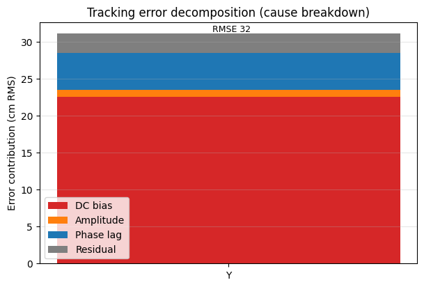

| Axis | Total RMSE | DC bias | Amplitude | Phase lag | Residual | Gain | Lag (ms) |
|------|-----------|---------|-----------|-----------|----------|------|----------|
| Y | 32.33 | 22.54 | 0.98 | 5.00 | 2.60 | 0.77 | 1207 |

### Yaw heading-hold drift

| Cmd (°) | Final offset (°) | Mean offset (°) | Drift (°/s) | Total drift (°) | P2P (°) |
|---------|------------------|-----------------|-------------|-----------------|---------|
| 0.00 | 0.12 | -0.01 | 0.07 | 0.30 | 0.68 |

## MRAC Scoreboard (attitude / rate loops)

| Axis  | RMSE | RMSE_ss | RMSE_tr | ρ_mean | ρ_p95 | Phase | ‖Θ‖ | ⚠ | 🔴 |
|-------|------|---------|---------|--------|-------|-------|------|---|---|
| Pitch | 3.488 | 3.332 | 3.469 | 0.428 | 0.661 | adversarial | 0.243 | 1 | 1 |
| Roll | 0.301 | 0.305 | - | 0.443 | 0.834 | decoupled | 0.247 | 0 | 0 |
| Yaw | 0.189 | 0.145 | - | 0.324 | 0.948 | reinforcing | 0.146 | 1 | 1 |
| Z | 0.029 | 0.020 | - | 0.912 | 0.964 | reinforcing | 0.891 | 3 | 1 |

## Alerts

- [CRITICAL] **PID_MRAC_FIGHT**: pitch: MRAC and PID are anti-correlated (r=-0.38). Check reference model sign convention.
- [CRITICAL] **NEAR_SATURATION**: yaw: MRAC near saturation (ρ_p95=0.95). Reduce gamma or increase u_max.
- [CRITICAL] **NEAR_SATURATION**: z: MRAC near saturation (ρ_p95=0.96). Reduce gamma or increase u_max.
- [WARN] **POOR_TRACKING**: pitch: Tracking degraded (RMSE=3.49).
- [WARN] **REDUNDANT_EFFORT**: yaw: MRAC reinforcing PID (r=0.42) with significant authority. PID may need retuning.
- [WARN] **HIGH_AUTHORITY**: z: MRAC-dominant (ρ=0.91). PID gains may be insufficient.
- [WARN] **PROJECTION_ACTIVE**: z: Weight[0] hitting projection bound 100% of time. Disturbance may exceed budget.
- [WARN] **REDUNDANT_EFFORT**: z: MRAC reinforcing PID (r=0.60) with significant authority. PID may need retuning.

## Per-Axis Detail

### Pitch

#### Tracking
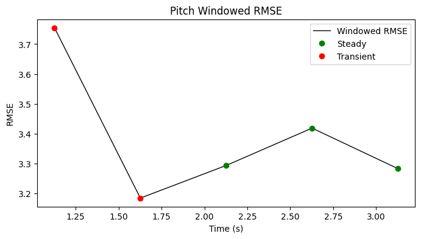

| Metric | Value |
|--------|-------|
| RMSE | 3.488 |
| MAE | 3.415 |
| Peak Error | 6.392 |
| Steady-State RMSE | 3.3315203995265157 |
| Transient RMSE | 3.469243183154829 |

#### Control Authority
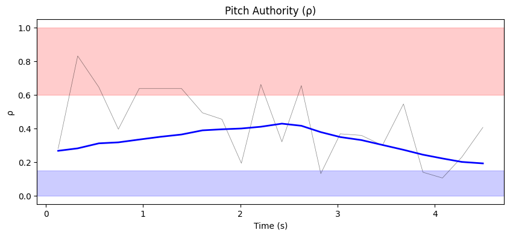
- ρ_mean = 0.428, ρ_p95 = 0.661
- u_ad RMS = 47.89 mixer units, u_nom RMS = 0.06 mixer units
- Phase relationship: adversarial (r = -0.38)

#### Weight Health
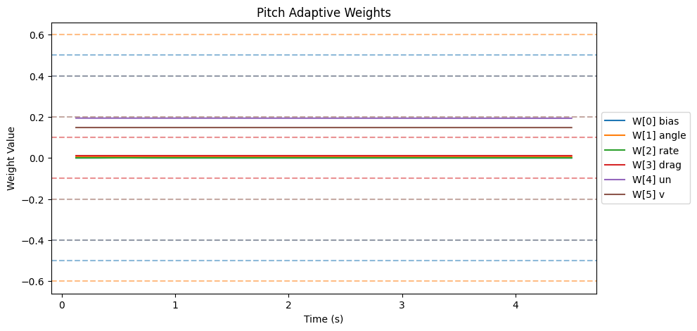
| Weight | θ_final | Drift (/s) | Proj. Hits | Oscillation (/s) |
|--------|---------|------------|------------|-------------------|
| W[0] bias | 0.000 | -0.0001 | 0.0% | 1.14 |
| W[1] angle | 0.005 | -0.0001 | 0.0% | 2.52 |
| W[2] rate | 0.000 | -0.0000 | 0.0% | 1.37 |
| W[3] drag | 0.011 | -0.0000 | 0.0% | 0.46 |
| W[4] un | 0.193 | -0.0001 | 0.0% | 0.46 |
| W[5] v | 0.148 | -0.0000 | 0.0% | 0.46 |

- ‖Θ‖ final = 0.243, trending: → STABLE/CONVERGING
- Hard-freeze fraction: 0.0%

### Roll

#### Tracking
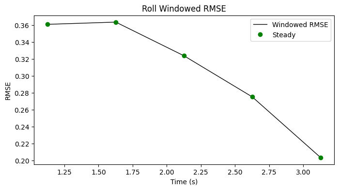

| Metric | Value |
|--------|-------|
| RMSE | 0.301 |
| MAE | 0.232 |
| Peak Error | 0.663 |
| Steady-State RMSE | 0.3053700834584579 |
| Transient RMSE | - |

#### Control Authority
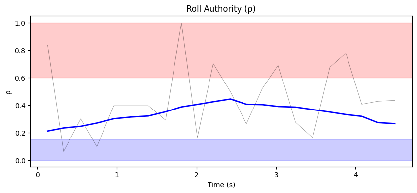
- ρ_mean = 0.443, ρ_p95 = 0.834
- u_ad RMS = 39.95 mixer units, u_nom RMS = 0.06 mixer units
- Phase relationship: decoupled (r = 0.04)

#### Weight Health
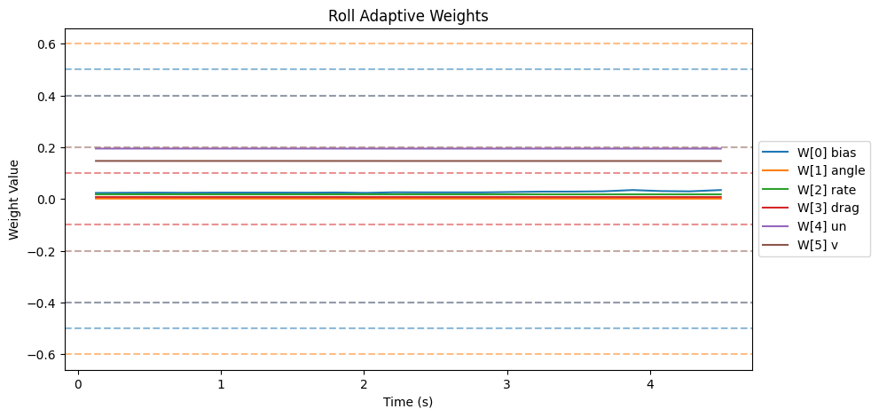
| Weight | θ_final | Drift (/s) | Proj. Hits | Oscillation (/s) |
|--------|---------|------------|------------|-------------------|
| W[0] bias | 0.034 | 0.0021 | 0.0% | 2.98 |
| W[1] angle | 0.001 | -0.0001 | 0.0% | 0.46 |
| W[2] rate | 0.018 | -0.0000 | 0.0% | 1.14 |
| W[3] drag | 0.007 | -0.0000 | 0.0% | 1.37 |
| W[4] un | 0.194 | -0.0001 | 0.0% | 0.46 |
| W[5] v | 0.147 | -0.0001 | 0.0% | 0.46 |

- ‖Θ‖ final = 0.247, trending: → STABLE/CONVERGING
- Hard-freeze fraction: 0.0%

### Yaw

#### Tracking
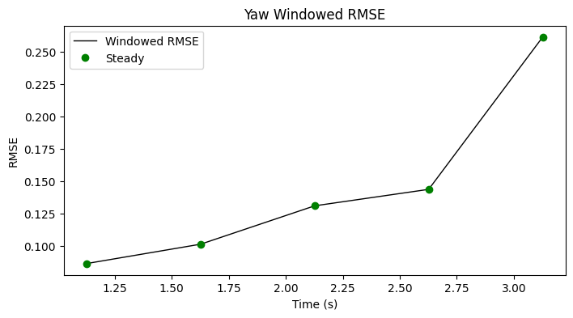

| Metric | Value |
|--------|-------|
| RMSE | 0.189 |
| MAE | 0.145 |
| Peak Error | 0.464 |
| Steady-State RMSE | 0.14490362504625437 |
| Transient RMSE | - |

#### Control Authority
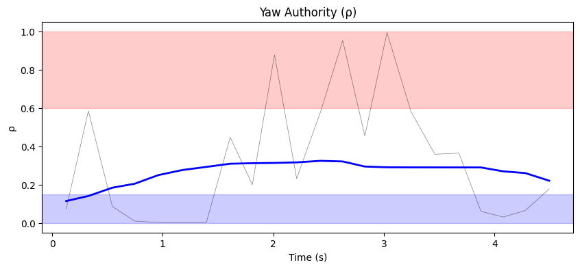
- ρ_mean = 0.324, ρ_p95 = 0.948
- u_ad RMS = 10.63 mixer units, u_nom RMS = 0.01 mixer units
- Phase relationship: reinforcing (r = 0.42)

#### Weight Health
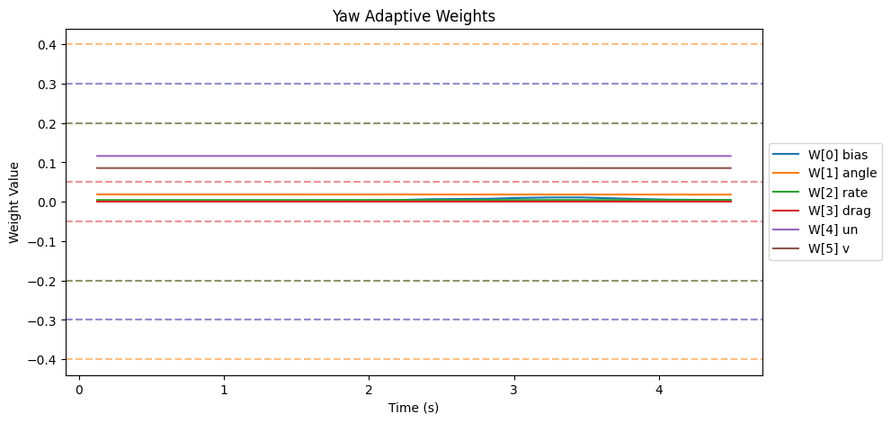
| Weight | θ_final | Drift (/s) | Proj. Hits | Oscillation (/s) |
|--------|---------|------------|------------|-------------------|
| W[0] bias | 0.004 | 0.0015 | 0.0% | 1.14 |
| W[1] angle | 0.018 | -0.0001 | 0.0% | 0.46 |
| W[2] rate | 0.005 | -0.0000 | 0.0% | 1.83 |
| W[3] drag | 0.000 | 0.0000 | 0.0% | 0.00 |
| W[4] un | 0.116 | -0.0000 | 0.0% | 0.46 |
| W[5] v | 0.086 | -0.0000 | 0.0% | 0.46 |

- ‖Θ‖ final = 0.146, trending: → STABLE/CONVERGING
- Hard-freeze fraction: 0.0%

### Z

#### Tracking
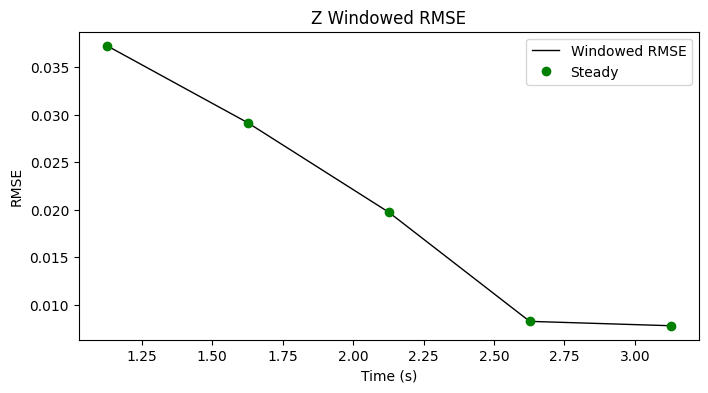

| Metric | Value |
|--------|-------|
| RMSE | 0.029 |
| MAE | 0.021 |
| Peak Error | 0.070 |
| Steady-State RMSE | 0.020440268963850372 |
| Transient RMSE | - |

#### Control Authority
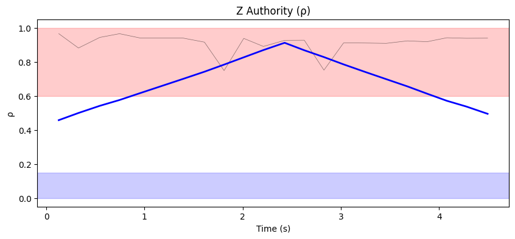
- ρ_mean = 0.912, ρ_p95 = 0.964
- u_ad RMS = 191.82 mixer units, u_nom RMS = 0.11 mixer units
- Phase relationship: reinforcing (r = 0.60)

#### Weight Health
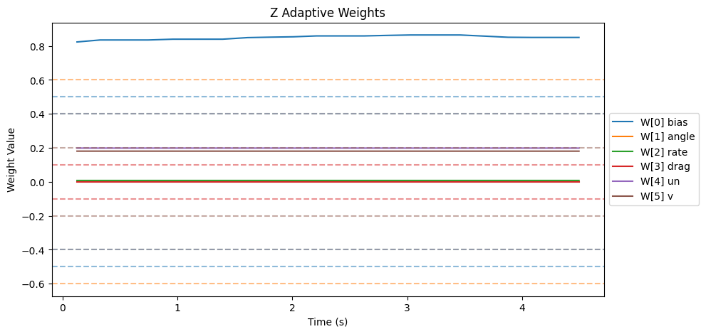
| Weight | θ_final | Drift (/s) | Proj. Hits | Oscillation (/s) |
|--------|---------|------------|------------|-------------------|
| W[0] bias | 0.850 | 0.0061 | 100.0% | 2.06 |
| W[1] angle | 0.002 | -0.0001 | 0.0% | 2.06 |
| W[2] rate | 0.008 | 0.0000 | 0.0% | 2.06 |
| W[3] drag | 0.000 | 0.0000 | 0.0% | 0.00 |
| W[4] un | 0.198 | -0.0000 | 0.0% | 2.75 |
| W[5] v | 0.180 | -0.0000 | 0.0% | 2.06 |

- ‖Θ‖ final = 0.891, trending: → STABLE/CONVERGING
- Hard-freeze fraction: 0.0%

## Firmware Parameters (Snapshot)
```json
{
  "payload": "PAYLOAD_LIGHT",
  "mrac_dt": 0.005,
  "num_basis": 6,
  "mixer": {
    "pitch": 1170.0,
    "roll": 1170.0,
    "yaw": 1872.0,
    "z": 222.0
  },
  "gamma": {
    "pitch": [
      0.5,
      3.3,
      1.0,
      2.0,
      0.1,
      1.0
    ],
    "roll": [
      0.5,
      3.3,
      1.0,
      2.0,
      0.1,
      1.0
    ],
    "yaw": [
      0.3,
      2.0,
      0.7,
      1.5,
      0.1,
      1.0
    ]
  },
  "wlim": {
    "pitch": [
      0.5,
      0.6,
      0.4,
      0.1,
      0.4,
      0.2
    ],
    "roll": [
      0.5,
      0.6,
      0.4,
      0.1,
      0.4,
      0.2
    ],
    "yaw": [
      0.3,
      0.4,
      0.2,
      0.05,
      0.3,
      0.2
    ]
  },
  "sigma": {
    "pitch": "from_config",
    "roll": "from_config",
    "yaw": "from_config"
  },
  "features": {
    "projection": true,
    "sigma_mod": true,
    "deadzone": true,
    "l1_filter": true,
    "pch": true,
    "perf_recovery": true
  },
  "_comment": "Manual overrides for firmware params. Edit before a test session. deep_analysis.py merges this into the experiment record.",
  "_instructions": "Update the fields below when you change firmware params that aren't in telemetry yet.",
  "sigma_pitch": null,
  "sigma_roll": null,
  "sigma_yaw": null,
  "omega_u_pitch": null,
  "omega_u_roll": null,
  "omega_u_yaw": null,
  "e_deadzone": null,
  "e_freeze": 8.0,
  "notes": ""
}
```
