# Flight Analysis Report: exp_flight_twc_1781527181

**Date:** 2026-06-15T13:29:23.348956Z | **Duration:** 3.5s | **Samples:** 1620 | **Config:** PAYLOAD_LIGHT

---

## What Happened

- Planar XY tracking RMSE was **35.4 cm** (peak 46.6 cm).
- Worst-tracked position axis was **Y** (RMSE 33.63 cm).
- Feedback trailed the reference by ~**1406 ms** (along-track/phase lag).
- **Y** tracking error is dominated by **DC offset/drift** (bias 25 / amp 0 / lag 6 / resid 2 cm RMS; gain 1.02).
- **Never settled** within 5 cm of target (final error 22.2 cm).
- ⚠ **3 CRITICAL** MRAC alert(s) — run is INELIGIBLE as a champion until resolved.
- MRAC was most active on **z** (ρ_mean 0.94).

## Path Tracking

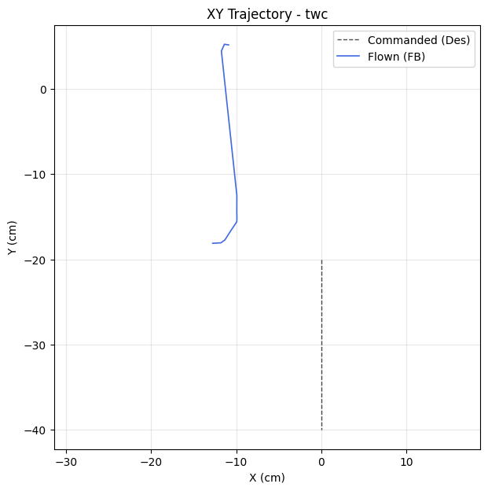

| Metric | Value |
|--------|-------|
| Planar XY RMSE (cm) | 35.42 |
| Planar peak (cm) | 46.64 |
| Cross-track mean / p95 / max (cm) | - / - / - |
| Along-track lag (ms) | 1406 |
| Rank score (planar_rmse_cm) | 35.42 |
| TWC settling time (s) | - |
| TWC final error (cm) | 22.16 |

| Axis | RMSE | MAE | Peak |
|------|------|-----|------|
| X | 11.11 | 11.08 | 12.76 |
| Y | 33.63 | 32.10 | 45.23 |
| Z | 0.01 | 0.01 | 0.01 |

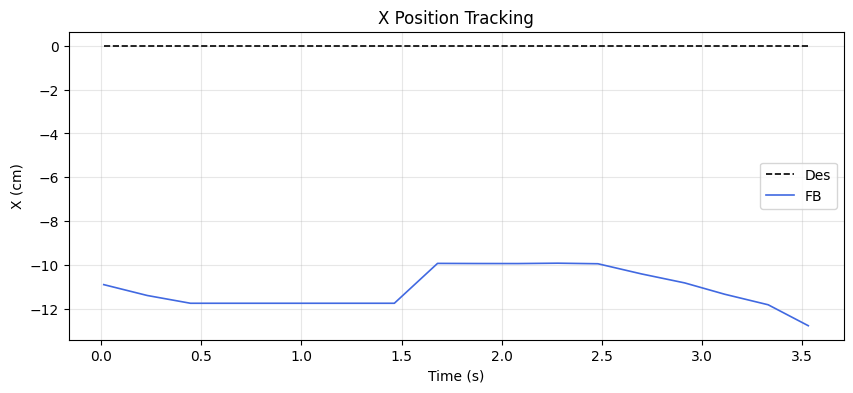
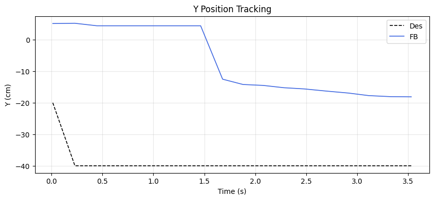
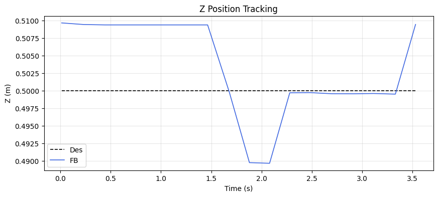

### Tracking error decomposition

_Splits each axis RMSE into the cause that injects it: a steady DC offset, amplitude attenuation (gain≠1), phase lag, or residual distortion. Read the largest column as the thing to fix first._

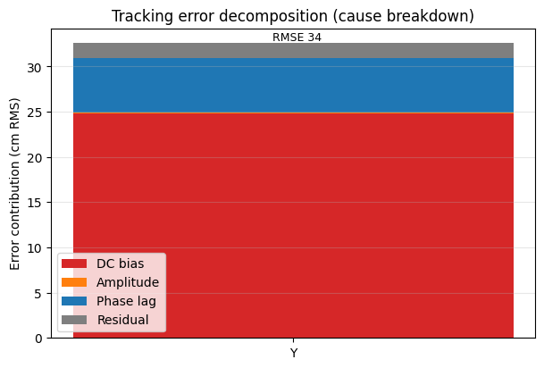

| Axis | Total RMSE | DC bias | Amplitude | Phase lag | Residual | Gain | Lag (ms) |
|------|-----------|---------|-----------|-----------|----------|------|----------|
| Y | 33.63 | 24.79 | 0.08 | 6.03 | 1.68 | 1.02 | 1406 |

### Yaw heading-hold drift

| Cmd (°) | Final offset (°) | Mean offset (°) | Drift (°/s) | Total drift (°) | P2P (°) |
|---------|------------------|-----------------|-------------|-----------------|---------|
| 0.00 | 0.01 | 0.00 | 0.01 | 0.02 | 0.48 |

## MRAC Scoreboard (attitude / rate loops)

| Axis  | RMSE | RMSE_ss | RMSE_tr | ρ_mean | ρ_p95 | Phase | ‖Θ‖ | ⚠ | 🔴 |
|-------|------|---------|---------|--------|-------|-------|------|---|---|
| Pitch | 3.370 | 3.128 | 3.408 | 0.625 | 0.980 | adversarial | 0.243 | 2 | 2 |
| Roll | 0.206 | 0.153 | - | 0.415 | 0.775 | decoupled | 0.246 | 0 | 0 |
| Yaw | 0.134 | 0.153 | - | 0.120 | 0.371 | reinforcing | 0.146 | 1 | 0 |
| Z | 0.008 | 0.007 | - | 0.936 | 0.950 | decoupled | 0.884 | 2 | 1 |

## Alerts

- [CRITICAL] **NEAR_SATURATION**: pitch: MRAC near saturation (ρ_p95=0.98). Reduce gamma or increase u_max.
- [CRITICAL] **PID_MRAC_FIGHT**: pitch: MRAC and PID are anti-correlated (r=-0.36). Check reference model sign convention.
- [CRITICAL] **NEAR_SATURATION**: z: MRAC near saturation (ρ_p95=0.95). Reduce gamma or increase u_max.
- [WARN] **HIGH_AUTHORITY**: pitch: MRAC-dominant (ρ=0.62). PID gains may be insufficient.
- [WARN] **POOR_TRACKING**: pitch: Tracking degraded (RMSE=3.37).
- [WARN] **LOW_AUTHORITY**: yaw: MRAC nearly inactive (ρ=0.12). Check if gamma is too low or deadzone too wide.
- [WARN] **HIGH_AUTHORITY**: z: MRAC-dominant (ρ=0.94). PID gains may be insufficient.
- [WARN] **PROJECTION_ACTIVE**: z: Weight[0] hitting projection bound 100% of time. Disturbance may exceed budget.

## Per-Axis Detail

### Pitch

#### Tracking
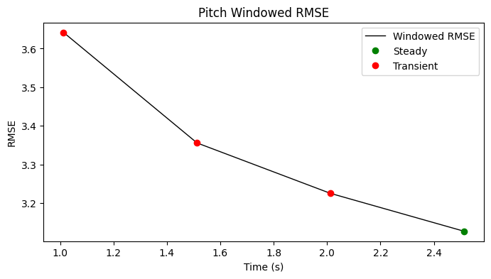

| Metric | Value |
|--------|-------|
| RMSE | 3.370 |
| MAE | 3.324 |
| Peak Error | 5.211 |
| Steady-State RMSE | 3.1276896034687587 |
| Transient RMSE | 3.4077374807095904 |

#### Control Authority
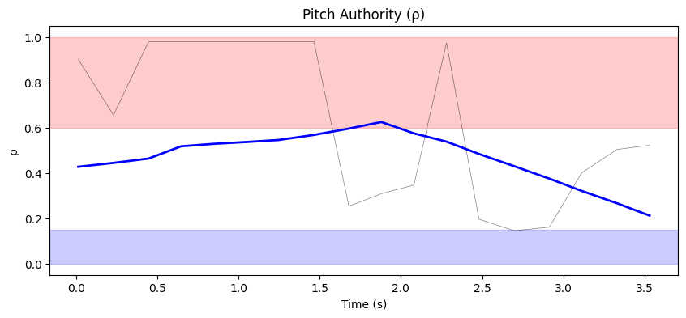
- ρ_mean = 0.625, ρ_p95 = 0.980
- u_ad RMS = 39.70 mixer units, u_nom RMS = 0.07 mixer units
- Phase relationship: adversarial (r = -0.36)

#### Weight Health
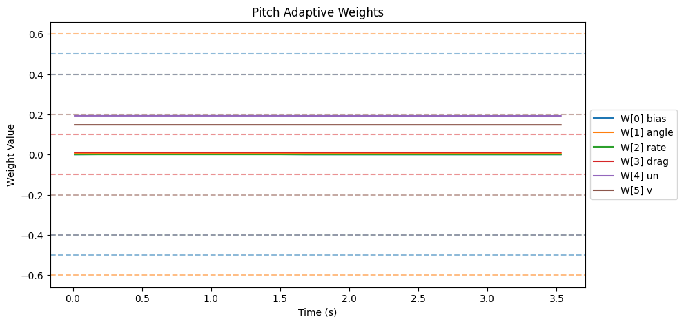
| Weight | θ_final | Drift (/s) | Proj. Hits | Oscillation (/s) |
|--------|---------|------------|------------|-------------------|
| W[0] bias | 0.000 | -0.0003 | 0.0% | 0.85 |
| W[1] angle | 0.004 | -0.0002 | 0.0% | 1.71 |
| W[2] rate | 0.000 | -0.0000 | 0.0% | 0.57 |
| W[3] drag | 0.011 | -0.0000 | 0.0% | 0.57 |
| W[4] un | 0.193 | -0.0001 | 0.0% | 0.57 |
| W[5] v | 0.148 | -0.0000 | 0.0% | 0.85 |

- ‖Θ‖ final = 0.243, trending: → STABLE/CONVERGING
- Hard-freeze fraction: 0.0%

### Roll

#### Tracking
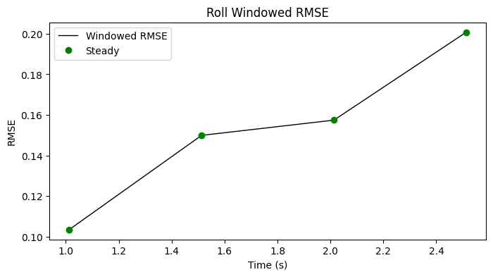

| Metric | Value |
|--------|-------|
| RMSE | 0.206 |
| MAE | 0.160 |
| Peak Error | 0.533 |
| Steady-State RMSE | 0.15287517042863852 |
| Transient RMSE | - |

#### Control Authority
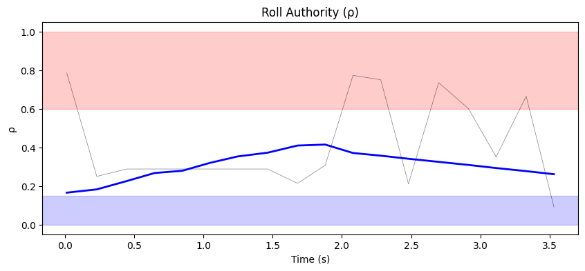
- ρ_mean = 0.415, ρ_p95 = 0.775
- u_ad RMS = 37.27 mixer units, u_nom RMS = 0.07 mixer units
- Phase relationship: decoupled (r = -0.13)

#### Weight Health
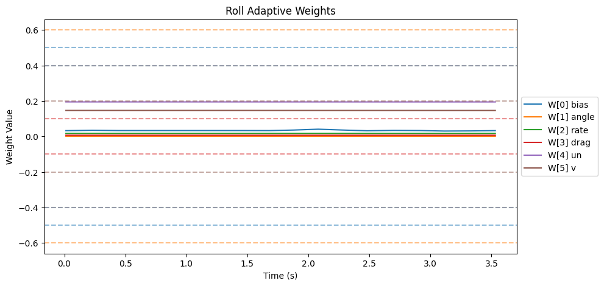
| Weight | θ_final | Drift (/s) | Proj. Hits | Oscillation (/s) |
|--------|---------|------------|------------|-------------------|
| W[0] bias | 0.033 | -0.0002 | 0.0% | 2.27 |
| W[1] angle | 0.001 | -0.0001 | 0.0% | 0.57 |
| W[2] rate | 0.018 | -0.0000 | 0.0% | 1.99 |
| W[3] drag | 0.007 | -0.0000 | 0.0% | 0.57 |
| W[4] un | 0.194 | -0.0001 | 0.0% | 0.57 |
| W[5] v | 0.146 | -0.0001 | 0.0% | 0.57 |

- ‖Θ‖ final = 0.246, trending: → STABLE/CONVERGING
- Hard-freeze fraction: 0.0%

### Yaw

#### Tracking
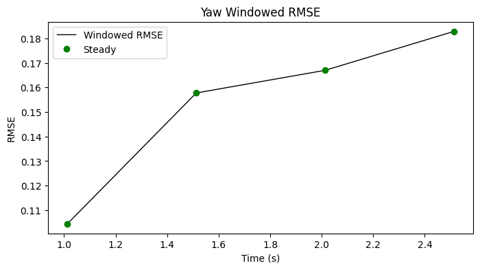

| Metric | Value |
|--------|-------|
| RMSE | 0.134 |
| MAE | 0.101 |
| Peak Error | 0.314 |
| Steady-State RMSE | 0.15301971448846224 |
| Transient RMSE | - |

#### Control Authority
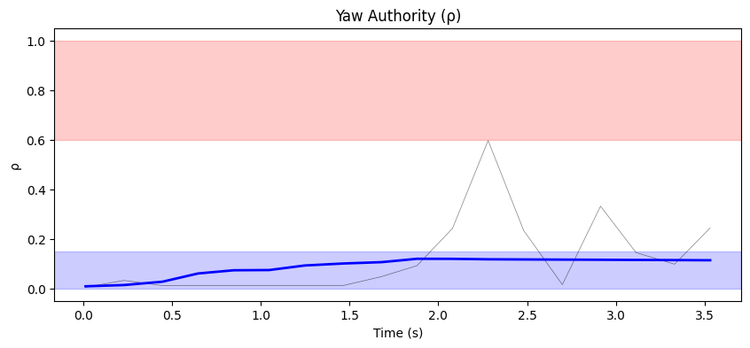
- ρ_mean = 0.120, ρ_p95 = 0.371
- u_ad RMS = 3.15 mixer units, u_nom RMS = 0.01 mixer units
- Phase relationship: reinforcing (r = 0.41)

#### Weight Health
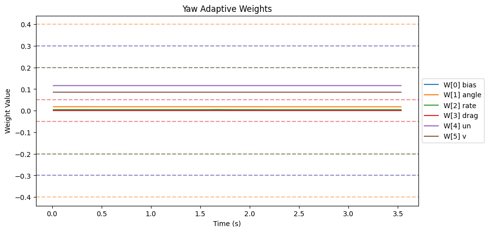
| Weight | θ_final | Drift (/s) | Proj. Hits | Oscillation (/s) |
|--------|---------|------------|------------|-------------------|
| W[0] bias | 0.003 | -0.0005 | 0.0% | 1.71 |
| W[1] angle | 0.018 | -0.0001 | 0.0% | 0.57 |
| W[2] rate | 0.005 | -0.0000 | 0.0% | 0.85 |
| W[3] drag | 0.000 | 0.0000 | 0.0% | 0.00 |
| W[4] un | 0.116 | -0.0000 | 0.0% | 0.57 |
| W[5] v | 0.086 | -0.0000 | 0.0% | 0.57 |

- ‖Θ‖ final = 0.146, trending: → STABLE/CONVERGING
- Hard-freeze fraction: 0.0%

### Z

#### Tracking
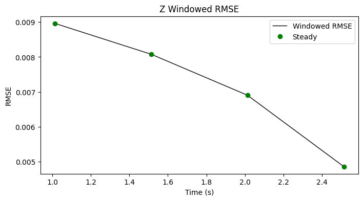

| Metric | Value |
|--------|-------|
| RMSE | 0.008 |
| MAE | 0.006 |
| Peak Error | 0.010 |
| Steady-State RMSE | 0.007201609314320635 |
| Transient RMSE | - |

#### Control Authority
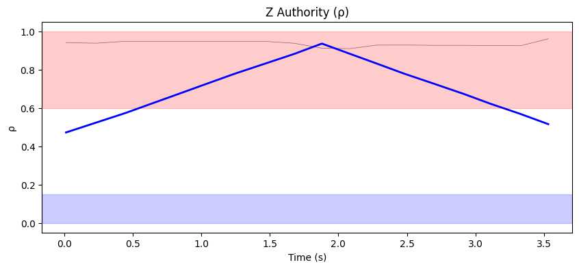
- ρ_mean = 0.936, ρ_p95 = 0.950
- u_ad RMS = 192.50 mixer units, u_nom RMS = 0.06 mixer units
- Phase relationship: decoupled (r = -0.09)

#### Weight Health
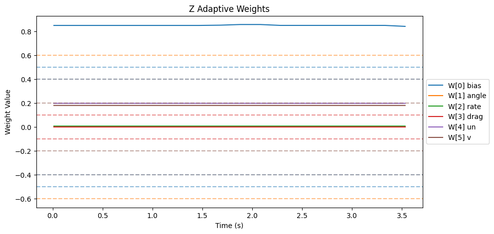
| Weight | θ_final | Drift (/s) | Proj. Hits | Oscillation (/s) |
|--------|---------|------------|------------|-------------------|
| W[0] bias | 0.842 | -0.0005 | 100.0% | 1.42 |
| W[1] angle | 0.002 | -0.0001 | 0.0% | 1.42 |
| W[2] rate | 0.008 | 0.0000 | 0.0% | 1.42 |
| W[3] drag | 0.000 | 0.0000 | 0.0% | 0.00 |
| W[4] un | 0.198 | -0.0000 | 0.0% | 1.42 |
| W[5] v | 0.180 | -0.0000 | 0.0% | 1.42 |

- ‖Θ‖ final = 0.884, trending: → STABLE/CONVERGING
- Hard-freeze fraction: 0.0%

## Firmware Parameters (Snapshot)
```json
{
  "payload": "PAYLOAD_LIGHT",
  "mrac_dt": 0.005,
  "num_basis": 6,
  "mixer": {
    "pitch": 1170.0,
    "roll": 1170.0,
    "yaw": 1872.0,
    "z": 222.0
  },
  "gamma": {
    "pitch": [
      0.5,
      3.3,
      1.0,
      2.0,
      0.1,
      1.0
    ],
    "roll": [
      0.5,
      3.3,
      1.0,
      2.0,
      0.1,
      1.0
    ],
    "yaw": [
      0.3,
      2.0,
      0.7,
      1.5,
      0.1,
      1.0
    ]
  },
  "wlim": {
    "pitch": [
      0.5,
      0.6,
      0.4,
      0.1,
      0.4,
      0.2
    ],
    "roll": [
      0.5,
      0.6,
      0.4,
      0.1,
      0.4,
      0.2
    ],
    "yaw": [
      0.3,
      0.4,
      0.2,
      0.05,
      0.3,
      0.2
    ]
  },
  "sigma": {
    "pitch": "from_config",
    "roll": "from_config",
    "yaw": "from_config"
  },
  "features": {
    "projection": true,
    "sigma_mod": true,
    "deadzone": true,
    "l1_filter": true,
    "pch": true,
    "perf_recovery": true
  },
  "_comment": "Manual overrides for firmware params. Edit before a test session. deep_analysis.py merges this into the experiment record.",
  "_instructions": "Update the fields below when you change firmware params that aren't in telemetry yet.",
  "sigma_pitch": null,
  "sigma_roll": null,
  "sigma_yaw": null,
  "omega_u_pitch": null,
  "omega_u_roll": null,
  "omega_u_yaw": null,
  "e_deadzone": null,
  "e_freeze": 8.0,
  "notes": ""
}
```
