# Flight Analysis Report: exp_flight_twc_1781527185

**Date:** 2026-06-15T13:29:31.906898Z | **Duration:** 8.2s | **Samples:** 3600 | **Config:** PAYLOAD_LIGHT

---

## What Happened

- Planar XY tracking RMSE was **32.3 cm** (peak 35.5 cm).
- Worst-tracked position axis was **Y** (RMSE 26.49 cm).
- Feedback trailed the reference by ~**646 ms** (along-track/phase lag).
- **Y** tracking error is dominated by **DC offset/drift** (bias 7 / amp 1 / lag 2 / resid 2 cm RMS; gain 0.62).
- **Never settled** within 5 cm of target (final error 32.5 cm).
- ⚠ **2 CRITICAL** MRAC alert(s) — run is INELIGIBLE as a champion until resolved.
- MRAC was most active on **z** (ρ_mean 0.90).

## Path Tracking

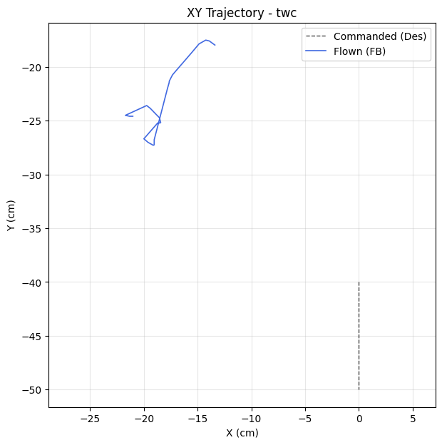

| Metric | Value |
|--------|-------|
| Planar XY RMSE (cm) | 32.34 |
| Planar peak (cm) | 35.47 |
| Cross-track mean / p95 / max (cm) | - / - / - |
| Along-track lag (ms) | 646 |
| Rank score (planar_rmse_cm) | 32.34 |
| TWC settling time (s) | - |
| TWC final error (cm) | 32.46 |

| Axis | RMSE | MAE | Peak |
|------|------|-----|------|
| X | 18.55 | 18.45 | 21.72 |
| Y | 26.49 | 26.34 | 32.49 |
| Z | 0.01 | 0.01 | 0.02 |

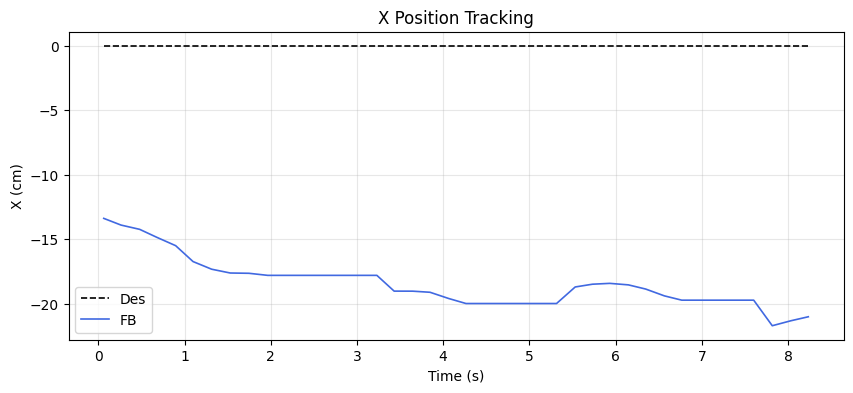
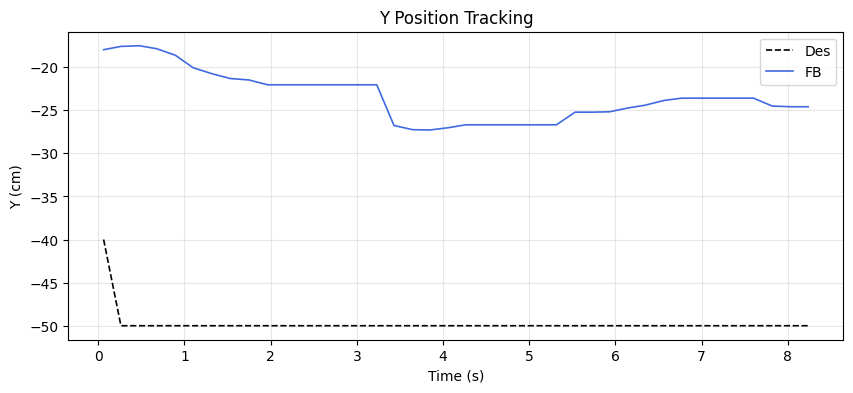
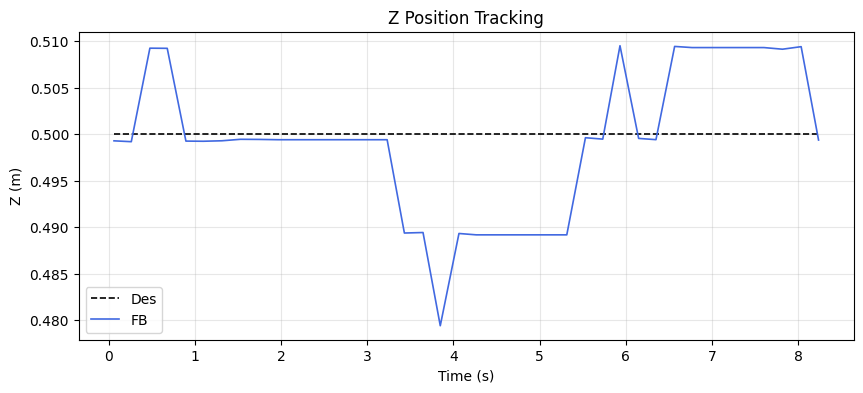

### Tracking error decomposition

_Splits each axis RMSE into the cause that injects it: a steady DC offset, amplitude attenuation (gain≠1), phase lag, or residual distortion. Read the largest column as the thing to fix first._

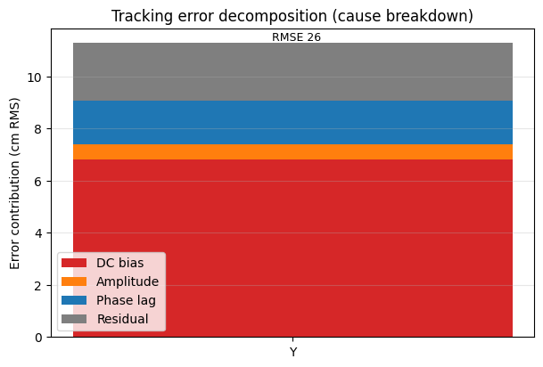

| Axis | Total RMSE | DC bias | Amplitude | Phase lag | Residual | Gain | Lag (ms) |
|------|-----------|---------|-----------|-----------|----------|------|----------|
| Y | 26.49 | 6.81 | 0.60 | 1.64 | 2.23 | 0.62 | 646 |

### Yaw heading-hold drift

| Cmd (°) | Final offset (°) | Mean offset (°) | Drift (°/s) | Total drift (°) | P2P (°) |
|---------|------------------|-----------------|-------------|-----------------|---------|
| 0.00 | 0.12 | 0.27 | -0.03 | -0.23 | 0.76 |

## MRAC Scoreboard (attitude / rate loops)

| Axis  | RMSE | RMSE_ss | RMSE_tr | ρ_mean | ρ_p95 | Phase | ‖Θ‖ | ⚠ | 🔴 |
|-------|------|---------|---------|--------|-------|-------|------|---|---|
| Pitch | 3.316 | 3.341 | - | 0.462 | 0.915 | decoupled | 0.242 | 1 | 1 |
| Roll | 0.737 | 0.694 | 0.807 | 0.217 | 0.487 | decoupled | 0.244 | 0 | 0 |
| Yaw | 0.354 | 0.352 | - | 0.344 | 0.676 | reinforcing | 0.145 | 1 | 0 |
| Z | 0.008 | 0.007 | - | 0.902 | 0.955 | reinforcing | 0.881 | 3 | 1 |

## Alerts

- [CRITICAL] **NEAR_SATURATION**: pitch: MRAC near saturation (ρ_p95=0.92). Reduce gamma or increase u_max.
- [CRITICAL] **NEAR_SATURATION**: z: MRAC near saturation (ρ_p95=0.96). Reduce gamma or increase u_max.
- [WARN] **POOR_TRACKING**: pitch: Tracking degraded (RMSE=3.32).
- [WARN] **REDUNDANT_EFFORT**: yaw: MRAC reinforcing PID (r=0.56) with significant authority. PID may need retuning.
- [WARN] **HIGH_AUTHORITY**: z: MRAC-dominant (ρ=0.90). PID gains may be insufficient.
- [WARN] **PROJECTION_ACTIVE**: z: Weight[0] hitting projection bound 100% of time. Disturbance may exceed budget.
- [WARN] **REDUNDANT_EFFORT**: z: MRAC reinforcing PID (r=0.51) with significant authority. PID may need retuning.

## Per-Axis Detail

### Pitch

#### Tracking
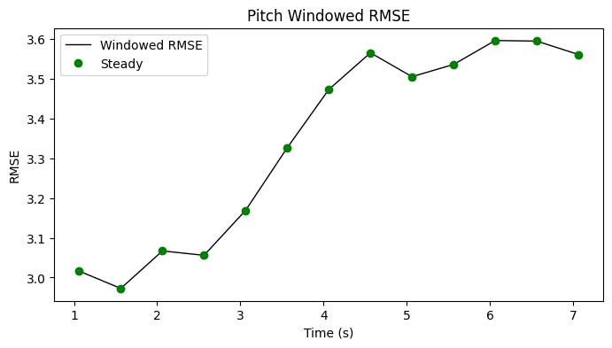

| Metric | Value |
|--------|-------|
| RMSE | 3.316 |
| MAE | 3.297 |
| Peak Error | 3.881 |
| Steady-State RMSE | 3.3412550451658687 |
| Transient RMSE | - |

#### Control Authority
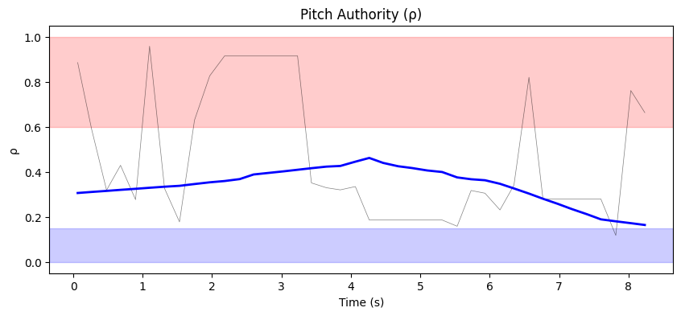
- ρ_mean = 0.462, ρ_p95 = 0.915
- u_ad RMS = 39.88 mixer units, u_nom RMS = 0.07 mixer units
- Phase relationship: decoupled (r = 0.06)

#### Weight Health
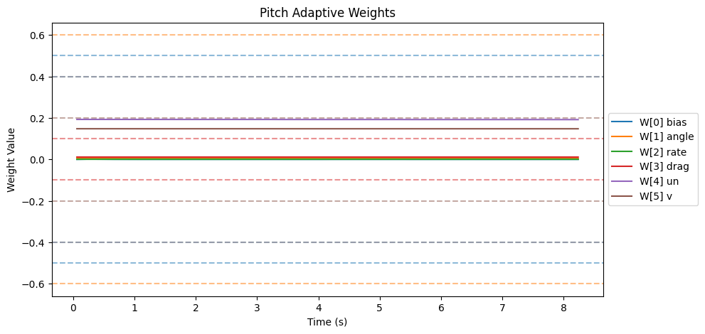
| Weight | θ_final | Drift (/s) | Proj. Hits | Oscillation (/s) |
|--------|---------|------------|------------|-------------------|
| W[0] bias | 0.000 | -0.0000 | 0.0% | 0.98 |
| W[1] angle | 0.004 | -0.0000 | 0.0% | 1.47 |
| W[2] rate | 0.000 | -0.0000 | 0.0% | 0.98 |
| W[3] drag | 0.011 | -0.0000 | 0.0% | 0.86 |
| W[4] un | 0.192 | -0.0001 | 0.0% | 0.73 |
| W[5] v | 0.148 | -0.0000 | 0.0% | 1.59 |

- ‖Θ‖ final = 0.242, trending: → STABLE/CONVERGING
- Hard-freeze fraction: 0.0%

### Roll

#### Tracking
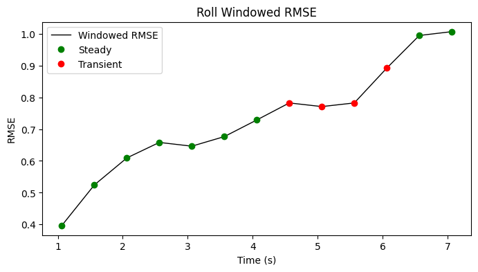

| Metric | Value |
|--------|-------|
| RMSE | 0.737 |
| MAE | 0.653 |
| Peak Error | 1.206 |
| Steady-State RMSE | 0.6936256898632264 |
| Transient RMSE | 0.8071034788925242 |

#### Control Authority
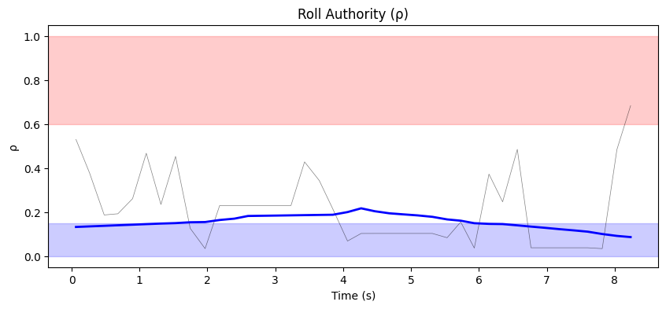
- ρ_mean = 0.217, ρ_p95 = 0.487
- u_ad RMS = 22.79 mixer units, u_nom RMS = 0.07 mixer units
- Phase relationship: decoupled (r = -0.20)

#### Weight Health
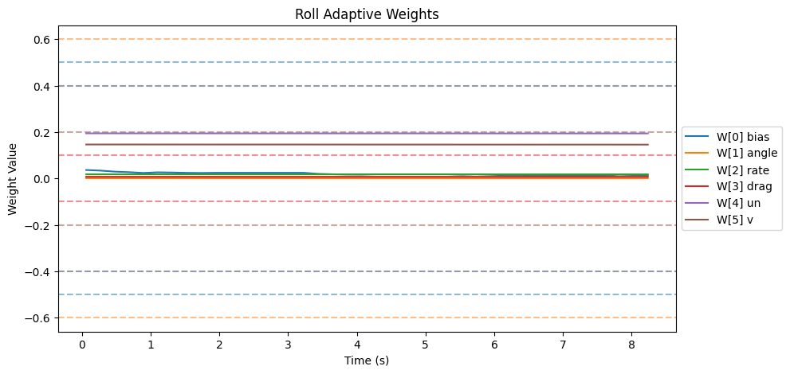
| Weight | θ_final | Drift (/s) | Proj. Hits | Oscillation (/s) |
|--------|---------|------------|------------|-------------------|
| W[0] bias | 0.013 | -0.0023 | 0.0% | 1.96 |
| W[1] angle | 0.001 | -0.0000 | 0.0% | 0.73 |
| W[2] rate | 0.018 | -0.0000 | 0.0% | 1.35 |
| W[3] drag | 0.007 | -0.0000 | 0.0% | 1.22 |
| W[4] un | 0.194 | -0.0000 | 0.0% | 0.73 |
| W[5] v | 0.146 | -0.0001 | 0.0% | 0.73 |

- ‖Θ‖ final = 0.244, trending: → STABLE/CONVERGING
- Hard-freeze fraction: 0.0%

### Yaw

#### Tracking
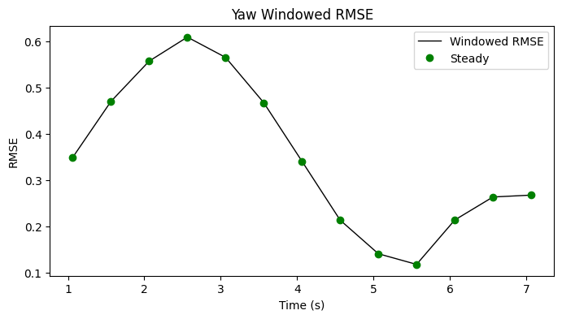

| Metric | Value |
|--------|-------|
| RMSE | 0.354 |
| MAE | 0.286 |
| Peak Error | 0.625 |
| Steady-State RMSE | 0.3521070049899516 |
| Transient RMSE | - |

#### Control Authority
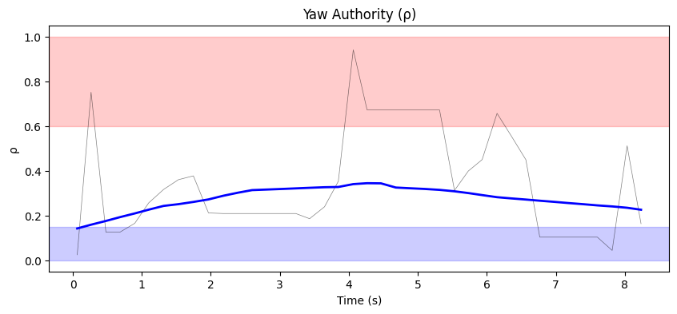
- ρ_mean = 0.344, ρ_p95 = 0.676
- u_ad RMS = 15.85 mixer units, u_nom RMS = 0.03 mixer units
- Phase relationship: reinforcing (r = 0.56)

#### Weight Health
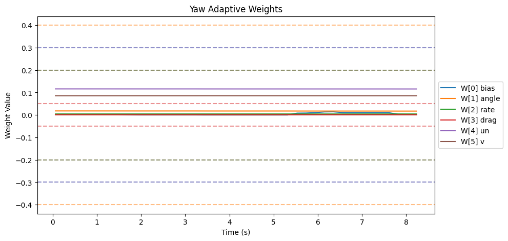
| Weight | θ_final | Drift (/s) | Proj. Hits | Oscillation (/s) |
|--------|---------|------------|------------|-------------------|
| W[0] bias | 0.002 | 0.0011 | 0.0% | 0.98 |
| W[1] angle | 0.017 | -0.0001 | 0.0% | 0.73 |
| W[2] rate | 0.004 | -0.0000 | 0.0% | 0.98 |
| W[3] drag | 0.000 | 0.0000 | 0.0% | 0.00 |
| W[4] un | 0.116 | -0.0000 | 0.0% | 0.73 |
| W[5] v | 0.086 | 0.0000 | 0.0% | 0.98 |

- ‖Θ‖ final = 0.145, trending: → STABLE/CONVERGING
- Hard-freeze fraction: 0.0%

### Z

#### Tracking
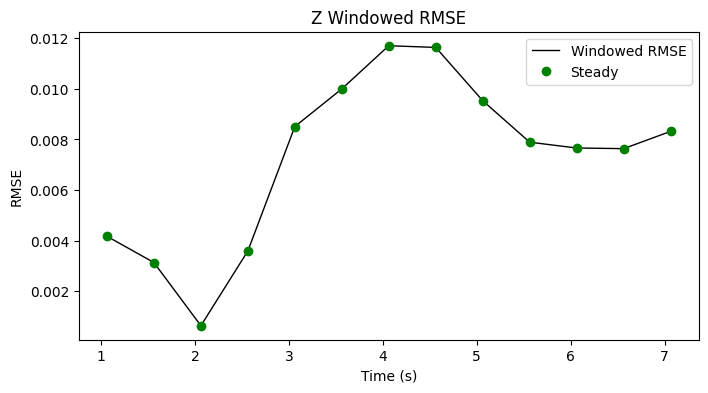

| Metric | Value |
|--------|-------|
| RMSE | 0.008 |
| MAE | 0.006 |
| Peak Error | 0.021 |
| Steady-State RMSE | 0.007264607813526438 |
| Transient RMSE | - |

#### Control Authority
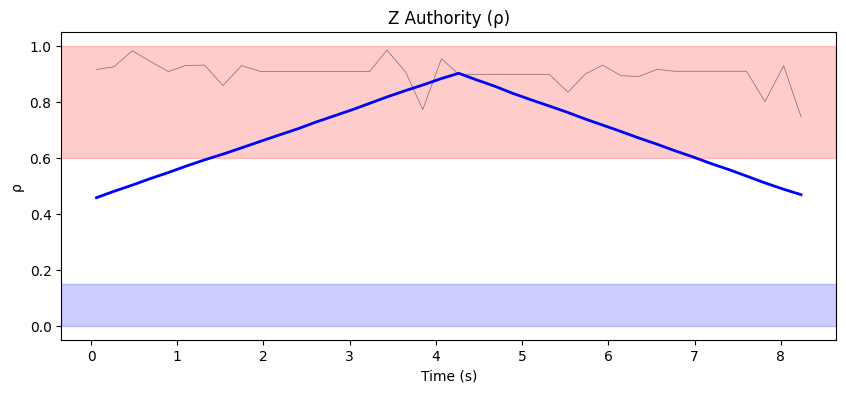
- ρ_mean = 0.902, ρ_p95 = 0.955
- u_ad RMS = 190.35 mixer units, u_nom RMS = 0.11 mixer units
- Phase relationship: reinforcing (r = 0.51)

#### Weight Health
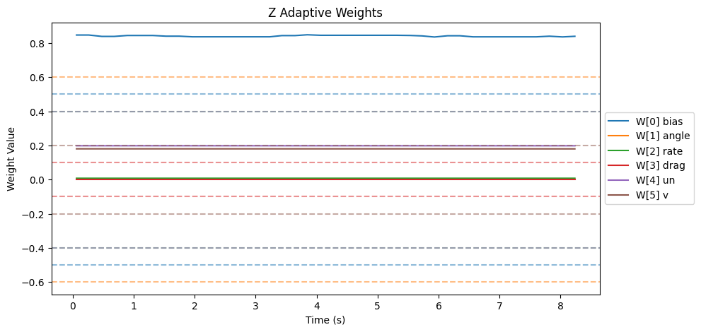
| Weight | θ_final | Drift (/s) | Proj. Hits | Oscillation (/s) |
|--------|---------|------------|------------|-------------------|
| W[0] bias | 0.840 | -0.0005 | 100.0% | 2.57 |
| W[1] angle | 0.002 | -0.0001 | 0.0% | 2.08 |
| W[2] rate | 0.008 | 0.0000 | 0.0% | 2.57 |
| W[3] drag | 0.000 | 0.0000 | 0.0% | 0.00 |
| W[4] un | 0.198 | -0.0000 | 0.0% | 2.32 |
| W[5] v | 0.180 | -0.0000 | 0.0% | 2.20 |

- ‖Θ‖ final = 0.881, trending: → STABLE/CONVERGING
- Hard-freeze fraction: 0.0%

## Firmware Parameters (Snapshot)
```json
{
  "payload": "PAYLOAD_LIGHT",
  "mrac_dt": 0.005,
  "num_basis": 6,
  "mixer": {
    "pitch": 1170.0,
    "roll": 1170.0,
    "yaw": 1872.0,
    "z": 222.0
  },
  "gamma": {
    "pitch": [
      0.5,
      3.3,
      1.0,
      2.0,
      0.1,
      1.0
    ],
    "roll": [
      0.5,
      3.3,
      1.0,
      2.0,
      0.1,
      1.0
    ],
    "yaw": [
      0.3,
      2.0,
      0.7,
      1.5,
      0.1,
      1.0
    ]
  },
  "wlim": {
    "pitch": [
      0.5,
      0.6,
      0.4,
      0.1,
      0.4,
      0.2
    ],
    "roll": [
      0.5,
      0.6,
      0.4,
      0.1,
      0.4,
      0.2
    ],
    "yaw": [
      0.3,
      0.4,
      0.2,
      0.05,
      0.3,
      0.2
    ]
  },
  "sigma": {
    "pitch": "from_config",
    "roll": "from_config",
    "yaw": "from_config"
  },
  "features": {
    "projection": true,
    "sigma_mod": true,
    "deadzone": true,
    "l1_filter": true,
    "pch": true,
    "perf_recovery": true
  },
  "_comment": "Manual overrides for firmware params. Edit before a test session. deep_analysis.py merges this into the experiment record.",
  "_instructions": "Update the fields below when you change firmware params that aren't in telemetry yet.",
  "sigma_pitch": null,
  "sigma_roll": null,
  "sigma_yaw": null,
  "omega_u_pitch": null,
  "omega_u_roll": null,
  "omega_u_yaw": null,
  "e_deadzone": null,
  "e_freeze": 8.0,
  "notes": ""
}
```
