# Flight Analysis Report: exp_flight_twc_1781527193

**Date:** 2026-06-15T13:29:40.256391Z | **Duration:** 4.2s | **Samples:** 1890 | **Config:** PAYLOAD_LIGHT

---

## What Happened

- Planar XY tracking RMSE was **45.2 cm** (peak 56.6 cm).
- Worst-tracked position axis was **X** (RMSE 37.52 cm).
- Feedback trailed the reference by ~**1944 ms** (along-track/phase lag).
- **X** tracking error is dominated by **DC offset/drift** (bias 20 / amp 0 / lag 9 / resid 14 cm RMS; gain 1.02).
- **Never settled** within 5 cm of target (final error 30.9 cm).
- 5 warning-level MRAC alert(s); no critical issues.
- MRAC was most active on **z** (ρ_mean 0.88).

## Path Tracking

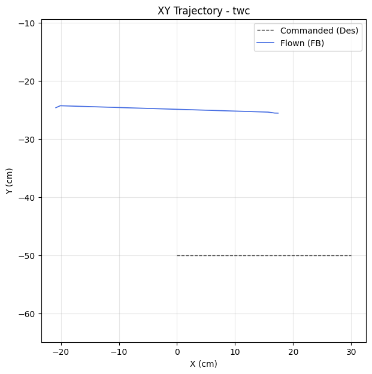

| Metric | Value |
|--------|-------|
| Planar XY RMSE (cm) | 45.19 |
| Planar peak (cm) | 56.58 |
| Cross-track mean / p95 / max (cm) | - / - / - |
| Along-track lag (ms) | 1944 |
| Rank score (planar_rmse_cm) | 45.19 |
| TWC settling time (s) | - |
| TWC final error (cm) | 30.90 |

| Axis | RMSE | MAE | Peak |
|------|------|-----|------|
| X | 37.52 | 32.76 | 50.47 |
| Y | 25.19 | 25.19 | 25.75 |
| Z | 0.01 | 0.01 | 0.02 |

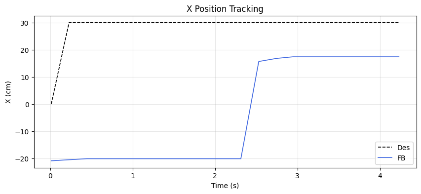
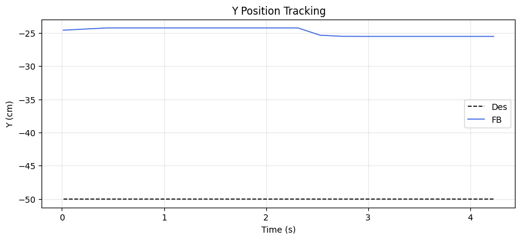
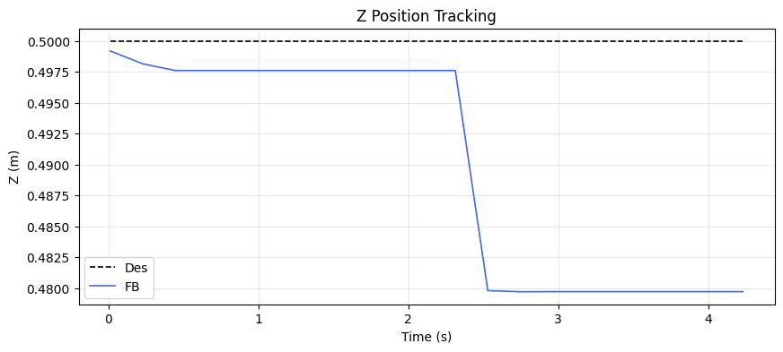

### Tracking error decomposition

_Splits each axis RMSE into the cause that injects it: a steady DC offset, amplitude attenuation (gain≠1), phase lag, or residual distortion. Read the largest column as the thing to fix first._

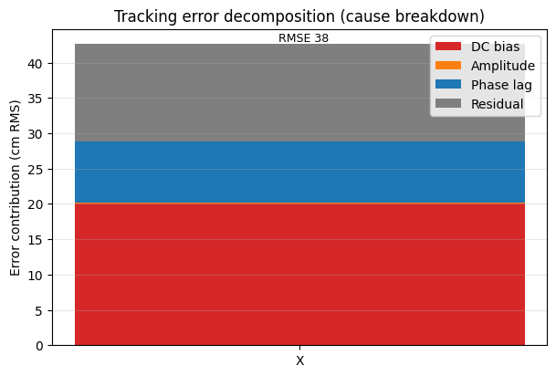

| Axis | Total RMSE | DC bias | Amplitude | Phase lag | Residual | Gain | Lag (ms) |
|------|-----------|---------|-----------|-----------|----------|------|----------|
| X | 37.52 | 20.09 | 0.10 | 8.66 | 13.76 | 1.02 | 1944 |

### Yaw heading-hold drift

| Cmd (°) | Final offset (°) | Mean offset (°) | Drift (°/s) | Total drift (°) | P2P (°) |
|---------|------------------|-----------------|-------------|-----------------|---------|
| 0.00 | 0.07 | 0.40 | -0.16 | -0.68 | 0.58 |

## MRAC Scoreboard (attitude / rate loops)

| Axis  | RMSE | RMSE_ss | RMSE_tr | ρ_mean | ρ_p95 | Phase | ‖Θ‖ | ⚠ | 🔴 |
|-------|------|---------|---------|--------|-------|-------|------|---|---|
| Pitch | 3.193 | 3.164 | - | 0.240 | 0.483 | decoupled | 0.242 | 1 | 0 |
| Roll | 0.672 | 0.553 | 0.513 | 0.131 | 0.244 | reinforcing | 0.244 | 1 | 0 |
| Yaw | 0.479 | 0.524 | - | 0.246 | 0.342 | reinforcing | 0.145 | 0 | 0 |
| Z | 0.013 | 0.010 | - | 0.879 | 0.896 | reinforcing | 0.907 | 3 | 0 |

## Alerts

- [WARN] **POOR_TRACKING**: pitch: Tracking degraded (RMSE=3.19).
- [WARN] **LOW_AUTHORITY**: roll: MRAC nearly inactive (ρ=0.13). Check if gamma is too low or deadzone too wide.
- [WARN] **HIGH_AUTHORITY**: z: MRAC-dominant (ρ=0.88). PID gains may be insufficient.
- [WARN] **PROJECTION_ACTIVE**: z: Weight[0] hitting projection bound 100% of time. Disturbance may exceed budget.
- [WARN] **REDUNDANT_EFFORT**: z: MRAC reinforcing PID (r=0.86) with significant authority. PID may need retuning.

## Per-Axis Detail

### Pitch

#### Tracking
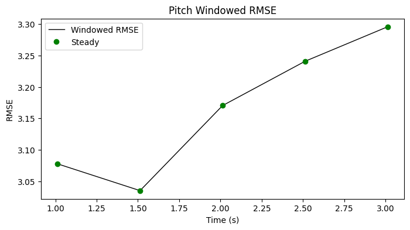

| Metric | Value |
|--------|-------|
| RMSE | 3.193 |
| MAE | 3.187 |
| Peak Error | 3.700 |
| Steady-State RMSE | 3.1639384810832434 |
| Transient RMSE | - |

#### Control Authority
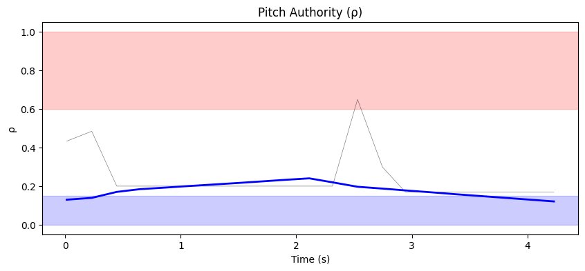
- ρ_mean = 0.240, ρ_p95 = 0.483
- u_ad RMS = 28.57 mixer units, u_nom RMS = 0.09 mixer units
- Phase relationship: decoupled (r = -0.06)

#### Weight Health
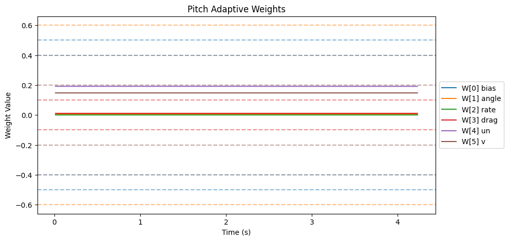
| Weight | θ_final | Drift (/s) | Proj. Hits | Oscillation (/s) |
|--------|---------|------------|------------|-------------------|
| W[0] bias | 0.000 | -0.0000 | 0.0% | 0.71 |
| W[1] angle | 0.004 | 0.0000 | 0.0% | 0.95 |
| W[2] rate | 0.000 | -0.0000 | 0.0% | 0.71 |
| W[3] drag | 0.011 | -0.0000 | 0.0% | 0.95 |
| W[4] un | 0.191 | -0.0001 | 0.0% | 0.71 |
| W[5] v | 0.148 | -0.0000 | 0.0% | 1.19 |

- ‖Θ‖ final = 0.242, trending: → STABLE/CONVERGING
- Hard-freeze fraction: 0.0%

### Roll

#### Tracking
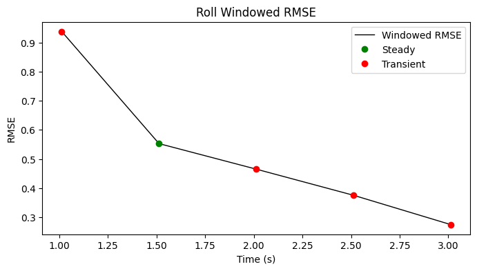

| Metric | Value |
|--------|-------|
| RMSE | 0.672 |
| MAE | 0.433 |
| Peak Error | 2.514 |
| Steady-State RMSE | 0.5526814 |
| Transient RMSE | 0.5130600544159696 |

#### Control Authority
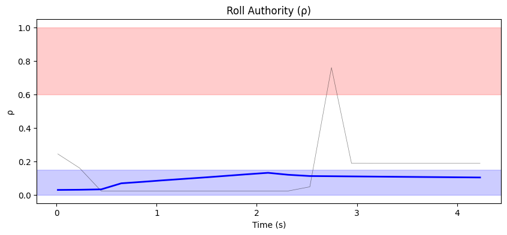
- ρ_mean = 0.131, ρ_p95 = 0.244
- u_ad RMS = 23.11 mixer units, u_nom RMS = 0.09 mixer units
- Phase relationship: reinforcing (r = 0.75)

#### Weight Health
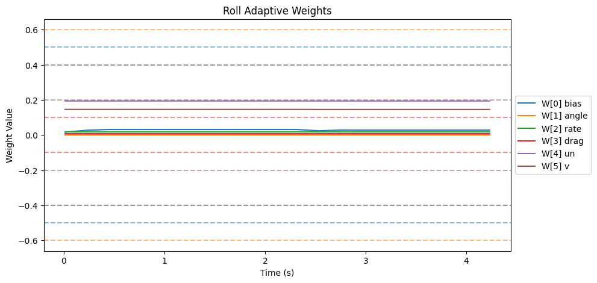
| Weight | θ_final | Drift (/s) | Proj. Hits | Oscillation (/s) |
|--------|---------|------------|------------|-------------------|
| W[0] bias | 0.028 | -0.0001 | 0.0% | 1.19 |
| W[1] angle | 0.000 | -0.0000 | 0.0% | 0.71 |
| W[2] rate | 0.018 | -0.0000 | 0.0% | 0.71 |
| W[3] drag | 0.007 | -0.0000 | 0.0% | 1.19 |
| W[4] un | 0.194 | -0.0000 | 0.0% | 0.71 |
| W[5] v | 0.145 | -0.0001 | 0.0% | 0.71 |

- ‖Θ‖ final = 0.244, trending: → STABLE/CONVERGING
- Hard-freeze fraction: 0.0%

### Yaw

#### Tracking
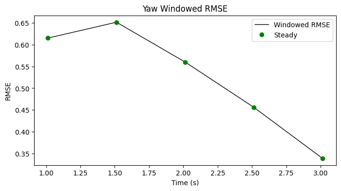

| Metric | Value |
|--------|-------|
| RMSE | 0.479 |
| MAE | 0.402 |
| Peak Error | 0.651 |
| Steady-State RMSE | 0.5242827602061815 |
| Transient RMSE | - |

#### Control Authority
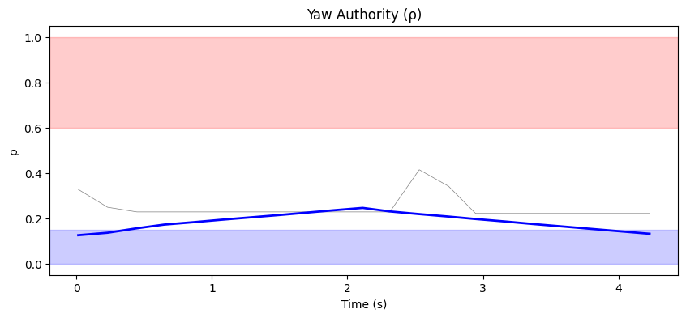
- ρ_mean = 0.246, ρ_p95 = 0.342
- u_ad RMS = 18.81 mixer units, u_nom RMS = 0.03 mixer units
- Phase relationship: reinforcing (r = 0.81)

#### Weight Health
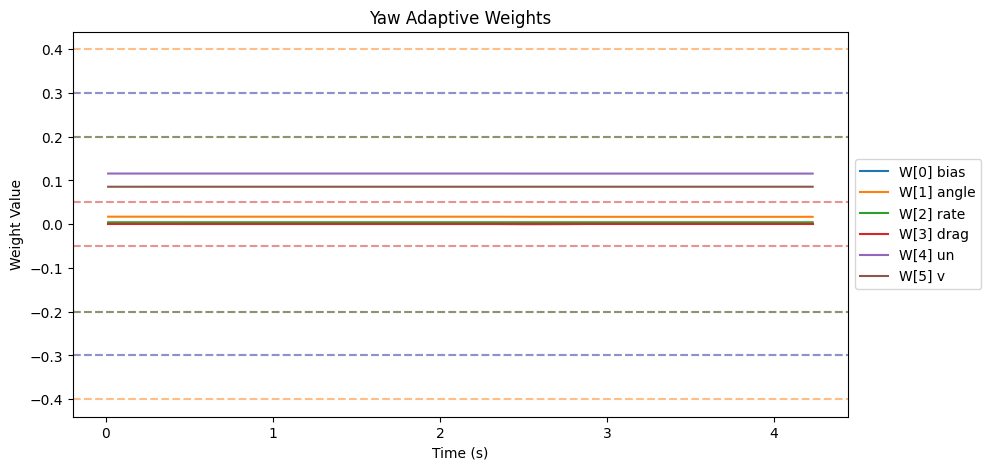
| Weight | θ_final | Drift (/s) | Proj. Hits | Oscillation (/s) |
|--------|---------|------------|------------|-------------------|
| W[0] bias | 0.001 | 0.0000 | 0.0% | 0.95 |
| W[1] angle | 0.017 | -0.0001 | 0.0% | 0.71 |
| W[2] rate | 0.004 | -0.0000 | 0.0% | 0.71 |
| W[3] drag | 0.000 | 0.0000 | 0.0% | 0.00 |
| W[4] un | 0.116 | -0.0000 | 0.0% | 0.71 |
| W[5] v | 0.086 | 0.0000 | 0.0% | 0.95 |

- ‖Θ‖ final = 0.145, trending: → STABLE/CONVERGING
- Hard-freeze fraction: 0.0%

### Z

#### Tracking
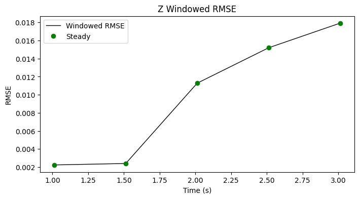

| Metric | Value |
|--------|-------|
| RMSE | 0.013 |
| MAE | 0.010 |
| Peak Error | 0.020 |
| Steady-State RMSE | 0.009805907406851916 |
| Transient RMSE | - |

#### Control Authority
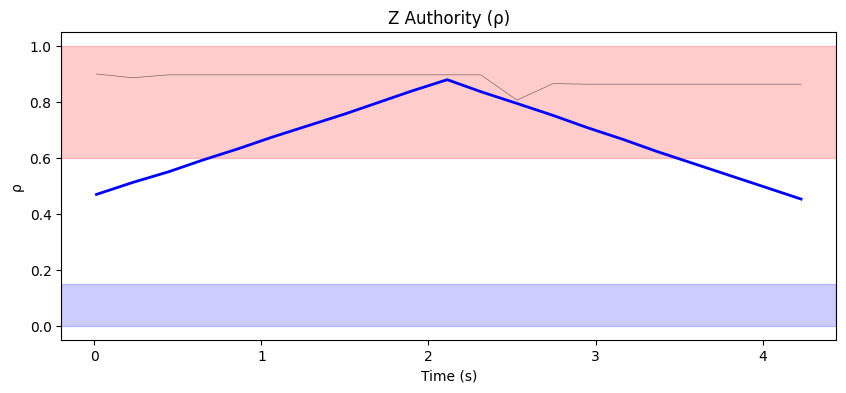
- ρ_mean = 0.879, ρ_p95 = 0.896
- u_ad RMS = 195.74 mixer units, u_nom RMS = 0.13 mixer units
- Phase relationship: reinforcing (r = 0.86)

#### Weight Health
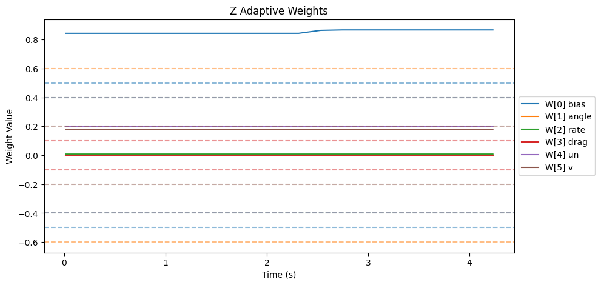
| Weight | θ_final | Drift (/s) | Proj. Hits | Oscillation (/s) |
|--------|---------|------------|------------|-------------------|
| W[0] bias | 0.867 | 0.0079 | 100.0% | 0.47 |
| W[1] angle | 0.001 | -0.0001 | 0.0% | 0.47 |
| W[2] rate | 0.008 | 0.0000 | 0.0% | 0.71 |
| W[3] drag | 0.000 | 0.0000 | 0.0% | 0.00 |
| W[4] un | 0.198 | -0.0000 | 0.0% | 0.47 |
| W[5] v | 0.180 | -0.0000 | 0.0% | 0.47 |

- ‖Θ‖ final = 0.907, trending: → STABLE/CONVERGING
- Hard-freeze fraction: 0.0%

## Firmware Parameters (Snapshot)
```json
{
  "payload": "PAYLOAD_LIGHT",
  "mrac_dt": 0.005,
  "num_basis": 6,
  "mixer": {
    "pitch": 1170.0,
    "roll": 1170.0,
    "yaw": 1872.0,
    "z": 222.0
  },
  "gamma": {
    "pitch": [
      0.5,
      3.3,
      1.0,
      2.0,
      0.1,
      1.0
    ],
    "roll": [
      0.5,
      3.3,
      1.0,
      2.0,
      0.1,
      1.0
    ],
    "yaw": [
      0.3,
      2.0,
      0.7,
      1.5,
      0.1,
      1.0
    ]
  },
  "wlim": {
    "pitch": [
      0.5,
      0.6,
      0.4,
      0.1,
      0.4,
      0.2
    ],
    "roll": [
      0.5,
      0.6,
      0.4,
      0.1,
      0.4,
      0.2
    ],
    "yaw": [
      0.3,
      0.4,
      0.2,
      0.05,
      0.3,
      0.2
    ]
  },
  "sigma": {
    "pitch": "from_config",
    "roll": "from_config",
    "yaw": "from_config"
  },
  "features": {
    "projection": true,
    "sigma_mod": true,
    "deadzone": true,
    "l1_filter": true,
    "pch": true,
    "perf_recovery": true
  },
  "_comment": "Manual overrides for firmware params. Edit before a test session. deep_analysis.py merges this into the experiment record.",
  "_instructions": "Update the fields below when you change firmware params that aren't in telemetry yet.",
  "sigma_pitch": null,
  "sigma_roll": null,
  "sigma_yaw": null,
  "omega_u_pitch": null,
  "omega_u_roll": null,
  "omega_u_yaw": null,
  "e_deadzone": null,
  "e_freeze": 8.0,
  "notes": ""
}
```
