# Flight Analysis Report: exp_flight_twc_1781527197

**Date:** 2026-06-15T13:29:48.647894Z | **Duration:** 13.0s | **Samples:** 5670 | **Config:** PAYLOAD_LIGHT

---

## What Happened

- Planar XY tracking RMSE was **28.6 cm** (peak 50.4 cm).
- Worst-tracked position axis was **Y** (RMSE 22.39 cm).
- **Never settled** within 5 cm of target (final error 55.3 cm).
- ⚠ **2 CRITICAL** MRAC alert(s) — run is INELIGIBLE as a champion until resolved.
- MRAC was most active on **z** (ρ_mean 0.85).

## Path Tracking

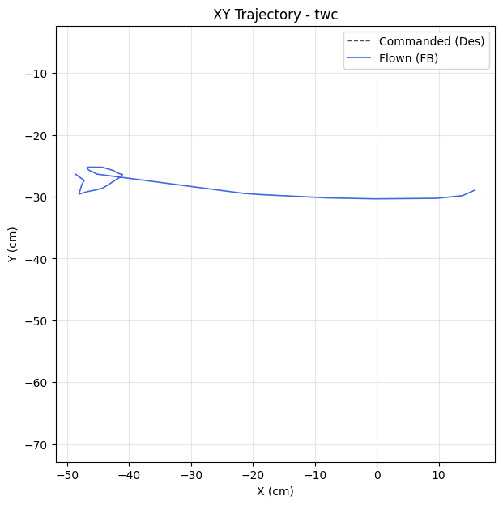

| Metric | Value |
|--------|-------|
| Planar XY RMSE (cm) | 28.58 |
| Planar peak (cm) | 50.45 |
| Cross-track mean / p95 / max (cm) | - / - / - |
| Along-track lag (ms) | - |
| Rank score (planar_rmse_cm) | 28.58 |
| TWC settling time (s) | - |
| TWC final error (cm) | 55.35 |

| Axis | RMSE | MAE | Peak |
|------|------|-----|------|
| X | 17.76 | 16.29 | 45.84 |
| Y | 22.39 | 22.34 | 24.77 |
| Z | 0.01 | 0.01 | 0.02 |

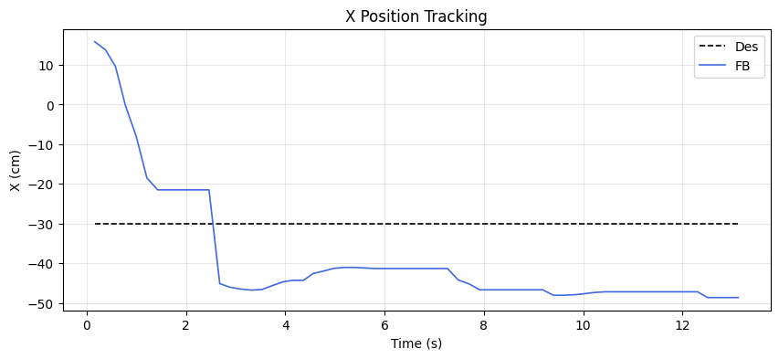
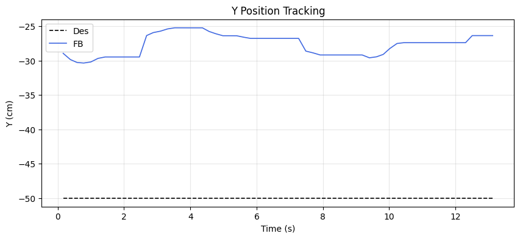
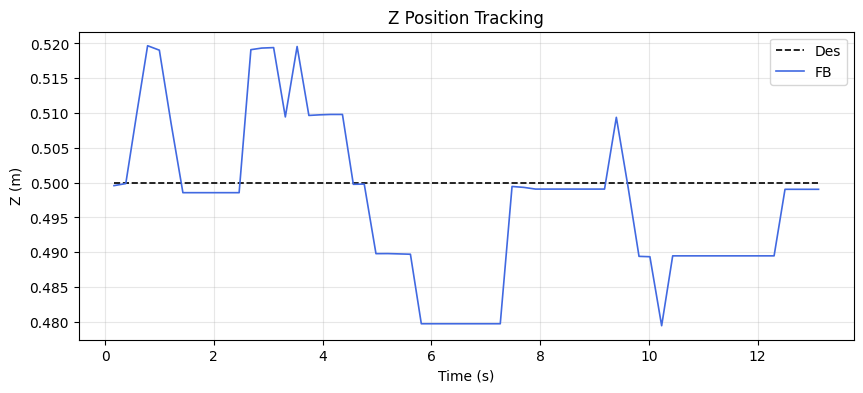

### Yaw heading-hold drift

| Cmd (°) | Final offset (°) | Mean offset (°) | Drift (°/s) | Total drift (°) | P2P (°) |
|---------|------------------|-----------------|-------------|-----------------|---------|
| 0.00 | 0.24 | 0.59 | 0.01 | 0.10 | 1.02 |

## MRAC Scoreboard (attitude / rate loops)

| Axis  | RMSE | RMSE_ss | RMSE_tr | ρ_mean | ρ_p95 | Phase | ‖Θ‖ | ⚠ | 🔴 |
|-------|------|---------|---------|--------|-------|-------|------|---|---|
| Pitch | 3.153 | 3.163 | - | 0.496 | 0.998 | decoupled | 0.241 | 1 | 1 |
| Roll | 1.165 | 0.419 | 0.700 | 0.264 | 0.483 | reinforcing | 0.243 | 0 | 0 |
| Yaw | 0.674 | 0.660 | - | 0.330 | 0.421 | reinforcing | 0.145 | 1 | 0 |
| Z | 0.012 | 0.012 | - | 0.849 | 0.927 | decoupled | 0.943 | 2 | 1 |

## Alerts

- [CRITICAL] **NEAR_SATURATION**: pitch: MRAC near saturation (ρ_p95=1.00). Reduce gamma or increase u_max.
- [CRITICAL] **NEAR_SATURATION**: z: MRAC near saturation (ρ_p95=0.93). Reduce gamma or increase u_max.
- [WARN] **POOR_TRACKING**: pitch: Tracking degraded (RMSE=3.15).
- [WARN] **REDUNDANT_EFFORT**: yaw: MRAC reinforcing PID (r=0.64) with significant authority. PID may need retuning.
- [WARN] **HIGH_AUTHORITY**: z: MRAC-dominant (ρ=0.85). PID gains may be insufficient.
- [WARN] **PROJECTION_ACTIVE**: z: Weight[0] hitting projection bound 100% of time. Disturbance may exceed budget.

## Per-Axis Detail

### Pitch

#### Tracking
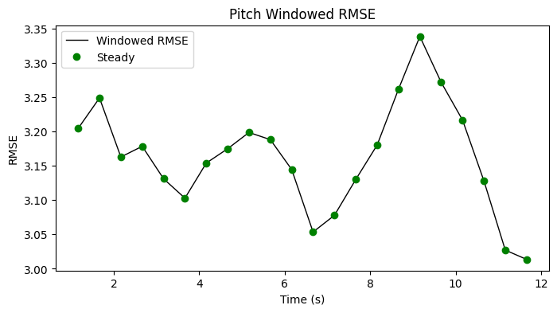

| Metric | Value |
|--------|-------|
| RMSE | 3.153 |
| MAE | 3.148 |
| Peak Error | 3.579 |
| Steady-State RMSE | 3.1631725171356537 |
| Transient RMSE | - |

#### Control Authority
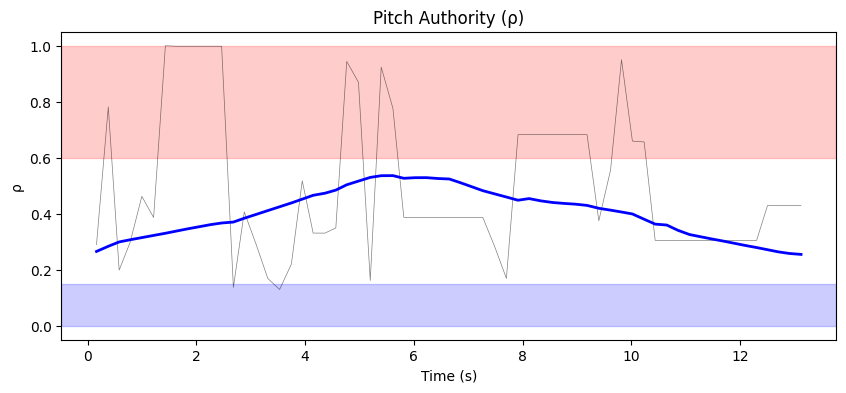
- ρ_mean = 0.496, ρ_p95 = 0.998
- u_ad RMS = 33.03 mixer units, u_nom RMS = 0.05 mixer units
- Phase relationship: decoupled (r = 0.11)

#### Weight Health
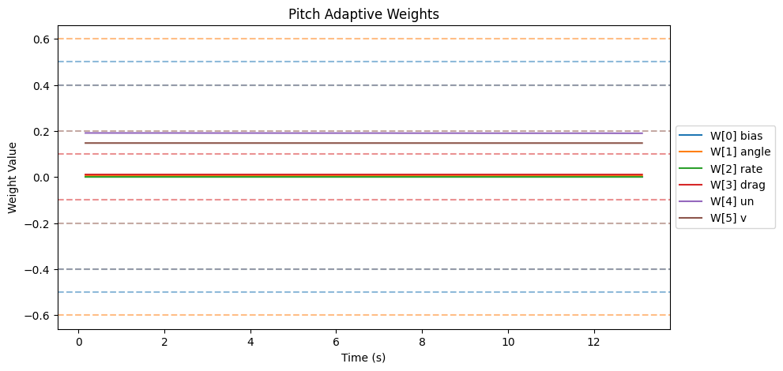
| Weight | θ_final | Drift (/s) | Proj. Hits | Oscillation (/s) |
|--------|---------|------------|------------|-------------------|
| W[0] bias | 0.000 | -0.0000 | 0.0% | 0.85 |
| W[1] angle | 0.004 | -0.0000 | 0.0% | 1.47 |
| W[2] rate | 0.000 | -0.0000 | 0.0% | 0.85 |
| W[3] drag | 0.011 | -0.0000 | 0.0% | 1.16 |
| W[4] un | 0.190 | -0.0001 | 0.0% | 0.85 |
| W[5] v | 0.147 | -0.0000 | 0.0% | 1.31 |

- ‖Θ‖ final = 0.241, trending: → STABLE/CONVERGING
- Hard-freeze fraction: 0.0%

### Roll

#### Tracking
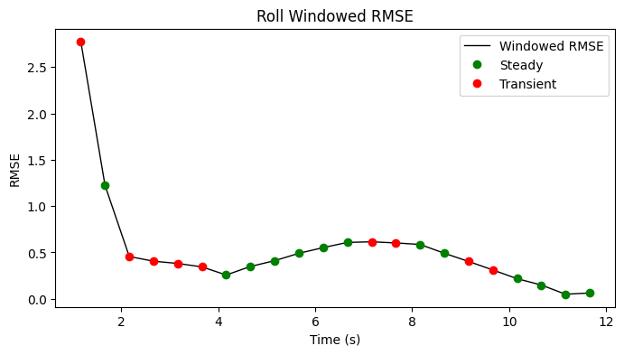

| Metric | Value |
|--------|-------|
| RMSE | 1.165 |
| MAE | 0.543 |
| Peak Error | 7.697 |
| Steady-State RMSE | 0.4191166770678442 |
| Transient RMSE | 0.699885111901637 |

#### Control Authority
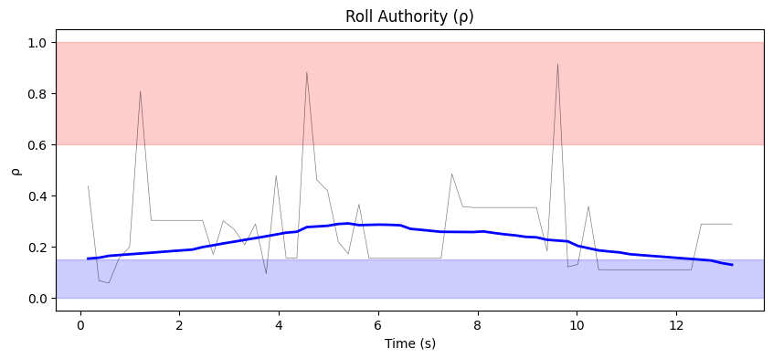
- ρ_mean = 0.264, ρ_p95 = 0.483
- u_ad RMS = 32.71 mixer units, u_nom RMS = 0.09 mixer units
- Phase relationship: reinforcing (r = 0.44)

#### Weight Health
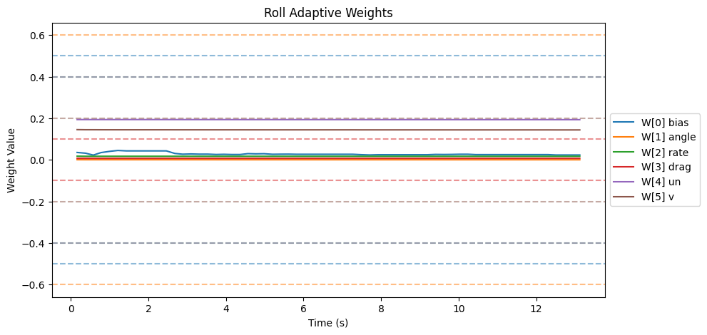
| Weight | θ_final | Drift (/s) | Proj. Hits | Oscillation (/s) |
|--------|---------|------------|------------|-------------------|
| W[0] bias | 0.023 | -0.0011 | 0.0% | 2.16 |
| W[1] angle | 0.000 | -0.0000 | 0.0% | 1.00 |
| W[2] rate | 0.017 | -0.0000 | 0.0% | 1.47 |
| W[3] drag | 0.007 | -0.0000 | 0.0% | 1.31 |
| W[4] un | 0.193 | -0.0000 | 0.0% | 0.93 |
| W[5] v | 0.144 | -0.0001 | 0.0% | 0.85 |

- ‖Θ‖ final = 0.243, trending: → STABLE/CONVERGING
- Hard-freeze fraction: 0.0%

### Yaw

#### Tracking
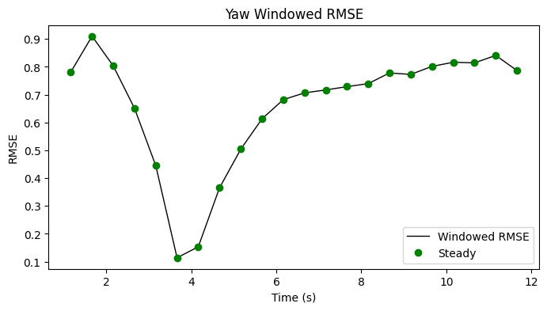

| Metric | Value |
|--------|-------|
| RMSE | 0.674 |
| MAE | 0.598 |
| Peak Error | 0.971 |
| Steady-State RMSE | 0.6601381597652606 |
| Transient RMSE | - |

#### Control Authority
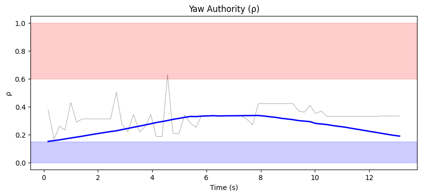
- ρ_mean = 0.330, ρ_p95 = 0.421
- u_ad RMS = 21.88 mixer units, u_nom RMS = 0.03 mixer units
- Phase relationship: reinforcing (r = 0.64)

#### Weight Health
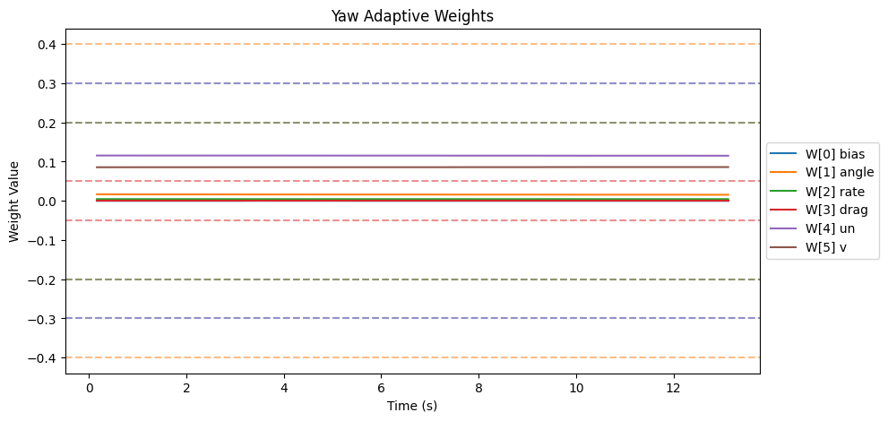
| Weight | θ_final | Drift (/s) | Proj. Hits | Oscillation (/s) |
|--------|---------|------------|------------|-------------------|
| W[0] bias | 0.000 | -0.0000 | 0.0% | 1.23 |
| W[1] angle | 0.016 | -0.0001 | 0.0% | 1.08 |
| W[2] rate | 0.004 | -0.0000 | 0.0% | 0.85 |
| W[3] drag | 0.000 | 0.0000 | 0.0% | 0.00 |
| W[4] un | 0.115 | -0.0000 | 0.0% | 0.85 |
| W[5] v | 0.086 | 0.0000 | 0.0% | 1.00 |

- ‖Θ‖ final = 0.145, trending: → STABLE/CONVERGING
- Hard-freeze fraction: 0.0%

### Z

#### Tracking
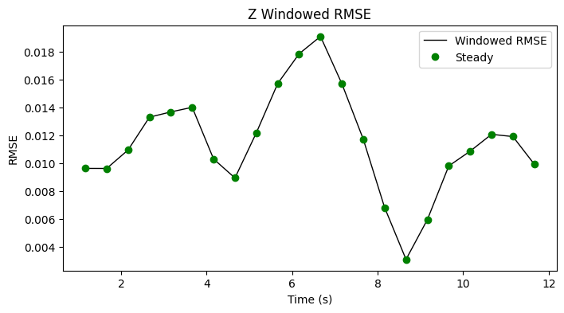

| Metric | Value |
|--------|-------|
| RMSE | 0.012 |
| MAE | 0.009 |
| Peak Error | 0.021 |
| Steady-State RMSE | 0.011510920075568426 |
| Transient RMSE | - |

#### Control Authority
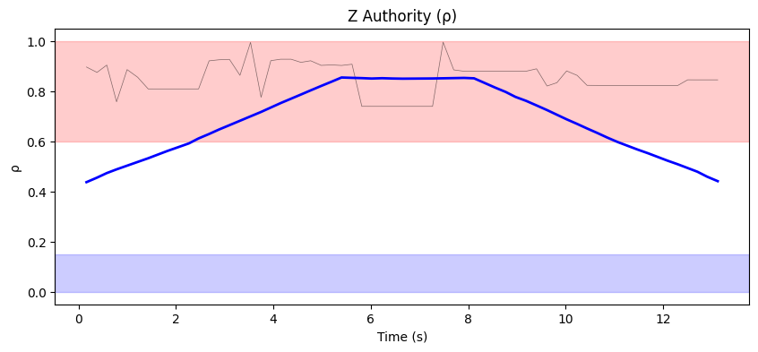
- ρ_mean = 0.849, ρ_p95 = 0.927
- u_ad RMS = 201.78 mixer units, u_nom RMS = 0.19 mixer units
- Phase relationship: decoupled (r = 0.27)

#### Weight Health
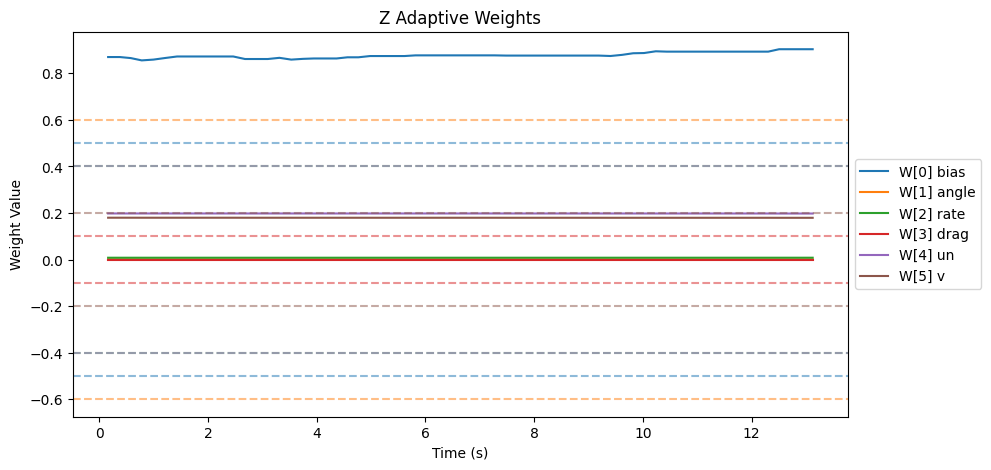
| Weight | θ_final | Drift (/s) | Proj. Hits | Oscillation (/s) |
|--------|---------|------------|------------|-------------------|
| W[0] bias | 0.904 | 0.0028 | 100.0% | 1.77 |
| W[1] angle | 0.001 | -0.0000 | 0.0% | 1.39 |
| W[2] rate | 0.008 | 0.0000 | 0.0% | 1.85 |
| W[3] drag | 0.000 | 0.0000 | 0.0% | 0.00 |
| W[4] un | 0.198 | -0.0000 | 0.0% | 1.77 |
| W[5] v | 0.179 | -0.0000 | 0.0% | 1.77 |

- ‖Θ‖ final = 0.943, trending: → STABLE/CONVERGING
- Hard-freeze fraction: 0.0%

## Firmware Parameters (Snapshot)
```json
{
  "payload": "PAYLOAD_LIGHT",
  "mrac_dt": 0.005,
  "num_basis": 6,
  "mixer": {
    "pitch": 1170.0,
    "roll": 1170.0,
    "yaw": 1872.0,
    "z": 222.0
  },
  "gamma": {
    "pitch": [
      0.5,
      3.3,
      1.0,
      2.0,
      0.1,
      1.0
    ],
    "roll": [
      0.5,
      3.3,
      1.0,
      2.0,
      0.1,
      1.0
    ],
    "yaw": [
      0.3,
      2.0,
      0.7,
      1.5,
      0.1,
      1.0
    ]
  },
  "wlim": {
    "pitch": [
      0.5,
      0.6,
      0.4,
      0.1,
      0.4,
      0.2
    ],
    "roll": [
      0.5,
      0.6,
      0.4,
      0.1,
      0.4,
      0.2
    ],
    "yaw": [
      0.3,
      0.4,
      0.2,
      0.05,
      0.3,
      0.2
    ]
  },
  "sigma": {
    "pitch": "from_config",
    "roll": "from_config",
    "yaw": "from_config"
  },
  "features": {
    "projection": true,
    "sigma_mod": true,
    "deadzone": true,
    "l1_filter": true,
    "pch": true,
    "perf_recovery": true
  },
  "_comment": "Manual overrides for firmware params. Edit before a test session. deep_analysis.py merges this into the experiment record.",
  "_instructions": "Update the fields below when you change firmware params that aren't in telemetry yet.",
  "sigma_pitch": null,
  "sigma_roll": null,
  "sigma_yaw": null,
  "omega_u_pitch": null,
  "omega_u_roll": null,
  "omega_u_yaw": null,
  "e_deadzone": null,
  "e_freeze": 8.0,
  "notes": ""
}
```
