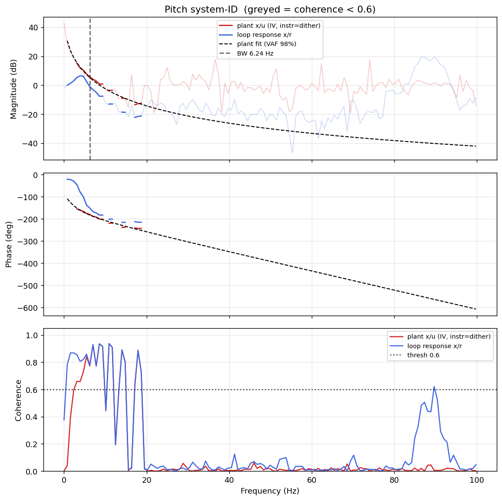

# System-ID analysis — sysid_pitch_1781788819.csv

- **Source log**: `ground_station\logs\sysid_pitch_1781788819.csv`
- **Sample rate (auto)**: 199.6 Hz
- **Excitation**: multisine  (dither peak 45.0, crest factor 3.22)
- **Battery (operating point)**: 0.00 V mean, 0.05→0.00 V (sag 0.05 V over run). Actuator gain scales with voltage — note this when comparing K across runs.

## Pitch axis

- Closed-loop −3 dB bandwidth: **6.238 Hz**  →  recommended `ref_model_bw` = **39.19 rad/s**
- Plant model  `G(s) = K / (s·(1 + s/p))·e^(−sT)`:
    - K (integrator gain) = 175.6
    - lag pole p = 17.7 rad/s (2.82 Hz)
    - transport delay T = 12 ms
    - fit quality **VAF = 98.2%** over 9 coherent bins
- Samples used: 7633 (largest gap-free segment)

