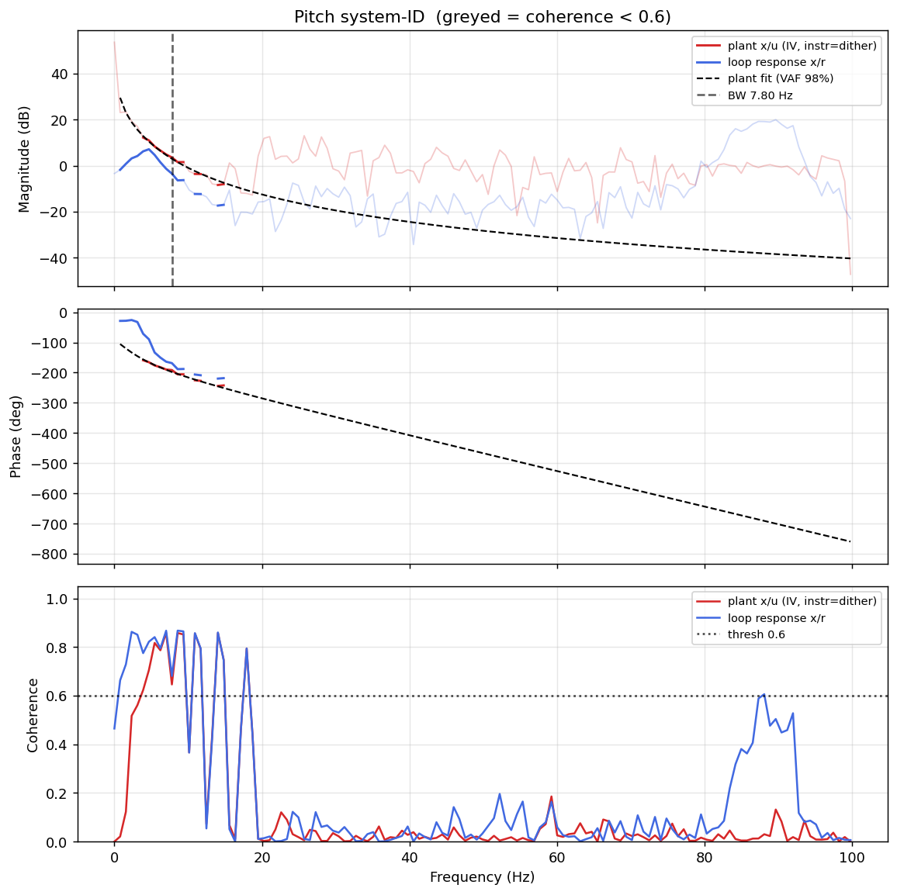

# System-ID analysis — sysid_pitch_1781788872.csv

- **Source log**: `ground_station\logs\sysid_pitch_1781788872.csv`
- **Sample rate (auto)**: 199.6 Hz
- **Excitation**: multisine  (dither peak 25.0, crest factor 3.27)
- **Battery (operating point)**: 0.00 V mean, 0.03→0.00 V (sag 0.03 V over run). Actuator gain scales with voltage — note this when comparing K across runs.

## Pitch axis

- Closed-loop −3 dB bandwidth: **7.796 Hz**  →  recommended `ref_model_bw` = **48.98 rad/s**
- Plant model  `G(s) = K / (s·(1 + s/p))·e^(−sT)`:
    - K (integrator gain) = 148.1
    - lag pole p = 25.8 rad/s (4.11 Hz)
    - transport delay T = 16 ms
    - fit quality **VAF = 97.7%** over 8 coherent bins
- Samples used: 3898 (largest gap-free segment)

