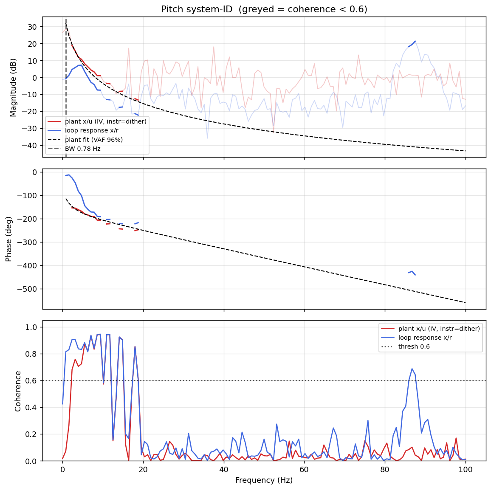

# System-ID analysis — sysid_pitch_1781789666.csv

- **Source log**: `ground_station\logs\sysid_pitch_1781789666.csv`
- **Sample rate (auto)**: 200.1 Hz
- **Excitation**: multisine  (dither peak 45.0, crest factor 3.28)
- **Battery (operating point)**: 0.00 V mean, 0.00→0.00 V (sag 0.00 V over run). Actuator gain scales with voltage — note this when comparing K across runs.

## Pitch axis

- Closed-loop −3 dB bandwidth: **0.781 Hz**  →  recommended `ref_model_bw` = **4.91 rad/s**
- Plant model  `G(s) = K / (s·(1 + s/p))·e^(−sT)`:
    - K (integrator gain) = 209.5
    - lag pole p = 12.8 rad/s (2.03 Hz)
    - transport delay T = 11 ms
    - fit quality **VAF = 96.5%** over 10 coherent bins
- Samples used: 2208 (largest gap-free segment)

