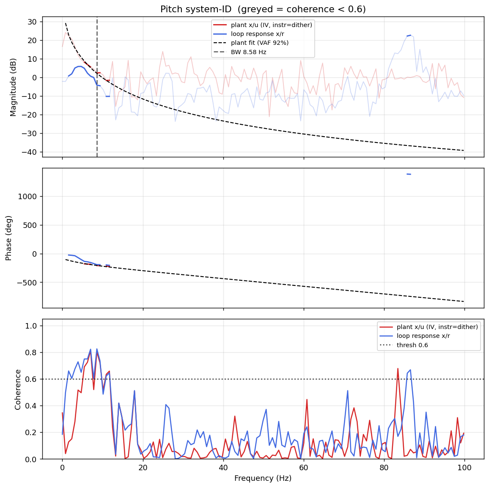

# System-ID analysis — sysid_pitch_1781789801.csv

> ⚠️ **LINK QUALITY BAD — results may be UNRELIABLE.** Only 71% of frames were received (17 gaps; largest clean segment 1293 samples). The wireless link dropped frames — fly the drone closer to the receiver and re-run.

- **Source log**: `ground_station\logs\sysid_pitch_1781789801.csv`
- **Link quality**: BAD (71% frames received, 17 gaps, largest clean segment 1293 samples)
- **Sample rate (auto)**: 199.6 Hz
- **Excitation**: multisine  (dither peak 12.0, crest factor 3.27)
- **Battery (operating point)**: 0.00 V mean, 0.00→0.00 V (sag 0.00 V over run). Actuator gain scales with voltage — note this when comparing K across runs.

## Pitch axis

- Closed-loop −3 dB bandwidth: **8.578 Hz**  →  recommended `ref_model_bw` = **53.90 rad/s**
- Plant model  `G(s) = K / (s·(1 + s/p))·e^(−sT)`:
    - K (integrator gain) = 143.4
    - lag pole p = 29.6 rad/s (4.71 Hz)
    - transport delay T = 18 ms
    - fit quality **VAF = 92.1%** over 5 coherent bins
- Samples used: 1293 (largest gap-free segment)

