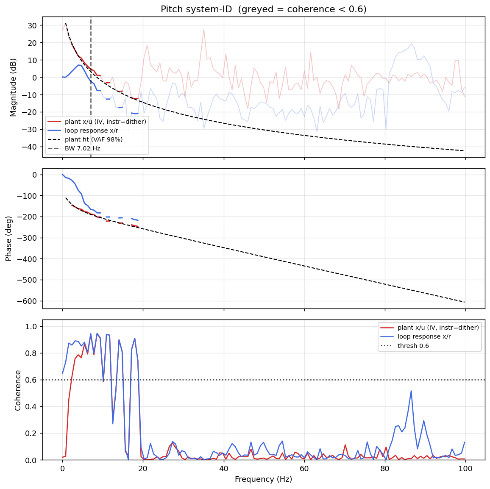

# System-ID analysis — sysid_pitch_1781790819.csv

> ⚠️ **LINK QUALITY WARN — results may be UNRELIABLE.** Only 93% of frames were received (6 gaps; largest clean segment 3603 samples). The wireless link dropped frames — fly the drone closer to the receiver and re-run.

- **Source log**: `ground_station\logs\sysid_pitch_1781790819.csv`
- **Link quality**: WARN (93% frames received, 6 gaps, largest clean segment 3603 samples)
- **Sample rate (auto)**: 199.7 Hz — counter reset detected (two runs in one log?) - fs from largest segment [1:7862]
- **Excitation**: multisine  (dither peak 45.0, crest factor 3.24)
- **Battery (operating point)**: 0.00 V mean, 0.02→0.00 V (sag 0.02 V over run). Actuator gain scales with voltage — note this when comparing K across runs.

## Pitch axis

- Closed-loop −3 dB bandwidth: **7.019 Hz**  →  recommended `ref_model_bw` = **44.10 rad/s**
- Plant model  `G(s) = K / (s·(1 + s/p))·e^(−sT)`:
    - K (integrator gain) = 186.2
    - lag pole p = 16.0 rad/s (2.55 Hz)
    - transport delay T = 12 ms
    - fit quality **VAF = 98.2%** over 10 coherent bins
- Samples used: 3603 (largest gap-free segment)

