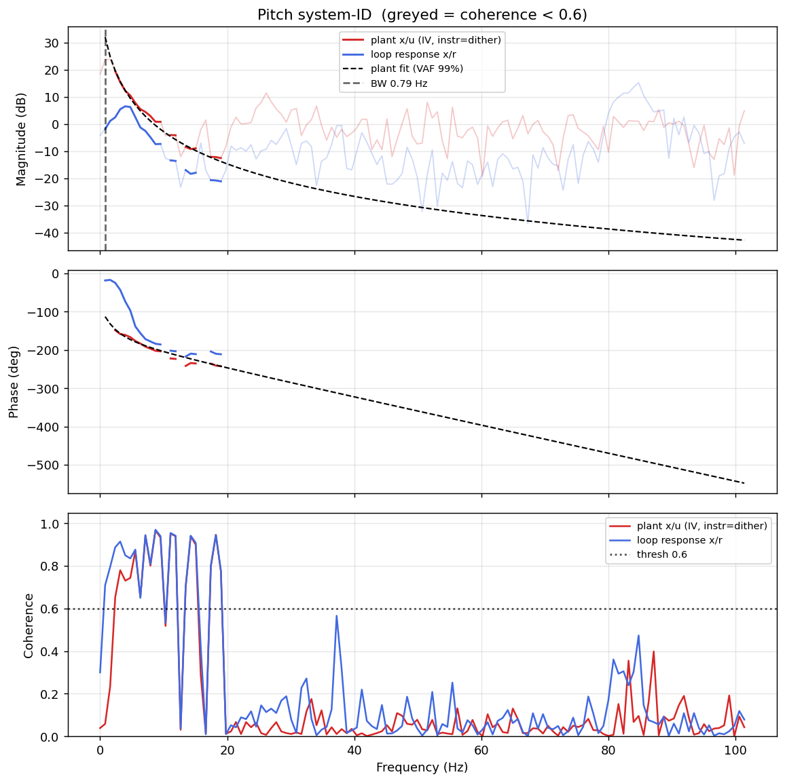

# System-ID analysis — sysid_pitch_1781790912.csv

> ⚠️ **LINK QUALITY BAD — results may be UNRELIABLE.** Only 68% of frames were received (13 gaps; largest clean segment 1833 samples). The wireless link dropped frames — fly the drone closer to the receiver and re-run.

- **Source log**: `ground_station\logs\sysid_pitch_1781790912.csv`
- **Link quality**: BAD (68% frames received, 13 gaps, largest clean segment 1833 samples)
- **Sample rate (auto)**: 202.8 Hz
- **Excitation**: multisine  (dither peak 45.0, crest factor 3.24)
- **Battery (operating point)**: 0.00 V mean, 0.00→0.00 V (sag 0.00 V over run). Actuator gain scales with voltage — note this when comparing K across runs.

## Pitch axis

- Closed-loop −3 dB bandwidth: **0.792 Hz**  →  recommended `ref_model_bw` = **4.98 rad/s**
- Plant model  `G(s) = K / (s·(1 + s/p))·e^(−sT)`:
    - K (integrator gain) = 215.1
    - lag pole p = 13.6 rad/s (2.16 Hz)
    - transport delay T = 10 ms
    - fit quality **VAF = 98.9%** over 10 coherent bins
- Samples used: 1833 (largest gap-free segment)

