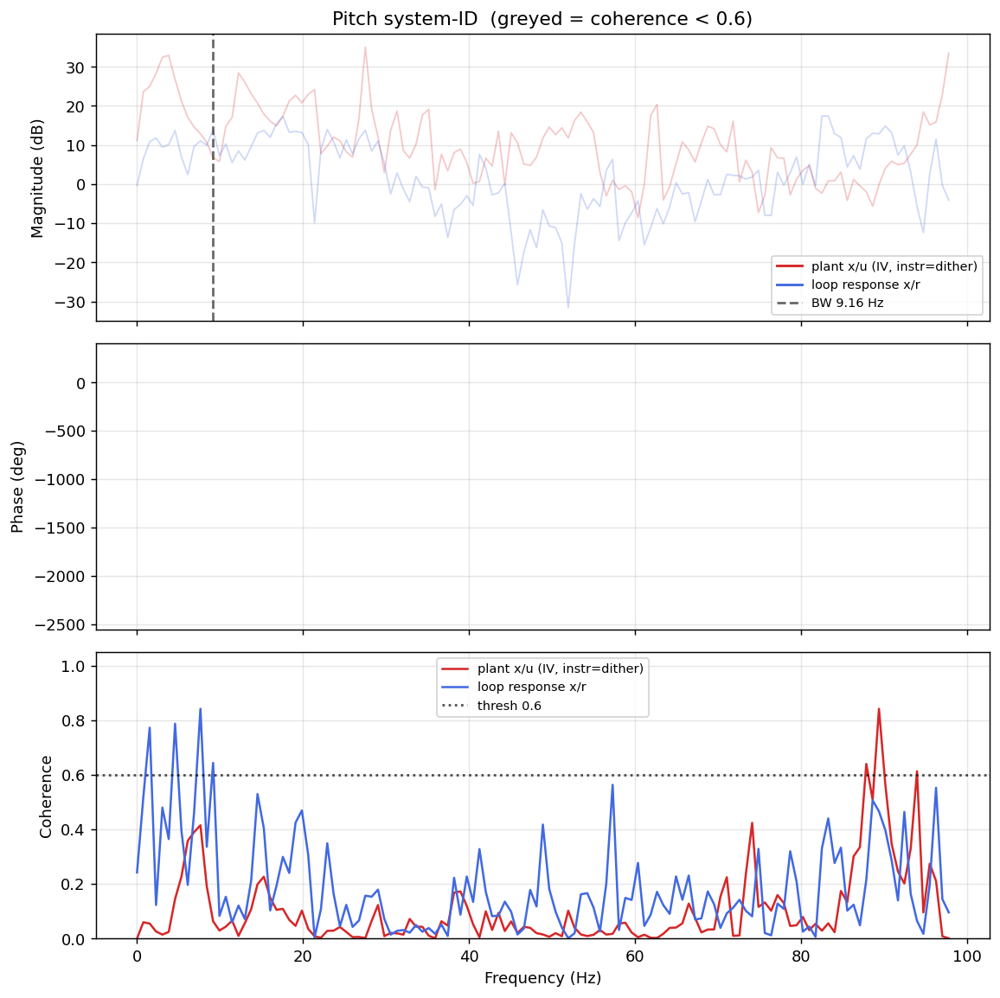

# System-ID analysis — sysid_pitch_1781791630.csv

> ⚠️ **LINK QUALITY BAD — results may be UNRELIABLE.** Only 100% of frames were received (0 gaps; largest clean segment 801 samples). The wireless link dropped frames — fly the drone closer to the receiver and re-run.

- **Source log**: `ground_station\logs\sysid_pitch_1781791630.csv`
- **Link quality**: BAD (100% frames received, 0 gaps, largest clean segment 801 samples)
- **Sample rate (auto)**: 195.5 Hz
- **Excitation**: chirp  (dither peak 43.7, crest factor 1.51)
- **Battery (operating point)**: 0.00 V mean, 0.02→0.00 V (sag 0.02 V over run). Actuator gain scales with voltage — note this when comparing K across runs.

## Pitch axis

- Closed-loop −3 dB bandwidth: **9.164 Hz**  →  recommended `ref_model_bw` = **57.58 rad/s**
- Plant model: not enough coherent bins to fit (0).
- Samples used: 799 (largest gap-free segment)

