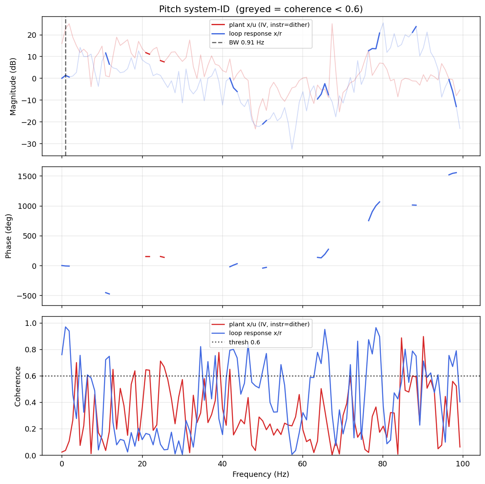

# System-ID analysis — sysid_pitch_1781791763.csv

> ⚠️ **LINK QUALITY BAD — results may be UNRELIABLE.** Only 66% of frames were received (6 gaps; largest clean segment 439 samples). The wireless link dropped frames — fly the drone closer to the receiver and re-run.

- **Source log**: `ground_station\logs\sysid_pitch_1781791763.csv`
- **Link quality**: BAD (66% frames received, 6 gaps, largest clean segment 439 samples)
- **Sample rate (auto)**: 198.6 Hz
- **Excitation**: chirp  (dither peak 45.0, crest factor 1.57)
- **Battery (operating point)**: 0.00 V mean, 0.00→0.00 V (sag 0.00 V over run). Actuator gain scales with voltage — note this when comparing K across runs.

## Pitch axis

- Closed-loop −3 dB bandwidth: **0.911 Hz**  →  recommended `ref_model_bw` = **5.72 rad/s**
- Plant model: not enough coherent bins to fit (2).
- Samples used: 439 (largest gap-free segment)

