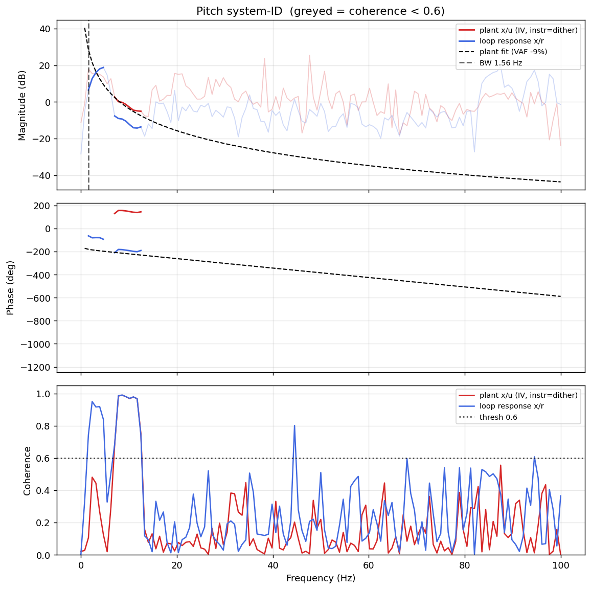

# System-ID analysis — sysid_pitch_1781791864.csv

> ⚠️ **LINK QUALITY BAD — results may be UNRELIABLE.** Only 46% of frames were received (22 gaps; largest clean segment 814 samples). The wireless link dropped frames — fly the drone closer to the receiver and re-run.

- **Source log**: `ground_station\logs\sysid_pitch_1781791864.csv`
- **Link quality**: BAD (46% frames received, 22 gaps, largest clean segment 814 samples)
- **Sample rate (auto)**: 200.0 Hz
- **Excitation**: chirp  (dither peak 35.0, crest factor 1.46)
- **Battery (operating point)**: 0.00 V mean, 0.04→0.00 V (sag 0.04 V over run). Actuator gain scales with voltage — note this when comparing K across runs.

## Pitch axis

- Closed-loop −3 dB bandwidth: **1.562 Hz**  →  recommended `ref_model_bw` = **9.82 rad/s**
- Plant model  `G(s) = K / (s·(1 + s/p))·e^(−sT)`:
    - K (integrator gain) = 2585.0
    - lag pole p = 1.0 rad/s (0.16 Hz)
    - transport delay T = 11 ms
    - fit quality **VAF = -9.1%** over 4 coherent bins
- Samples used: 814 (largest gap-free segment)

