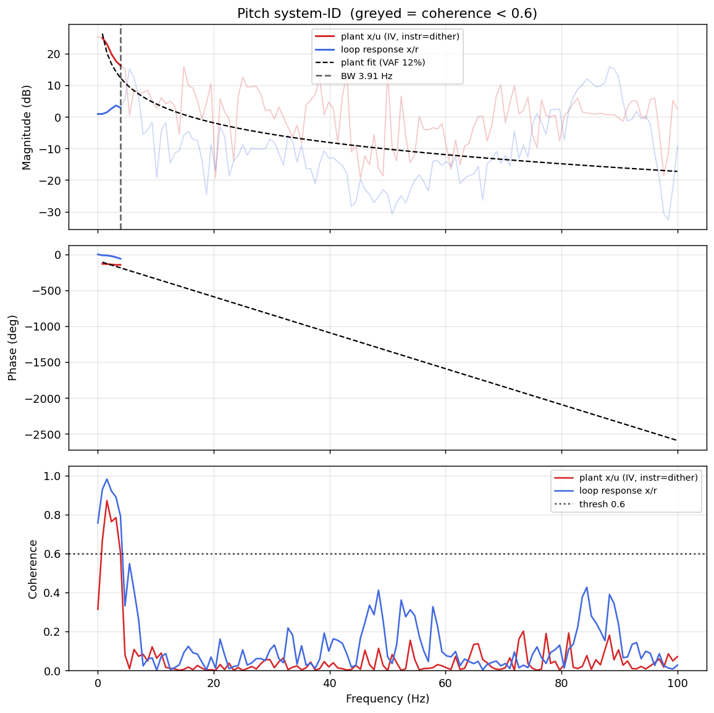

# System-ID analysis — sysid_pitch_1781792717.csv

> ⚠️ **LINK QUALITY BAD — results may be UNRELIABLE.** Only 72% of frames were received (20 gaps; largest clean segment 2354 samples). The wireless link dropped frames — fly the drone closer to the receiver and re-run.

- **Source log**: `ground_station\logs\sysid_pitch_1781792717.csv`
- **Link quality**: BAD (72% frames received, 20 gaps, largest clean segment 2354 samples)
- **Sample rate (auto)**: 200.0 Hz — counter reset detected (two runs in one log?) - fs from largest segment [1:6185]
- **Excitation**: chirp  (dither peak 45.0, crest factor 1.42)
- **Battery (operating point)**: 0.00 V mean, 0.00→0.00 V (sag 0.00 V over run). Actuator gain scales with voltage — note this when comparing K across runs.

## Pitch axis

- Closed-loop −3 dB bandwidth: **3.907 Hz**  →  recommended `ref_model_bw` = **24.55 rad/s**
- Plant model  `G(s) = K / (s·(1 + s/p))·e^(−sT)`:
    - K (integrator gain) = 101.9
    - lag pole p = 1000.0 rad/s (159.15 Hz)
    - transport delay T = 69 ms
    - fit quality **VAF = 12.4%** over 5 coherent bins
- Samples used: 2354 (largest gap-free segment)

