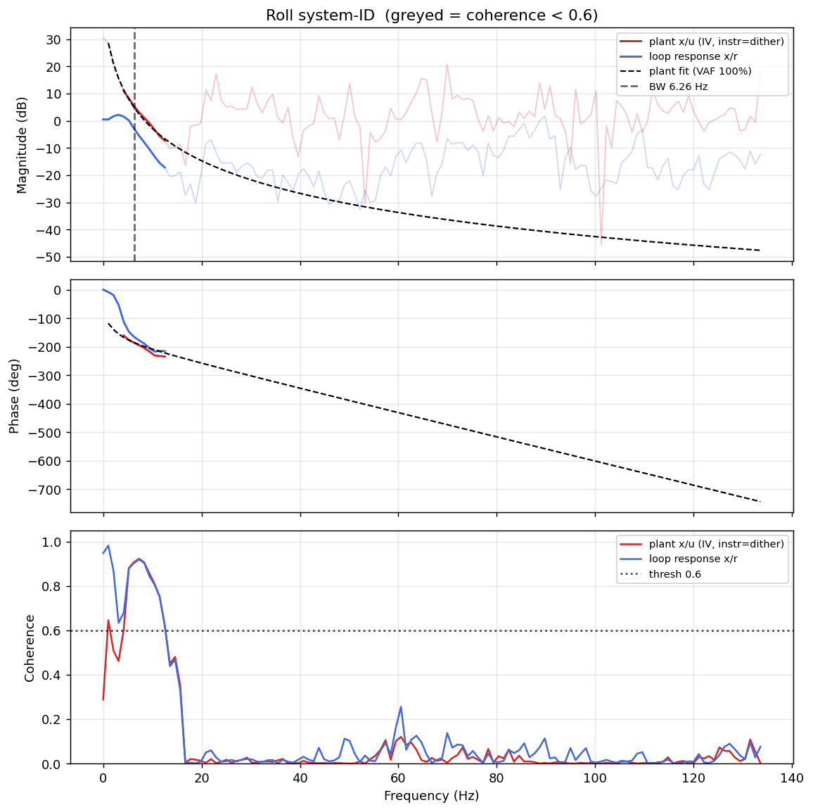

# System-ID analysis — sysid_roll_1781707687.csv

- **Source log**: `..\logs\sysid_roll_1781707687.csv`
- **Sample rate (auto)**: 267.2 Hz
- **Excitation**: chirp  (dither peak 35.0, crest factor 1.46)
- **Battery (operating point)**: 0.00 V mean, 0.00→0.00 V (sag 0.00 V over run). Actuator gain scales with voltage — note this when comparing K across runs.

## Roll axis

- Closed-loop −3 dB bandwidth: **6.262 Hz**  →  recommended `ref_model_bw` = **39.34 rad/s**
- Plant model  `G(s) = K / (s·(1 + s/p))·e^(−sT)`:
    - K (integrator gain) = 192.6
    - lag pole p = 15.2 rad/s (2.43 Hz)
    - transport delay T = 12 ms
    - fit quality **VAF = 99.9%** over 7 coherent bins
- Samples used: 8832 (largest gap-free segment)

