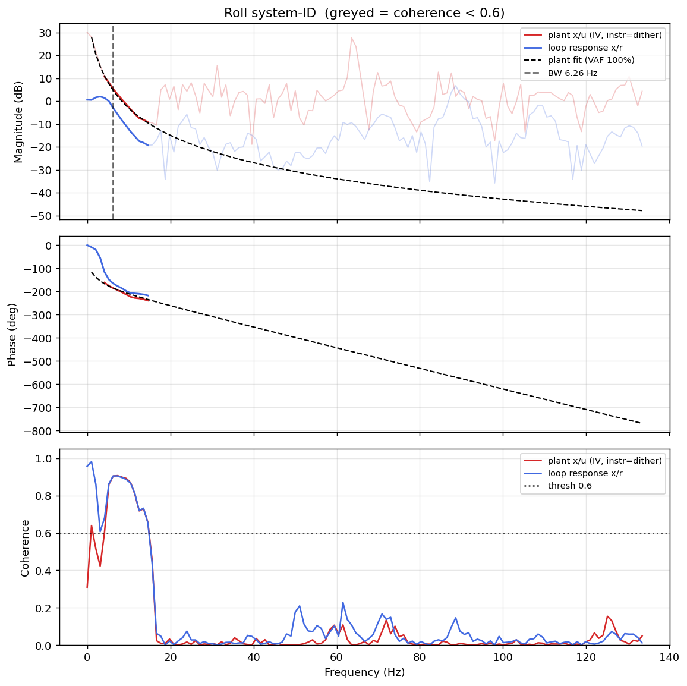

# System-ID analysis — sysid_roll_1781707840.csv

- **Source log**: `..\logs\sysid_roll_1781707840.csv`
- **Sample rate (auto)**: 266.9 Hz
- **Excitation**: chirp  (dither peak 35.0, crest factor 1.46)

## Roll axis

- Closed-loop −3 dB bandwidth: **6.256 Hz**  →  recommended `ref_model_bw` = **39.31 rad/s**
- Plant model  `G(s) = K / (s·(1 + s/p))·e^(−sT)`:
    - K (integrator gain) = 177.1
    - lag pole p = 16.1 rad/s (2.56 Hz)
    - transport delay T = 12 ms
    - fit quality **VAF = 100.0%** over 7 coherent bins
- Samples used: 8831 (largest gap-free segment)

