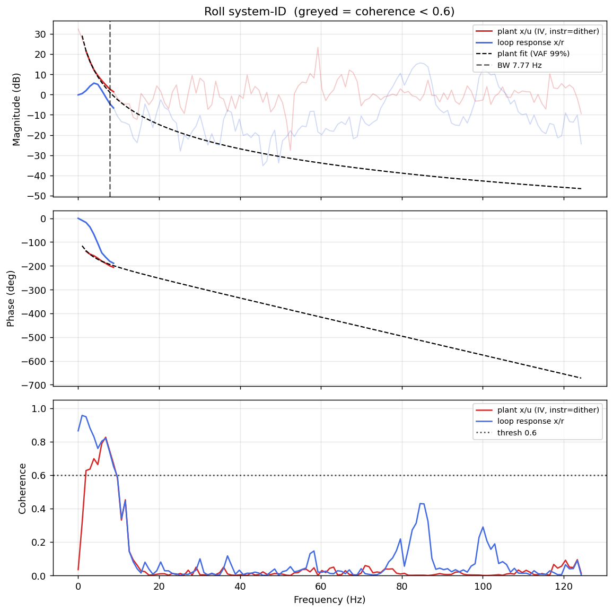

# System-ID analysis — sysid_roll_1781707964.csv

- **Source log**: `..\logs\sysid_roll_1781707964.csv`
- **Sample rate (auto)**: 248.7 Hz — counter reset detected (two runs in one log?) — fs from largest segment [1:8204]
- **Excitation**: multisine  (dither peak 22.7, crest factor 3.33)

## Roll axis

- Closed-loop −3 dB bandwidth: **7.771 Hz**  →  recommended `ref_model_bw` = **48.82 rad/s**
- Plant model  `G(s) = K / (s·(1 + s/p))·e^(−sT)`:
    - K (integrator gain) = 188.5
    - lag pole p = 15.3 rad/s (2.43 Hz)
    - transport delay T = 11 ms
    - fit quality **VAF = 99.4%** over 8 coherent bins
- Samples used: 6418 (largest gap-free segment)

