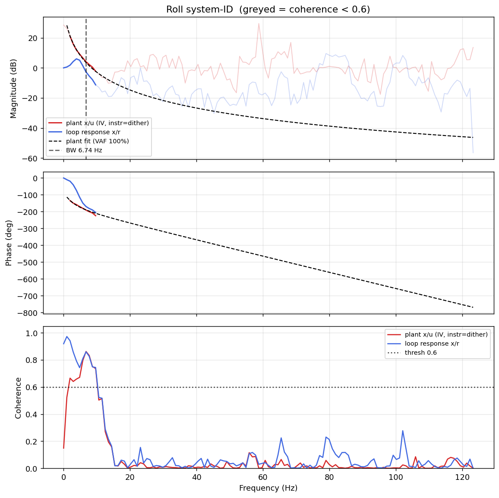

# System-ID analysis — sysid_roll_1781708122.csv

- **Source log**: `..\logs\sysid_roll_1781708122.csv`
- **Sample rate (auto)**: 246.6 Hz
- **Excitation**: multisine  (dither peak 31.7, crest factor 3.35)

## Roll axis

- Closed-loop −3 dB bandwidth: **6.742 Hz**  →  recommended `ref_model_bw` = **42.36 rad/s**
- Plant model  `G(s) = K / (s·(1 + s/p))·e^(−sT)`:
    - K (integrator gain) = 165.6
    - lag pole p = 17.7 rad/s (2.82 Hz)
    - transport delay T = 13 ms
    - fit quality **VAF = 99.8%** over 9 coherent bins
- Samples used: 6180 (largest gap-free segment)

