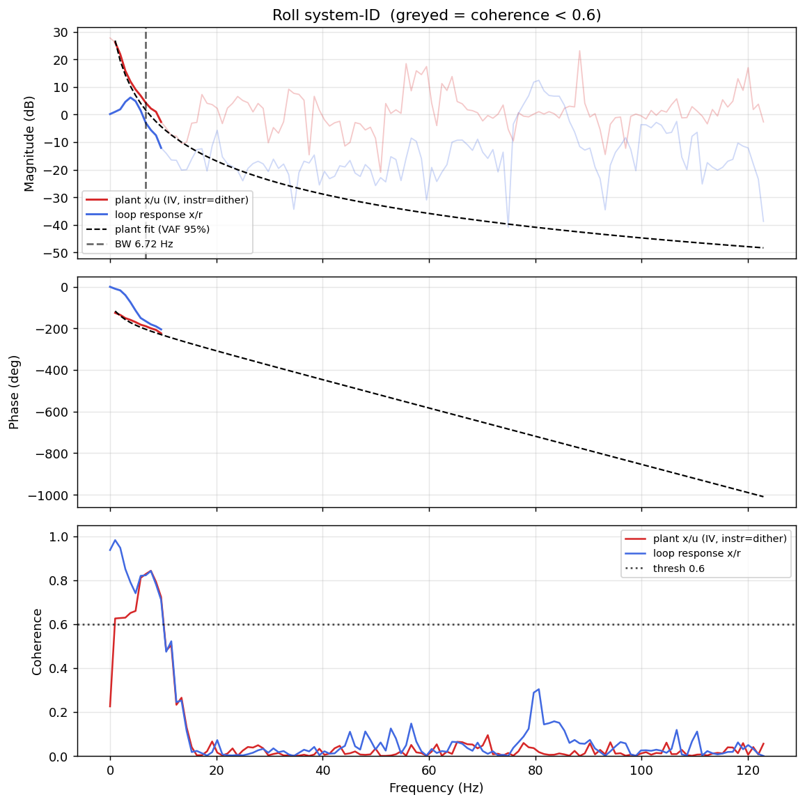

# System-ID analysis — sysid_roll_1781708174.csv

- **Source log**: `..\logs\sysid_roll_1781708174.csv`
- **Sample rate (auto)**: 245.9 Hz
- **Excitation**: multisine  (dither peak 31.7, crest factor 3.34)

## Roll axis

- Closed-loop −3 dB bandwidth: **6.724 Hz**  →  recommended `ref_model_bw` = **42.25 rad/s**
- Plant model  `G(s) = K / (s·(1 + s/p))·e^(−sT)`:
    - K (integrator gain) = 140.9
    - lag pole p = 16.3 rad/s (2.59 Hz)
    - transport delay T = 19 ms
    - fit quality **VAF = 95.1%** over 10 coherent bins
- Samples used: 6114 (largest gap-free segment)

