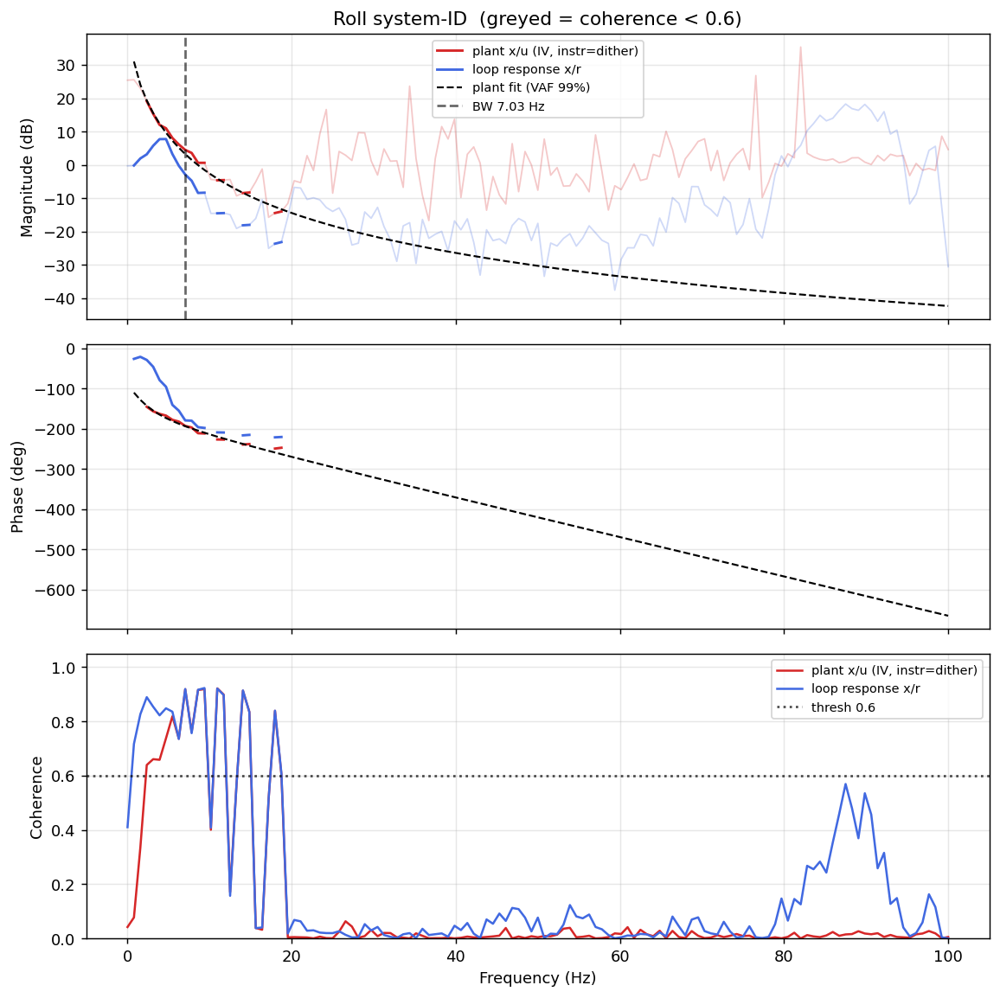

# System-ID analysis — sysid_roll_1781786557.csv

- **Source log**: `ground_station\logs\sysid_roll_1781786557.csv`
- **Sample rate (auto)**: 200.0 Hz — counter reset detected (two runs in one log?) - fs from largest segment [1:6601]
- **Excitation**: multisine  (dither peak 43.7, crest factor 3.19)
- **Battery (operating point)**: 0.00 V mean, 0.00→0.00 V (sag 0.00 V over run). Actuator gain scales with voltage — note this when comparing K across runs.

## Roll axis

- Closed-loop −3 dB bandwidth: **7.032 Hz**  →  recommended `ref_model_bw` = **44.18 rad/s**
- Plant model  `G(s) = K / (s·(1 + s/p))·e^(−sT)`:
    - K (integrator gain) = 181.7
    - lag pole p = 16.7 rad/s (2.65 Hz)
    - transport delay T = 13 ms
    - fit quality **VAF = 98.8%** over 10 coherent bins
- Samples used: 6601 (largest gap-free segment)

