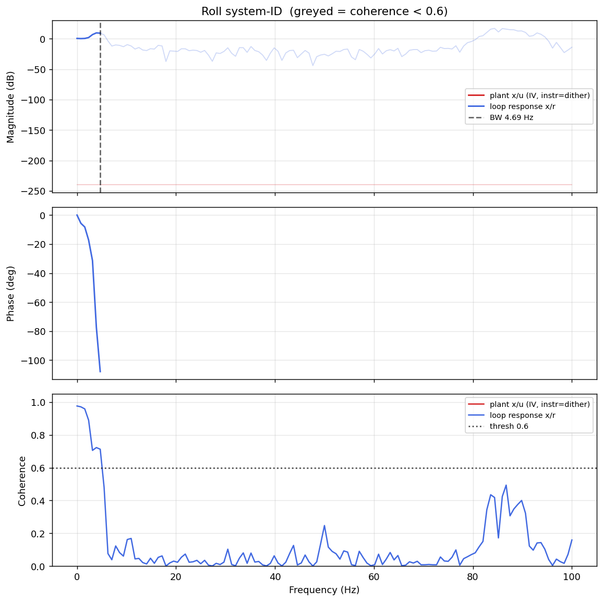

# System-ID analysis — sysid_roll_1781786691.csv

- **Source log**: `ground_station\logs\sysid_roll_1781786691.csv`
- **Sample rate (auto)**: 200.0 Hz
- **Battery (operating point)**: 0.00 V mean, 0.00→0.00 V (sag 0.00 V over run). Actuator gain scales with voltage — note this when comparing K across runs.

## Roll axis

- Closed-loop −3 dB bandwidth: **4.688 Hz**  →  recommended `ref_model_bw` = **29.45 rad/s**
- Plant model: not enough coherent bins to fit (0).
- Samples used: 4445 (largest gap-free segment)

