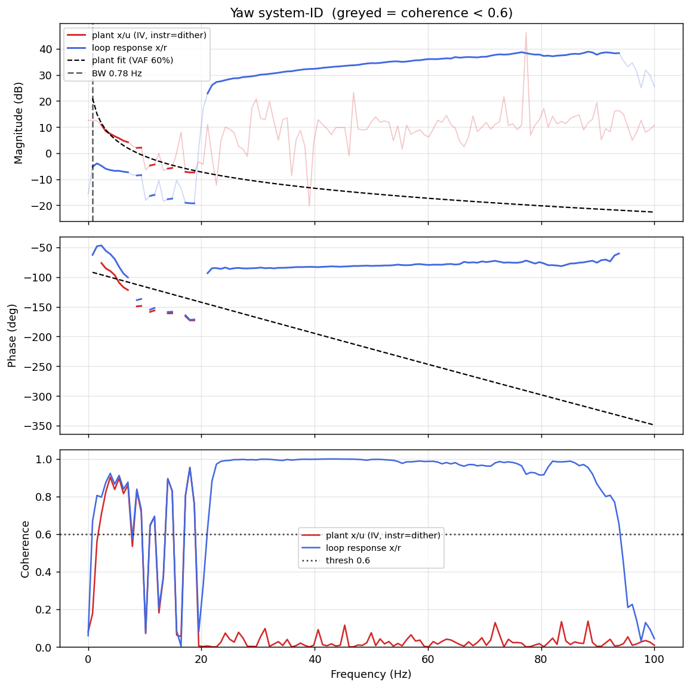

# System-ID analysis — sysid_yaw_1781791328.csv

> ⚠️ **LINK QUALITY WARN — results may be UNRELIABLE.** Only 88% of frames were received (8 gaps; largest clean segment 3900 samples). The wireless link dropped frames — fly the drone closer to the receiver and re-run.

- **Source log**: `ground_station\logs\sysid_yaw_1781791328.csv`
- **Link quality**: WARN (88% frames received, 8 gaps, largest clean segment 3900 samples)
- **Sample rate (auto)**: 200.0 Hz
- **Excitation**: multisine  (dither peak 45.0, crest factor 3.28)
- **Battery (operating point)**: 0.00 V mean, 0.04→0.00 V (sag 0.04 V over run). Actuator gain scales with voltage — note this when comparing K across runs.

## Yaw axis

- Closed-loop −3 dB bandwidth: **0.781 Hz**  →  recommended `ref_model_bw` = **4.91 rad/s**
- Plant model  `G(s) = K / (s·(1 + s/p))·e^(−sT)`:
    - K (integrator gain) = 55.1
    - lag pole p = 1000.0 rad/s (159.15 Hz)
    - transport delay T = 6 ms
    - fit quality **VAF = 60.2%** over 9 coherent bins
- Samples used: 3900 (largest gap-free segment)

