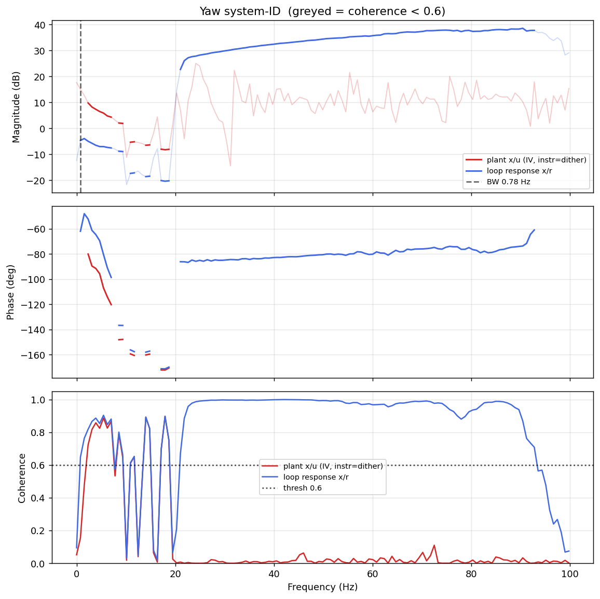

# System-ID analysis — sysid_yaw_1781791449.csv

- **Source log**: `ground_station\logs\sysid_yaw_1781791449.csv`
- **Link quality**: GOOD (100% frames received, 0 gaps, largest clean segment 8602 samples)
- **Sample rate (auto)**: 199.6 Hz
- **Excitation**: multisine  (dither peak 45.0, crest factor 3.26)
- **Battery (operating point)**: 0.00 V mean, 0.00→0.00 V (sag 0.00 V over run). Actuator gain scales with voltage — note this when comparing K across runs.

## Yaw axis

- Closed-loop −3 dB bandwidth: **0.780 Hz**  →  recommended `ref_model_bw` = **4.90 rad/s**
- Plant model: not enough coherent bins to fit (2).
- Samples used: 8602 (largest gap-free segment)

