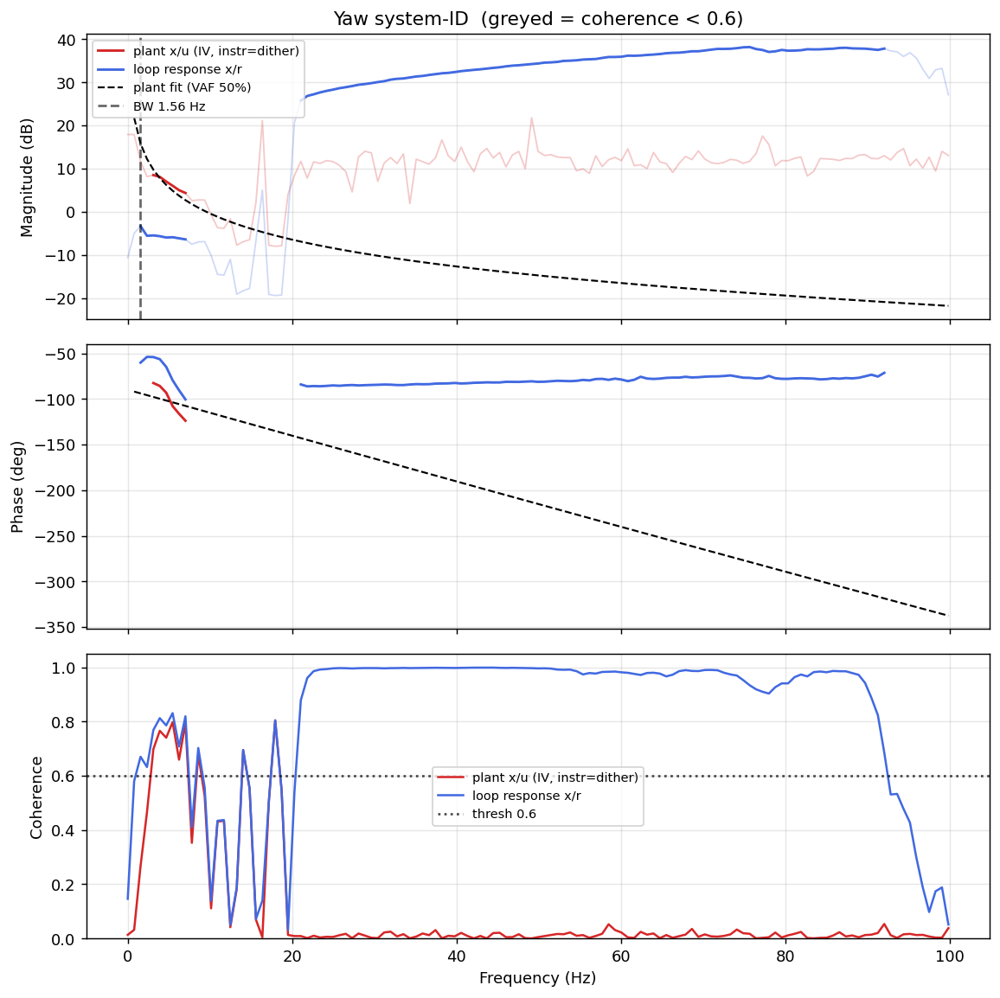

# System-ID analysis — sysid_yaw_1781791510.csv

- **Source log**: `ground_station\logs\sysid_yaw_1781791510.csv`
- **Link quality**: GOOD (99% frames received, 1 gaps, largest clean segment 8529 samples)
- **Sample rate (auto)**: 199.6 Hz
- **Excitation**: multisine  (dither peak 25.0, crest factor 3.25)
- **Battery (operating point)**: 0.00 V mean, 0.00→0.00 V (sag 0.00 V over run). Actuator gain scales with voltage — note this when comparing K across runs.

## Yaw axis

- Closed-loop −3 dB bandwidth: **1.559 Hz**  →  recommended `ref_model_bw` = **9.80 rad/s**
- Plant model  `G(s) = K / (s·(1 + s/p))·e^(−sT)`:
    - K (integrator gain) = 60.2
    - lag pole p = 1000.0 rad/s (159.15 Hz)
    - transport delay T = 6 ms
    - fit quality **VAF = 49.7%** over 7 coherent bins
- Samples used: 8529 (largest gap-free segment)

