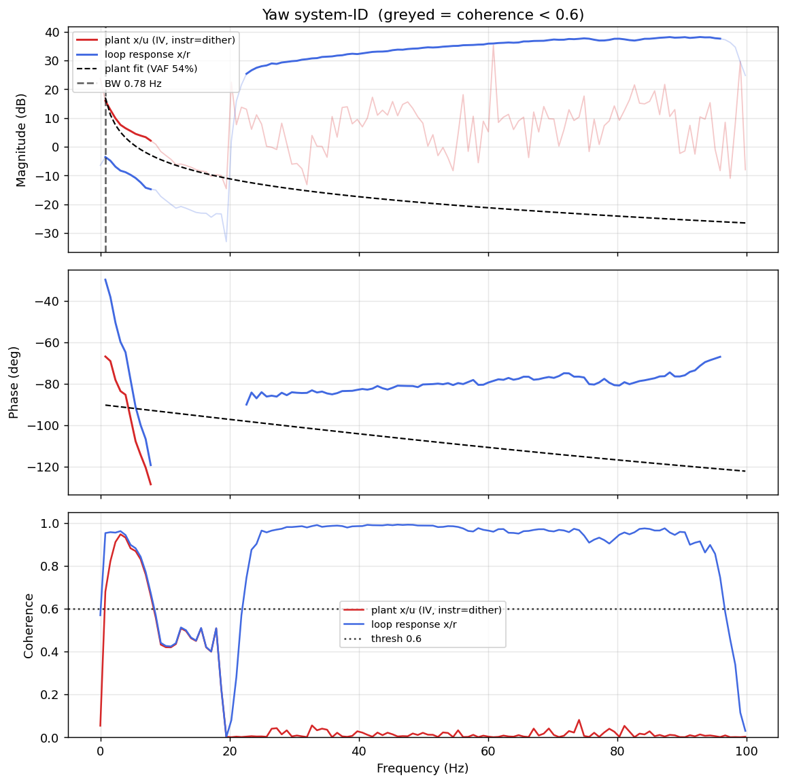

# System-ID analysis — sysid_yaw_1781791564.csv

- **Source log**: `ground_station\logs\sysid_yaw_1781791564.csv`
- **Link quality**: GOOD (100% frames received, 0 gaps, largest clean segment 8602 samples)
- **Sample rate (auto)**: 199.7 Hz
- **Excitation**: chirp  (dither peak 45.0, crest factor 1.44)
- **Battery (operating point)**: 0.00 V mean, 0.01→0.00 V (sag 0.01 V over run). Actuator gain scales with voltage — note this when comparing K across runs.

## Yaw axis

- Closed-loop −3 dB bandwidth: **0.780 Hz**  →  recommended `ref_model_bw` = **4.90 rad/s**
- Plant model  `G(s) = K / (s·(1 + s/p))·e^(−sT)`:
    - K (integrator gain) = 35.1
    - lag pole p = 1000.0 rad/s (159.15 Hz)
    - transport delay T = 0 ms
    - fit quality **VAF = 53.9%** over 10 coherent bins
- Samples used: 8602 (largest gap-free segment)

