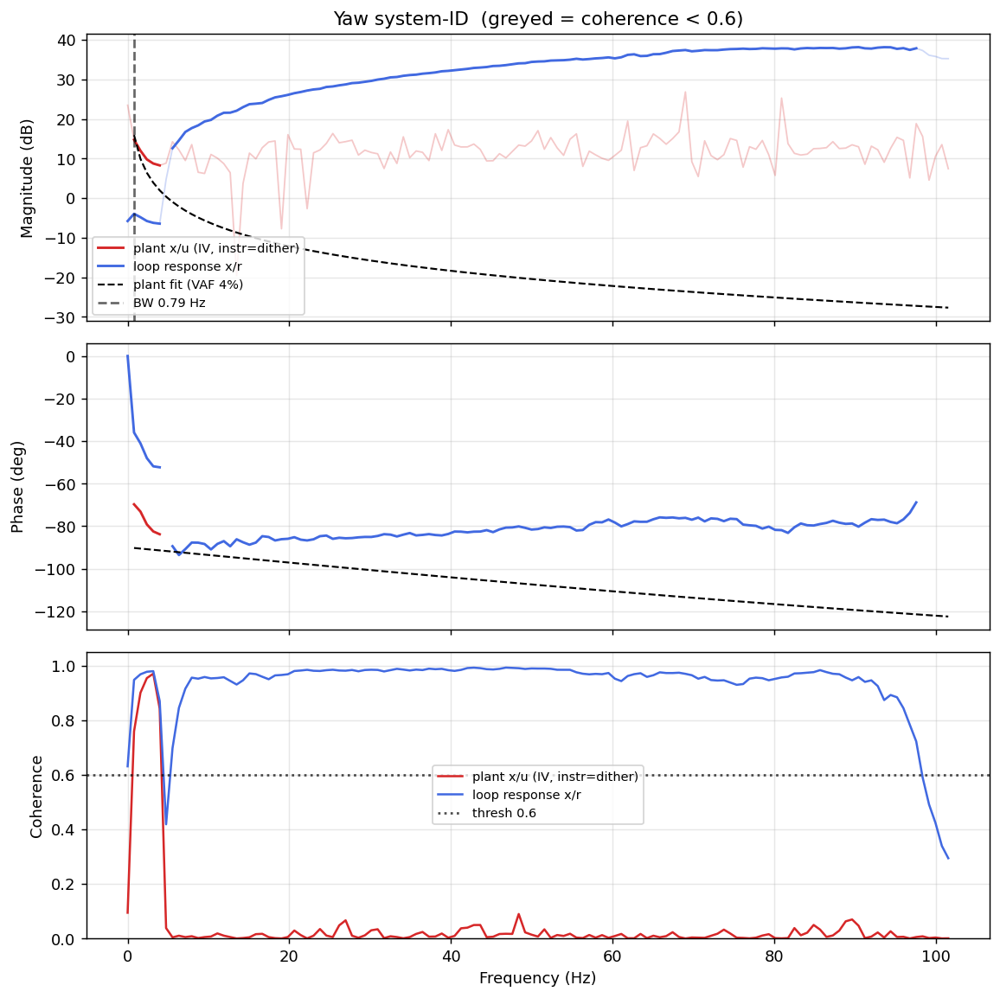

# System-ID analysis — sysid_yaw_1781792863.csv

> ⚠️ **LINK QUALITY WARN — results may be UNRELIABLE.** Only 95% of frames were received (2 gaps; largest clean segment 8214 samples). The wireless link dropped frames — fly the drone closer to the receiver and re-run.

- **Source log**: `ground_station\logs\sysid_yaw_1781792863.csv`
- **Link quality**: WARN (95% frames received, 2 gaps, largest clean segment 8214 samples)
- **Sample rate (auto)**: 203.0 Hz
- **Excitation**: multisine  (dither peak 54.9, crest factor 2.98)
- **Battery (operating point)**: 0.00 V mean, 0.00→0.00 V (sag 0.00 V over run). Actuator gain scales with voltage — note this when comparing K across runs.

## Yaw axis

- Closed-loop −3 dB bandwidth: **0.793 Hz**  →  recommended `ref_model_bw` = **4.98 rad/s**
- Plant model  `G(s) = K / (s·(1 + s/p))·e^(−sT)`:
    - K (integrator gain) = 31.2
    - lag pole p = 1000.0 rad/s (159.15 Hz)
    - transport delay T = 0 ms
    - fit quality **VAF = 4.0%** over 4 coherent bins
- Samples used: 8214 (largest gap-free segment)

