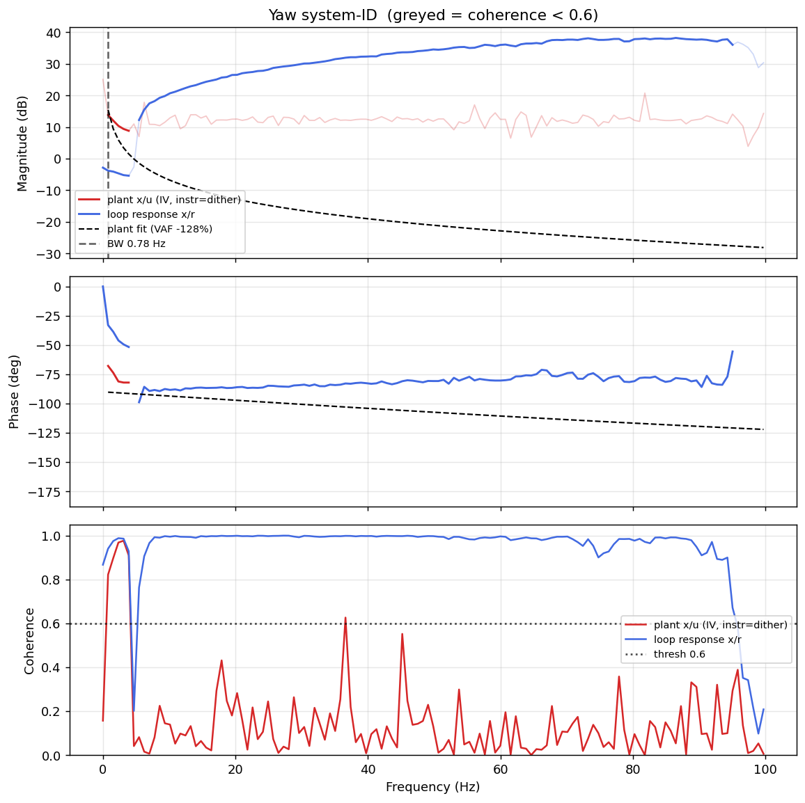

# System-ID analysis — sysid_yaw_1781792911.csv

> ⚠️ **LINK QUALITY BAD — results may be UNRELIABLE.** Only 66% of frames were received (14 gaps; largest clean segment 1257 samples). The wireless link dropped frames — fly the drone closer to the receiver and re-run.

- **Source log**: `ground_station\logs\sysid_yaw_1781792911.csv`
- **Link quality**: BAD (66% frames received, 14 gaps, largest clean segment 1257 samples)
- **Sample rate (auto)**: 199.4 Hz
- **Excitation**: multisine  (dither peak 30.5, crest factor 2.99)
- **Battery (operating point)**: 0.00 V mean, 0.03→0.00 V (sag 0.03 V over run). Actuator gain scales with voltage — note this when comparing K across runs.

## Yaw axis

- Closed-loop −3 dB bandwidth: **0.779 Hz**  →  recommended `ref_model_bw` = **4.89 rad/s**
- Plant model  `G(s) = K / (s·(1 + s/p))·e^(−sT)`:
    - K (integrator gain) = 29.1
    - lag pole p = 1000.0 rad/s (159.15 Hz)
    - transport delay T = 0 ms
    - fit quality **VAF = -127.8%** over 4 coherent bins
- Samples used: 1257 (largest gap-free segment)

