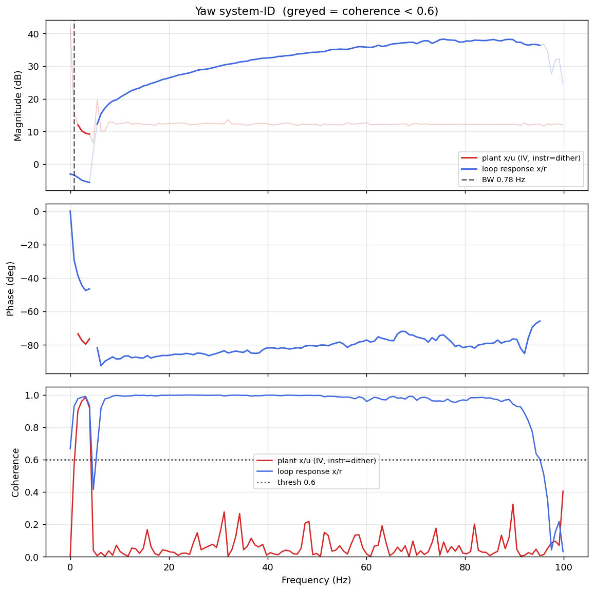

# System-ID analysis — sysid_yaw_1781792951.csv

> ⚠️ **LINK QUALITY BAD — results may be UNRELIABLE.** Only 77% of frames were received (11 gaps; largest clean segment 2096 samples). The wireless link dropped frames — fly the drone closer to the receiver and re-run.

- **Source log**: `ground_station\logs\sysid_yaw_1781792951.csv`
- **Link quality**: BAD (77% frames received, 11 gaps, largest clean segment 2096 samples)
- **Sample rate (auto)**: 199.7 Hz
- **Excitation**: multisine  (dither peak 30.5, crest factor 2.86)
- **Battery (operating point)**: 0.00 V mean, 0.00→0.00 V (sag 0.00 V over run). Actuator gain scales with voltage — note this when comparing K across runs.

## Yaw axis

- Closed-loop −3 dB bandwidth: **0.780 Hz**  →  recommended `ref_model_bw` = **4.90 rad/s**
- Plant model: not enough coherent bins to fit (3).
- Samples used: 2096 (largest gap-free segment)

