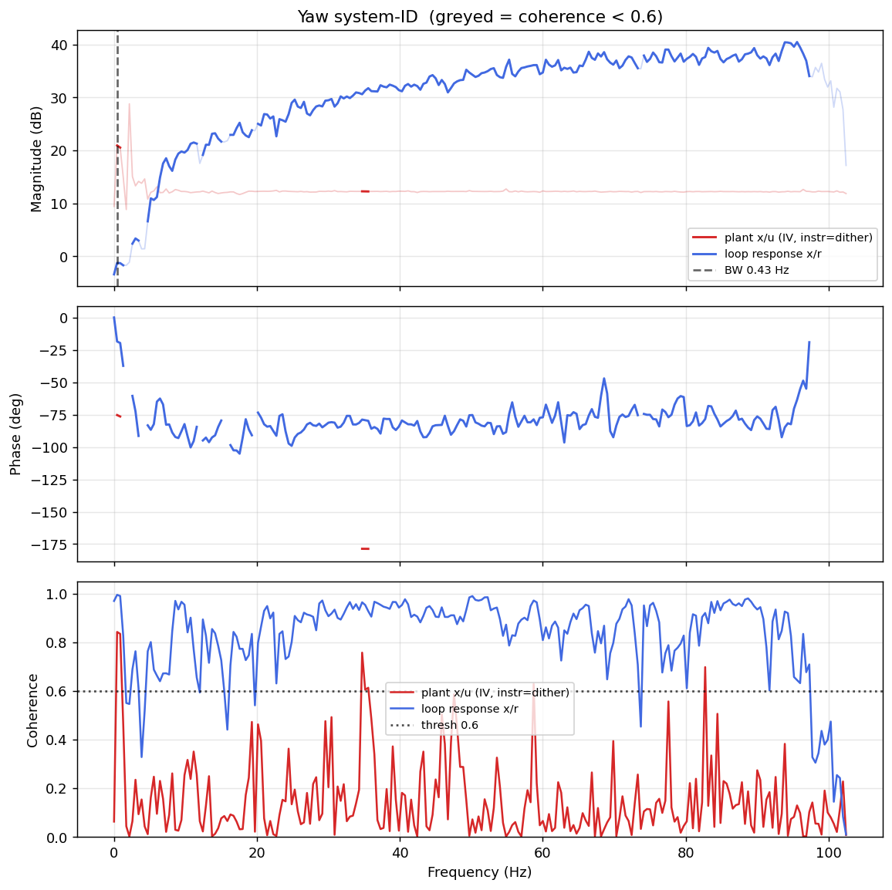

# System-ID analysis — sysid_yaw_1781793004.csv

> ⚠️ **LINK QUALITY BAD — results may be UNRELIABLE.** Only 72% of frames were received (14 gaps; largest clean segment 1913 samples). The wireless link dropped frames — fly the drone closer to the receiver and re-run.

- **Source log**: `ground_station\logs\sysid_yaw_1781793004.csv`
- **Link quality**: BAD (72% frames received, 14 gaps, largest clean segment 1913 samples)
- **Sample rate (auto)**: 204.9 Hz
- **Excitation**: chirp  (dither peak 45.0, crest factor 1.45)
- **Battery (operating point)**: 0.00 V mean, 0.00→0.00 V (sag 0.00 V over run). Actuator gain scales with voltage — note this when comparing K across runs.

## Yaw axis

- Closed-loop −3 dB bandwidth: **0.429 Hz**  →  recommended `ref_model_bw` = **2.69 rad/s**
- Plant model: not enough coherent bins to fit (2).
- Samples used: 1913 (largest gap-free segment)

