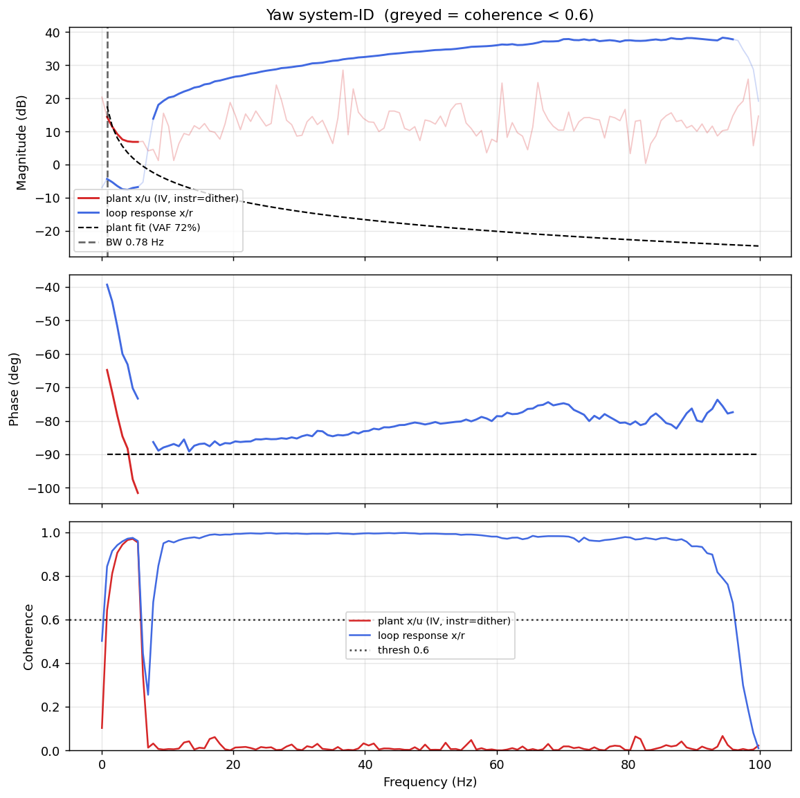

# System-ID analysis — sysid_yaw_1781793095.csv

- **Source log**: `ground_station\logs\sysid_yaw_1781793095.csv`
- **Link quality**: GOOD (97% frames received, 2 gaps, largest clean segment 7364 samples)
- **Sample rate (auto)**: 199.6 Hz
- **Excitation**: multisine  (dither peak 60.6, crest factor 3.46)
- **Battery (operating point)**: 0.00 V mean, 0.00→0.00 V (sag 0.00 V over run). Actuator gain scales with voltage — note this when comparing K across runs.

## Yaw axis

- Closed-loop −3 dB bandwidth: **0.780 Hz**  →  recommended `ref_model_bw` = **4.90 rad/s**
- Plant model  `G(s) = K / s · e^(−sT)`  (**pure integrator, relative degree 1** — no identifiable lag pole in the excited band):
    - K (integrator gain) = 37.1
    - transport delay T = 0 ms
    - fit quality **VAF = 72.2%** over 26 coherent bins
- Samples used: 7364 (largest gap-free segment)

