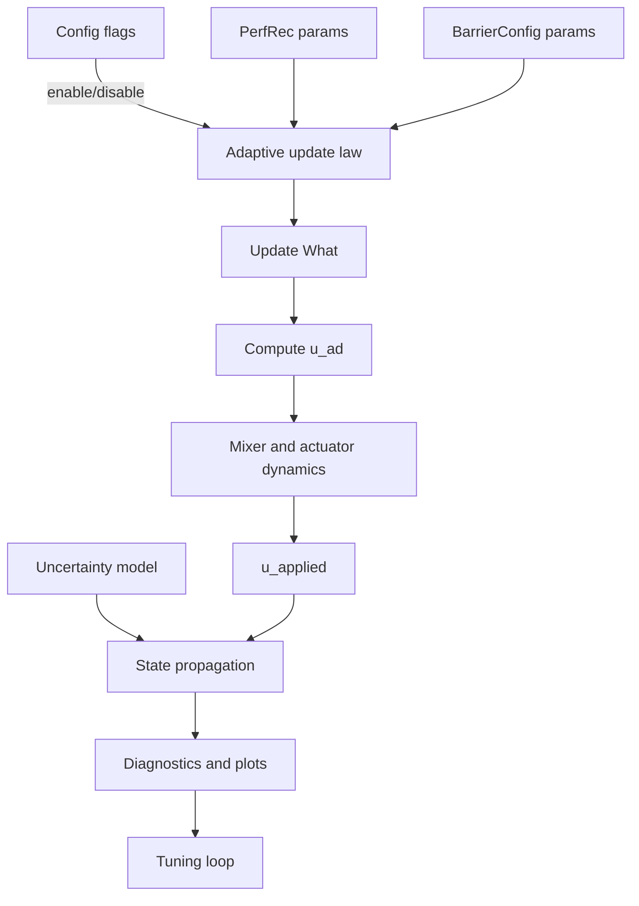
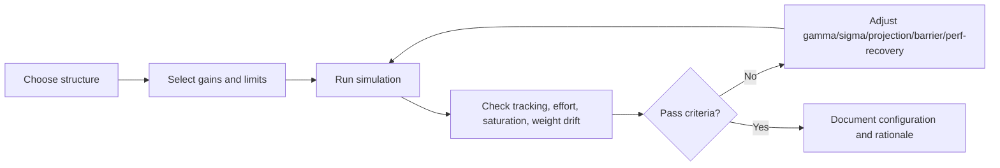

This page is the high-level bridge between adaptive-control theory and your three validated simulation notebooks. It is designed for fast onboarding of both humans and agents.

## Trust boundary (important)

- **Code cells**: user-tested and working; treat as baseline truth for implementation behavior.
- **Markdown explanations**: useful context, but not always fully rigorous; verify against equations and code.
- **Use pattern**: theory from this page, implementation details from source pages, then reproduce in notebook code.

## System-level control architecture

```mermaid
flowchart LR
    R[Reference command r] --> RM[Reference model xm]
    RM --> E[Tracking error e = x - xm]
    X[Plant state x] --> E
    E --> ADP[Adaptive law]
    X --> PHI[Regressor Phi(x)]
    PHI --> ADP
    ADP --> UAD[Adaptive control u_ad]
    UNOM[Nominal controller u_nom] --> SUM((+))
    UAD --> SUM
    SUM --> ACT[Actuator + mixer dynamics]
    ACT --> PLANT[Plant dynamics]
    PLANT --> X
```

## Core theory used across notebooks

### 1) Reference-model tracking

- Goal: force real state `x` to follow model state `xm`.
- Error: `e = x - xm`.
- Adaptive term: `u_ad = What^T * Phi(x)` where `What` are learned weights.

### 2) Weight update (direct MRAC style)

- Base idea: update weights proportionally to error-correlated features.
- Practical form in notebooks: gradient-based update with robustness options:
  - projection (weight bounds),
  - sigma leakage (drift control),
  - deadzone/e-modification (noise/transient robustness),
  - optional low-frequency filtering/performance recovery.

### 3) Constrained adaptation (barrier variants)

- Barrier terms activate near error constraints and bias adaptation away from unsafe regions.
- In your notebooks this is implemented as additive barrier-gradient shaping, not a completely separate controller.

## Practical implementation mapping



### Theory-to-code checkpoints

- **Reference model**: explicit `wn` and `zeta` choices define desired closed-loop profile.
- **Adaptive law ordering**: projection should constrain gradient direction before sigma leakage is applied.
- **Actuator realism**: mixer/inverse-mixer + motor lag must be validated before judging adaptation quality.
- **Constraint logic**: barrier activation threshold and smoothing strongly affect chatter vs safety margin.

## Notebook map and recommended learning order

1. [[Adaptive Control Tutorial Notebook]]
   - Build intuition from fixed gain -> adaptive gain -> projection/sigma/e-mod -> RBF variants.
2. [[Adaptive Control Tutorial 2 Notebook]]
   - Add derivative-free and barrier-oriented thinking with smaller examples.
3. [[Direct MRAC + FF + Projection Notebook]]
   - Integrate all features in multi-axis simulation and run diagnostics/tuning sweeps.

## Experiment loop for comprehensive understanding



## Validation checklist (before trusting conclusions)

- Mixer single-axis sign and scaling checks pass for pitch/roll/yaw.
- No persistent NaN/Inf or runaway states in long-horizon runs.
- `u_applied` stays physically plausible for hover-throttle and actuator limits.
- Weight trajectories remain bounded and interpretable.
- Barrier or robustness terms activate when expected (not always-on, not never-on).

## Known cautions

- Projection + sigma interaction can degrade learning if combined naively.
- Barrier theory text may be stronger than what is numerically guaranteed in a given setup.
- Performance conclusions are sensitive to uncertainty profile and excitation richness.

## Deep-dive companion

- [[Adaptive Simulation Theory-to-Code Deep Dive]]

## See also

- [[MRAC Theory]]
- [[MRAC Control Law]]
- [[Cascaded PID Theory]]
- [[Tuning Workflow]]
