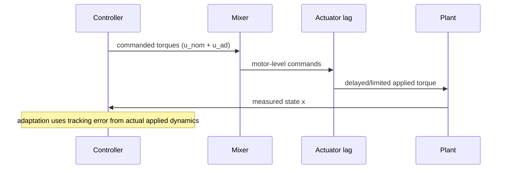

This page connects the math objects used in adaptive control directly to practical notebook implementation blocks, with emphasis on debugging and tuning decisions.

## 1) Equation blocks to implementation blocks

| Theory object | Practical role | Where to look in notebooks |
|:--|:--|:--|
| `xm` (reference model state) | Defines desired dynamics to track | Reference-model design and model update cells |
| `e = x - xm` | Master adaptation signal | Main simulation loops and diagnostics |
| `Phi(x)` | Feature encoding of uncertainty | Structured terms and RBF helper functions |
| `What` | Learned uncertainty estimate parameters | Weight update sections and weight plots |
| `u_ad = What^T Phi` | Adaptive compensation input | Control synthesis before mixer/actuator path |
| Projection operator | Keep `What` bounded and physically meaningful | Projection helper/update functions |
| Sigma/e-mod/deadzone | Robustness against drift/noise/transients | Config flags and update law branches |
| Barrier terms | Enforce error-set constraints | Barrier utility functions and verification plots |

## 2) Internal update pipeline (practical MRAC step)

```mermaid
flowchart TD
    X[Current state x] --> PHI[Build Phi(x)]
    X --> E[Compute e = x - xm]
    E --> G[Base gradient g]
    PHI --> G
    G --> N[Optional normalization]
    N --> P[Projection on gradient direction]
    P --> S[Add sigma/e-mod leakage terms]
    S --> W[Integrate What]
    W --> U[u_ad = What^T Phi]
```

### Why ordering matters

- If projection is applied after combining all terms, leakage and gradient can interfere near boundaries.
- A safer practical sequence is:
  1. compute and normalize gradient,
  2. project gradient direction,
  3. add leakage/drift terms,
  4. update weights.

## 3) Actuator-aware adaptation loop



### Practical implication

- If mixer signs/scales are wrong, adaptation learns the wrong plant.
- Always validate forward/inverse mixer consistency before controller comparisons.

## 4) Barrier function implementation intent

- Target: keep tracking error inside user-selected sets.
- Activation design:
  - inactive region for nominal behavior,
  - smooth ramp region to avoid numerical chatter,
  - strong correction near boundary.
- Tuning tradeoff:
  - higher gain / earlier activation -> safer, possibly more conservative and chatty,
  - lower gain / later activation -> better nominal performance, weaker constraint protection.

## 5) Recommended tuning order (simulation-first)

1. **Nominal baseline**: verify stable tracking with adaptation disabled.
2. **Enable adaptation only**: tune `gamma` for convergence without oscillation.
3. **Add projection**: tighten bounds until weights remain interpretable.
4. **Add sigma/e-mod/deadzone**: remove drift and noise-driven motion.
5. **Enable actuator dynamics**: retune because effective loop becomes slower.
6. **Enable barriers**: enforce safety envelopes, then retune comfort/performance.

## 6) Diagnostic signals that matter most

- `e` and `||e||`: direct performance and safety margin.
- `What`: boundedness, convergence trend, and component-level interpretation.
- `u_nom`, `u_ad`, `u_applied`: adaptation usefulness vs actuator reality.
- saturation incidence and duration: identifies infeasible trajectories or gains.
- barrier activation ratio: indicates over-tight/over-loose constraint design.

## 7) Common failure patterns and fixes

- **High-frequency oscillation**:
  - lower `gamma`, increase filtering, reduce reference aggressiveness.
- **Weight drift at steady state**:
  - increase sigma/deadzone, verify noise floor assumptions.
- **Good command, poor applied response**:
  - check mixer normalization, hover-throttle assumptions, actuator lag constants.
- **Barrier always active**:
  - relax limits or delay activation threshold.
- **Barrier never active**:
  - constraints are too loose for current trajectory; tighten for meaningful tests.

## 8) Usage with the three notebook sources

- Use [[Adaptive Control Tutorial Notebook]] for quick A/B of adaptation structures.
- Use [[Adaptive Control Tutorial 2 Notebook]] for derivative-free and constrained-control ideas.
- Use [[Direct MRAC + FF + Projection Notebook]] as the integrated benchmark and reporting environment.

## 9) Practical documentation rule for future updates

When adding a new adaptive feature, document it in this order:

1. Theory sentence (what term was added and why).
2. Update-law insertion point (exact pipeline stage).
3. New config parameters and safe ranges.
4. One expected failure mode if mis-tuned.
5. One required validation plot.
