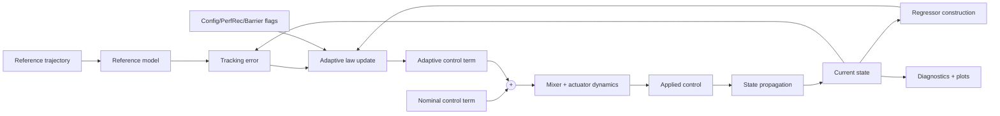

Structured digest of the user-built 60-cell simulation notebook for roll/pitch/yaw adaptive control. This source captures the tested code architecture and retains theory text as secondary context.

## End-to-end implementation diagram

## What this notebook implements (code-confirmed)

- Unified state-space reference model setup with explicit `wn`/`zeta` selection.
- Nominal controller + direct MRAC term with configurable adaptive features.
- Projection operator and sigma-modification toggles.
- Optional actuator dynamics and mixer/inverse-mixer loop for realistic motor lag effects.
- Set-theoretic error barrier utilities and integration into adaptation updates.
- Performance recovery, diagnostics, and rich post-run plotting/analysis pipeline.

## Core configurable modules

- `Config`: feature flags including projection, sigma-mod, actuator dynamics, structured uncertainty.
- `PerfRec`: performance recovery parameters and filtered augmentation terms.
- `BarrierConfig`: hard error limits, activation threshold, barrier gain, smoothing.
- Helper functions for scheduled adaptation gain, trajectory generation, uncertainty injection, and projection-aware weight updates.

## Theory-to-code implementation notes

- **Reference dynamics**: `wn` and `zeta` are explicit knobs that define the target transient behavior.
- **Adaptive core**: weight updates are built from error-correlated regressor terms with optional normalization.
- **Robustness layering**: projection, sigma-modification, deadzone/e-modification, and low-frequency shaping are composable via flags.
- **Constraint layer**: barrier gradients are injected into adaptation rather than replacing base MRAC terms.
- **Plant realism**: optional actuator and mixer block converts commanded torque to delayed applied torque, closing the realism gap.

## High-value implementation notes

- **Projection + sigma ordering**: notebook documents and applies a corrected update sequence where projection is applied to the gradient before sigma leakage is added.
- **Mixer realism**: forward/inverse mixer math is paired with hover-throttle normalization and actuator lag, then fed back as applied control.
- **Barrier integration**: logarithmic barrier gradient is added to adaptive updates with activation thresholding.
- **Debug depth**: includes numerical checks for overflow/NaN, saturation diagnostics, and tuning recommendation cells.

## Reliability guidance for agents

- Prioritize code cells and parameter definitions over markdown claims.
- Reuse this notebook as the main multi-axis benchmark environment.
- Validate any new theoretical edits against the existing simulation diagnostics.

## Related pages

- [[Adaptive Control Simulations]]
- [[MRAC Theory]]
- [[Timer & PWM Configuration]]
- [[Motor Mixer]]
