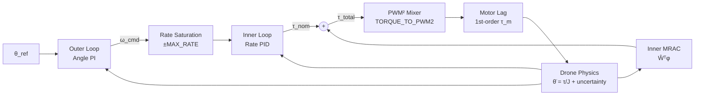

20-cell notebook bridging PID nominal controller design to firmware-ready hardware parameters. Unique in this notebook set: it derives DShot PWM² values, maps torque to actual ESC commands, and performs stability margin analysis for both inner and outer loops. The MRAC adaptive layer is applied only to the inner (rate) loop throughout — the outer (angle) loop is treated as purely kinematic and requires no adaptation.

---

## Architecture overview



---

## Physical parameters (Cell 0)

```python
DRONE_MASS       = 0.366    # [kg] with battery
ARM_LENGTH       = 0.125    # [m] center to motor (diagonal/2)
Jx = Jy          = 0.002304 # [kg·m²] pitch/roll inertia (cuboid approx)
Jz               = 0.001544 # [kg·m²] yaw inertia
MOTOR_TAU        = 0.06     # [s] 60 ms spool-up — overridden to 0.040 in Cell 19!
HOVER_THROTTLE   = 0.23     # 23% throttle at hover
U_MAX_PITCH_ROLL = 6.73863  # [Nm] max torque pitch/roll
U_MAX_YAW        = 2.027    # [Nm] max torque yaw
dt               = 0.006    # [s] simulation timestep
```

**Inertia derivation:** cuboid approximation `J = m/12 × (w² + l²)`. For a 5-inch drone these are heuristics — validate via SysID before trusting in firmware.

**Hover throttle:** 23% implies ~4.3:1 thrust-to-weight ratio. This ratio drives the `TORQUE_TO_PWM2` bridge constant used in Cell 19.

**Motor lag inconsistency:** Cell 0 sets `MOTOR_TAU = 0.06` (60 ms). Cell 19 redefines it to `0.040` (40 ms). Use 40 ms for sequential LQR tuning (Cell 16) and firmware — it is closer to real brushless ESC latency on DShot.

---

## Cell 1 — Empty

Placeholder / scratch cell.

---

## PID nominal controller design — three methods (Cells 2–4)

All three cells produce the same data structure: gains `K1_pitch` (Kp), `K3_pitch` (Kd), `K2_pitch` (Ki), plus `build_augmented_model()` which constructs `Ar`, `Br`, `Ba` and solves the Lyapunov equation for `P`. Whichever cell runs last sets the gains used downstream.

### Common augmented state

All three use the same 3rd-order augmented plant:

```
State ξ = [θ, ω, z_int]ᵀ,   z_int_dot = θ - θ_ref

A_aug = [[0, 1, 0],    B_aug = [[0],
          [0, 0, 0],             [1],
          [1, 0, 0]]             [0]]
```

### Cell 2 — LQR-tuned PID

```python
Q_pr  = diag([80.0, 1.0, 8.0])   # [angle, rate, integral] penalty
R_pr  = 0.5                        # control effort
Q_yaw = diag([80.0, 1.0, 8.0])
R_yaw = 0.5
LAMBDA = 50.0                      # dirty-derivative filter pole [rad/s]
```

LQR solves `min ∫(ξᵀQξ + uᵀRu)dt` → K = [Kp, Kd, Ki] for each axis. Pitch = Roll (same J).

**Reference model construction:**
```
F     = I + B·K3·C,   F_inv = inv(F),   G = A - B·K1·C
Ar    = [[F_inv·G, -F_inv·B·K2], [C, 0]]
Br    = [F_inv·B·K1;  -1]
Ba    = [F_inv·B;      0]
P     = lyap(Ar.T, I₃)
```

### Cell 3 — Manual stub

Sets `K1=1, K2=0, K3=0` for all axes — a P-only starting point for manual tuning. With `K3=0`, F is identity (no dirty-derivative term in reference model).

### Cell 4 — Pole-placement tuned

```python
# Pitch/Roll target poles
omega_n_pr = 10.0,  zeta_pr = 0.8,  p_integral = -1.0
poles_pr   = [-8+6j, -8-6j, -1.0]   # ζωn = 8

# Yaw — slower due to lower authority
omega_n_yaw = 5.0,  zeta_yaw = 0.8,  p_integral = -3.0
poles_yaw   = [-4+3j, -4-3j, -3.0]
```

Computes rise time (90%), overshoot (%), and settling time (2%) from the closed-loop step response.

**Design rationale from comments:** `omega_n_pr = 10` (reduced from 8 to tolerate 40 ms motor lag). `zeta = 0.8` (increased from 0.707 for phase margin). Integral pole at -1 is deliberately slow.

---

## Cell 5 — Step response with motor lag

4-state augmented system:

```
States: [θ, ω, z_int, u_motor]
u_dot_motor = (1/τ_m)(u_cmd - u_motor)
```

Checks peak torque vs `U_MAX_PITCH_ROLL` / `U_MAX_YAW` for a 20° step. Without τ_m the step response is "too optimistic" — motor lag is the true bandwidth limiter.

---

## Cell 6 — Markdown: PID-MRAC key equations

Structural analogy between mass-spring-damper and drone:

| Mass-spring-damper | Drone axis |
|---|---|
| position x | angle θ |
| velocity ẋ | rate ω |
| mass m, Λ=1/m | inertia Jy, Λ=1/Jy |
| spring α + damper β | aero drag Cd·ω + gyro Cg·θ |
| true W₀ = [-α, -β]ᵀ | true W₀ = [-Cg, -Cd]ᵀ |

**Total control law:**
```
τ = -K1(θ-θ_ref) - K2·z - K3·ω̂  +  (-Ŵᵀφ)
      ┗━━━━━ τ_nom (LQR-PID) ━━━━┛    ┗━ τ_ada ━┛

φ = [θ, ω, τ_nom]ᵀ    (3-element regressor)
```

**Lyapunov weight update:**
```
Ŵ̇ = γ · φ · (ξ - ξr)ᵀ P Ba,    Arᵀ P + P Ar = -I₃
```

where `Ba = [F_inv·B; 0]` is the augmented input direction — the direction in ξ-space along which adaptive torque enters.

---

## Cell 7 — Single-loop PID-MRAC simulation (pitch axis)

**True uncertainty:**
```python
C_gyro_true = 10.8    # [1/s²] angle → accel coupling
C_drag_true = 10.5    # [1/s]  rate → accel damping
W0 = [[-10.8], [-10.5]]    # 2×1, in normalized accel units
gam = 10               # adaptation gain
LAMBDA = 50.0          # dirty-derivative filter pole [rad/s]
```

**Simulation loop order (critical):**
1. Dirty-derivative rate: `q̇ = -λ(q-y)`, `ẏd = -λ(q-y)`
2. Nominal PID: `τ_nom = -K1·err - K2·z - K3·ẏd`
3. Integral update: `ż = y - c`
4. Regressor: `φ = [θ, ω, τ_nom]ᵀ`
5. Adaptive: `τ_ada = -Ŵᵀφ`
6. Total: `u = τ_nom + τ_ada`
7. Reference model: `ξ̇r = Ar·ξr + Br·c`
8. Weight update: `Ẇ = γ·φ·(ξ-ξr)ᵀ·P·Ba`
9. Plant: `ẋ = A_p·x + B_p·(u + W0ᵀ·x)`

**Finding:** `Ŵ[0]` converges to `C_gyro_true = 10.8`, `Ŵ[1]` to `C_drag_true = 10.5`. `Ŵ[2]` (τ_nom term) stays near zero when Λ=1 (known input gain).

---

## Cell 9 — Stability margin analysis (single-loop)

Open-loop transfer function:
```
P(s) = 1/s²            (double integrator, accel domain)
C(s) = K1 + K3·s + K2/s
L(s) = C(s)·P(s)
```

Reports: gain margin [dB], phase margin [°], crossover frequency, time delay margin [ms].

**Print label bug:** the print statement says `Kd=K2, Ki=K3` — but in the model K2 is the integral gain and K3 is the derivative. Labels are swapped. Read variable assignments in Cells 2–4 directly.

**Target margins from comments:** PM ≥ 45–60°, delay margin > 40 ms (absorbs ESC latency + motor spool-up).

---

## Cell 10 — Markdown: cascaded architecture motivation

Two reasons to cascade vs single-loop:
1. Rate saturation: `clip(ω_cmd)` prevents physically impossible rate commands from large stick inputs.
2. MRAC scope: outer loop is pure kinematics — no uncertainty, no adaptation needed. Only inner (rate→torque) loop sees inertia mismatch and aero drag.

**Algebraic cascaded gain mapping from single-loop LQR:**
```python
P_in  = K2           # inner P-gain: rate error → torque
P_out = K1 / P_in    # outer P-gain: angle error → rate command
I_out = K3 / P_in    # outer I-gain
```

---

## Cell 12 — Cascaded gain mapping (code)

```python
P_in  = K2,  P_out = K1/P_in,  I_out = K3/P_in
MAX_RATE_DEG = 1000.0   # [°/s] physical rate saturation
```

**Caution:** mapping is only valid for LQR gains (Cell 2). Pole-placement gains (Cell 4) produce different K2/K3 ratio — re-derive if using pole placement.

---

## Cell 13 — Simple cascaded PID + inner MRAC

Inner MRAC uses 1st-order reference model (rate only):

```python
ω̇r = -P_in·ωr + P_in·ω_cmd    # 1st order
err_mrac = ω - ωr
Ẇ = γ·err_mrac·φ               # simplified (scalar err, no P matrix)
gamma = 4.0
phi = [θ, ω, τ_nom]ᵀ
```

The scalar `err_mrac·φ` is a simplified Lyapunov update — drops the `PBa` term. Stability is not formally guaranteed but works in practice for a stable 1st-order inner loop. For formal guarantee use `Ẇ = γ·φ·err_mrac·P·b` with 1×1 P from `lyap(-P_in, 1)`.

---

## Cell 15 — Markdown: sequential LQR (Successive Loop Closure)

Inner loop augmented with motor state (3 states: ω, τ_real, ∫ω):
```
ω̇      = τ_real
τ̇_real = (1/τ_m)(τ_cmd - τ_real)   motor lag
ẑ_ω    = ω                           integral of rate error
```
This makes LQR produce a Kd that anticipates motor delay — acts on dω/dt (angular acceleration).

Outer loop 2-state (θ, ∫θ): pure kinematics, LQR naturally outputs PI (D unnecessary).

---

## Cell 16 — Sequential LQR implementation

```python
# Inner loop
Q_in = diag([100.0, 2.0, 150.0])   # ω, τ_real, ∫ω
R_in = 0.015                         # aggressive torque allowed

# Outer loop
Q_out = diag([1000.0, 100.0])       # θ, ∫θ
R_out = 5.0                          # penalise aggressive rate commands
```

**Firmware conversion (printed in cell output):**
```python
Kp_in = Kp_in_kin * Jy   # [Nm/(rad/s)]
Ki_in = Ki_in_kin * Jy   # [Nm/(rad/s·s)]
Kd_in = Kd_in_kin * Jy   # [Nm/(rad/s²)]
```

Comment in the cell explicitly states: `"FOR C FIRMWARE in mrac.c"`. These are the intended embedded PID gains.

---

## Cell 17 — Dual-LQR cascaded + MRAC stress test

Large uncertainty (`C_gyro=30.8`, `C_drag=30.5`). Full inner PID with motor lag in plant.

**D-term on measurement (avoids setpoint kick):**
```python
dot_omega = (omega - omega_prev) / dt_sim
tau_nom = Kp_in·err_omega + Ki_in·z_in + Kd_in·(-dot_omega)
```
The `-dot_omega` is intentional. Match in firmware: D acts on gyro reading, not rate error.

**Anti-windup:**
```python
z_out = clip(z_out, -1.0, 1.0)
z_in  = clip(z_in,  -2.0, 2.0)
```
These bounds are heuristic. Use back-calculation anti-windup in firmware.

**Clamp projection:**
```python
W_hat = np.clip(W_hat, -20.0, 20.0)   # HACKY — discontinuous at bounds
```
Replace with `mrac_projection_scalar()` from [API/mrac.c](../../API/mrac.c).

---

## Cell 18 — Cascaded stability metrics

Frequency domain analysis for both loops:

**Inner loop:**
```
P_in(s) = (1/s) × 1/(τ_m·s + 1)
C_in(s) = Kp_in + Ki_in/s + Kd_in·s
```

**Outer loop (wraps closed inner):**
```
T_in(s)  = L_in(s) / (1 + L_in(s))
L_out(s) = C_out(s) × T_in(s) × (1/s)
```

Prints gain margin, phase margin, crossover, delay margin for each. Rule of thumb: inner delay margin > 2×τ_m to safely absorb ESC + comms latency.

---

## Cell 19 — Hardware-realistic simulation with DShot bridge

The most firmware-faithful cell.

**DShot mixer constants:**
```python
MOTOR_TAU      = 0.040       # 40 ms (overrides Cell 0)
HOV_THRUST_PWM = 350         # DShot hover command
MOTOR_MAX      = 1524        # DShot maximum
TORQUE_TO_PWM2 = 324605.0   # 1 Nm = this many PWM² units
```

**Torque → DShot:**
```python
pwm2_delta        = tau_total * TORQUE_TO_PWM2
motor_front_pwm2  = HOV_THRUST_SQ + pwm2_delta
motor_rear_pwm2   = HOV_THRUST_SQ - pwm2_delta
clip to [0, MOTOR_MAX²]
actual_dshot_cmd  = sqrt(motor_pwm2)
```

**Inertia mismatch:**
```python
J_real = J_torque * 1.3   # 30% heavier than model assumes
```

**Regressor with bias:**
```python
phi = [1.0, theta, omega]   # Bias, Angle, Rate
```
Bias allows adaptation to compensate constant torque offsets (motor imbalance, CG offset).

**Diagonal adaptation gain matrix:**
```python
Gamma = diag([0.1, 0.05, 0.05])   # per-weight learning rates
```
Bias converges fastest (0.1); angle and rate weights slower (0.05) to avoid oscillation.

**Disturbance injection:**
```python
dist_torque = -0.3 if t > 8.0 else 0.0   # [Nm] wind gust
```

With MRAC on, the adaptive weights compensate the 30% inertia mismatch and disturbance within ~1–2 s.

---

## Firmware cross-references

| Notebook constant | Firmware | Notes |
|---|---|---|
| `TORQUE_TO_PWM2 = 324605.0` | [API/mrac.c](../../API/mrac.c) | Verify against PWM-to-torque factor in motor mixer |
| `MOTOR_TAU = 0.040` (Cell 19) | [API/mrac.h](../../API/mrac.h) | Use 40 ms, not 60 ms from Cell 0 |
| `HOV_THRUST_PWM = 350`, `MOTOR_MAX = 1524` | [API/pwm.c](../../API/pwm.c) | Match DShot range constants |
| `Kp_in, Ki_in, Kd_in` (× Jy) | [API/mrac.c](../../API/mrac.c) | Inner-loop rate PID in Nm — from Cell 16 output |
| `Kp_out, Ki_out` | [API/mrac.c](../../API/mrac.c) | Outer-loop angle PI gains |
| `phi = [1, θ, ω]` | [API/mrac.c](../../API/mrac.c) | Bias + angle + rate regressor (Cell 19 variant) |
| `Gamma = diag(...)` | [API/mrac.h](../../API/mrac.h) | Per-weight γ vs scalar `MRAC_GAMMA` |
| `clip(W_hat, -20, 20)` | [API/mrac.c](../../API/mrac.c) | Replace with `mrac_projection_scalar()` |
| `Kd_in * (-dot_omega)` | [API/mrac.c](../../API/mrac.c) | D-term on measurement, not error |

---

## Known bugs and gotchas

| Issue | Cell | Fix |
|---|---|---|
| MOTOR_TAU inconsistency | 0 vs 19 | Use 40 ms (Cell 19) in firmware and sequential LQR |
| Kd/Ki label swap in print | 9 | Read variable assignments, ignore printed labels |
| Hacky clip projection | 17 | Replace with linear smooth projection |
| No formal Lyapunov in simplified MRAC | 13 | Add `P·b` from `lyap(-P_in, 1)` for formal guarantee |
| Cascaded gain mapping only for LQR | 12 | Does not apply to pole-placement gains |

---

## Recommended use pattern for agents

1. **Firmware gain derivation:** run Cell 16 (sequential LQR) with `MOTOR_TAU = 0.040`. Read printed gains and multiply kinematic values by J.
2. **Stability validation:** run Cell 18 after any gain change. Target inner delay margin > 80 ms.
3. **Hardware-realistic MRAC template:** start from Cell 19 — has correct regressor `[1, θ, ω]`, diagonal Gamma, DShot mixer, disturbance injection.
4. **Do not copy Cell 17 projection** — replace `clip` with `mrac_projection_scalar()`.

## Related pages

- [[Adaptive Control Tutorial Notebook]]
- [[Adaptive Control Tutorial 2 Notebook]]
- [[Direct MRAC + FF + Projection Notebook]]
- [[Adaptive Control Simulations]]
- [[MRAC Theory]]
- [[MRAC Control Law]]
- [[Motor Mixer]]
- [[SysID Excitation Module]]
